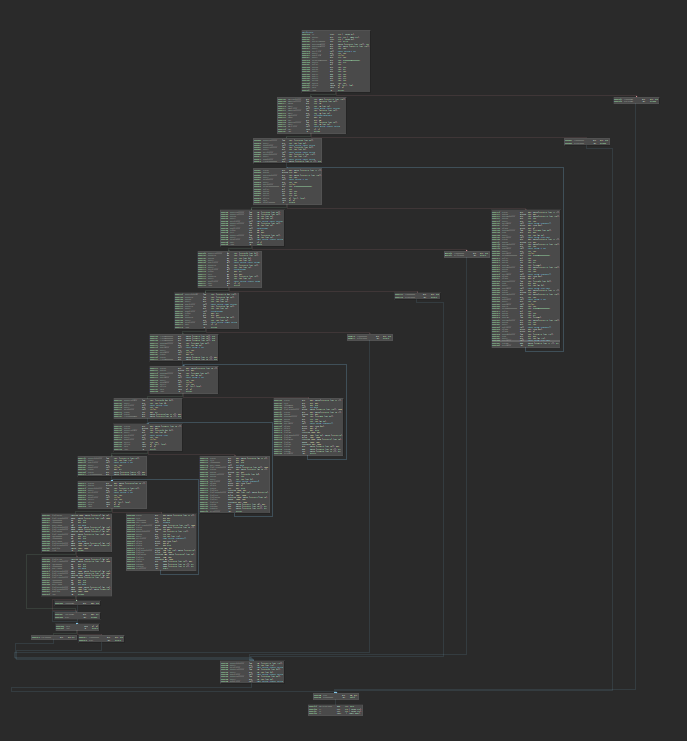
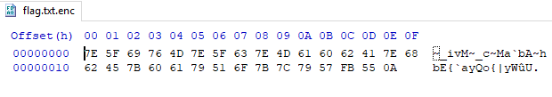

# Archimedes

    CTF reveals its secrets only to those who approach it with pure love, for its own beauty.
    
The challenges provides a 64bit Linux binary that can encrypt files in a non-deterministic way and a encrypted flag files meant to be decrypted.

## Solution

The challenge uses a random value seeded with the current system time to determine the encryption values which are then xored with the data meant to be encrypted.
As the generation of the encryption keys is independent of the file input and also limited to 65535 different sets, making a table out of all of them and
trying to filter which can decrypted to printable characters is possible.

This gdb script does that by modifying the random value to a fixed value, letting the binary calculate the values and then saving them to a file:
```python
gdb.execute("set pagination off")
gdb.execute("set confirm off")

version = 0 # 0 - 15 (split so running multiple instances parallel is possible)

# create a dummy file to encrypt
dummyFile = open("test%d.txt" % version, "w")
dummyFile.write("D"*0x2F)
dummyFile.close()

# some initial code to set the breakpoints in a position independent environment
gdb.execute("b *rand") # break at rand
gdb.execute("run") # run until rand
gdb.execute("finish") # continue until the function ends
gdb.execute("delete") # delete all breakpoints

gdb.execute("b") # set a breakpoint after the random value to modify it [0000000000002DCF]
ip = int(gdb.parse_and_eval("$rip"))
gdb.execute("b *0x%X" % (ip + 0x73a)) # read rdx from here to get value for the key [0000000000003509]


for index in range(max(1,0x1000*version), 0x1000*(version+1))): # skip 0 as it crashes the binary
    gdb.execute("set logging redirect off")
    print("%04X" % index)
    gdb.execute("set logging redirect on")
    gdb.execute("run test%d.txt" % version) # start the process

    # modify random

    gdb.execute("set $rax = "+hex(index))
    gdb.execute("continue")

    solMap = []

    for i in range(0x2F):
        solMap.append(int(gdb.parse_and_eval("$rdx"))&0xFF)
        gdb.execute("continue")
        
    f = open("./rnums/entry_%04X.txt" % (index),"w")
    f.write(str(solMap))
    f.close()
```

To speed up the process I then zipped the resulting files and ran them through a script to find the printable ones:
```python
import string
import zipfile

map = {}

# read the lists from a zip archive
archive = zipfile.ZipFile('rnums.zip', 'r')

encryptedData = []
with open("flag.enc", "rb") as flag: # read the flag
    encryptedData = [ord(c) for c in flag.read()]

# limit the amount of entries to parse
UPPERBORDER = 0x1000

# evaluate the lists from the archive and map them to their index
for i in range(1,UPPERBORDER):
    try:
        map[i] = eval(archive.read('entry_%04X.txt' % i))
    except:
        pass
archive.close()

print("Parsed..")

# try the encryption key lists on the flag
for i in range(1,UPPERBORDER):
    if not i in map: continue
    d = [chr(map[i][j]^encryptedData[j]^0x8F^j) for j in range(len(encryptedData))] # same code as in the binary, as it only uses xor it's symmetrical
    if(all([c in string.printable for c in d])): # print everything with the index that doesn't contain not-printable character
        print ("[%04X]: "%i)+''.join(d)
print("Done..")
```

Running it reveals that the encryption set was already the second one `[0002]: ASIS{U5in9_Pi_1n_Rev3rs1ng_w4s_e4sy_3n0u9h!!?}`.

# Medias

    Numbers, how clever and intelligent these numbers are!!
    
Medias is a 64bit Linux binary that requests a number parameter to be supplied to decrypt the flag out of entered numbers sha1 hash.

## Solution

While reversing the first stages of the input verification code the function at 0000289d sticks out as it's pretty linear and depending on it's output the binary either proceeds or stops.



Looking further into it it shows that it checks the input for some constraints, separates it in 3 same sized pieces and runs further compares on them.
Put into z3 they look like this:

```python
from z3 import *

s = Solver()

variableSizeFactor = 8 # adjusting number to multiply with 3 until no found

arg1Size = 3*variableSizeFactor 
arg1SizeM = (arg1Size/3)

argv1 = IntVector("argv1", arg1Size) # an array holding all of the digits
val = Int("val") # the value of the digits interpreted as a single number

row1 = Int("row1") # the first third
row2 = Int("row2") # the second third
row3 = Int("row3") # the last third

s.add(arg1Size%3 == 0) # check if the length is matching the constraints

for i in range(arg1Size): # verify that the digit array only contains single digits
    s.add(argv1[i] >= 0)
    s.add(argv1[i] < 10)
 
# Set the digits together to form the integer values
s.add(val == Sum([argv1[index]*(10**(arg1Size-1-index)) for index in range(arg1Size)]))
s.add(row1 == Sum([argv1[index]*(10**(arg1SizeM-1-index)) for index in range(arg1SizeM)]))
s.add(row2 == Sum([argv1[index+arg1Size/3]*(10**(arg1SizeM-1-index)) for index in range(arg1SizeM)]))
s.add(row3 == Sum([argv1[index+arg1Size/3*2]*(10**(arg1SizeM-1-index)) for index in range(arg1SizeM)]))

# these contrains are checked on the three parts
for i in range(1,arg1SizeM-1):
    s.add(argv1[i-1] != 0)
    s.add(2*argv1[i] - argv1[i-1] < argv1[i+1])
    s.add(argv1[(i-1)+arg1Size/3] != 0)
    s.add(2*argv1[i+arg1Size/3] - argv1[(i-1)+arg1Size/3] < argv1[(i+1)+arg1Size/3])
    s.add(argv1[(i-1)+arg1Size/3*2] != 0)
    s.add(2*argv1[i+arg1Size/3*2] - argv1[(i-1)+arg1Size/3*2] < argv1[(i+1)+arg1Size/3*2])

# the last check done on the numbers
s.add(10**6 + row1 <= 10**5 + row2)
s.add(10**5 + row2 <= 10**4 + row3)

while s.check():
    m = s.model()
    print(m[val].as_long()) # try out last found number
    s.add(val > m[val].as_long()) # find all numbers until no are left
```

and after entering one of the numbers the binary requests the largest one:
```
./medias 742112478421124785322358
- please find the largest such number!
```

Entering the largest of them passes the md5 check and reveals the flag:
```
./medias 942112599532235996433469
********  Well done  ********
     _R3V__B1n4rY_tR3E!!_
```

# Mind Space

    Free your mind to have some space to enjoy the Spring!
    
Mind Space provides a 64bit Linux binary that can encrypts "flag.txt" files of a specific format and a encrypted flag file meant to be decoded.

## Solution

I first reimplemented the C++ logic in python to get a better gasp of it:

```python
import math

def doubleToStringFancy(dValue): # 00000000000024B8
    intValue = 2 * int(math.floor(round(100000.0 * dValue)))
    if dValue < 0.0:
        intValue = ~intValue
    res = ""
    continueExec = True
    while continueExec:
        continueExec = (intValue >> 5) > 0
        v4 = intValue&0x1F
        if continueExec:
            v4 |= 0x20
        res = res + chr(v4+0x3F)
        intValue = intValue >> 5
    return res
    
def transformValues(pva): # 000000000000257A
    lastValue = 0.0
    lastValue2 = 0.0
    mainString = ""
    for pv in pva:
        mainString = mainString + doubleToStringFancy(pv[0] - lastValue)
        mainString = mainString + doubleToStringFancy(pv[1] - lastValue2)
        lastValue = pv[0]
        lastValue2 = pv[1]
    
    return mainString
    
    
def parseLine(content, index=1): # 0000000000002B35
    findComma = content.index(", ")
    tillComma = content[0:findComma]
    content = content[findComma+2:]
    upperValue = float(content) - 80.0 - index
    lowerValue = index + float(tillComma) - 80.0
    if lowerValue > 90.0 or lowerValue < -90.0:
        print(tillComma)
        print("LOWER VALUE OUT OF RANGE")
        return None
    if upperValue > 180.0 or upperValue < -180.0:
        print(content)
        print("UPPER VALUE OUT OF RANGE")
        return None
    return (lowerValue, upperValue)
    
print(parseLine("1.78, 2.5"))
# (-77.22, -78.5)
print(parseLine("1.12321321, 2.5", index=2))
# (-76.87678679, -79.5)
print(transformValues([parseLine("1.78, 2.5"), parseLine("1.12321321, 2.5", index=2), parseLine("98.7654321, 133.7420", index=3)]).encode("hex"))
# 7e5f69764d7e5f637e4d616062417e6862457b606179516f7b7c7957
```

Trying out some values reveals they match up with the results from the binary. (The floating point upper and lower values can be read at 0000000000002C4A in xmm0 and xmm1)
Noticeable here is that after the encoded values some additional junk bytes appear, the original flag.enc file also contains one junk byte "0A" which needs to be removed or ignored.



The reversed code showed that the input for the encryption needs in a "floating-point-number, floating-point-number" format so the task will be to recover those numbers from the encrypted flag file.

Do do that I turned around the above number processing and wrote functions to recover the original format:

```python
...

def fancyToDouble(res): # revert the byte array to the floating point number that created it
    intValue = 0
    index = 0
    continueExec = True
    cList = []
    while continueExec: # just a reverse implementation of the original
        cur = ord(res[index])-0x3F
        if cur&0x20 == 0:
            continueExec = False
        else:
            cur = cur ^ 0x20
        cList.append(cur)
        index += 1
    cList.reverse()
    for e in cList:
        intValue |= e
        intValue = intValue << 5
    intValue = intValue >> 5
    # return multiple values as the rounding and negating part cause multiple possible inputs
    return ([float(intValue / 2) / 100000.0, (float(intValue / 2) + 1) / 100000.0, (float(intValue / 2) - 1) / 100000.0, float((~intValue) / 2) / 100000.0, (float((~intValue) / 2) + 1) / 100000.0, (float((~intValue) / 2) - 1) / 100000.0], index)

def untransformValues(str):
    lastValue = 0.0
    lastValue2 = 0.0
    
    bigIndex = 0
    bL = []
    
    while len(str) > 0:
        res, index = fancyToDouble(str) # decode the possible values and amount of characters parsed
        part = str[:index] # extract the first part
        str = str[index:] # remove the first part from the string
        res2, index = fancyToDouble(str) # decode the possible values and amount of characters parsed
        part2 = str[:index] # extract the second part as it's partly independent of the first
        str = str[index:] # remove the second part from the string
        bigIndex += 1 # increase the index needed for decoding
        
        for r in res+[]: # filter the ones out that don't encode to the same byte array
            if(doubleToStringFancy(r) != part):
                res.remove(r)
        
        res = [r+lastValue for r in res] # reconstruct to the original state
                
        for r in res2+[]: # filter the ones out that don't encode to the same byte array
            if(doubleToStringFancy(r) != part2):
                res2.remove(r)
            
        res2 = [r+lastValue2 for r in res2] # reconstruct to the original state
            
        if len(res) > 1 or len(res) == 0: # exit if multiple results or possible or non was found
            print("Error with line 1")
            print(res)
            return bL
            
        if len(res2) > 1 or len(res2) == 0: # exit if multiple results or possible or non was found
            print("Error with line 2")
            print(res2)
            return bL
            
        lastValue = res[0]
        lastValue2 = res2[0]
        bL.append(((res[0] + 80.0 - bigIndex),(bigIndex + (res2[0]) + 80.0))) # append the decoded values to the array
    return bL    

    
def unparse(st):
    l = untransformValues(st) # turn the encrypted content back into 
    res = ""
    for p in l:
        res = res + ("%0.5f, %0.5f\n" % (p[0],p[1])) # put the reconstructed values in the correct format
    res = res[:-1]
    print res # print the reconstructed file
    # parse all the reconstructed lines to verify the result is correct
    i=1
    cL = []
    for line in res.split("\n"):
        cL.append(parseLine(line, index=i))
        i += 1
    # verify the original and the result of the reconstructed values are the same, needs to be adjusted for custom input
    return (transformValues(cL).encode("hex") == st.encode("hex"))
    
flagFile = open("flag.txt.enc", "rb")
flag = flagFile.read()[:-1] # cut off the last byte "0A" as it's junk data
flagFile.close()

print(unparse(flag))
```

Which outputs
```
95.18000, 85.15000
49.12000, 83.02000
57.11000, 95.27000
95.06000, 95.35000
105.37000, 63.41000
78.25000, 108.21000
49.24000, 79.10000
76.23000, 89.22000
125.44000, 77.31000
95.30000, 112.33000
123.05000, 95.14000
95.07000, 55.40000
83.04000, 101.17000
48.20000, 33.43000
71.08000, 52.32000
53.16000, 51.13000
78.29000, 104.39000
73.03000, 51.26000
33.42000, 65.01000
48.09000, 80.19000
57.38000, 105.28000
82.36000, 53.34000
True
```

The numbers before the dots are the ASCII characters and the numbers behind them are the position they should be at.
A small sorting script reveals the flag:
```python
l = [95.18, 85.15, 49.12, 83.02, 57.11, 95.27, 95.06, 95.35, 105.37, 63.41, 78.25, 108.21, 49.24, 79.1, 76.23, 89.22, 125.44, 77.31, 95.3, 112.33, 123.05, 95.14, 95.07, 55.4, 83.04, 101.17, 48.2, 33.43, 71.08, 52.32, 53.16, 51.13, 78.29, 104.39, 73.03, 51.26, 33.42, 65.01, 48.09, 80.19, 57.38, 105.28, 82.36, 53.34]
indexed = [str(e).split(".") for e in l]
indexed.sort(key=lambda x: x[1])
print(''.join([chr(int(ind[0])) for ind in indexed]))
ASIS{__G0O913_U5e_P0lYL1N3_iN_M4p5_Ri9h7?!!}
```

# Silk road I and III ID/Token

Z3 Python Scripts and working numbers for solving the constrain part of Silk road I and Silk road III are in this folder as well.