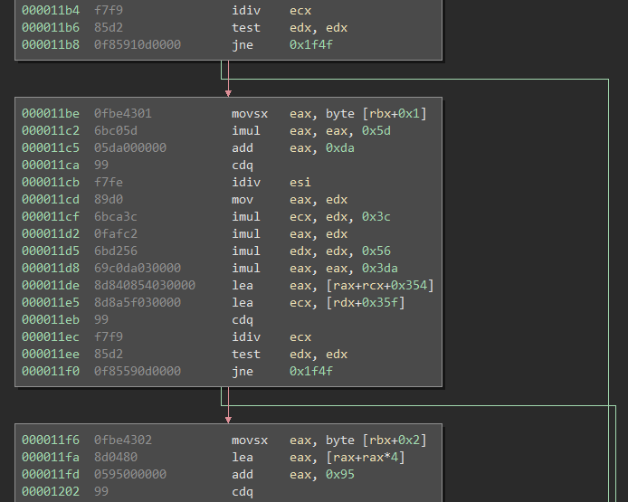

# Cursed app 

    Description
    If we want to say 100, should we start at 1 and count until 100?
    sha256(flag) = dd791346264fc02ddcd2466b9e8b2b2bba8057d61fbbc824d25c7957c127250d
    
The challenge consists out of cursed_app.elf, a 64bit Linux binary which requires a licence file as an argument which contains the flag.
The binary checks whether the flag is correct or not.

## Solution

The binary consists out of 60 checks whether the input is correct, because it checks each character of the file one at a time each constrain can be solved individually.

The checking blocks all look similar to this:



I choose angr to solve the constrains for me:

```python
import angr
import claripy

def main():
    print("Loading..")
    p = angr.Project("cursed_app.elf", load_options={'auto_load_libs': False})
    # provide the argument to the fake file
    state = p.factory.entry_state(args= ["cursed_app.elf", "tmpLicence"])

    license_name = "tmpLicence"

    bytestring = None
    line = []
    for i in range(0x3b):
        line.append(state.solver.BVS('tmpLicence_%d' % (i), 8))
    bytestring = claripy.Concat(*line)
    
    
    for byte in bytestring.chop(8): # only allow printable characters
        state.add_constraints(byte >= '\x20') # ' '
        state.add_constraints(byte <= '\x7e') # '~'

    license_file = angr.storage.file.SimFile(license_name, bytestring) # create symbolic file with content basesd on symbolic string
    state.fs.insert(license_name, license_file) # insert the file into the state

    # offsets to the next blocks, and "win" condition
    blocks = [0x1177, 0x11be, 0x11f6 , 0x1231, 0x1269, 0x12a3, 0x12d6, 0x1312, 0x1351, 0x138c, 0x13ca, 0x140d, 0x1445, 0x1481, 0x14c2, 0x14fb, 0x1536, 0x1572, 0x15b3
    , 0x15ee, 0x1629, 0x166a, 0x16a6, 0x16df, 0x1715, 0x1750, 0x178c, 0x17c7, 0x1805, 0x1843, 0x187b, 0x18c1, 0x18fd, 0x193b, 0x1977, 0x19b3, 0x19f2, 0x1a2b
    , 0x1a66, 0x1a9c, 0x1ad7, 0x1b17, 0x1b52, 0x1b91, 0x1bcd, 0x1c05, 0x1c3e, 0x1c7c, 0x1cba, 0x1cf3, 0x1d2e, 0x1d6f, 0x1daa, 0x1de0, 0x1e19, 0x1e54, 0x1e90
    , 0x1ece, 0x1f06, 0x1f3b]
    
    # create simulation
    simgr = p.factory.simulation_manager(state)

    # explore the paths and continue from the one that worked
    for i in range(len(blocks)):
        simgr.explore(
                find=(0x400000 + blocks[i]),
                avoid=(0x400000  + 0x1f4f)
            )
        print(simgr)
        found = simgr.found[0]
        simgr.move('found', 'active') # add the path that reached the next block to the one we continue from
        print("Found for "+str(i+1)+" characters.")
    data, actual_size, new_pos = license_file.read(0, 0x40) # read the symbolic file
    print(found.solver.eval(bytestring, cast_to=bytes)) # and output
    return

if __name__ == '__main__':
    main()
```

Which after a short while returned the flag "ASIS{y0u_c4N_s33_7h15_15_34R13R_7h4n_Y0u_7h1nk_r16h7?__!!!}".
While this works as a correct licence text for the binary, it doesn't match the given sha256 hash.
Looking at it shows that "34R13R" probably should be "34513R" and indeed that also satisfies the constrains and is the correct flag:

    ASIS{y0u_c4N_s33_7h15_15_34513R_7h4n_Y0u_7h1nk_r16h7?__!!!}
    

# Helix

    Description:
    Secrets are kept out of reach for outsiders inside the helix! Can you bring them out?
    
Helix contains a 64bit Linux binary and a file named "flag.enc" probably containing the flag in an encrypted format.
To run Helix a file named "flag" is required to exist, which is then encrypted and written to "flag.enc"

## Solution

Looking into the binary the inner workings can be summarized as:

  - Check for the "flag" file and read it if it exists
  - Determine the first x for which x*x >= length(fileContent) is correct
  - Fill a C++ vector with the fileContent and (x*x - fileContent) random bytes
  - Calculate a random variable o and apply (c+o)&0xFF for each byte in the previously created vector
  - Split the vector into a vector of x vectors, where each vector contain x elements of the original vector
  - Put the vector of vectors through a recursive scrambling method which outputs a vector<byte> containing the encrypted and scrambled data
  - Write the bytes of the scrambled data into the "flag.enc" file
  
The scrambling method outputs different patterns depending on x, and for the provided "flag.enc" file, which is 11881 bytes in size, x is 109.
Based on this I wrote a gdb script that creates a dummy flag file of size x*x and traces the recursive scrambling and access to data to create an array containing the scrambled order of indexes for a given x.

```python
import gdb

SQRT_VALUE = 109 # root of the size of the real flags file size
f = open("flag", "wb")
f.write(bytes([(i&0xFF) for i in range(SQRT_VALUE*SQRT_VALUE)])) # write some dummy values
f.close()

gdb.execute("d")
gdb.execute("break *rand")

gdb.execute("run")
gdb.execute("finish") # finish rand()
gdb.execute("set $rax = 0") # rand() = 0, for consistency

gdb.execute("break *($rip+0x187)")  # here we can parse the original list
gdb.execute("continue")

gdb.execute("break *($rip-0x6d5)") # interesting function                       00000000000023CA
gdb.execute("break *($rip+0x77e)") # here the values get read in shuffled order 000000000000321D
gdb.execute("continue")

constBreakpoint = long(gdb.parse_and_eval("$rip")) # address of the scramble function

listOfLists = [] # list containing all recursive scrambling results

while constBreakpoint == long(gdb.parse_and_eval("$rip")):

    # Amount of vector<int>'s in the vector<vector<int>> used for the scramble call
    bufferStart = gdb.parse_and_eval("*((void**)($rsi))")
    bufferEnd   = gdb.parse_and_eval("*((void**)($rsi+8))")
    bufferSize  = int((bufferEnd-bufferStart)/(8*3))
    
    # If the list is empty scrambling is finished
    if bufferSize == 0: break
    
    # Save all addresses used to save values in the vector<int>'s
    contentMap = {}
    for i in range(SQRT_VALUE):
        startReading = long(gdb.parse_and_eval("*((void**)("+str(bufferStart)+"+"+str(0)+"))"))
        endReading   = long(gdb.parse_and_eval("*((void**)("+str(bufferStart)+"+"+str(8)+"))"))
        bufferStart = bufferStart + 8*3
        for x in range(bufferSize):
            contentMap[long(startReading)+x*4] = i*bufferSize+x # save the address and index

    # Now record and save all accesses to the data and their sequence
    callList = []
    gdb.execute("continue") # continue from constructor
    for i in range(SQRT_VALUE*SQRT_VALUE):
        if constBreakpoint != long(gdb.parse_and_eval("$rip")):
            currentAccess = long(gdb.parse_and_eval("$rax"))
            callList.append(contentMap[currentAccess]) # add the original index
            gdb.execute("continue") # next
 
    print([hex(x) for x in callList]) # output the result of this scrambling iteration in readable format
    listOfLists.append(callList)      # append it to the list of recursive scrambling

# iterate backwards through the lists and apply the recursive scrambling on the lists it applies to
for i in range(len(listOfLists)-1):
    cL = listOfLists[-i-1]
    tL = listOfLists[-i-2][-len(cL)::]
    listOfLists[-i-2] = listOfLists[-i-2][:-len(cL)]+[tL[cL[j]] for j in range(len(cL))]
    
print([hex(x) for x in listOfLists[0]]) # output the final scrambling format
gdb.execute("continue")                 # let it write the "flag.enc" file for confirming it worked
```

The "applyUnscramble.py" script contains the scramble index array and the reversing of it (not included here because it's quite long) as well as reversing the (c+o)&0xFF operation (o is 8 for the provided "flag.enc" file which can easily be guessed based by the amount of 0x08 bytes at the beginning after unscrambling).

The result is a PNG file with the flag on it:


