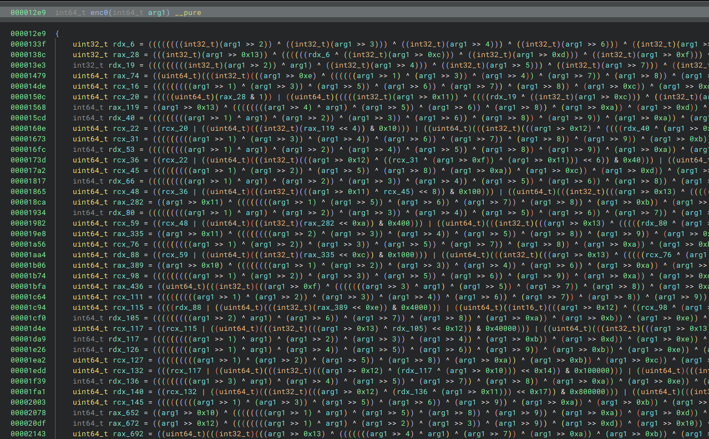
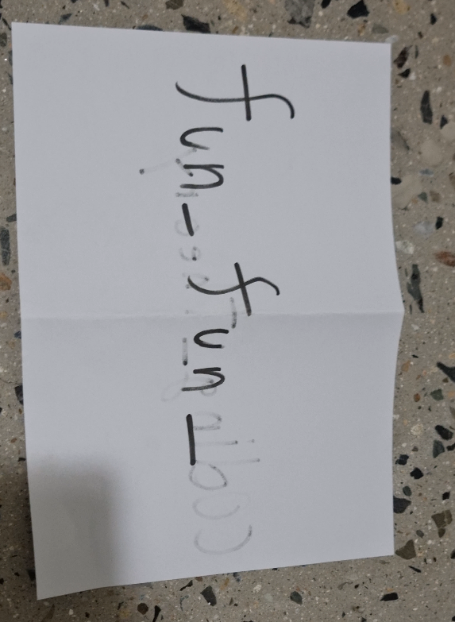
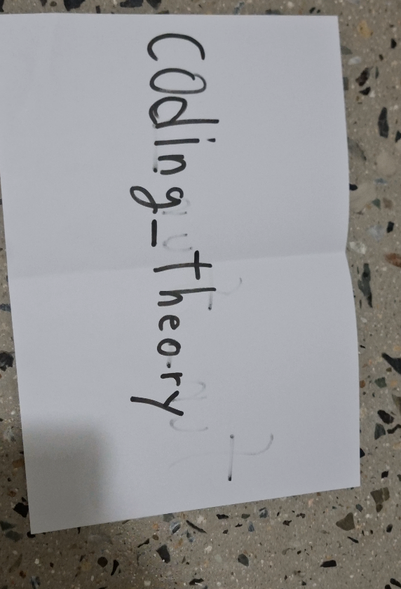

# Everlasting_Message

    This binary won't stop sending messages. It seems to be trying to tell us something important...


Everlasting_Message provides an encryption program and the encrypted flag file.

## Solution

The encryption binary creates 4 threads which receive and send data to each other using `msgget` and `msgsnd`.
Specifically each thread gets assigned an encryption function and a bit extraction function.

So every 80 bits of plaintext get send to the threads, which extract 20 bits each and apply their encryption function on it, that sends 40 bits back.
This means every 10 bytes of plaintext turn into 20 bytes of ciphertext.

Notable here is that the encryption functions look horrible to analyze:



and after applying the encryption two random bits get flipped:

```C
000060c0          int64_t encExtractedBits = applyEncryptionFunction(extract20Bits(&msgp[1]));
000060db          int64_t flipOneBit = ((1 << (rand() & 0x3f)) ^ encExtractedBits);
000060f7          int64_t flipAnotherBit = ((1 << (rand() & 0x3f)) ^ flipOneBit);
00006106          msgp[0] = threadId;
0000610e          msgp[1] = flipAnotherBit;
00006128          sendData = msgsnd(msg3b6_2, &msgp, 0x10, 0);
```

The code that merges the thread results only cares about the first 5 bytes, so bits flipped above the 40th are disregarded.

The first step to solving this is to invert the encryption functions. Since they only take 20 bits as input we can just build lookup tables for them.

An easy way to do that is to LD_PRELOAD a hook (in this case for the first `msgget`) for the binary to print out all possible encryptions without flipped bits:

```C
// gcc everlasting_message_preload.c -o everlasting_message_preload.so -fPIC -shared -ldl -D_GNU_SOURCE
// LD_PRELOAD=$PWD/everlasting_message_preload.so ./messages msg.txt msg.bin

int msgget(key_t key, int msgflg) {
    
    Dl_info dlinfo;
    dladdr(__builtin_return_address(0), &dlinfo);
    
    unsigned char * base_addr = (unsigned char*) dlinfo.dli_fbase;

    uint64_t (*enc0)(uint64_t) = (void*)(base_addr + 0x12e9); // enc0
    uint64_t (*enc1)(uint64_t) = (void*)(base_addr + 0x264d); // enc1
    uint64_t (*enc2)(uint64_t) = (void*)(base_addr + 0x3977); // enc2
    uint64_t (*enc3)(uint64_t) = (void*)(base_addr + 0x4c0e); // enc3
    
    for(uint64_t i=0;i<=0xfffff;i++) {
        // run this for each encryption function once
        printf("%05lX %010lX\n", i, enc0(i));
    }

    exit(0);
    return 0;
}
```

Based on this we create 4 look-up tables (table0.txt, table1.txt, table2.txt, table3.txt).
In the decryption script we build a ciphertext to plaintext map where we introduce the flipped bits again.

```python
# decrypt

def parseTable(nr):
    table = {}
    f = open("table"+str(nr)+".txt", "r")
    lines = f.read().split("\n")[:-1]
    f.close()
    indx = 0
    for line in lines:
        if indx % 10000 == 0:
            print("Loading Randomized Table", indx, len(lines))
            
        a, b = line.split(" ")
        a = int(a, 16)    
        b = int(b, 16)
        
        # load in variations of the dumped entries with potentially one flipped bit
        for i in range(41):
            c = (b ^ (1 << i))&0xffffffffff
            table[c] = a
            
        table[b] = a
        
        indx += 1
        
    return table

# try to lookup from the table of one-bit flipped values by flipping another bit
# (and potentially undoing one of the ciphertext bitflips)
def tryVariations(table, b):
    for j in range(41):
        c = (b ^ (1 << j))&0xffffffffff
        if c in table:
            return table[c]
    # Log if for some reason no entry was found
    print("Failure at", b)
    return 0
    
    
# Load the tables for the 4 different functions
table0 = parseTable(0)
table1 = parseTable(1)
table2 = parseTable(2)
table3 = parseTable(3)


tableTable = [table0, table1, table2, table3]

print("Tables loaded")

ciphertext = open("flag_enc", "rb").read()

f = open("flag.mp4", "wb")

for j in range(len(ciphertext)//20):

    if j % 10000 == 0:
        print(j, len(ciphertext)//20)

    # Take 4 5-byte blocks out of the cipher text
    bigblock = ciphertext[j*20:(j+1)*20]
    chunk = []
    for i in range(4):
        # Run each 5-byte block through the corresponding look up table
        block = bigblock[i*5:(i+1)*5]
        # decode the bytes to a number
        nm = int.from_bytes(block, byteorder="little")
        chunk.append(tryVariations(tableTable[i], nm))
    # Format the 4 chunks to 10-byte plaintext
    f.write((chunk[0] + (chunk[1]<<20) + (chunk[2]<<40) + (chunk[3]<<60)).to_bytes(10, 'little'))
    
f.close()
print("Done..")
```

Because of the flipped bits this takes quite a bit of memory and time on the large encrypted flag file.
But after waiting a bit we get the video which shows the flag:






# LACUCARA_VM

    Did you know that a month ago was BASIC's 60th birthday? (Note: In Korea, a 60th birthday is called “Hwangap” and has a special meaning). To celebrate, I've created a challenge using the BASIC language. Have fun!

LACUCARA_VM gives us a 32bit Windows binary, a redacted flag (which is input to the program) and the output of the execution with the real flag.

## Solution

The binary itself is quite large and it is easy to get lost in it. An easy way to find the actual Virtual Machine is to search for the usage of the strings in the register printing, specifically the `REG R` string.
From there we get to the `0044a0d9  int32_t __stdcall printR0AndR1(int16_t* arg1)` function which is called directly in the Virtual Machine body.
Unlike most of the other code in the binary the VM Dispatcher is decently readable:


| Opcode | Name         |
|--------|--------------|
| 00     | printR0AndR1 |
| 01     | ADD          |
| 02     | SUB          |
| 03     | MUL          |
| 04     | DIV          |
| 05     | JMP          |
| 06     | JG           |
| 07     | JL           |
| 08     | JE           |
| 09     | JNE          |
| 0A     | SET_FLAGS    |
| 0B     | AND          |
| 0C     | OR           |
| 0D     | XOR          |
| 0E     | NOT          |
| 0F     | MOV          |
| 10     | CALL         |
| 11     | RET          |
| 12     | PUSH         |
| 13     | POP          |
| 14     | SWAP         |
| 15     | SHL          |
| 16     | SHR          |
| 17     | PUSHAD       |
| 18     | POPAD        |
| 19     | printR0AndR1 |

Now by setting a breakpoint at the VM Dispatcher `0044af2b  int32_t __stdcall VMDispatcher(int32_t* code)` we can dump the bytecode at runtime.
Together with static analysis of the handlers we have a disassembly of the executed code.

```python
# Dumped during runtime
code = "02 00 00 00 12 00 00 00 00 00 00 00 00 00 00 00 01 00 00 00 16 00 00 00 00 00 00 00 07 00 00 00 02 00 00 00 0F 00 00 00 01 00 00 00 00 00 00 00 02 00 00 00 13 00 00 00 00 00 00 00 00 00 00 00 02 00 00 00 12 00 00 00 00 00 00 00 00 00 00 00 01 00 00 00 16 00 00 00 00 00 00 00 04 00 00 00 02 00 00 00 0F 00 00 00 15 00 00 00 00 00 00 00 02 00 00 00 13 00 00 00 00 00 00 00 00 00 00 00 02 00 00 00 12 00 00 00 00 00 00 00 00 00 00 00 01 00 00 00 16 00 00 00 00 00 00 00 0B 00 00 00 02 00 00 00 0F 00 00 00 05 00 00 00 00 00 00 00 02 00 00 00 13 00 00 00 00 00 00 00 00 00 00 00 02 00 00 00 12 00 00 00 00 00 00 00 00 00 00 00 01 00 00 00 16 00 00 00 00 00 00 00 0C 00 00 00 02 00 00 00 0F 00 00 00 14 00 00 00 00 00 00 00 02 00 00 00 13 00 00 00 00 00 00 00 00 00 00 00 02 00 00 00 12 00 00 00 00 00 00 00 00 00 00 00 01 00 00 00 16 00 00 00 00 00 00 00 08 00 00 00 02 00 00 00 0F 00 00 00 0C 00 00 00 00 00 00 00 02 00 00 00 13 00 00 00 00 00 00 00 00 00 00 00 02 00 00 00 12 00 00 00 00 00 00 00 00 00 00 00 01 00 00 00 16 00 00 00 00 00 00 00 0F 00 00 00 02 00 00 00 0F 00 00 00 02 00 00 00 00 00 00 00 02 00 00 00 13 00 00 00 00 00 00 00 00 00 00 00 02 00 00 00 12 00 00 00 00 00 00 00 00 00 00 00 01 00 00 00 16 00 00 00 00 00 00 00 03 00 00 00 02 00 00 00 0F 00 00 00 11 00 00 00 00 00 00 00 02 00 00 00 13 00 00 00 00 00 00 00 00 00 00 00 02 00 00 00 12 00 00 00 00 00 00 00 00 00 00 00 01 00 00 00 16 00 00 00 00 00 00 00 06 00 00 00 02 00 00 00 0F 00 00 00 12 00 00 00 00 00 00 00 02 00 00 00 13 00 00 00 00 00 00 00 00 00 00 00 02 00 00 00 12 00 00 00 14 00 00 00 00 00 00 00 02 00 00 00 0D 00 00 00 14 00 00 00 0C 00 00 00 02 00 00 00 0F 00 00 00 09 00 00 00 14 00 00 00 02 00 00 00 13 00 00 00 14 00 00 00 00 00 00 00 02 00 00 00 12 00 00 00 00 00 00 00 00 00 00 00 01 00 00 00 16 00 00 00 00 00 00 00 0E 00 00 00 02 00 00 00 0F 00 00 00 0A 00 00 00 00 00 00 00 02 00 00 00 13 00 00 00 00 00 00 00 00 00 00 00 02 00 00 00 12 00 00 00 05 00 00 00 00 00 00 00 02 00 00 00 0D 00 00 00 05 00 00 00 02 00 00 00 02 00 00 00 0F 00 00 00 08 00 00 00 05 00 00 00 02 00 00 00 13 00 00 00 05 00 00 00 00 00 00 00 02 00 00 00 12 00 00 00 00 00 00 00 00 00 00 00 01 00 00 00 16 00 00 00 00 00 00 00 0A 00 00 00 02 00 00 00 0F 00 00 00 0B 00 00 00 00 00 00 00 02 00 00 00 13 00 00 00 00 00 00 00 00 00 00 00 02 00 00 00 0D 00 00 00 05 00 00 00 01 00 00 00 02 00 00 00 0D 00 00 00 0C 00 00 00 15 00 00 00 02 00 00 00 12 00 00 00 00 00 00 00 00 00 00 00 01 00 00 00 16 00 00 00 00 00 00 00 02 00 00 00 02 00 00 00 0F 00 00 00 04 00 00 00 00 00 00 00 02 00 00 00 13 00 00 00 00 00 00 00 00 00 00 00 02 00 00 00 12 00 00 00 0A 00 00 00 00 00 00 00 02 00 00 00 0D 00 00 00 0A 00 00 00 0B 00 00 00 02 00 00 00 0F 00 00 00 07 00 00 00 0A 00 00 00 02 00 00 00 13 00 00 00 0A 00 00 00 00 00 00 00 02 00 00 00 12 00 00 00 00 00 00 00 00 00 00 00 02 00 00 00 0D 00 00 00 00 00 00 00 0C 00 00 00 02 00 00 00 0F 00 00 00 0C 00 00 00 00 00 00 00 02 00 00 00 13 00 00 00 00 00 00 00 00 00 00 00 02 00 00 00 0D 00 00 00 0A 00 00 00 12 00 00 00 02 00 00 00 12 00 00 00 11 00 00 00 00 00 00 00 02 00 00 00 0D 00 00 00 11 00 00 00 05 00 00 00 02 00 00 00 0F 00 00 00 05 00 00 00 11 00 00 00 02 00 00 00 13 00 00 00 11 00 00 00 00 00 00 00 01 00 00 00 0B 00 00 00 0C 00 00 00 01 00 00 00 02 00 00 00 12 00 00 00 04 00 00 00 00 00 00 00 02 00 00 00 0D 00 00 00 04 00 00 00 0A 00 00 00 02 00 00 00 0F 00 00 00 0A 00 00 00 04 00 00 00 02 00 00 00 13 00 00 00 04 00 00 00 00 00 00 00 01 00 00 00 15 00 00 00 05 00 00 00 0F 00 00 00 02 00 00 00 12 00 00 00 00 00 00 00 00 00 00 00 01 00 00 00 16 00 00 00 00 00 00 00 0D 00 00 00 02 00 00 00 0F 00 00 00 16 00 00 00 00 00 00 00 02 00 00 00 13 00 00 00 00 00 00 00 00 00 00 00 02 00 00 00 12 00 00 00 00 00 00 00 00 00 00 00 01 00 00 00 16 00 00 00 00 00 00 00 09 00 00 00 02 00 00 00 0F 00 00 00 13 00 00 00 00 00 00 00 02 00 00 00 13 00 00 00 00 00 00 00 00 00 00 00 02 00 00 00 0C 00 00 00 05 00 00 00 0C 00 00 00 01 00 00 00 15 00 00 00 0A 00 00 00 0E 00 00 00 01 00 00 00 0F 00 00 00 0C 00 00 00 00 40 00 00 02 00 00 00 12 00 00 00 16 00 00 00 00 00 00 00 02 00 00 00 0D 00 00 00 16 00 00 00 13 00 00 00 02 00 00 00 0F 00 00 00 03 00 00 00 16 00 00 00 02 00 00 00 13 00 00 00 16 00 00 00 00 00 00 00 02 00 00 00 12 00 00 00 00 00 00 00 00 00 00 00 01 00 00 00 16 00 00 00 00 00 00 00 01 00 00 00 02 00 00 00 0F 00 00 00 10 00 00 00 00 00 00 00 02 00 00 00 13 00 00 00 00 00 00 00 00 00 00 00 02 00 00 00 0B 00 00 00 0A 00 00 00 0C 00 00 00 02 00 00 00 0C 00 00 00 05 00 00 00 0A 00 00 00 02 00 00 00 12 00 00 00 03 00 00 00 00 00 00 00 02 00 00 00 0D 00 00 00 03 00 00 00 10 00 00 00 02 00 00 00 0F 00 00 00 0A 00 00 00 03 00 00 00 02 00 00 00 13 00 00 00 03 00 00 00 00 00 00 00 01 00 00 00 0F 00 00 00 0C 00 00 00 00 20 00 00 01 00 00 00 15 00 00 00 0A 00 00 00 0D 00 00 00 02 00 00 00 0B 00 00 00 0A 00 00 00 0C 00 00 00 02 00 00 00 0C 00 00 00 05 00 00 00 0A 00 00 00 02 00 00 00 12 00 00 00 09 00 00 00 00 00 00 00 02 00 00 00 0D 00 00 00 09 00 00 00 15 00 00 00 02 00 00 00 0F 00 00 00 0A 00 00 00 09 00 00 00 02 00 00 00 13 00 00 00 09 00 00 00 00 00 00 00 01 00 00 00 0F 00 00 00 0C 00 00 00 00 10 00 00 01 00 00 00 15 00 00 00 0A 00 00 00 0C 00 00 00 02 00 00 00 0B 00 00 00 0A 00 00 00 0C 00 00 00 02 00 00 00 0C 00 00 00 05 00 00 00 0A 00 00 00 01 00 00 00 0F 00 00 00 0C 00 00 00 00 10 00 00 02 00 00 00 12 00 00 00 01 00 00 00 00 00 00 00 02 00 00 00 0D 00 00 00 01 00 00 00 08 00 00 00 02 00 00 00 0F 00 00 00 0A 00 00 00 01 00 00 00 02 00 00 00 13 00 00 00 01 00 00 00 00 00 00 00 01 00 00 00 02 00 00 00 0C 00 00 00 00 08 00 00 01 00 00 00 15 00 00 00 0A 00 00 00 0B 00 00 00 02 00 00 00 0B 00 00 00 0A 00 00 00 0C 00 00 00 02 00 00 00 0C 00 00 00 05 00 00 00 0A 00 00 00 02 00 00 00 12 00 00 00 12 00 00 00 00 00 00 00 02 00 00 00 0D 00 00 00 12 00 00 00 04 00 00 00 02 00 00 00 0F 00 00 00 0A 00 00 00 12 00 00 00 02 00 00 00 13 00 00 00 12 00 00 00 00 00 00 00 02 00 00 00 12 00 00 00 00 00 00 00 00 00 00 00 01 00 00 00 16 00 00 00 00 00 00 00 05 00 00 00 02 00 00 00 0F 00 00 00 06 00 00 00 00 00 00 00 02 00 00 00 13 00 00 00 00 00 00 00 00 00 00 00 02 00 00 00 0D 00 00 00 0B 00 00 00 0A 00 00 00 02 00 00 00 0D 00 00 00 16 00 00 00 10 00 00 00 01 00 00 00 15 00 00 00 0B 00 00 00 0A 00 00 00 02 00 00 00 12 00 00 00 06 00 00 00 00 00 00 00 02 00 00 00 0D 00 00 00 06 00 00 00 16 00 00 00 02 00 00 00 0F 00 00 00 16 00 00 00 06 00 00 00 02 00 00 00 13 00 00 00 06 00 00 00 00 00 00 00 01 00 00 00 0B 00 00 00 0B 00 00 00 00 04 00 00 02 00 00 00 0D 00 00 00 09 00 00 00 00 00 00 00 01 00 00 00 15 00 00 00 16 00 00 00 09 00 00 00 02 00 00 00 0C 00 00 00 05 00 00 00 0B 00 00 00 01 00 00 00 0B 00 00 00 16 00 00 00 00 02 00 00 01 00 00 00 15 00 00 00 09 00 00 00 08 00 00 00 02 00 00 00 12 00 00 00 11 00 00 00 00 00 00 00 02 00 00 00 0D 00 00 00 11 00 00 00 08 00 00 00 02 00 00 00 0F 00 00 00 08 00 00 00 11 00 00 00 02 00 00 00 13 00 00 00 11 00 00 00 00 00 00 00 01 00 00 00 0B 00 00 00 09 00 00 00 00 01 00 00 02 00 00 00 0C 00 00 00 05 00 00 00 16 00 00 00 01 00 00 00 15 00 00 00 08 00 00 00 07 00 00 00 02 00 00 00 0D 00 00 00 12 00 00 00 07 00 00 00 02 00 00 00 0D 00 00 00 13 00 00 00 10 00 00 00 02 00 00 00 0C 00 00 00 05 00 00 00 09 00 00 00 01 00 00 00 0B 00 00 00 08 00 00 00 FF 00 00 00 01 00 00 00 15 00 00 00 12 00 00 00 06 00 00 00 02 00 00 00 12 00 00 00 06 00 00 00 00 00 00 00 02 00 00 00 0D 00 00 00 06 00 00 00 13 00 00 00 02 00 00 00 0F 00 00 00 13 00 00 00 06 00 00 00 02 00 00 00 13 00 00 00 06 00 00 00 00 00 00 00 02 00 00 00 0D 00 00 00 14 00 00 00 15 00 00 00 02 00 00 00 0C 00 00 00 05 00 00 00 08 00 00 00 01 00 00 00 0B 00 00 00 12 00 00 00 40 00 00 00 01 00 00 00 15 00 00 00 13 00 00 00 05 00 00 00 02 00 00 00 0D 00 00 00 00 00 00 00 14 00 00 00 02 00 00 00 0C 00 00 00 05 00 00 00 12 00 00 00 01 00 00 00 0B 00 00 00 13 00 00 00 20 00 00 00 01 00 00 00 15 00 00 00 00 00 00 00 04 00 00 00 02 00 00 00 0C 00 00 00 05 00 00 00 13 00 00 00 01 00 00 00 0B 00 00 00 00 00 00 00 10 00 00 00 02 00 00 00 12 00 00 00 05 00 00 00 00 00 00 00 02 00 00 00 0C 00 00 00 05 00 00 00 00 00 00 00 02 00 00 00 0F 00 00 00 00 00 00 00 05 00 00 00 02 00 00 00 13 00 00 00 05 00 00 00 00 00 00 00 02 00 00 00 12 00 00 00 01 00 00 00 00 00 00 00 02 00 00 00 0D 00 00 00 01 00 00 00 11 00 00 00 02 00 00 00 0F 00 00 00 05 00 00 00 01 00 00 00 02 00 00 00 13 00 00 00 01 00 00 00 00 00 00 00 02 00 00 00 12 00 00 00 02 00 00 00 00 00 00 00 02 00 00 00 0D 00 00 00 02 00 00 00 05 00 00 00 02 00 00 00 0F 00 00 00 05 00 00 00 02 00 00 00 02 00 00 00 13 00 00 00 02 00 00 00 00 00 00 00 01 00 00 00 15 00 00 00 05 00 00 00 03 00 00 00 02 00 00 00 0D 00 00 00 04 00 00 00 07 00 00 00 01 00 00 00 0B 00 00 00 05 00 00 00 08 00 00 00 01 00 00 00 15 00 00 00 04 00 00 00 02 00 00 00 02 00 00 00 0D 00 00 00 03 00 00 00 06 00 00 00 02 00 00 00 0C 00 00 00 00 00 00 00 05 00 00 00 01 00 00 00 0B 00 00 00 04 00 00 00 04 00 00 00 01 00 00 00 15 00 00 00 03 00 00 00 01 00 00 00 02 00 00 00 0C 00 00 00 00 00 00 00 04 00 00 00 01 00 00 00 0B 00 00 00 03 00 00 00 02 00 00 00 02 00 00 00 0C 00 00 00 00 00 00 00 03 00 00 00 01 00 00 00 15 00 00 00 00 00 00 00 10 00 00 00 01 00 00 00 16 00 00 00 00 00 00 00 10 00 00 00 00 00 00 00 11 00 00 00 00 00 00 00 00 00 00 00 02 00 00 00 12 00 00 00 00 00 00 00 00 00 00 00 01 00 00 00 16 00 00 00 00 00 00 00 0F 00 00 00 02 00 00 00 0F 00 00 00 04 00 00 00 00 00 00 00 02 00 00 00 13 00 00 00 00 00 00 00 00 00 00 00 02 00 00 00 12 00 00 00 00 00 00 00 00 00 00 00 01 00 00 00 16 00 00 00 00 00 00 00 0B 00 00 00 02 00 00 00 0F 00 00 00 07 00 00 00 00 00 00 00 02 00 00 00 13 00 00 00 00 00 00 00 00 00 00 00 02 00 00 00 12 00 00 00 00 00 00 00 00 00 00 00 01 00 00 00 16 00 00 00 00 00 00 00 0C 00 00 00 02 00 00 00 0F 00 00 00 08 00 00 00 00 00 00 00 02 00 00 00 13 00 00 00 00 00 00 00 00 00 00 00 02 00 00 00 12 00 00 00 00 00 00 00 00 00 00 00 01 00 00 00 16 00 00 00 00 00 00 00 08 00 00 00 02 00 00 00 0F 00 00 00 15 00 00 00 00 00 00 00 02 00 00 00 13 00 00 00 00 00 00 00 00 00 00 00 02 00 00 00 12 00 00 00 00 00 00 00 00 00 00 00 01 00 00 00 16 00 00 00 00 00 00 00 07 00 00 00 02 00 00 00 0F 00 00 00 14 00 00 00 00 00 00 00 02 00 00 00 13 00 00 00 00 00 00 00 00 00 00 00 02 00 00 00 12 00 00 00 00 00 00 00 00 00 00 00 01 00 00 00 16 00 00 00 00 00 00 00 06 00 00 00 02 00 00 00 0F 00 00 00 06 00 00 00 00 00 00 00 02 00 00 00 13 00 00 00 00 00 00 00 00 00 00 00 02 00 00 00 12 00 00 00 08 00 00 00 00 00 00 00 02 00 00 00 0D 00 00 00 08 00 00 00 15 00 00 00 02 00 00 00 0F 00 00 00 0C 00 00 00 08 00 00 00 02 00 00 00 13 00 00 00 08 00 00 00 00 00 00 00 02 00 00 00 12 00 00 00 00 00 00 00 00 00 00 00 01 00 00 00 16 00 00 00 00 00 00 00 04 00 00 00 02 00 00 00 0F 00 00 00 16 00 00 00 00 00 00 00 02 00 00 00 13 00 00 00 00 00 00 00 00 00 00 00 02 00 00 00 12 00 00 00 04 00 00 00 00 00 00 00 02 00 00 00 0D 00 00 00 04 00 00 00 07 00 00 00 02 00 00 00 0F 00 00 00 0B 00 00 00 04 00 00 00 02 00 00 00 13 00 00 00 04 00 00 00 00 00 00 00 02 00 00 00 12 00 00 00 00 00 00 00 00 00 00 00 01 00 00 00 16 00 00 00 00 00 00 00 0A 00 00 00 02 00 00 00 0F 00 00 00 0D 00 00 00 00 00 00 00 02 00 00 00 13 00 00 00 00 00 00 00 00 00 00 00 02 00 00 00 12 00 00 00 00 00 00 00 00 00 00 00 01 00 00 00 16 00 00 00 00 00 00 00 0E 00 00 00 02 00 00 00 0F 00 00 00 01 00 00 00 00 00 00 00 02 00 00 00 13 00 00 00 00 00 00 00 00 00 00 00 02 00 00 00 12 00 00 00 00 00 00 00 00 00 00 00 01 00 00 00 16 00 00 00 00 00 00 00 02 00 00 00 02 00 00 00 0F 00 00 00 13 00 00 00 00 00 00 00 02 00 00 00 13 00 00 00 00 00 00 00 00 00 00 00 02 00 00 00 12 00 00 00 0D 00 00 00 00 00 00 00 02 00 00 00 0D 00 00 00 0D 00 00 00 01 00 00 00 02 00 00 00 0F 00 00 00 12 00 00 00 0D 00 00 00 02 00 00 00 13 00 00 00 0D 00 00 00 00 00 00 00 02 00 00 00 12 00 00 00 0B 00 00 00 00 00 00 00 02 00 00 00 0D 00 00 00 0B 00 00 00 14 00 00 00 02 00 00 00 0F 00 00 00 05 00 00 00 0B 00 00 00 02 00 00 00 13 00 00 00 0B 00 00 00 00 00 00 00 02 00 00 00 12 00 00 00 0C 00 00 00 00 00 00 00 02 00 00 00 0D 00 00 00 0C 00 00 00 16 00 00 00 02 00 00 00 0F 00 00 00 0E 00 00 00 0C 00 00 00 02 00 00 00 13 00 00 00 0C 00 00 00 00 00 00 00 02 00 00 00 0D 00 00 00 0D 00 00 00 06 00 00 00 02 00 00 00 12 00 00 00 00 00 00 00 00 00 00 00 01 00 00 00 16 00 00 00 00 00 00 00 05 00 00 00 02 00 00 00 0F 00 00 00 10 00 00 00 00 00 00 00 02 00 00 00 13 00 00 00 00 00 00 00 00 00 00 00 02 00 00 00 12 00 00 00 00 00 00 00 00 00 00 00 01 00 00 00 16 00 00 00 00 00 00 00 0D 00 00 00 02 00 00 00 0F 00 00 00 09 00 00 00 00 00 00 00 02 00 00 00 13 00 00 00 00 00 00 00 00 00 00 00 02 00 00 00 12 00 00 00 00 00 00 00 00 00 00 00 01 00 00 00 16 00 00 00 00 00 00 00 09 00 00 00 02 00 00 00 0F 00 00 00 0A 00 00 00 00 00 00 00 02 00 00 00 13 00 00 00 00 00 00 00 00 00 00 00 01 00 00 00 0B 00 00 00 0E 00 00 00 01 00 00 00 01 00 00 00 15 00 00 00 05 00 00 00 0F 00 00 00 02 00 00 00 12 00 00 00 13 00 00 00 00 00 00 00 02 00 00 00 0D 00 00 00 13 00 00 00 0D 00 00 00 02 00 00 00 0F 00 00 00 0D 00 00 00 13 00 00 00 02 00 00 00 13 00 00 00 13 00 00 00 00 00 00 00 02 00 00 00 12 00 00 00 00 00 00 00 00 00 00 00 01 00 00 00 16 00 00 00 00 00 00 00 01 00 00 00 02 00 00 00 0F 00 00 00 03 00 00 00 00 00 00 00 02 00 00 00 13 00 00 00 00 00 00 00 00 00 00 00 02 00 00 00 12 00 00 00 09 00 00 00 00 00 00 00 02 00 00 00 0D 00 00 00 09 00 00 00 0A 00 00 00 02 00 00 00 0F 00 00 00 11 00 00 00 09 00 00 00 02 00 00 00 13 00 00 00 09 00 00 00 00 00 00 00 02 00 00 00 0C 00 00 00 05 00 00 00 0E 00 00 00 02 00 00 00 0D 00 00 00 09 00 00 00 10 00 00 00 01 00 00 00 0F 00 00 00 0E 00 00 00 00 40 00 00 01 00 00 00 15 00 00 00 0D 00 00 00 0E 00 00 00 02 00 00 00 0B 00 00 00 0D 00 00 00 0E 00 00 00 02 00 00 00 12 00 00 00 03 00 00 00 00 00 00 00 02 00 00 00 0D 00 00 00 03 00 00 00 09 00 00 00 02 00 00 00 0F 00 00 00 09 00 00 00 03 00 00 00 02 00 00 00 13 00 00 00 03 00 00 00 00 00 00 00 02 00 00 00 0C 00 00 00 05 00 00 00 0D 00 00 00 01 00 00 00 15 00 00 00 09 00 00 00 0D 00 00 00 01 00 00 00 0F 00 00 00 0D 00 00 00 00 20 00 00 02 00 00 00 0B 00 00 00 09 00 00 00 0D 00 00 00 02 00 00 00 0D 00 00 00 0C 00 00 00 00 00 00 00 02 00 00 00 12 00 00 00 00 00 00 00 00 00 00 00 01 00 00 00 16 00 00 00 00 00 00 00 03 00 00 00 02 00 00 00 0F 00 00 00 02 00 00 00 00 00 00 00 02 00 00 00 13 00 00 00 00 00 00 00 00 00 00 00 02 00 00 00 0C 00 00 00 05 00 00 00 09 00 00 00 01 00 00 00 15 00 00 00 0C 00 00 00 0C 00 00 00 01 00 00 00 0F 00 00 00 09 00 00 00 00 10 00 00 02 00 00 00 0B 00 00 00 0C 00 00 00 09 00 00 00 02 00 00 00 0D 00 00 00 0B 00 00 00 02 00 00 00 01 00 00 00 0F 00 00 00 09 00 00 00 00 10 00 00 01 00 00 00 02 00 00 00 09 00 00 00 00 08 00 00 01 00 00 00 15 00 00 00 0B 00 00 00 0B 00 00 00 02 00 00 00 0B 00 00 00 0B 00 00 00 09 00 00 00 02 00 00 00 12 00 00 00 06 00 00 00 00 00 00 00 02 00 00 00 0D 00 00 00 06 00 00 00 12 00 00 00 02 00 00 00 0F 00 00 00 09 00 00 00 06 00 00 00 02 00 00 00 13 00 00 00 06 00 00 00 00 00 00 00 02 00 00 00 0C 00 00 00 05 00 00 00 0C 00 00 00 01 00 00 00 15 00 00 00 09 00 00 00 0A 00 00 00 02 00 00 00 0C 00 00 00 05 00 00 00 0B 00 00 00 01 00 00 00 0B 00 00 00 09 00 00 00 00 04 00 00 02 00 00 00 0C 00 00 00 05 00 00 00 09 00 00 00 02 00 00 00 12 00 00 00 10 00 00 00 00 00 00 00 02 00 00 00 0D 00 00 00 10 00 00 00 03 00 00 00 02 00 00 00 0F 00 00 00 09 00 00 00 10 00 00 00 02 00 00 00 13 00 00 00 10 00 00 00 00 00 00 00 02 00 00 00 0D 00 00 00 0A 00 00 00 09 00 00 00 02 00 00 00 0D 00 00 00 08 00 00 00 16 00 00 00 02 00 00 00 12 00 00 00 00 00 00 00 00 00 00 00 02 00 00 00 0D 00 00 00 00 00 00 00 08 00 00 00 02 00 00 00 0F 00 00 00 08 00 00 00 00 00 00 00 02 00 00 00 13 00 00 00 00 00 00 00 00 00 00 00 01 00 00 00 15 00 00 00 0A 00 00 00 09 00 00 00 02 00 00 00 0D 00 00 00 04 00 00 00 14 00 00 00 01 00 00 00 0B 00 00 00 0A 00 00 00 00 02 00 00 01 00 00 00 15 00 00 00 08 00 00 00 08 00 00 00 02 00 00 00 12 00 00 00 02 00 00 00 00 00 00 00 02 00 00 00 0D 00 00 00 02 00 00 00 04 00 00 00 02 00 00 00 0F 00 00 00 04 00 00 00 02 00 00 00 02 00 00 00 13 00 00 00 02 00 00 00 00 00 00 00 02 00 00 00 0C 00 00 00 05 00 00 00 0A 00 00 00 01 00 00 00 0B 00 00 00 08 00 00 00 00 01 00 00 01 00 00 00 15 00 00 00 04 00 00 00 07 00 00 00 02 00 00 00 12 00 00 00 13 00 00 00 00 00 00 00 02 00 00 00 0D 00 00 00 13 00 00 00 12 00 00 00 02 00 00 00 0F 00 00 00 12 00 00 00 13 00 00 00 02 00 00 00 13 00 00 00 13 00 00 00 00 00 00 00 02 00 00 00 0C 00 00 00 05 00 00 00 08 00 00 00 01 00 00 00 0B 00 00 00 04 00 00 00 FF 00 00 00 01 00 00 00 15 00 00 00 12 00 00 00 06 00 00 00 02 00 00 00 0D 00 00 00 10 00 00 00 11 00 00 00 02 00 00 00 0D 00 00 00 15 00 00 00 16 00 00 00 02 00 00 00 0C 00 00 00 05 00 00 00 04 00 00 00 01 00 00 00 0B 00 00 00 12 00 00 00 40 00 00 00 01 00 00 00 15 00 00 00 10 00 00 00 05 00 00 00 02 00 00 00 0D 00 00 00 00 00 00 00 15 00 00 00 02 00 00 00 0C 00 00 00 05 00 00 00 12 00 00 00 01 00 00 00 0B 00 00 00 10 00 00 00 20 00 00 00 01 00 00 00 15 00 00 00 00 00 00 00 04 00 00 00 02 00 00 00 0C 00 00 00 05 00 00 00 10 00 00 00 01 00 00 00 0B 00 00 00 00 00 00 00 10 00 00 00 02 00 00 00 12 00 00 00 05 00 00 00 00 00 00 00 02 00 00 00 0C 00 00 00 05 00 00 00 00 00 00 00 02 00 00 00 0F 00 00 00 00 00 00 00 05 00 00 00 02 00 00 00 13 00 00 00 05 00 00 00 00 00 00 00 02 00 00 00 12 00 00 00 07 00 00 00 00 00 00 00 02 00 00 00 0D 00 00 00 07 00 00 00 14 00 00 00 02 00 00 00 0F 00 00 00 05 00 00 00 07 00 00 00 02 00 00 00 13 00 00 00 07 00 00 00 00 00 00 00 02 00 00 00 12 00 00 00 02 00 00 00 00 00 00 00 02 00 00 00 0D 00 00 00 02 00 00 00 05 00 00 00 02 00 00 00 0F 00 00 00 05 00 00 00 02 00 00 00 02 00 00 00 13 00 00 00 02 00 00 00 00 00 00 00 01 00 00 00 15 00 00 00 05 00 00 00 03 00 00 00 01 00 00 00 0B 00 00 00 05 00 00 00 08 00 00 00 02 00 00 00 0C 00 00 00 00 00 00 00 05 00 00 00 02 00 00 00 12 00 00 00 06 00 00 00 00 00 00 00 02 00 00 00 0D 00 00 00 06 00 00 00 13 00 00 00 02 00 00 00 0F 00 00 00 05 00 00 00 06 00 00 00 02 00 00 00 13 00 00 00 06 00 00 00 00 00 00 00 02 00 00 00 12 00 00 00 01 00 00 00 00 00 00 00 02 00 00 00 0D 00 00 00 01 00 00 00 05 00 00 00 02 00 00 00 0F 00 00 00 05 00 00 00 01 00 00 00 02 00 00 00 13 00 00 00 01 00 00 00 00 00 00 00 01 00 00 00 15 00 00 00 05 00 00 00 02 00 00 00 02 00 00 00 0D 00 00 00 03 00 00 00 11 00 00 00 01 00 00 00 0B 00 00 00 05 00 00 00 04 00 00 00 01 00 00 00 15 00 00 00 03 00 00 00 01 00 00 00 02 00 00 00 0C 00 00 00 00 00 00 00 05 00 00 00 01 00 00 00 0B 00 00 00 03 00 00 00 02 00 00 00 02 00 00 00 0C 00 00 00 00 00 00 00 03 00 00 00 01 00 00 00 15 00 00 00 00 00 00 00 10 00 00 00 01 00 00 00 16 00 00 00 00 00 00 00 10 00 00 00 00 00 00 00 11 00 00 00 00 00 00 00 00 00 00 00 02 00 00 00 0F 00 00 00 0B 00 00 00 00 00 00 00 00 00 00 00 12 00 00 00 01 00 00 00 00 00 00 00 01 00 00 00 16 00 00 00 01 00 00 00 10 00 00 00 02 00 00 00 0F 00 00 00 00 00 00 00 01 00 00 00 00 00 00 00 13 00 00 00 01 00 00 00 00 00 00 00 00 00 00 00 17 00 00 00 00 00 00 00 00 00 00 00 00 00 00 00 12 00 00 00 01 00 00 00 00 00 00 00 00 00 00 00 10 00 00 00 00 00 00 00 00 00 00 00 00 00 00 00 13 00 00 00 01 00 00 00 00 00 00 00 00 00 00 00 18 00 00 00 00 00 00 00 00 00 00 00 02 00 00 00 0F 00 00 00 0A 00 00 00 00 00 00 00 00 00 00 00 12 00 00 00 01 00 00 00 00 00 00 00 01 00 00 00 15 00 00 00 01 00 00 00 10 00 00 00 02 00 00 00 0F 00 00 00 00 00 00 00 01 00 00 00 00 00 00 00 13 00 00 00 01 00 00 00 00 00 00 00 01 00 00 00 16 00 00 00 00 00 00 00 10 00 00 00 00 00 00 00 17 00 00 00 00 00 00 00 00 00 00 00 00 00 00 00 10 00 00 00 C0 00 00 00 00 00 00 00 00 00 00 00 18 00 00 00 00 00 00 00 00 00 00 00 02 00 00 00 0F 00 00 00 09 00 00 00 00 00 00 00 00 00 00 00 12 00 00 00 0B 00 00 00 00 00 00 00 01 00 00 00 16 00 00 00 0B 00 00 00 10 00 00 00 02 00 00 00 0F 00 00 00 00 00 00 00 0B 00 00 00 00 00 00 00 13 00 00 00 0B 00 00 00 00 00 00 00 00 00 00 00 17 00 00 00 00 00 00 00 00 00 00 00 00 00 00 00 10 00 00 00 C0 00 00 00 00 00 00 00 00 00 00 00 18 00 00 00 00 00 00 00 00 00 00 00 02 00 00 00 0F 00 00 00 08 00 00 00 00 00 00 00 00 00 00 00 12 00 00 00 0B 00 00 00 00 00 00 00 01 00 00 00 15 00 00 00 0B 00 00 00 10 00 00 00 02 00 00 00 0F 00 00 00 00 00 00 00 0B 00 00 00 00 00 00 00 13 00 00 00 0B 00 00 00 00 00 00 00 01 00 00 00 16 00 00 00 00 00 00 00 10 00 00 00 00 00 00 00 17 00 00 00 00 00 00 00 00 00 00 00 00 00 00 00 10 00 00 00 00 00 00 00 00 00 00 00 00 00 00 00 18 00 00 00 00 00 00 00 00 00 00 00 00 00 00 00 12 00 00 00 08 00 00 00 00 00 00 00 01 00 00 00 16 00 00 00 08 00 00 00 10 00 00 00 02 00 00 00 0F 00 00 00 01 00 00 00 08 00 00 00 00 00 00 00 13 00 00 00 08 00 00 00 00 00 00 00 01 00 00 00 15 00 00 00 08 00 00 00 10 00 00 00 02 00 00 00 0C 00 00 00 00 00 00 00 08 00 00 00 00 00 00 00 12 00 00 00 0A 00 00 00 00 00 00 00 01 00 00 00 15 00 00 00 0A 00 00 00 10 00 00 00 02 00 00 00 0F 00 00 00 05 00 00 00 0A 00 00 00 00 00 00 00 13 00 00 00 0A 00 00 00 00 00 00 00 00 00 00 00 12 00 00 00 09 00 00 00 00 00 00 00 02 00 00 00 0C 00 00 00 09 00 00 00 05 00 00 00 02 00 00 00 0F 00 00 00 05 00 00 00 09 00 00 00 00 00 00 00 13 00 00 00 09 00 00 00 00 00 00 00 00 00 00 00 12 00 00 00 05 00 00 00 00 00 00 00 02 00 00 00 0C 00 00 00 05 00 00 00 01 00 00 00 02 00 00 00 0F 00 00 00 01 00 00 00 05 00 00 00 00 00 00 00 13 00 00 00 05 00 00 00 00 00 00 00 00 00 00 00 11 00 00 00 00 00 00 00 00 00 00 00 01 00 00 00 0A 00 00 00 02 00 00 00 00 00 00 00 01 00 00 00 09 00 00 00 BD 01 00 00 00 00 00 00 00 00 00 00 11 00 00 00 00 00 00 00 00 00 00 00 01 00 00 00 0A 00 00 00 02 00 00 00 40 00 00 00 01 00 00 00 07 00 00 00 C2 01 00 00 00 00 00 00 01 00 00 00 0F 00 00 00 00 00 00 00 00 00 00 00 01 00 00 00 0F 00 00 00 01 00 00 00 00 00 00 00 00 00 00 00 11 00 00 00 00 00 00 00 00 00 00 00 01 00 00 00 0A 00 00 00 02 00 00 00 20 00 00 00 01 00 00 00 07 00 00 00 C5 01 00 00 00 00 00 00 01 00 00 00 05 00 00 00 D5 01 00 00 00 00 00 00 02 00 00 00 12 00 00 00 01 00 00 00 00 00 00 00 02 00 00 00 15 00 00 00 01 00 00 00 02 00 00 00 02 00 00 00 0F 00 00 00 08 00 00 00 01 00 00 00 02 00 00 00 13 00 00 00 01 00 00 00 00 00 00 00 01 00 00 00 0F 00 00 00 0A 00 00 00 20 00 00 00 02 00 00 00 02 00 00 00 0A 00 00 00 02 00 00 00 02 00 00 00 12 00 00 00 00 00 00 00 00 00 00 00 02 00 00 00 16 00 00 00 00 00 00 00 02 00 00 00 02 00 00 00 0F 00 00 00 09 00 00 00 00 00 00 00 02 00 00 00 13 00 00 00 00 00 00 00 00 00 00 00 02 00 00 00 12 00 00 00 08 00 00 00 00 00 00 00 02 00 00 00 0C 00 00 00 08 00 00 00 09 00 00 00 02 00 00 00 0F 00 00 00 01 00 00 00 08 00 00 00 02 00 00 00 13 00 00 00 08 00 00 00 00 00 00 00 02 00 00 00 15 00 00 00 00 00 00 00 02 00 00 00 00 00 00 00 11 00 00 00 00 00 00 00 00 00 00 00 02 00 00 00 12 00 00 00 02 00 00 00 00 00 00 00 01 00 00 00 02 00 00 00 02 00 00 00 20 00 00 00 02 00 00 00 0F 00 00 00 08 00 00 00 02 00 00 00 02 00 00 00 13 00 00 00 02 00 00 00 00 00 00 00 02 00 00 00 12 00 00 00 00 00 00 00 00 00 00 00 02 00 00 00 15 00 00 00 00 00 00 00 08 00 00 00 02 00 00 00 0F 00 00 00 01 00 00 00 00 00 00 00 02 00 00 00 13 00 00 00 00 00 00 00 00 00 00 00 01 00 00 00 0F 00 00 00 00 00 00 00 00 00 00 00 00 00 00 00 11 00 00 00 00 00 00 00 00 00 00 00 01 00 00 00 0A 00 00 00 02 00 00 00 00 00 00 00 01 00 00 00 09 00 00 00 E2 01 00 00 00 00 00 00 00 00 00 00 11 00 00 00 00 00 00 00 00 00 00 00 01 00 00 00 0A 00 00 00 02 00 00 00 40 00 00 00 01 00 00 00 07 00 00 00 E7 01 00 00 00 00 00 00 01 00 00 00 0F 00 00 00 00 00 00 00 00 00 00 00 01 00 00 00 0F 00 00 00 01 00 00 00 00 00 00 00 00 00 00 00 11 00 00 00 00 00 00 00 00 00 00 00 01 00 00 00 0A 00 00 00 02 00 00 00 20 00 00 00 01 00 00 00 07 00 00 00 EA 01 00 00 00 00 00 00 01 00 00 00 05 00 00 00 FA 01 00 00 00 00 00 00 02 00 00 00 12 00 00 00 00 00 00 00 00 00 00 00 02 00 00 00 16 00 00 00 00 00 00 00 02 00 00 00 02 00 00 00 0F 00 00 00 08 00 00 00 00 00 00 00 02 00 00 00 13 00 00 00 00 00 00 00 00 00 00 00 01 00 00 00 0F 00 00 00 0A 00 00 00 20 00 00 00 02 00 00 00 02 00 00 00 0A 00 00 00 02 00 00 00 02 00 00 00 12 00 00 00 01 00 00 00 00 00 00 00 02 00 00 00 15 00 00 00 01 00 00 00 0A 00 00 00 02 00 00 00 0F 00 00 00 09 00 00 00 01 00 00 00 02 00 00 00 13 00 00 00 01 00 00 00 00 00 00 00 02 00 00 00 12 00 00 00 08 00 00 00 00 00 00 00 02 00 00 00 0C 00 00 00 08 00 00 00 09 00 00 00 02 00 00 00 0F 00 00 00 00 00 00 00 08 00 00 00 02 00 00 00 13 00 00 00 08 00 00 00 00 00 00 00 02 00 00 00 16 00 00 00 01 00 00 00 02 00 00 00 00 00 00 00 11 00 00 00 00 00 00 00 00 00 00 00 02 00 00 00 12 00 00 00 02 00 00 00 00 00 00 00 01 00 00 00 02 00 00 00 02 00 00 00 20 00 00 00 02 00 00 00 0F 00 00 00 08 00 00 00 02 00 00 00 02 00 00 00 13 00 00 00 02 00 00 00 00 00 00 00 02 00 00 00 12 00 00 00 01 00 00 00 00 00 00 00 02 00 00 00 16 00 00 00 01 00 00 00 08 00 00 00 02 00 00 00 0F 00 00 00 00 00 00 00 01 00 00 00 02 00 00 00 13 00 00 00 01 00 00 00 00 00 00 00 01 00 00 00 0F 00 00 00 01 00 00 00 00 00 00 00 00 00 00 00 11 00 00 00 00 00 00 00 00 00 00 00 02 00 00 00 0F 00 00 00 0E 00 00 00 00 00 00 00 02 00 00 00 0F 00 00 00 0F 00 00 00 01 00 00 00 02 00 00 00 0F 00 00 00 0C 00 00 00 02 00 00 00 01 00 00 00 0F 00 00 00 08 00 00 00 00 00 00 00 01 00 00 00 0F 00 00 00 0A 00 00 00 00 00 00 00 01 00 00 00 0F 00 00 00 09 00 00 00 00 00 00 00 01 00 00 00 0F 00 00 00 0B 00 00 00 40 00 00 00 02 00 00 00 0F 00 00 00 02 00 00 00 08 00 00 00 02 00 00 00 0F 00 00 00 00 00 00 00 0E 00 00 00 02 00 00 00 0F 00 00 00 01 00 00 00 0F 00 00 00 00 00 00 00 17 00 00 00 00 00 00 00 00 00 00 00 00 00 00 00 10 00 00 00 DF 01 00 00 00 00 00 00 00 00 00 00 18 00 00 00 00 00 00 00 00 00 00 00 01 00 00 00 0B 00 00 00 00 00 00 00 0F 00 00 00 02 00 00 00 01 00 00 00 00 00 00 00 0C 00 00 00 00 00 00 00 0F 00 00 00 00 00 00 00 00 00 00 00 02 00 00 00 0F 00 00 00 02 00 00 00 08 00 00 00 01 00 00 00 0F 00 00 00 01 00 00 00 00 00 00 00 00 00 00 00 17 00 00 00 00 00 00 00 00 00 00 00 00 00 00 00 10 00 00 00 BA 01 00 00 00 00 00 00 00 00 00 00 18 00 00 00 00 00 00 00 00 00 00 00 01 00 00 00 01 00 00 00 08 00 00 00 04 00 00 00 02 00 00 00 0C 00 00 00 0A 00 00 00 00 00 00 00 02 00 00 00 0C 00 00 00 09 00 00 00 01 00 00 00 02 00 00 00 0A 00 00 00 08 00 00 00 0B 00 00 00 01 00 00 00 09 00 00 00 0B 02 00 00 00 00 00 00 02 00 00 00 0F 00 00 00 00 00 00 00 0A 00 00 00 02 00 00 00 0F 00 00 00 01 00 00 00 09 00 00 00 00 00 00 00 11 00 00 00 00 00 00 00 00 00 00 00 02 00 00 00 12 00 00 00 01 00 00 00 00 00 00 00 01 00 00 00 16 00 00 00 01 00 00 00 1C 00 00 00 02 00 00 00 0F 00 00 00 05 00 00 00 01 00 00 00 02 00 00 00 13 00 00 00 01 00 00 00 00 00 00 00 01 00 00 00 15 00 00 00 05 00 00 00 14 00 00 00 02 00 00 00 12 00 00 00 01 00 00 00 00 00 00 00 01 00 00 00 16 00 00 00 01 00 00 00 18 00 00 00 02 00 00 00 0F 00 00 00 04 00 00 00 01 00 00 00 02 00 00 00 13 00 00 00 01 00 00 00 00 00 00 00 01 00 00 00 0B 00 00 00 04 00 00 00 0F 00 00 00 02 00 00 00 12 00 00 00 01 00 00 00 00 00 00 00 01 00 00 00 16 00 00 00 01 00 00 00 04 00 00 00 02 00 00 00 0F 00 00 00 03 00 00 00 01 00 00 00 02 00 00 00 13 00 00 00 01 00 00 00 00 00 00 00 01 00 00 00 15 00 00 00 03 00 00 00 1C 00 00 00 02 00 00 00 0C 00 00 00 05 00 00 00 03 00 00 00 02 00 00 00 12 00 00 00 00 00 00 00 00 00 00 00 01 00 00 00 15 00 00 00 00 00 00 00 08 00 00 00 02 00 00 00 0F 00 00 00 02 00 00 00 00 00 00 00 02 00 00 00 13 00 00 00 00 00 00 00 00 00 00 00 01 00 00 00 0F 00 00 00 03 00 00 00 00 10 00 00 01 00 00 00 02 00 00 00 03 00 00 00 00 01 00 00 02 00 00 00 0B 00 00 00 02 00 00 00 03 00 00 00 02 00 00 00 0C 00 00 00 05 00 00 00 02 00 00 00 02 00 00 00 12 00 00 00 01 00 00 00 00 00 00 00 01 00 00 00 16 00 00 00 01 00 00 00 08 00 00 00 02 00 00 00 0F 00 00 00 02 00 00 00 01 00 00 00 02 00 00 00 13 00 00 00 01 00 00 00 00 00 00 00 01 00 00 00 0F 00 00 00 06 00 00 00 00 F0 00 00 02 00 00 00 0B 00 00 00 02 00 00 00 06 00 00 00 02 00 00 00 0C 00 00 00 04 00 00 00 02 00 00 00 02 00 00 00 12 00 00 00 01 00 00 00 00 00 00 00 01 00 00 00 15 00 00 00 01 00 00 00 08 00 00 00 02 00 00 00 0F 00 00 00 02 00 00 00 01 00 00 00 02 00 00 00 13 00 00 00 01 00 00 00 00 00 00 00 01 00 00 00 0F 00 00 00 07 00 00 00 00 00 00 0F 02 00 00 00 0B 00 00 00 02 00 00 00 07 00 00 00 02 00 00 00 0C 00 00 00 04 00 00 00 02 00 00 00 02 00 00 00 12 00 00 00 01 00 00 00 00 00 00 00 01 00 00 00 16 00 00 00 01 00 00 00 08 00 00 00 02 00 00 00 0F 00 00 00 02 00 00 00 01 00 00 00 02 00 00 00 13 00 00 00 01 00 00 00 00 00 00 00 01 00 00 00 0B 00 00 00 02 00 00 00 F0 00 00 00 02 00 00 00 0C 00 00 00 05 00 00 00 02 00 00 00 02 00 00 00 12 00 00 00 01 00 00 00 00 00 00 00 01 00 00 00 15 00 00 00 01 00 00 00 08 00 00 00 02 00 00 00 0F 00 00 00 02 00 00 00 01 00 00 00 02 00 00 00 13 00 00 00 01 00 00 00 00 00 00 00 01 00 00 00 0F 00 00 00 06 00 00 00 00 00 0F 00 02 00 00 00 0B 00 00 00 02 00 00 00 06 00 00 00 02 00 00 00 0C 00 00 00 05 00 00 00 02 00 00 00 02 00 00 00 12 00 00 00 01 00 00 00 00 00 00 00 01 00 00 00 15 00 00 00 01 00 00 00 08 00 00 00 02 00 00 00 0F 00 00 00 02 00 00 00 01 00 00 00 02 00 00 00 13 00 00 00 01 00 00 00 00 00 00 00 02 00 00 00 0B 00 00 00 03 00 00 00 02 00 00 00 02 00 00 00 0C 00 00 00 04 00 00 00 03 00 00 00 02 00 00 00 12 00 00 00 01 00 00 00 00 00 00 00 01 00 00 00 15 00 00 00 01 00 00 00 04 00 00 00 02 00 00 00 0F 00 00 00 02 00 00 00 01 00 00 00 02 00 00 00 13 00 00 00 01 00 00 00 00 00 00 00 02 00 00 00 12 00 00 00 00 00 00 00 00 00 00 00 01 00 00 00 16 00 00 00 00 00 00 00 1C 00 00 00 02 00 00 00 0F 00 00 00 03 00 00 00 00 00 00 00 02 00 00 00 13 00 00 00 00 00 00 00 00 00 00 00 02 00 00 00 0C 00 00 00 03 00 00 00 02 00 00 00 01 00 00 00 15 00 00 00 03 00 00 00 14 00 00 00 01 00 00 00 0F 00 00 00 02 00 00 00 00 00 F0 00 02 00 00 00 0B 00 00 00 03 00 00 00 02 00 00 00 02 00 00 00 0C 00 00 00 04 00 00 00 03 00 00 00 02 00 00 00 12 00 00 00 00 00 00 00 00 00 00 00 01 00 00 00 16 00 00 00 00 00 00 00 18 00 00 00 02 00 00 00 0F 00 00 00 02 00 00 00 00 00 00 00 02 00 00 00 13 00 00 00 00 00 00 00 00 00 00 00 01 00 00 00 0B 00 00 00 02 00 00 00 0F 00 00 00 02 00 00 00 0C 00 00 00 05 00 00 00 02 00 00 00 01 00 00 00 15 00 00 00 01 00 00 00 0C 00 00 00 02 00 00 00 12 00 00 00 00 00 00 00 00 00 00 00 01 00 00 00 16 00 00 00 00 00 00 00 14 00 00 00 02 00 00 00 0F 00 00 00 03 00 00 00 00 00 00 00 02 00 00 00 13 00 00 00 00 00 00 00 00 00 00 00 02 00 00 00 0C 00 00 00 03 00 00 00 01 00 00 00 01 00 00 00 15 00 00 00 03 00 00 00 0C 00 00 00 01 00 00 00 0F 00 00 00 02 00 00 00 00 F0 00 00 02 00 00 00 0B 00 00 00 03 00 00 00 02 00 00 00 02 00 00 00 0C 00 00 00 05 00 00 00 03 00 00 00 02 00 00 00 12 00 00 00 00 00 00 00 00 00 00 00 01 00 00 00 15 00 00 00 00 00 00 00 08 00 00 00 02 00 00 00 0F 00 00 00 01 00 00 00 00 00 00 00 02 00 00 00 13 00 00 00 00 00 00 00 00 00 00 00 02 00 00 00 0B 00 00 00 01 00 00 00 07 00 00 00 02 00 00 00 12 00 00 00 00 00 00 00 00 00 00 00 01 00 00 00 16 00 00 00 00 00 00 00 08 00 00 00 02 00 00 00 0F 00 00 00 02 00 00 00 00 00 00 00 02 00 00 00 13 00 00 00 00 00 00 00 00 00 00 00 01 00 00 00 0B 00 00 00 02 00 00 00 F0 00 00 00 02 00 00 00 0C 00 00 00 04 00 00 00 02 00 00 00 02 00 00 00 12 00 00 00 00 00 00 00 00 00 00 00 01 00 00 00 15 00 00 00 00 00 00 00 08 00 00 00 02 00 00 00 0F 00 00 00 03 00 00 00 00 00 00 00 02 00 00 00 13 00 00 00 00 00 00 00 00 00 00 00 02 00 00 00 0B 00 00 00 03 00 00 00 06 00 00 00 02 00 00 00 0C 00 00 00 04 00 00 00 03 00 00 00 01 00 00 00 16 00 00 00 00 00 00 00 04 00 00 00 01 00 00 00 15 00 00 00 00 00 00 00 1C 00 00 00 02 00 00 00 0C 00 00 00 00 00 00 00 04 00 00 00 02 00 00 00 0C 00 00 00 01 00 00 00 05 00 00 00 00 00 00 00 11 00 00 00 00 00 00 00 00 00 00 00 02 00 00 00 12 00 00 00 01 00 00 00 00 00 00 00 01 00 00 00 16 00 00 00 01 00 00 00 1C 00 00 00 02 00 00 00 0F 00 00 00 05 00 00 00 01 00 00 00 02 00 00 00 13 00 00 00 01 00 00 00 00 00 00 00 01 00 00 00 15 00 00 00 05 00 00 00 14 00 00 00 02 00 00 00 12 00 00 00 01 00 00 00 00 00 00 00 01 00 00 00 16 00 00 00 01 00 00 00 04 00 00 00 02 00 00 00 0F 00 00 00 04 00 00 00 01 00 00 00 02 00 00 00 13 00 00 00 01 00 00 00 00 00 00 00 01 00 00 00 15 00 00 00 04 00 00 00 1C 00 00 00 02 00 00 00 0C 00 00 00 05 00 00 00 04 00 00 00 02 00 00 00 12 00 00 00 01 00 00 00 00 00 00 00 01 00 00 00 15 00 00 00 01 00 00 00 08 00 00 00 02 00 00 00 0F 00 00 00 02 00 00 00 01 00 00 00 02 00 00 00 13 00 00 00 01 00 00 00 00 00 00 00 02 00 00 00 12 00 00 00 00 00 00 00 00 00 00 00 01 00 00 00 16 00 00 00 00 00 00 00 18 00 00 00 02 00 00 00 0F 00 00 00 04 00 00 00 00 00 00 00 02 00 00 00 13 00 00 00 00 00 00 00 00 00 00 00 02 00 00 00 12 00 00 00 01 00 00 00 00 00 00 00 01 00 00 00 16 00 00 00 01 00 00 00 18 00 00 00 02 00 00 00 0F 00 00 00 06 00 00 00 01 00 00 00 02 00 00 00 13 00 00 00 01 00 00 00 00 00 00 00 01 00 00 00 0B 00 00 00 04 00 00 00 0F 00 00 00 02 00 00 00 12 00 00 00 00 00 00 00 00 00 00 00 01 00 00 00 15 00 00 00 00 00 00 00 08 00 00 00 02 00 00 00 0F 00 00 00 07 00 00 00 00 00 00 00 02 00 00 00 13 00 00 00 00 00 00 00 00 00 00 00 01 00 00 00 0F 00 00 00 03 00 00 00 00 10 00 00 01 00 00 00 02 00 00 00 03 00 00 00 00 01 00 00 02 00 00 00 0B 00 00 00 07 00 00 00 03 00 00 00 02 00 00 00 0C 00 00 00 04 00 00 00 07 00 00 00 01 00 00 00 0B 00 00 00 06 00 00 00 0F 00 00 00 02 00 00 00 0C 00 00 00 05 00 00 00 06 00 00 00 02 00 00 00 12 00 00 00 01 00 00 00 00 00 00 00 01 00 00 00 16 00 00 00 01 00 00 00 08 00 00 00 02 00 00 00 0F 00 00 00 06 00 00 00 01 00 00 00 02 00 00 00 13 00 00 00 01 00 00 00 00 00 00 00 01 00 00 00 0F 00 00 00 07 00 00 00 00 F0 00 00 02 00 00 00 0B 00 00 00 06 00 00 00 07 00 00 00 02 00 00 00 0C 00 00 00 04 00 00 00 06 00 00 00 01 00 00 00 0F 00 00 00 11 00 00 00 00 00 00 0F 02 00 00 00 12 00 00 00 02 00 00 00 00 00 00 00 02 00 00 00 0B 00 00 00 02 00 00 00 11 00 00 00 02 00 00 00 0F 00 00 00 06 00 00 00 02 00 00 00 02 00 00 00 13 00 00 00 02 00 00 00 00 00 00 00 02 00 00 00 0C 00 00 00 05 00 00 00 06 00 00 00 02 00 00 00 12 00 00 00 01 00 00 00 00 00 00 00 01 00 00 00 16 00 00 00 01 00 00 00 08 00 00 00 02 00 00 00 0F 00 00 00 06 00 00 00 01 00 00 00 02 00 00 00 13 00 00 00 01 00 00 00 00 00 00 00 01 00 00 00 0B 00 00 00 06 00 00 00 F0 00 00 00 02 00 00 00 0C 00 00 00 05 00 00 00 06 00 00 00 01 00 00 00 0F 00 00 00 06 00 00 00 00 00 0F 00 02 00 00 00 12 00 00 00 02 00 00 00 00 00 00 00 02 00 00 00 0B 00 00 00 02 00 00 00 06 00 00 00 02 00 00 00 0F 00 00 00 07 00 00 00 02 00 00 00 02 00 00 00 13 00 00 00 02 00 00 00 00 00 00 00 02 00 00 00 0C 00 00 00 04 00 00 00 07 00 00 00 02 00 00 00 0B 00 00 00 03 00 00 00 02 00 00 00 02 00 00 00 0C 00 00 00 05 00 00 00 03 00 00 00 02 00 00 00 12 00 00 00 01 00 00 00 00 00 00 00 01 00 00 00 15 00 00 00 01 00 00 00 04 00 00 00 02 00 00 00 0F 00 00 00 02 00 00 00 01 00 00 00 02 00 00 00 13 00 00 00 01 00 00 00 00 00 00 00 02 00 00 00 12 00 00 00 00 00 00 00 00 00 00 00 01 00 00 00 16 00 00 00 00 00 00 00 1C 00 00 00 02 00 00 00 0F 00 00 00 03 00 00 00 00 00 00 00 02 00 00 00 13 00 00 00 00 00 00 00 00 00 00 00 02 00 00 00 0C 00 00 00 03 00 00 00 02 00 00 00 01 00 00 00 15 00 00 00 03 00 00 00 14 00 00 00 01 00 00 00 0F 00 00 00 02 00 00 00 00 00 F0 00 02 00 00 00 0B 00 00 00 03 00 00 00 02 00 00 00 02 00 00 00 0C 00 00 00 04 00 00 00 03 00 00 00 01 00 00 00 15 00 00 00 01 00 00 00 0C 00 00 00 02 00 00 00 12 00 00 00 00 00 00 00 00 00 00 00 01 00 00 00 16 00 00 00 00 00 00 00 14 00 00 00 02 00 00 00 0F 00 00 00 03 00 00 00 00 00 00 00 02 00 00 00 13 00 00 00 00 00 00 00 00 00 00 00 02 00 00 00 0C 00 00 00 03 00 00 00 01 00 00 00 01 00 00 00 15 00 00 00 03 00 00 00 0C 00 00 00 01 00 00 00 0F 00 00 00 02 00 00 00 00 F0 00 00 02 00 00 00 0B 00 00 00 03 00 00 00 02 00 00 00 02 00 00 00 0C 00 00 00 05 00 00 00 03 00 00 00 02 00 00 00 12 00 00 00 00 00 00 00 00 00 00 00 01 00 00 00 15 00 00 00 00 00 00 00 08 00 00 00 02 00 00 00 0F 00 00 00 03 00 00 00 00 00 00 00 02 00 00 00 13 00 00 00 00 00 00 00 00 00 00 00 02 00 00 00 0B 00 00 00 03 00 00 00 11 00 00 00 02 00 00 00 0C 00 00 00 04 00 00 00 03 00 00 00 02 00 00 00 12 00 00 00 00 00 00 00 00 00 00 00 01 00 00 00 16 00 00 00 00 00 00 00 08 00 00 00 02 00 00 00 0F 00 00 00 03 00 00 00 00 00 00 00 02 00 00 00 13 00 00 00 00 00 00 00 00 00 00 00 01 00 00 00 0B 00 00 00 03 00 00 00 F0 00 00 00 02 00 00 00 0C 00 00 00 04 00 00 00 03 00 00 00 02 00 00 00 12 00 00 00 00 00 00 00 00 00 00 00 01 00 00 00 15 00 00 00 00 00 00 00 08 00 00 00 02 00 00 00 0F 00 00 00 01 00 00 00 00 00 00 00 02 00 00 00 13 00 00 00 00 00 00 00 00 00 00 00 02 00 00 00 0B 00 00 00 01 00 00 00 06 00 00 00 01 00 00 00 16 00 00 00 00 00 00 00 04 00 00 00 01 00 00 00 15 00 00 00 00 00 00 00 1C 00 00 00 02 00 00 00 0C 00 00 00 00 00 00 00 04 00 00 00 02 00 00 00 0C 00 00 00 01 00 00 00 05 00 00 00 00 00 00 00 11 00 00 00 00 00 00 00 00 00 00 00 02 00 00 00 0F 00 00 00 0A 00 00 00 02 00 00 00 02 00 00 00 0F 00 00 00 0C 00 00 00 03 00 00 00 02 00 00 00 0F 00 00 00 09 00 00 00 04 00 00 00 02 00 00 00 0F 00 00 00 08 00 00 00 05 00 00 00 02 00 00 00 0D 00 00 00 00 00 00 00 04 00 00 00 02 00 00 00 0D 00 00 00 01 00 00 00 05 00 00 00 02 00 00 00 0D 00 00 00 00 00 00 00 0A 00 00 00 02 00 00 00 0D 00 00 00 01 00 00 00 03 00 00 00 01 00 00 00 0F 00 00 00 02 00 00 00 00 00 00 00 00 00 00 00 17 00 00 00 00 00 00 00 00 00 00 00 01 00 00 00 10 00 00 00 04 02 00 00 00 00 00 00 00 00 00 00 18 00 00 00 00 00 00 00 00 00 00 00 00 00 00 00 17 00 00 00 00 00 00 00 00 00 00 00 01 00 00 00 10 00 00 00 83 01 00 00 00 00 00 00 00 00 00 00 18 00 00 00 00 00 00 00 00 00 00 00 00 00 00 00 17 00 00 00 00 00 00 00 00 00 00 00 01 00 00 00 10 00 00 00 21 02 00 00 00 00 00 00 00 00 00 00 18 00 00 00 00 00 00 00 00 00 00 00 02 00 00 00 12 00 00 00 09 00 00 00 00 00 00 00 02 00 00 00 0D 00 00 00 09 00 00 00 00 00 00 00 02 00 00 00 0F 00 00 00 10 00 00 00 09 00 00 00 02 00 00 00 13 00 00 00 09 00 00 00 00 00 00 00 02 00 00 00 12 00 00 00 08 00 00 00 00 00 00 00 02 00 00 00 0D 00 00 00 08 00 00 00 01 00 00 00 02 00 00 00 0F 00 00 00 11 00 00 00 08 00 00 00 02 00 00 00 13 00 00 00 08 00 00 00 00 00 00 00 02 00 00 00 12 00 00 00 10 00 00 00 00 00 00 00 01 00 00 00 0D 00 00 00 10 00 00 00 44 73 70 03 02 00 00 00 0F 00 00 00 00 00 00 00 10 00 00 00 02 00 00 00 13 00 00 00 10 00 00 00 00 00 00 00 02 00 00 00 12 00 00 00 11 00 00 00 00 00 00 00 01 00 00 00 0D 00 00 00 11 00 00 00 2E 8A 19 13 02 00 00 00 0F 00 00 00 01 00 00 00 11 00 00 00 02 00 00 00 13 00 00 00 11 00 00 00 00 00 00 00 00 00 00 00 17 00 00 00 00 00 00 00 00 00 00 00 01 00 00 00 10 00 00 00 04 02 00 00 00 00 00 00 00 00 00 00 18 00 00 00 00 00 00 00 00 00 00 00 00 00 00 00 17 00 00 00 00 00 00 00 00 00 00 00 01 00 00 00 10 00 00 00 83 01 00 00 00 00 00 00 00 00 00 00 18 00 00 00 00 00 00 00 00 00 00 00 00 00 00 00 17 00 00 00 00 00 00 00 00 00 00 00 01 00 00 00 10 00 00 00 21 02 00 00 00 00 00 00 00 00 00 00 18 00 00 00 00 00 00 00 00 00 00 00 02 00 00 00 12 00 00 00 09 00 00 00 00 00 00 00 02 00 00 00 0D 00 00 00 09 00 00 00 00 00 00 00 02 00 00 00 0F 00 00 00 06 00 00 00 09 00 00 00 02 00 00 00 13 00 00 00 09 00 00 00 00 00 00 00 02 00 00 00 12 00 00 00 08 00 00 00 00 00 00 00 02 00 00 00 0D 00 00 00 08 00 00 00 01 00 00 00 02 00 00 00 0F 00 00 00 07 00 00 00 08 00 00 00 02 00 00 00 13 00 00 00 08 00 00 00 00 00 00 00 02 00 00 00 12 00 00 00 06 00 00 00 00 00 00 00 01 00 00 00 0D 00 00 00 06 00 00 00 D0 31 9F 29 02 00 00 00 0F 00 00 00 00 00 00 00 06 00 00 00 02 00 00 00 13 00 00 00 06 00 00 00 00 00 00 00 02 00 00 00 12 00 00 00 07 00 00 00 00 00 00 00 01 00 00 00 0D 00 00 00 07 00 00 00 22 38 09 A4 02 00 00 00 0F 00 00 00 01 00 00 00 07 00 00 00 02 00 00 00 13 00 00 00 07 00 00 00 00 00 00 00 01 00 00 00 0F 00 00 00 02 00 00 00 00 00 00 00 00 00 00 00 17 00 00 00 00 00 00 00 00 00 00 00 01 00 00 00 10 00 00 00 04 02 00 00 00 00 00 00 00 00 00 00 18 00 00 00 00 00 00 00 00 00 00 00 00 00 00 00 17 00 00 00 00 00 00 00 00 00 00 00 01 00 00 00 10 00 00 00 83 01 00 00 00 00 00 00 00 00 00 00 18 00 00 00 00 00 00 00 00 00 00 00 00 00 00 00 17 00 00 00 00 00 00 00 00 00 00 00 01 00 00 00 10 00 00 00 21 02 00 00 00 00 00 00 00 00 00 00 18 00 00 00 00 00 00 00 00 00 00 00 02 00 00 00 0D 00 00 00 00 00 00 00 09 00 00 00 02 00 00 00 0D 00 00 00 01 00 00 00 08 00 00 00 01 00 00 00 0D 00 00 00 00 00 00 00 89 6C 4E EC 01 00 00 00 0D 00 00 00 01 00 00 00 98 FA 2E 08 01 00 00 00 0F 00 00 00 02 00 00 00 00 00 00 00 00 00 00 00 17 00 00 00 00 00 00 00 00 00 00 00 01 00 00 00 10 00 00 00 04 02 00 00 00 00 00 00 00 00 00 00 18 00 00 00 00 00 00 00 00 00 00 00 00 00 00 00 17 00 00 00 00 00 00 00 00 00 00 00 01 00 00 00 10 00 00 00 83 01 00 00 00 00 00 00 00 00 00 00 18 00 00 00 00 00 00 00 00 00 00 00 00 00 00 00 17 00 00 00 00 00 00 00 00 00 00 00 01 00 00 00 10 00 00 00 21 02 00 00 00 00 00 00 00 00 00 00 18 00 00 00 00 00 00 00 00 00 00 00 02 00 00 00 12 00 00 00 09 00 00 00 00 00 00 00 02 00 00 00 0D 00 00 00 09 00 00 00 00 00 00 00 02 00 00 00 0F 00 00 00 03 00 00 00 09 00 00 00 02 00 00 00 13 00 00 00 09 00 00 00 00 00 00 00 02 00 00 00 12 00 00 00 08 00 00 00 00 00 00 00 02 00 00 00 0D 00 00 00 08 00 00 00 01 00 00 00 02 00 00 00 0F 00 00 00 04 00 00 00 08 00 00 00 02 00 00 00 13 00 00 00 08 00 00 00 00 00 00 00 02 00 00 00 12 00 00 00 03 00 00 00 00 00 00 00 01 00 00 00 0D 00 00 00 03 00 00 00 77 13 D0 38 02 00 00 00 0F 00 00 00 00 00 00 00 03 00 00 00 02 00 00 00 13 00 00 00 03 00 00 00 00 00 00 00 02 00 00 00 12 00 00 00 04 00 00 00 00 00 00 00 01 00 00 00 0D 00 00 00 04 00 00 00 E6 21 28 45 02 00 00 00 0F 00 00 00 01 00 00 00 04 00 00 00 02 00 00 00 13 00 00 00 04 00 00 00 00 00 00 00 01 00 00 00 0F 00 00 00 02 00 00 00 00 00 00 00 00 00 00 00 17 00 00 00 00 00 00 00 00 00 00 00 01 00 00 00 10 00 00 00 04 02 00 00 00 00 00 00 00 00 00 00 18 00 00 00 00 00 00 00 00 00 00 00 00 00 00 00 17 00 00 00 00 00 00 00 00 00 00 00 01 00 00 00 10 00 00 00 83 01 00 00 00 00 00 00 00 00 00 00 18 00 00 00 00 00 00 00 00 00 00 00 00 00 00 00 17 00 00 00 00 00 00 00 00 00 00 00 01 00 00 00 10 00 00 00 21 02 00 00 00 00 00 00 00 00 00 00 18 00 00 00 00 00 00 00 00 00 00 00 02 00 00 00 12 00 00 00 09 00 00 00 00 00 00 00 02 00 00 00 0D 00 00 00 09 00 00 00 00 00 00 00 02 00 00 00 0F 00 00 00 15 00 00 00 09 00 00 00 02 00 00 00 13 00 00 00 09 00 00 00 00 00 00 00 02 00 00 00 12 00 00 00 08 00 00 00 00 00 00 00 02 00 00 00 0D 00 00 00 08 00 00 00 01 00 00 00 02 00 00 00 0F 00 00 00 16 00 00 00 08 00 00 00 02 00 00 00 13 00 00 00 08 00 00 00 00 00 00 00 02 00 00 00 12 00 00 00 15 00 00 00 00 00 00 00 01 00 00 00 0D 00 00 00 15 00 00 00 6C 0C E9 34 02 00 00 00 0F 00 00 00 00 00 00 00 15 00 00 00 02 00 00 00 13 00 00 00 15 00 00 00 00 00 00 00 02 00 00 00 12 00 00 00 16 00 00 00 00 00 00 00 01 00 00 00 0D 00 00 00 16 00 00 00 CF 66 54 BE 02 00 00 00 0F 00 00 00 01 00 00 00 16 00 00 00 02 00 00 00 13 00 00 00 16 00 00 00 00 00 00 00 01 00 00 00 0F 00 00 00 02 00 00 00 00 00 00 00 00 00 00 00 17 00 00 00 00 00 00 00 00 00 00 00 01 00 00 00 10 00 00 00 04 02 00 00 00 00 00 00 00 00 00 00 18 00 00 00 00 00 00 00 00 00 00 00 00 00 00 00 17 00 00 00 00 00 00 00 00 00 00 00 01 00 00 00 10 00 00 00 83 01 00 00 00 00 00 00 00 00 00 00 18 00 00 00 00 00 00 00 00 00 00 00 01 00 00 00 0F 00 00 00 02 00 00 00 10 00 00 00 00 00 00 00 17 00 00 00 00 00 00 00 00 00 00 00 01 00 00 00 10 00 00 00 04 02 00 00 00 00 00 00 00 00 00 00 18 00 00 00 00 00 00 00 00 00 00 00 02 00 00 00 12 00 00 00 09 00 00 00 00 00 00 00 02 00 00 00 0D 00 00 00 09 00 00 00 00 00 00 00 02 00 00 00 0F 00 00 00 02 00 00 00 09 00 00 00 02 00 00 00 13 00 00 00 09 00 00 00 00 00 00 00 02 00 00 00 12 00 00 00 08 00 00 00 00 00 00 00 02 00 00 00 0D 00 00 00 08 00 00 00 01 00 00 00 02 00 00 00 0F 00 00 00 11 00 00 00 08 00 00 00 02 00 00 00 13 00 00 00 08 00 00 00 00 00 00 00 02 00 00 00 12 00 00 00 02 00 00 00 00 00 00 00 01 00 00 00 0D 00 00 00 02 00 00 00 B1 5C 95 FD 02 00 00 00 0F 00 00 00 00 00 00 00 02 00 00 00 02 00 00 00 13 00 00 00 02 00 00 00 00 00 00 00 02 00 00 00 12 00 00 00 11 00 00 00 00 00 00 00 01 00 00 00 0D 00 00 00 11 00 00 00 78 4F F8 7E 02 00 00 00 0F 00 00 00 01 00 00 00 11 00 00 00 02 00 00 00 13 00 00 00 11 00 00 00 00 00 00 00 00 00 00 00 17 00 00 00 00 00 00 00 00 00 00 00 01 00 00 00 10 00 00 00 8D 02 00 00 00 00 00 00 00 00 00 00 18 00 00 00 00 00 00 00 00 00 00 00 00 00 00 00 17 00 00 00 00 00 00 00 00 00 00 00 01 00 00 00 10 00 00 00 83 01 00 00 00 00 00 00 00 00 00 00 18 00 00 00 00 00 00 00 00 00 00 00 01 00 00 00 0F 00 00 00 02 00 00 00 10 00 00 00 00 00 00 00 17 00 00 00 00 00 00 00 00 00 00 00 01 00 00 00 10 00 00 00 04 02 00 00 00 00 00 00 00 00 00 00 18 00 00 00 00 00 00 00 00 00 00 00 02 00 00 00 12 00 00 00 09 00 00 00 00 00 00 00 02 00 00 00 0D 00 00 00 09 00 00 00 00 00 00 00 02 00 00 00 0F 00 00 00 06 00 00 00 09 00 00 00 02 00 00 00 13 00 00 00 09 00 00 00 00 00 00 00 02 00 00 00 12 00 00 00 08 00 00 00 00 00 00 00 02 00 00 00 0D 00 00 00 08 00 00 00 01 00 00 00 02 00 00 00 0F 00 00 00 07 00 00 00 08 00 00 00 02 00 00 00 13 00 00 00 08 00 00 00 00 00 00 00 02 00 00 00 12 00 00 00 06 00 00 00 00 00 00 00 01 00 00 00 0D 00 00 00 06 00 00 00 AA 43 AC F1 02 00 00 00 0F 00 00 00 00 00 00 00 06 00 00 00 02 00 00 00 13 00 00 00 06 00 00 00 00 00 00 00 02 00 00 00 12 00 00 00 07 00 00 00 00 00 00 00 01 00 00 00 0D 00 00 00 07 00 00 00 51 08 84 85 02 00 00 00 0F 00 00 00 01 00 00 00 07 00 00 00 02 00 00 00 13 00 00 00 07 00 00 00 00 00 00 00 00 00 00 00 17 00 00 00 00 00 00 00 00 00 00 00 01 00 00 00 10 00 00 00 8D 02 00 00 00 00 00 00 00 00 00 00 18 00 00 00 00 00 00 00 00 00 00 00 00 00 00 00 17 00 00 00 00 00 00 00 00 00 00 00 01 00 00 00 10 00 00 00 83 01 00 00 00 00 00 00 00 00 00 00 18 00 00 00 00 00 00 00 00 00 00 00 01 00 00 00 0F 00 00 00 02 00 00 00 10 00 00 00 00 00 00 00 17 00 00 00 00 00 00 00 00 00 00 00 01 00 00 00 10 00 00 00 04 02 00 00 00 00 00 00 00 00 00 00 18 00 00 00 00 00 00 00 00 00 00 00 02 00 00 00 12 00 00 00 09 00 00 00 00 00 00 00 02 00 00 00 0D 00 00 00 09 00 00 00 00 00 00 00 02 00 00 00 0F 00 00 00 0D 00 00 00 09 00 00 00 02 00 00 00 13 00 00 00 09 00 00 00 00 00 00 00 02 00 00 00 0D 00 00 00 01 00 00 00 08 00 00 00 02 00 00 00 12 00 00 00 0D 00 00 00 00 00 00 00 01 00 00 00 0D 00 00 00 0D 00 00 00 54 3C 32 25 02 00 00 00 0F 00 00 00 00 00 00 00 0D 00 00 00 02 00 00 00 13 00 00 00 0D 00 00 00 00 00 00 00 01 00 00 00 0D 00 00 00 01 00 00 00 2F D3 82 C8 00 00 00 00 17 00 00 00 00 00 00 00 00 00 00 00 01 00 00 00 10 00 00 00 8D 02 00 00 00 00 00 00 00 00 00 00 18 00 00 00 00 00 00 00 00 00 00 00 00 00 00 00 17 00 00 00 00 00 00 00 00 00 00 00 01 00 00 00 10 00 00 00 83 01 00 00 00 00 00 00 00 00 00 00 18 00 00 00 00 00 00 00 00 00 00 00 01 00 00 00 0F 00 00 00 02 00 00 00 10 00 00 00 00 00 00 00 17 00 00 00 00 00 00 00 00 00 00 00 01 00 00 00 10 00 00 00 04 02 00 00 00 00 00 00 00 00 00 00 18 00 00 00 00 00 00 00 00 00 00 00 02 00 00 00 12 00 00 00 09 00 00 00 00 00 00 00 02 00 00 00 0D 00 00 00 09 00 00 00 00 00 00 00 02 00 00 00 0F 00 00 00 12 00 00 00 09 00 00 00 02 00 00 00 13 00 00 00 09 00 00 00 00 00 00 00 02 00 00 00 12 00 00 00 08 00 00 00 00 00 00 00 02 00 00 00 0D 00 00 00 08 00 00 00 01 00 00 00 02 00 00 00 0F 00 00 00 03 00 00 00 08 00 00 00 02 00 00 00 13 00 00 00 08 00 00 00 00 00 00 00 02 00 00 00 12 00 00 00 12 00 00 00 00 00 00 00 01 00 00 00 0D 00 00 00 12 00 00 00 0D 61 E3 E0 02 00 00 00 0F 00 00 00 00 00 00 00 12 00 00 00 02 00 00 00 13 00 00 00 12 00 00 00 00 00 00 00 02 00 00 00 12 00 00 00 03 00 00 00 00 00 00 00 01 00 00 00 0D 00 00 00 03 00 00 00 95 11 A5 64 02 00 00 00 0F 00 00 00 01 00 00 00 03 00 00 00 02 00 00 00 13 00 00 00 03 00 00 00 00 00 00 00 00 00 00 00 17 00 00 00 00 00 00 00 00 00 00 00 01 00 00 00 10 00 00 00 8D 02 00 00 00 00 00 00 00 00 00 00 18 00 00 00 00 00 00 00 00 00 00 00 00 00 00 00 17 00 00 00 00 00 00 00 00 00 00 00 01 00 00 00 10 00 00 00 83 01 00 00 00 00 00 00 00 00 00 00 18 00 00 00 00 00 00 00 00 00 00 00 01 00 00 00 0F 00 00 00 02 00 00 00 10 00 00 00 00 00 00 00 17 00 00 00 00 00 00 00 00 00 00 00 01 00 00 00 10 00 00 00 04 02 00 00 00 00 00 00 00 00 00 00 18 00 00 00 00 00 00 00 00 00 00 00 02 00 00 00 12 00 00 00 09 00 00 00 00 00 00 00 02 00 00 00 0D 00 00 00 09 00 00 00 00 00 00 00 02 00 00 00 0F 00 00 00 13 00 00 00 09 00 00 00 02 00 00 00 13 00 00 00 09 00 00 00 00 00 00 00 02 00 00 00 12 00 00 00 08 00 00 00 00 00 00 00 02 00 00 00 0D 00 00 00 08 00 00 00 01 00 00 00 02 00 00 00 0F 00 00 00 14 00 00 00 08 00 00 00 02 00 00 00 13 00 00 00 08 00 00 00 00 00 00 00 02 00 00 00 12 00 00 00 13 00 00 00 00 00 00 00 01 00 00 00 0D 00 00 00 13 00 00 00 99 23 0C CA 02 00 00 00 0F 00 00 00 00 00 00 00 13 00 00 00 02 00 00 00 13 00 00 00 13 00 00 00 00 00 00 00 02 00 00 00 12 00 00 00 14 00 00 00 00 00 00 00 01 00 00 00 0D 00 00 00 14 00 00 00 99 A3 B5 D3 02 00 00 00 0F 00 00 00 01 00 00 00 14 00 00 00 02 00 00 00 13 00 00 00 14 00 00 00 00 00 00 00 00 00 00 00 17 00 00 00 00 00 00 00 00 00 00 00 01 00 00 00 10 00 00 00 8D 02 00 00 00 00 00 00 00 00 00 00 18 00 00 00 00 00 00 00 00 00 00 00 00 00 00 00 17 00 00 00 00 00 00 00 00 00 00 00 01 00 00 00 10 00 00 00 83 01 00 00 00 00 00 00 00 00 00 00 18 00 00 00 00 00 00 00 00 00 00 00 01 00 00 00 0F 00 00 00 02 00 00 00 10 00 00 00 00 00 00 00 17 00 00 00 00 00 00 00 00 00 00 00 01 00 00 00 10 00 00 00 04 02 00 00 00 00 00 00 00 00 00 00 18 00 00 00 00 00 00 00 00 00 00 00 02 00 00 00 12 00 00 00 0C 00 00 00 00 00 00 00 01 00 00 00 15 00 00 00 0C 00 00 00 1F 00 00 00 02 00 00 00 0F 00 00 00 0B 00 00 00 0C 00 00 00 02 00 00 00 13 00 00 00 0C 00 00 00 00 00 00 00 02 00 00 00 12 00 00 00 0A 00 00 00 00 00 00 00 01 00 00 00 16 00 00 00 0A 00 00 00 01 00 00 00 02 00 00 00 0F 00 00 00 10 00 00 00 0A 00 00 00 02 00 00 00 13 00 00 00 0A 00 00 00 00 00 00 00 02 00 00 00 12 00 00 00 0B 00 00 00 00 00 00 00 02 00 00 00 0C 00 00 00 0B 00 00 00 10 00 00 00 02 00 00 00 0F 00 00 00 02 00 00 00 0B 00 00 00 02 00 00 00 13 00 00 00 0B 00 00 00 00 00 00 00 01 00 00 00 15 00 00 00 0A 00 00 00 1F 00 00 00 02 00 00 00 12 00 00 00 0C 00 00 00 00 00 00 00 01 00 00 00 16 00 00 00 0C 00 00 00 01 00 00 00 02 00 00 00 0F 00 00 00 11 00 00 00 0C 00 00 00 02 00 00 00 13 00 00 00 0C 00 00 00 00 00 00 00 02 00 00 00 12 00 00 00 0A 00 00 00 00 00 00 00 02 00 00 00 0C 00 00 00 0A 00 00 00 11 00 00 00 02 00 00 00 0F 00 00 00 12 00 00 00 0A 00 00 00 02 00 00 00 13 00 00 00 0A 00 00 00 00 00 00 00 02 00 00 00 0D 00 00 00 09 00 00 00 00 00 00 00 02 00 00 00 0D 00 00 00 08 00 00 00 01 00 00 00 02 00 00 00 12 00 00 00 02 00 00 00 00 00 00 00 02 00 00 00 0D 00 00 00 02 00 00 00 09 00 00 00 02 00 00 00 0F 00 00 00 00 00 00 00 02 00 00 00 02 00 00 00 13 00 00 00 02 00 00 00 00 00 00 00 02 00 00 00 12 00 00 00 12 00 00 00 00 00 00 00 02 00 00 00 0D 00 00 00 12 00 00 00 08 00 00 00 02 00 00 00 0F 00 00 00 03 00 00 00 12 00 00 00 02 00 00 00 13 00 00 00 12 00 00 00 00 00 00 00 01 00 00 00 16 00 00 00 0C 00 00 00 1F 00 00 00 02 00 00 00 12 00 00 00 00 00 00 00 00 00 00 00 02 00 00 00 0D 00 00 00 00 00 00 00 0C 00 00 00 02 00 00 00 0F 00 00 00 04 00 00 00 00 00 00 00 02 00 00 00 13 00 00 00 00 00 00 00 00 00 00 00 02 00 00 00 12 00 00 00 04 00 00 00 00 00 00 00 01 00 00 00 0D 00 00 00 04 00 00 00 DD 50 7C C9 02 00 00 00 0F 00 00 00 00 00 00 00 04 00 00 00 02 00 00 00 13 00 00 00 04 00 00 00 00 00 00 00 02 00 00 00 12 00 00 00 03 00 00 00 00 00 00 00 01 00 00 00 0D 00 00 00 03 00 00 00 B7 29 AC C0 02 00 00 00 0F 00 00 00 01 00 00 00 03 00 00 00 02 00 00 00 13 00 00 00 03 00 00 00 00 00 00 00"
code += "00 00 00 00 00 00 00 00 00 00 00 00 00 00 00 00"
code = bytes.fromhex(code.replace(" ", ""))

# Decode to 32bit integers
code = [int.from_bytes(code[i*4:(i+1)*4],byteorder='little') for i in range(len(code)//4)]

# Most used encoding
def defaultTwoOps(codeChunk, opStr):
    encoding = codeChunk[0]

    if encoding == 0:
        fullStr = "regs[%d] = regs[%d] %s memory[regs[%d]] " % (codeChunk[2], codeChunk[2], opStr, codeChunk[3])
    elif encoding == 1:
        fullStr = "regs[%d] = regs[%d] %s 0x%08X" % (codeChunk[2], codeChunk[2], opStr, codeChunk[3])
    elif encoding == 2:
        fullStr = "regs[%d] = regs[%d] %s regs[%d]" % (codeChunk[2], codeChunk[2], opStr, codeChunk[3])
    else:
        fullStr = "???"
    return fullStr
    
# Iterate through the bytecode and disassemble it
for indx in range(len(code)//4):
    codeChunk = code[(indx*4):((indx+1)*4)]
    opcode = codeChunk[1]
    encoding = codeChunk[0]
    fullStr = None
        
    if opcode == 0:
        name = "PrintR0R1"
        fullStr = "0"
    elif opcode == 1:
        name = "ADD"
        fullStr = defaultTwoOps(codeChunk, "+")
    elif opcode == 2:
        name = "SUB"
        fullStr = defaultTwoOps(codeChunk, "-")
    elif opcode == 3:
        name = "MUL"
        fullStr = defaultTwoOps(codeChunk, "*")
    elif opcode == 4:
        name = "DIV"
        fullStr = defaultTwoOps(codeChunk, "/")
    elif opcode == 5:
        name = "JMP"
        if encoding == 1:
            fullStr = "L%04d" % (codeChunk[2])
        elif encoding == 2:
            fullStr = "regs[%d]" % (codeChunk[2])
    elif opcode == 6:
        name = "JG"
        if encoding == 1:
            fullStr = "L%04d" % (codeChunk[2])
        elif encoding == 2:
            fullStr = "regs[%d]" % (codeChunk[2])
    elif opcode == 7:
        name = "JL"
        if encoding == 1:
            fullStr = "L%04d" % (codeChunk[2])
        elif encoding == 2:
            fullStr = "regs[%d]" % (codeChunk[2])
    elif opcode == 8:
        name = "JE"
        if encoding == 1:
            fullStr = "L%04d" % (codeChunk[2])
        elif encoding == 2:
            fullStr = "regs[%d]" % (codeChunk[2])
    elif opcode == 9:
        name = "JNE"
        if encoding == 1:
            fullStr = "L%04d" % (codeChunk[2])
        elif encoding == 2:
            fullStr = "regs[%d]" % (codeChunk[2])
    elif opcode == 0xA:
        name = "SET_FLAGS"
        if encoding == 0:
            fullStr = "regs[%d] == memory[regs[%d]]" % (codeChunk[2], codeChunk[3])
        elif encoding == 1:
            fullStr = "regs[%d] == 0x%08X" % (codeChunk[2], codeChunk[3])
        elif encoding == 2:
            fullStr = "regs[%d] == regs[%d]" % (codeChunk[2], codeChunk[3])
    elif opcode == 0xB:
        name = "AND"
        fullStr = defaultTwoOps(codeChunk, "&")
    elif opcode == 0xC:
        name = "OR"
        fullStr = defaultTwoOps(codeChunk, "|")
    elif opcode == 0xD:
        name = "XOR"
        fullStr = defaultTwoOps(codeChunk, "^")
    elif opcode == 0xE:
        name = "NOT"
        fullStr = "regs[%d] = !regs[%d]" % (codeChunk[2], codeChunk[2])
    elif opcode == 0xF:
        name = "MOV"
        if encoding == 0:
            fullStr = "regs[%d] = memory[regs[%d]]" % (codeChunk[2], codeChunk[3])
        elif encoding == 1:
            fullStr = "regs[%d] = 0x%08X" % (codeChunk[2], codeChunk[3])
        elif encoding == 2:
            fullStr = "regs[%d] = regs[%d]" % (codeChunk[2], codeChunk[3])
        elif encoding == 3:
            fullStr = "memory[%d] = regs[%d]" % (codeChunk[2], codeChunk[3])
    elif opcode == 0x10:
        name = "CALL"
        fullStr = "L%04d" % (codeChunk[2])
    elif opcode == 0x11:
        name = "RET"
        fullStr = ""
    elif opcode == 0x12:
        name = "PUSH"
        fullStr = "regs[%d]" % (codeChunk[2])
    elif opcode == 0x13:
        name = "POP"
        fullStr = "regs[%d]" % (codeChunk[2])
    elif opcode == 0x14:
        name = "SWAP"
        fullStr = "regs[%d] <-> regs[%d]" % (codeChunk[2], codeChunk[3])
    elif opcode == 0x15:
        name = "SHL"
        fullStr = defaultTwoOps(codeChunk, "<<")
    elif opcode == 0x16:
        name = "SHR"
        fullStr = defaultTwoOps(codeChunk, ">>")
    elif opcode == 0x17:
        name = "PUSHAD_ExceptR0R1"
        fullStr = ""
    elif opcode == 0x18:
        name = "POPAD_ExceptR0R1"
        fullStr = ""
    elif opcode == 0x19:
        name = "PrintR0R1"
        fullStr = "-1"
        
    print("L%04d" % indx, name, fullStr)
```

We then translated the disassembled bytecode to C and are now working with the following functions:

- `uint32_t func_0000(uint32_t regA)` which permutates one dword (only used in `func_0387`)
- `uint32_t func_0192(uint32_t regA)` which also permuates one dword (only used in `func_0387`)
- `void func_0387(uint32_t* regA, uint32_t* regB)` which permuates two dwords, it inverts itself
- `void func_0545(uint32_t* regA, uint32_t* regB)` which permuates two dwords, the inverse is calling `func_0545` 7 times
- `void func_0653(uint32_t* regA, uint32_t* regB)` which also permuates two dwords, the inverse is calling `func_0653` 7 times
- `void func_0442(uint32_t* regA, uint32_t* regB, uint32_t regC)` which is a 64 bit shift left
- `void func_0479(uint32_t* regA, uint32_t* regB, uint32_t regC)` which is a 64 bit shift right
- `void func_0516(uint32_t* regA, uint32_t* regB, uint32_t sboxOffset)` which applies an S-box on the nibbles, two S-boxes are used and they invert each other
- `void func_0759(uint32_t* regA, uint32_t* regB, uint32_t flagC, uint32_t flagD)` the actual main function

See [the simplified code](vm_translated_simplified.c) for the actual simplified code (and for solving this challenge, unnecessary implementation of a decryption).

Now what the encryptor program does is call `func_0759` with the first two arguments being random numbers and the later two being 2-dwords of the flag file.

e.g. for the first iteration of the output.txt this means for 

```
0xD5DB2C94
0x959DB87D
REG R0 : 0x57D21D0
REG R1 : 0x7163E0F5
==================
```

That we ran `func_0759(0xD5DB2C94, 0x959DB87D, flag0_3, flag4_7) == (0x57D21D0, 0x7163E0F5)` which we need to solve for the flag arguments.

We struggeled with this for a while as nothing in either the encryption or decryption function makes it obvious how the flag arguments could be extracted.

After playing around with it for a while though we realized that `func_0759` behaves linear for the flag arguments, specifically:

`(func_0759(a, b, 0, 0) ^ func_0759(a, b, x, x')) ^ (func_0759(a, b, 0, 0) ^ func_0759(a, b, y, y')) == (func_0759(a, b, 0, 0) ^ func_0759(a, b, x^y, x'^y'))`

With this we can solve each iteration as a series of linear equasions in `GF(2)` over vectors with 64 entries by trying to figure out which combinations of encrypted individual bits added together (as addition in `GF(2)` is the same as xor) is equal to the actual encryption result.

```python
import subprocess

# from output.txt (input r0, r1), (output r0, r1)
output_txt = [
((0xD5DB2C94, 0x959DB87D), (0x57D21D0, 0x7163E0F5)),
((0xE1D9AB69, 0x7F920AC7), (0x2D47D458, 0xD18F4E13)),
((0x740C6CD5, 0xCADCA511), (0xE83B0109, 0x273B255C)),
((0x9147A5EF, 0x24C49DD1), (0x7AE86AFE, 0x3ECB6289)),
((0xADE26435, 0xEB531A28), (0x124C8D25, 0x73C81102)),
((0x343E0B03, 0xB5D7D555), (0xA4FC371C, 0x80C87931)),
((0x237CD1E, 0xCA65A03E), (0x9CEBAD55, 0x8F743074)),
((0xE9B3362E, 0xA551DBED), (0x1C899FBB, 0xF9404F51))]

# use translated binary as oracle with chosen a,b,c,d
def oracle(a, b, i):
    args = ["./vm_translated_simplified", str(a), str(b), str(i&0xffffffff), str((i>>32)&0xffffffff)]
    proc = subprocess.Popen(args, stdout=subprocess.PIPE)
    stdout, stderr = proc.communicate()
    output = stdout.strip().decode("ascii")
    return ZZ(output)

# turn 64-bit integer into 64-bit entry GF(2) vector
def vec64(val):
    lst = val.digits(base=2)
    return vector(GF(2), lst+[0]*(64-len(lst)))

flag = b''
for cur_entry in output_txt:
    a, b = cur_entry[0]
    out_a, out_b = cur_entry[1]

    # result of actual encryption
    wanted = vec64((out_b<<32) | out_a)
    
    # oracle for (0,0)
    base = vec64(oracle(a, b, 0))

    # Build Matrix for all the indiviual bits
    A = Matrix(GF(2), [vec64(oracle(a, b, 1<<i))+base for i in range(64)]).transpose()
    # Solve A sol = wanted
    sol = A.solve_right(wanted-base)
    # Convert solution to bytes
    flag += (int(ZZ(list(sol), base=2)).to_bytes(8, 'big'))

print(flag)
# codegate2024{B45IC_i5_n07_d34d_4nd_n3v3r_wi11_b3_2024_MQCJAb4Wr}
```