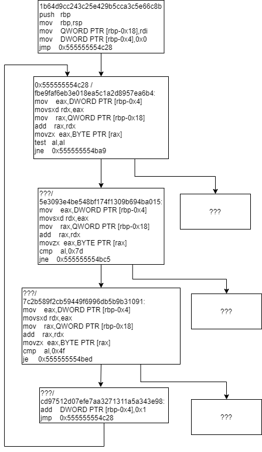
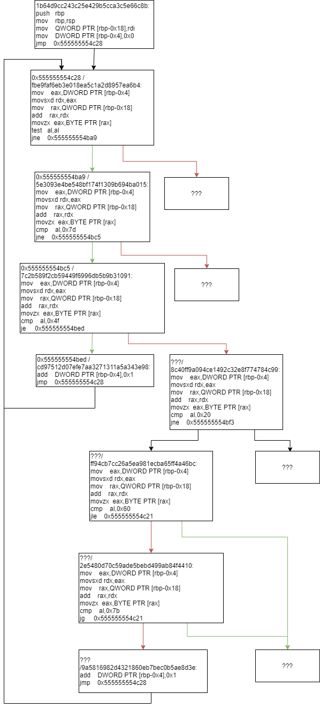
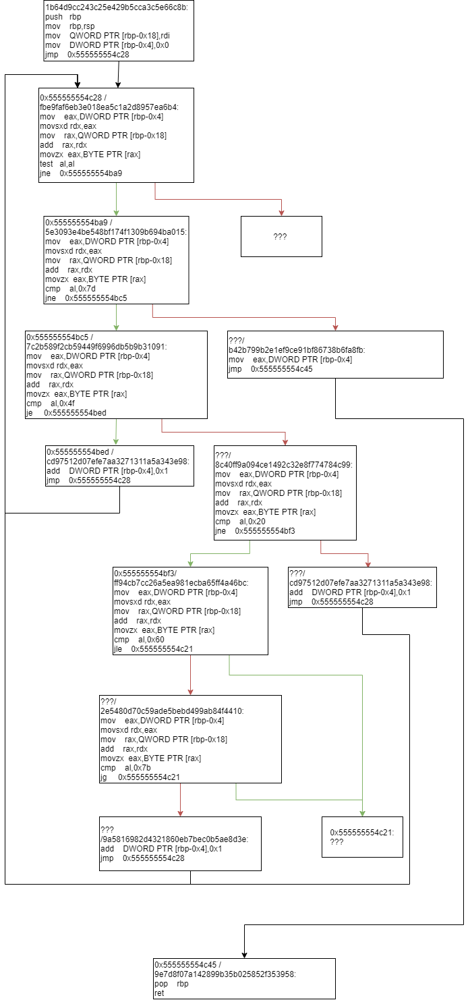
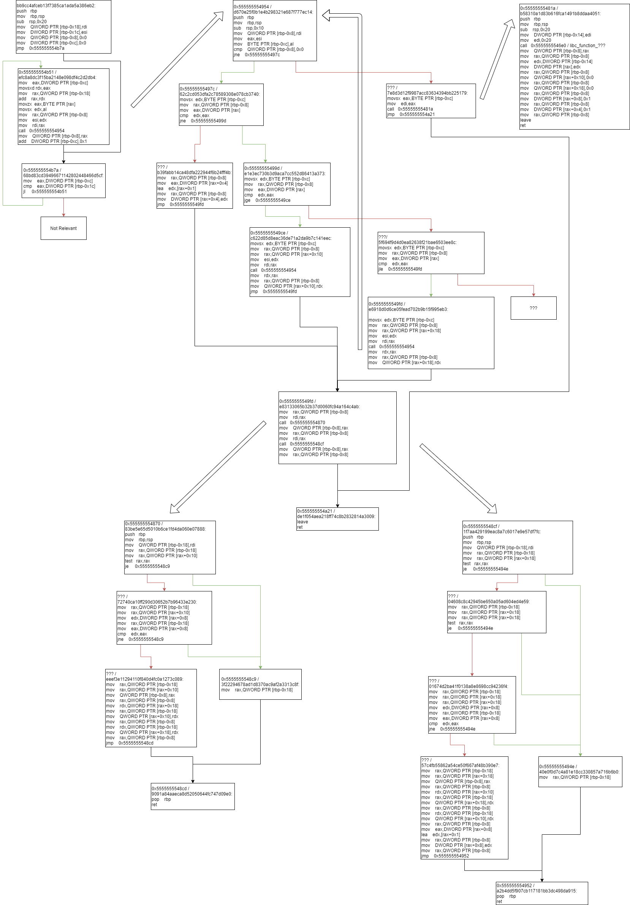
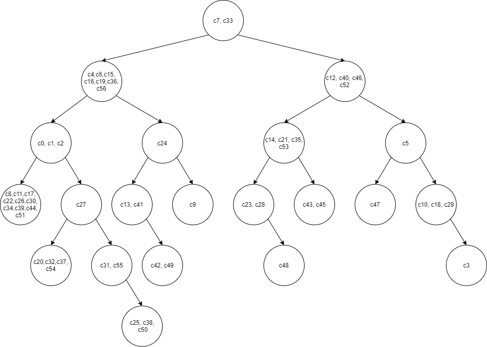
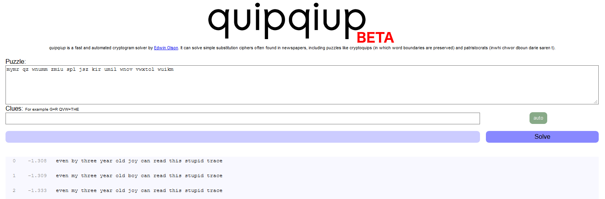

# flag-hunting

    Description:
    
    This archive contains a sanitized execution trace of:
    > ./flag-hunting-bin FLAG.txt

    The trace is for debugging purpose only.
    The address of each instruction has been replaced with a unique identifier
    and our secure technology ensure that no data can be recovered from this trace.

     -- The OOO Secure Tracing Department

 
"flag-hunting" is the execution trace of a x86_64 binary but all addresses have been replaced with unique identifiers, the goal is to figure out the content of the processed file.

## Solution

The given trace removed all addresses of instructions with unique identifiers, this means that just mapping the instructions according to their address is not directly possible.

The instructions still contain the actual addresses which on one side means some address related information wasn't destroyed but on the other side that it's not directly visible whether a conditional branch was taken or not
as it's not directly visible whether the next address is the jump target.

A possible approach could be trying to reconstruct the addresses of the instruction based on some known addresses (destinations of call's and unconditional branches) and the disassembly of the further instructions, but
as x86-64 allows for many different length encodings for the same instructions this may lead to more trouble than it's worth.

My approach was to reconstruct the flow graph of the program in small steps manually following a starting point.

### Starting Point

The challenge description states that the traced binary was executed like : "./flag-hunting-bin FLAG.txt"
This makes it very likely that the binary reads the flag from a file and then processes it, based on that I choose the reading of the file as a starting point.

Iterating through the syscall's the following one appeared to be the read syscall responsible for actually reading the flag file:

```
6dc6cf6131e24166ecb7ce9e4c7ff86e  test   eax,eax
8e2cae730608760016a5610ac3e28aee  jne    0x7ffff7af4090 
a00a4e49abf2af8cce1b622ffeeb631a  xor    eax,eax                 ; rax = 0 -> sys_read
29baf18c7ca50fee9bf3739553e1a68f  syscall 
9fe56638ba76bf30749bcfa547249dc4  cmp    rax,0xfffffffffffff000
53f29450777795e50840c21d6e9b7fd8  ja     0x7ffff7af40e0 
88c72e539e0c72bc78c87565e8d020ad  repz ret 
```

Something interesting can be seen here already, some execution happens within addresses starting with `0x7ff` whereas others start with `0x555`.
A reasonable assumption here is that the `0x7ff` related trace is within a shared library (most likely libc) whereas the `0x555` related ones are within the actual challenge binary.
Based on this I will later cut out shared library related code with a call and guess the external functions name based on the context of it.

Following the starting point at `29baf18c7ca50fee9bf3739553e1a68f` the first occurrence of a challenge binary address happens at `20686067138f49f491686da3dd11d1b1`:

```
613472c1ee18d178d112b3f56c7da779  pop    r12
76b5cb68c01288b4549b9c570ea8356e  pop    r13
4199419e23fb0ff1771cc74fc6f9e28e  ret    
fc0f068e0b2844dca910d9073a046c7f  lea    rax,[rbp-0x50]
3bf5ffd9ce42d71a6196afe909bffccc  mov    rdi,rax
20686067138f49f491686da3dd11d1b1  call   0x555555554b98 
1b64d9cc243c25e429b5cca3c5e66c8b  push   rbp
1a792cf14fca7936ca9add9d53891758  mov    rbp,rsp
dd69e5406d5c8e17cb44f7e63116ef8a  mov    QWORD PTR [rbp-0x18],rdi
0a5ccd577591f7f5bfce808078db57f5  mov    DWORD PTR [rbp-0x4],0x0
```

It's probably safe to assume that `4199419e23fb0ff1771cc74fc6f9e28e` related to the return of the file reading function, where as `fc0f068e0b2844dca910d9073a046c7f` is within the challenge binary.
As we can see `rbp-0x50` is referenced, searching for previous occurrences which are probably within the challenge binary address space, this pops up:

```
e5a855900796b2b70b0b20754dd3f57e  mov    QWORD PTR [rbp-0x58],rax
781c2565bc3d35a95f80e7d6d04fa505  cmp    QWORD PTR [rbp-0x58],0x0
48e645ea667f548a1bfac88bc0b52638  jne    0x555555554ce9 
57de559bb554d68b2b41c506cd82d218  mov    rdx,QWORD PTR [rbp-0x58]
c8845262a116ed2db723f85006eff47f  lea    rax,[rbp-0x50]
42a4a7e94472af49e220d7c563877230  mov    rcx,rdx
3ff0f5c9082dc25e082e8bbbefa5bdad  mov    edx,0x3c
5f6e6e68641c926e715977ea47bf6304  mov    esi,0x1
61b24a7e90cf324b3e92e8a2beec90e5  mov    rdi,rax
51d387bd0ae5d5eea7d0a862d3d9cb4e  call   0x5555555546b0 
b15c7898bd1ca217c0ac4fbbd2f90d77  jmp    QWORD PTR [rip+0x2018fa]        
a6bd65b6f5175ed57c223eba44454b36  push   r13
a7fa24566b44588d11c3911d6896ba1a  push   r12
9a2f63deae67a52c2fc044c2c4395fbb  push   rbp
a3d0c2cfa77aecaa76f1136c5498fa3a  push   rbx
5524c97300870912da7fbab0fef3a119  mov    rbx,rsi
2bfe26333757b91a4cecdf66c49a0f63  imul   rbx,rdx
5515c80df754378c1a216bd4777a31e0  sub    rsp,0x8
8179c9274d0ee36df88746ab69892bea  test   rbx,rbx
ce85b56fa143ed6ab6800d0a4f90a37a  je     0x7ffff7a6341c
```

As this is the first challenge binary to shared library transition before the read syscall we can assume that this is the call to the external file read function.

Matching the instructions to the calling convention makes it likely that something like fread was called

`some_read(rbp-0x50, 0x1, 0x3c, [rbp-0x58])`
=>
`fread(void *ptr, size_t size, size_t nmemb, FILE *stream)`

So after the function call there are possibly up to 60 (0x3c) characters from the FLAG.TXT file at `rbp-0x50`.

With this we have a starting point and an assumption of where the information lies we want to extract, let's continue with the function call at `20686067138f49f491686da3dd11d1b1` as it's directly given the FLAG.TXT content as a parameter.

```
fc0f068e0b2844dca910d9073a046c7f  lea    rax,[rbp-0x50]
3bf5ffd9ce42d71a6196afe909bffccc  mov    rdi,rax
20686067138f49f491686da3dd11d1b1  call   0x555555554b98 
1b64d9cc243c25e429b5cca3c5e66c8b  push   rbp
1a792cf14fca7936ca9add9d53891758  mov    rbp,rsp
```

### Function 1

Matching `call`s and `ret`s for the function at `1b64d9cc243c25e429b5cca3c5e66c8b/0x555555554b98`, it seems to start at line 64779 in the trace and goes up to 67106, so there are 2327 instructions / lines to analyze.

Starting to draw a graph turns into this (line 64779 to 64806):



Interesting here are the checks for 0x7d ('}') and 0x4f ('O').
Up to line 64852 the same flow is continued, meaning that 3 characters have been checked whether they match 0x00, 0x7d or 0x4f.
Based on the flag format (`OOO{FLAG-HERE}`), one can assume that the first three 0x4f-checks where positive, and that the 0x7d-check will only be positive at the end of the flag.

Adding the check for the next character into the flow graph expands it this way:



New interesting things pop up, like a check for 0x20 (' ') and boundary checks for the characters to be greater than 0x60 (0x61 = a) and smaller than 0x7b (0x7a = z) otherwise.
Checking the next few characters, different behavior for the 0x20-check can be found at line 65101 and different behavior for the 0x7d-check at line 67103 ending the function:



Based on this some information about the flag has already been leaked:
    - The flag starts with three 'O's
    - The flag is overall 58 characters long
    - The flag ends with '}'
    - The characters at index 9,12, 18, 23, 27, 31, 35, 40, 45, 52 are all spaces / 0x20
    - All other characters are within the non-capitalized alphabet


### Function 2

Following code flow after Function 1 another function gets called at `2a0711617c98b163d5d86699a4f7fc88`, which is what I analyzed next.

```
9e7d8f07a142899b35b025852f353958  pop    rbp
24e8c5ca3a9804e3427df1239dc235ac  ret    
09919b23da8ccaea9877952fb2bc10b8  mov    DWORD PTR [rbp-0x5c],eax
9097ba9a91ddef9225a1cfb256735286  cmp    DWORD PTR [rbp-0x5c],0x0
4db7e59a6cab53ffe3bda0ded5f455f1  jns    0x555555554d38 
c995786c7f009e7b17e6bb213a552b5d  cmp    DWORD PTR [rbp-0x5c],0x0
5c2d01f8616d9938d927db8b677a62eb  jne    0x555555554d51 
29d4435c533a85c664456391da4189ed  mov    edx,DWORD PTR [rbp-0x5c]
7d926986ad73cbca3317123528e43050  lea    rax,[rbp-0x50]
b7c00e2b7e4ac06402a5872b4678f963  mov    esi,edx
e359b508a6b9a68f5f104371bb87481e  mov    rdi,rax
2a0711617c98b163d5d86699a4f7fc88  call   0x555555554b31 
bb9cc4afceb13f7385ca1ada5a386eb2  push   rbp
```

Repeating the same procedure of `Function 1` for the function `bb9cc4afceb13f7385ca1ada5a386eb2/0x555555554b31` and all functions it called resulted in the following rather complex graph:



Especially interesting is the `1b6cf1b9aa2b8b5de46e055995b61a36  call   0x5555555546e0` line which is a call to an external library.
From the context I assumed it's some kind of memory allocation function and translated it with malloc.

Analysis on the assembly level seemed rather tedious to me so I translated it to functionally equivalent C Code:

```C

// my interpretation of the tree structure
struct tree { // sizeof(0x20)
    uint32_t character;
    uint32_t value1;
    uint32_t value2;
    struct tree* p1;
    struct tree* p2;
};

// bb9cc4afceb13f7385ca1ada5a386eb2
struct tree* treeifyFlag(char* flagStr, int size) {
    struct tree* var_8 = 0;
    for(int i=0;i<size;i++)
        var_8 = appendElement(var_8, flagStr[i]);
    return var_8;
}

// d670e25f0b1e4b298321e687f777ec14
struct tree* appendElement(struct tree* l, char c) {
    if(l == 0) {
        return create(c);
    }else {
        if(c == l->character) {
            l->value1 = l->value1 + 1;
            l = modify(l);
            l = modify2(l);
        }else {
            if(c >= l->character) {
                l->p2 = appendElement(l->p2, c);
                l = modify(l);
                l = modify2(l);
                return l;
            }else {
                l->p1 = appendElement(l->p1, c);
                l = modify(l);
                l = modify2(l);
                return l;
            }
        }
    }
}

// b58310a1d83b616fca1491b8ddaa4051
struct tree* create(char c) {
    struct tree* thing = (struct tree*)malloc(sizeof(struct tree));
    thing->character = c;
    thing->value1 = 1;
    thing->value2 = 1;
    thing->p1 = 0;
    thing->p2 = 0;
    return thing;
}

// 83be5e65d5010b6ce1fd4da060e07888
struct tree* modify(struct tree* l) {
    if(l->p1 == 0) return l;
    if(l->p1->value2 != l->value2) return l;
    struct tree* l2 = l->p1;
    l->p1 = l2->p2;
    l2->p2 = l;
    return l2;
}

// 1f7aa429199eac8a7c6017e9e57df7fc
struct tree* modify2(struct tree* l) {
    if(l->p2 == 0) return l;
    if(l->p2->p2 == 0) return l;
    if(l->p2->p2->value2 != l->value2) return l;
    struct tree* l2 = l->p2;
    l->p2 = l2->p1;
    l2->p1 = l;
    l2->value2 = l2->value2 + 1;
    return l2;
}

```

### Analysing the Trace

It's a balanced tree counting how often each character appears! (An AA Tree to be precise)
Now this is very helpful, because based on the branching taken in the trace it's possible to reconstruct relationship of which character at a given index is lower or higher than the others.

To do that I wrote a small python script which analyses code-flow based on the occurrence of basic blocks  identifiers previously analyzed.

```python
trace = open("trace.txt")

lines = trace.read()
trace.close()

treeStruct = None

currentNode = None

index = -1
prevLine = ""
indend = ""


stackPush = []

for line in lines.split("\n"):
    if line.startswith("efc8a8dc3f15ba2148e098df4c2d2db4"):
        print("\nCharacter start:")
        indend = ""
        index = index + 1
        
    if line.startswith("d670e25f0b1e4b298321e687f777ec14"):
        print(indend+"linkedList!")
        indend = indend + "  "
        
    if line.startswith("b58310a1d83b616fca1491b8ddaa4051"):
        print(indend+"Create new node")
        stackPush.append(None)
        currentNode = [["c"+str(index)], 1, 1, None, None]
        
    if line.startswith("b39fabb14ca48dfa222944f6b24fff4b"):
        print(indend+"c == l->character, value1++")
        stackPush.append(None)
        currentNode[1] += 1
        currentNode[0].append("c"+str(index))
        
    if line.startswith("c622d85d8eac36de71a2da9b7c141eec"):
        print(indend+"c < l->character, l->p2")
        stackPush.append((currentNode, 3))
        currentNode = currentNode[3]
        
    if line.startswith("5f694f9d4d0ea82638f21bae6503ee8c"):
        print(indend+"c > l->character, l->p1")
        stackPush.append((currentNode, 4))
        currentNode = currentNode[4]
        
    if line.startswith("de1f054aea218ff74c8b2832814a3009"):
        if len(stackPush) > 0:
            p = stackPush.pop()
            if p == None and len(stackPush) > 0:
                p = stackPush.pop()
            if p != None:
                n = p[0]
                n[p[1]] = currentNode
                currentNode = n
        print(indend+"return")
        indend = indend[2:]
        
        
    if line.startswith("40e0f0d7c4a81e18cc330857a716b6b0") and prevLine.startswith("cdd8d0db80a1e08e0b2f480d2437b45d"):
        print(indend+"l->p2 == 0")
        
    if line.startswith("40e0f0d7c4a81e18cc330857a716b6b0") and prevLine.startswith("1d3cd83339084286a1100abe18df6cc3"):
        print(indend+"l->p2->p2 == 0")
        
    if line.startswith("40e0f0d7c4a81e18cc330857a716b6b0") and prevLine.startswith("df94ae98b0d0af748ec2d249182b86b0"):
        print(indend+"l->p2->p2->value2 != l->value2")
        
    if line.startswith("57c4fb55862a54ce50f667af48b390e7"):
        print(indend+"modify2!, value2++")
        n = currentNode[4]
        currentNode[4] = n[3]
        n[3] = currentNode
        n[2] += 1
        currentNode = n
        
    if line.startswith("3f22294678ad1d8370ac9af2a3313c8f") and prevLine.startswith("82d0a15c53505f9cbe99f6d72683ce27"):
        print(indend+"l->p1 == 0")
        
    if line.startswith("3f22294678ad1d8370ac9af2a3313c8f") and prevLine.startswith("98d38856414f65c192bbf00f01e1a835"):
        print(indend+"l->p1->value2 != l->value2")

    if line.startswith("eeef3e11294110f840d4fc0a1273c089"):
        print(indend+"modify1!")
        n = currentNode[3]
        currentNode[3] = n[4]
        n[4] = currentNode
        currentNode = n
    
        
    prevLine = line
    
print(currentNode)
```

which yields

```
[['c7', 'c33'], 2, 4, [['c4', 'c6', 'c15', 'c16', 'c19', 'c36', 'c56'], 7, 3, [['c0', 'c1', 'c2'], 3, 2, [['c8', 'c11', 'c17', 'c22', 'c26', 'c30', 'c34', 'c39', 'c44', 'c51'], 10, 1, None, None], [['c27'], 1, 2, [['c20', 'c32', 'c37', 'c54'], 4, 1, None, None], [['c31', 'c55'], 2, 1, None, [['c25', 'c38', 'c50'], 3, 1, None, None]]]], [['c24'], 1, 2, [['c13', 'c41'], 2, 1, None, [['c42', 'c49'], 2, 1, None, None]], [['c9'], 1, 1, None, None]]], [['c12', 'c40', 'c46', 'c52'], 4, 3, [['c14', 'c21', 'c35', 'c53'], 4, 2, [['c23', 'c28'], 2, 1, None, [['c48'], 1, 1, None, None]], [['c43', 'c45'], 2, 1, None, None]], [['c5'], 1, 2, [['c47'], 1, 1, None, None], [['c10', 'c18', 'c29'], 3, 1, None, [['c3'], 1, 1, None, None]]]]]
```

making a graph out of it visualizes it quite nicely:



Notable here is the most left node contains `c8, c11, c17, c22, c26, c30, c34, c39, c44, c51` which are exactly the characters we identified being spaces (`0x20`) before.
Also the second lowest characters being the first 3 `O`s of the flag (`c0, c1, c2`) fits the previous observations.
Interesting is the highest character being at `c3` which can be explained by the fact that the ending `}` was omitted in this tree, but the `{` wasn't.

Flattening the tree yields the following:

```python

def pTree(n):
    a = []
    if n[3] != None:
        a = a + pTree(n[3])
    a = a + [n[0]]
    if n[4] != None:
        a = a + pTree(n[4])
    return a

print(pTree(currentNode))

> [['c8', 'c11', 'c17', 'c22', 'c26', 'c30', 'c34', 'c39', 'c44', 'c51'], ['c0', 'c1', 'c2'], ['c20', 'c32', 'c37', 'c54'], ['c27'], ['c31', 'c55'], ['c25', 'c38', 'c50'], ['c4', 'c6', 'c15', 'c16', 'c19', 'c36', 'c56'], ['c13', 'c41'], ['c42', 'c49'], ['c24'], ['c9'], ['c7', 'c33'], ['c23', 'c28'], ['c48'], ['c14', 'c21', 'c35', 'c53'], ['c43', 'c45'], ['c12', 'c40', 'c46', 'c52'], ['c47'], ['c5'], ['c10', 'c18', 'c29'], ['c3']]

```

### Bruteforcing the Flag

What's interesting is that after omitting the 'O's, the ' 's and the '{', 18 unique characters remain which all are within a to z.

Pulling out some combinatorial math this means there are only binom(26, 18) = 1562275 different combinations possible.

Bruteforcing only that many is even with an unoptimized naive bruteforcing script possible within a few seconds:

```python
def mapings(X, Y, offset=0):
    if Y == X:
        return [[i+offset for i in range(Y)]]
    if X > Y:
        return []
    if X == 0: return [[]]
    return mapings(X, Y-1, offset+1) +  [ [offset]+s for s in mapings(X-1, Y-1, offset+1)]
 
mappings = mapings(18,26)

spaces = [8, 11, 17, 22, 26, 30, 34, 39, 44, 51]
flattened = [[20, 32, 37, 54], [27], [31, 55], [25, 38, 50], [4, 6, 15, 16, 19, 36, 56], [13, 41], [42, 49], [24], [9], [7, 33], [23, 28], [48], [14, 21, 35, 53], [43, 45], [12, 40, 46, 52], [47], [5], [10, 18, 29]]

charset = "abcdefghijklmnopqrstuvwxyz"

l = list(" "*62)
l[0] = 'O'
l[1] = 'O'
l[2] = 'O'
l[3] = '{'
l[57] = '}'

a = 0
print(str(len(mappings))+" Mappings:")
for mapping in mappings:
    for i in range(len(mapping)):
        c = charset[mapping[i]]
        for j in flattened[i]:
            l[j] = c
    print(''.join(l)+" "+str(a))
    a += 1
```

Searching the list with a word list reveals the flag, though a teammate pointed out that even just one of these combinations put into https://quipqiup.com/ solves it correctly:



`OOO{even my three year old boy can read this stupid trace}` (1374777 combination using the bruteforce script)

