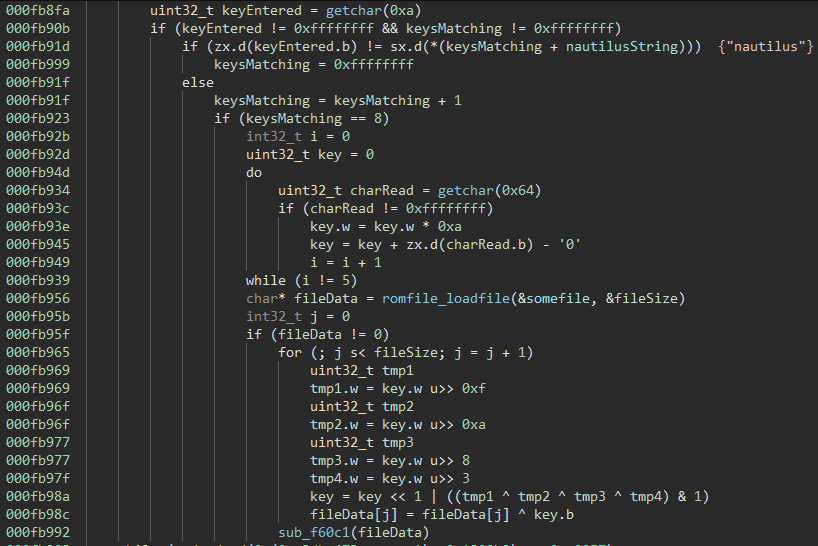
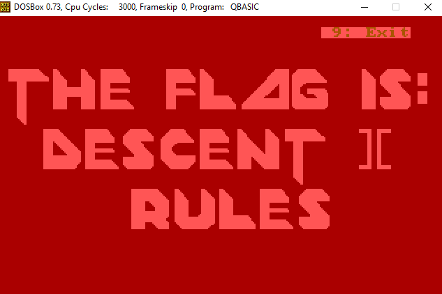
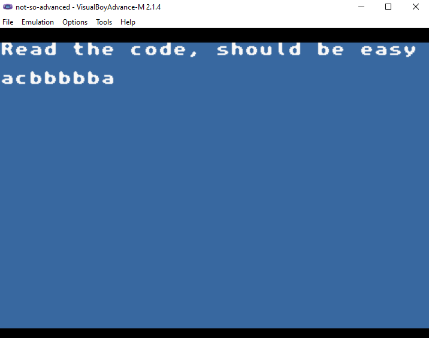
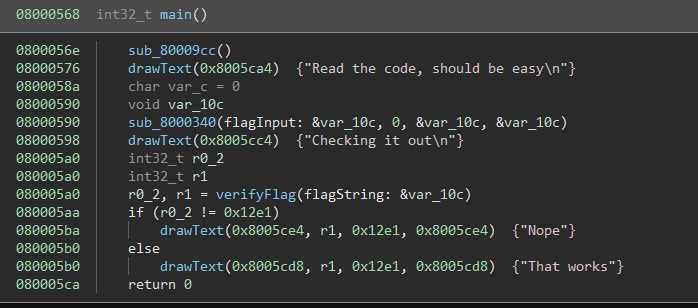
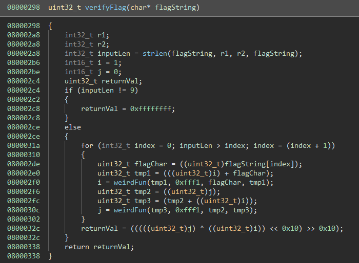

# BIOS 

    Yo, we hear you like BIOs in your BIOS so enjoy a BIOS of BIOs. Submit the part after "The Flag Is:"

BIOS is a modified SeaBIOS image.

## Solution

The first thing that pops up when inspecting the binary file in a hex editor is the "LARCHIVE" header at the beginning.
Searching through the binary, the header occurs multiple times in the file.
A bit of googeling and we find ourself on the [coreboot  CBFS](https://www.coreboot.org/CBFS) wiki page.
Using coreboots [cbfstool tool](https://github.com/coreboot/coreboot/tree/master/util/cbfstool), it is possible to extract all the resources embedded in the binary:

```python
import os
import subprocess

f = open("bios-nautilus.bin", "rb")
data = f.read()
f.close()

parts = data.split(b"LARCHIVE")

for part in parts[1:]:
    o = open("dump.bin" , "wb")
    o.write(b"LARCHIVE"+part)
    o.close()

    result = subprocess.check_output("bash -c './coreboot/util/cbfstool/cbfstool dump.bin print'", shell=True)
    name = result.split(b"\n")[2].split(b" ")[0].decode("utf-8")
    result = subprocess.check_output("bash -c './coreboot/util/cbfstool/cbfstool dump.bin extract -f dump/"+name+" -n "+name+"'", shell=True)
    print(name)
```

The following files are contained in the file, most interestingly the `flag.lzma.enc` file.

```
bootsplash.bmp.lzma
font.bmp.lzma
font.dat
fire.pal
names.txt
ENDEAVOR.bmp.lzma
ENDEAVOR.txt
FISH.bmp.lzma
FISH.txt
FUZYLL.bmp.lzma
FUZYLL.txt
HJ.bmp.lzma
HJ.txt
HOJU.bmp.lzma
HOJU.txt
ITSZN.bmp.lzma
ITSZN.txt
JETBOY.bmp.lzma
JETBOY.txt
LIGHTNING.bmp.lzma
LIGHTNING.txt
MIKE_PIZZA.bmp.lzma
MIKE_PIZZA.txt
PERRIBUS.bmp.lzma
PERRIBUS.txt
THING2.bmp.lzma
THING2.txt
THOMASWINDMILL.bmp.lzma
THOMASWINDMILL.txt
VITO.bmp.lzma
VITO.txt
flag.lzma.enc
```

Browsing through the binary after mapping it correctly, and following the strings shows some interesting code:



The function names can be figured out by looking at how the binary otherwise works and how [certain functions](https://github.com/coreboot/seabios/blob/master/src/romfile.c) are implemented in SeaBIOS.

So if somewhere "nautilus" is entered, we can enter 5 more characters that then are used to decrypt some file, which is then not really used (I think `sub_f60c1` is some kind of free or unregistering function).


With a bit of guessing we know `flag.lzma.enc` should be a lzma archive, and 5 characters (most likely numbers) are bruteforcable:


```python
import lzma

orig = open("flag.lzma.enc", "rb")
dataOrig = orig.read()
orig.close()

def applyRound(key):
    tmp1 = (key >> 0xF)&0xffff
    tmp2 = (key >> 0xA)&0xffff
    tmp3 = (key >> 0x8)&0xffff
    tmp4 = (key >> 0x3)&0xffff
    return ((key << 1) | ((tmp1 ^ tmp2 ^ tmp3 ^ tmp4) & 1))&0xffffffff

firstBytes = list(dataOrig[0:4])
shouldBe   = [0x5d, 0x00, 0x00, 0x80] # header from the other lzma images

# bruteforce key
for a in range(10):
    for b in range(10):
        for c in range(10):
            for d in range(10):
                for e in range(10):
                
                    # check if the first 4 bytes match with the assumed header after decryption
                    key = a+b*10+c*100+d*1000+e*10000
                    failed = False
                    for i in range(4):
                        key = applyRound(key)
                        if(dataOrig[i]^(key&0xff) != shouldBe[i]):
                            failed = True
                            break
                            
                    # if the header matched, fully decrypt and try to decompress using the LZMADecompressor
                    if not failed:
                        print(e, d, c, b, a)
                        dataTry = []
                        key = a+b*10+c*100+d*1000+e*10000
                        for q in dataOrig:
                            key = applyRound(key)
                            dataTry.append(q^(key&0xff))
                        dataTry = bytes(dataTry)
                        try:
                            dec = lzma.LZMADecompressor()
                            print("Decompress:", dec.decompress(dataTry, max_length=32))
                            # Save the decrypted files
                            f = open("flag."+str(key)+".lzma", "wb")
                            f.write(dataTry)
                            f.close()
                        except Exception as e:
                            pass
```

Which results in:

```
5 8 6 0 1
5 4 1 2 1
7 6 5 2 1
1 4 4 4 1
4 9 6 4 1
6 7 5 6 1
8 9 9 6 1
6 3 0 8 1
0 5 4 8 1
8 5 4 8 1
8 7 9 1 3
4 8 2 3 3
8 3 4 3 3
0 4 0 7 3
3 9 2 7 3
7 4 4 7 3
9 6 8 7 3
Decompress: b'APERTURE IMAGE FORMAT (c) 1985\n\n'
1 2 3 9 3
9 2 3 9 3
9 9 3 0 5
0 2 0 2 5
3 7 2 2 5
2 4 4 2 5
9 4 8 2 5
9 0 3 4 5
1 9 9 4 5
7 3 0 6 5
4 6 1 8 5
1 0 9 8 5
7 1 0 1 7
3 5 8 1 7
3 1 3 3 7
Decompress: b'APERTURE IMAGE FORMAT (c) 1985\n\n'
0 8 9 3 7
2 6 8 5 7
2 2 3 7 7
4 4 7 7 7
7 9 9 7 7
1 7 8 9 7
6 9 6 0 9
2 4 8 0 9
6 5 1 2 9
0 7 5 2 9
4 2 7 2 9
7 7 9 2 9
6 0 6 4 9
5 6 1 6 9
3 3 7 6 9
2 9 2 8 9
5 1 6 8 9
```

Both `9 6 8 7 3` and `3 1 3 3 7` yield the same output binary, which is in the "APERTURE IMAGE FORMAT".

Getting a [tool for this file format](http://portalwiki.asshatter.org/index.php/Aperture_Image_Format.html) and rendering it shows the flag:



(To get it to work in DOSBOX I also had to replace the `0A 0A 0D` line endings with `0D 0A` in the binary file)

With the flag being `Descent ][ Rules` (weird flag format..).


# not-so-advanced

    RE the ROM, figure out the code. Not in the flag{} format

not-so-advanced is a GBA game that requests input and verifies whether it's a valid flag.


## Solution

Looking at the game it requests an input and verifies it whether it is correct:



Loading the binary (Thumb, Load Address: 0x8000000) and looking for the strings shows the main function of it



The verifyFlag functions return value has to be `0x12e1` and from the verifyFlag function we can see that the input has to be 9 characters long.



With this we can build a z3 model around it:

```python
# Input is a-z or _
for i in range(9):
    solver.add(Or(And(flagString[i] >= ord('a'), flagString[i] <= ord('z')), flagString[i] == ord('_')))

v12 = 1
v14 = 0
for i in range(9):
    v12 = weirdFun(v12 + ZeroExt(32, flagString[i]), 0xfff1)
    v14 = weirdFun(v14 + v12, 0xfff1)

solver.add((v14^v12)&0xffff == 0x12e1)
```

Now the last question is what the `weirdFun` does, but just by guessing some common methods (and matching it with the code) we guessed it might just be `a % b` which was true.

The solver outputs many valid flags (e.g. `nb__dcf_d` (again weird flag format)) that work as a solution.