# kkkkklik

    Find the flag.
    
kkkkklik is a Visual Basic 6 Windows GUI Application.
    
## Solution

Running the application shows this:

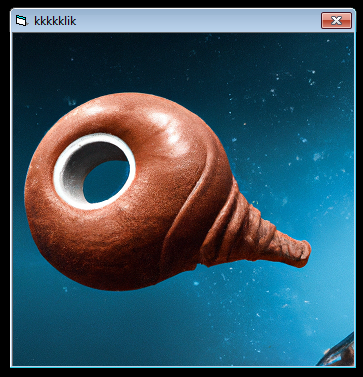

Using (the lite version) of [VB-Decompiler](https://www.vb-decompiler.org/) we can see the general layout of code.

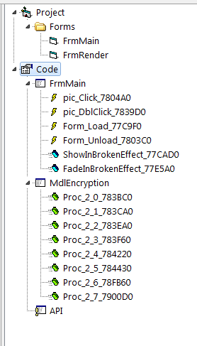

Reversing `pic_Click` shows that there are 3 special handlers when a certain amount of clicks on the image have been reached:
    -   133337 Clicks (`0x780653`): Some Visual Basic Objects are created
    -   1333337 Clicks (`0x7810E2`: Some String is decoded and message box is shown
    -   1337 Clicks (`0x7822ac`): Some String is decoded, an input form is shown, the input string is given to Proc_2_2 is done, and another message box is shown
    
### 1337 
   
Running the handler for 1337 clicks handler shows the following input form:
    
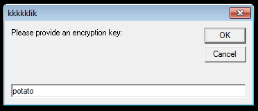

And shows a message box like this as a result:

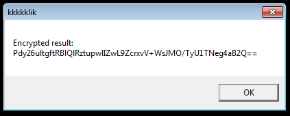

With a bit of dynamic debugging it shows that it encrypt the string `flag{this_is_a_fake_flag_find_the_real_one!}` and then base64 encodes it to display it.
Based on some debugging and looking at the used values at runtime, the structure of the code and testing we figured out that the encryption algorithm is Blowfish in ECB Mode.

### 1333337

The handler for 1333337 just shows a message box that says the task is to decrypt the string `jEJclmCsLkox48h7uChks6p/+Lo6XHquEPBbOJzC3+0Witqh+5EZ2D7Ed7KiAbJq`:

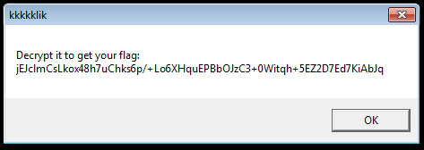

So now we just need to somehow get the password to decrypt it.

### 133337

Looking into the handler of 133337 it creates a lot of VB6 objects with parameters like this

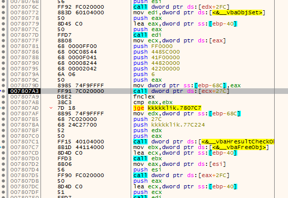

Stepping a bit into the creation `Line` is referenced, so these are probably line objects

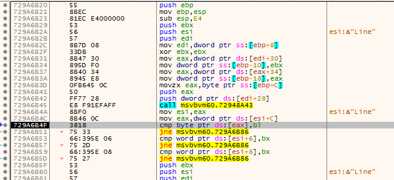

Comparing them to what I can only assume is the [right object](https://learn.microsoft.com/en-us/previous-versions/bb823229(v=vs.140))

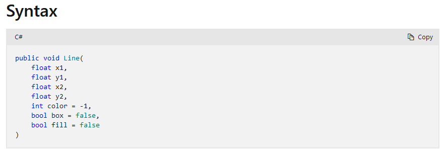

From there it's just collecting the line allocations and [plotting a graph](kkkkklik_graph.py)

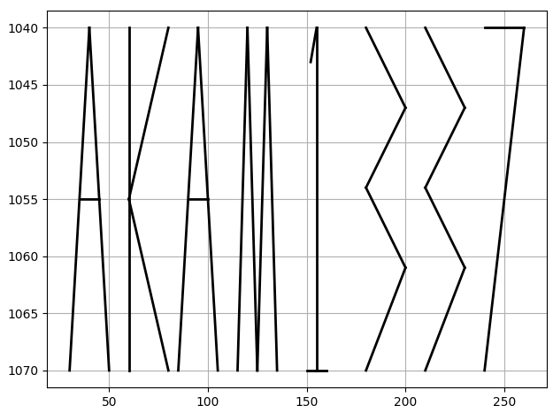

Supposedly these lines should be rendered in the form, but I really can't see them.
Either way we just plop the encryption algorithm, the encrypted flag and the password together and get the flag:

```python
import base64
from Crypto.Cipher import Blowfish

enc = "jEJclmCsLkox48h7uChks6p/+Lo6XHquEPBbOJzC3+0Witqh+5EZ2D7Ed7KiAbJq"
encData = base64.b64decode(enc)

key = b"AKAM1337"
cipher = Blowfish.new(key, Blowfish.MODE_ECB)
dec = cipher.decrypt(encData)
print(dec)
```

    flag{vb6_and_blowfish_fun_from_the_old_days}
    
# ncuts (a)

    A (binary?) ninja cut the chain of flag into many links. Can you put all links together, reassemble the chain, and recover the flags?

    If a link requires a passphrase, the passphrase is the input that the previous link takes.
    To make your life easier, each link will print out its intended ID in the chain -- once you figure out the intended input the link takes.
    The order of the first N binaries is known.
    Solve the first N binaries to get the first flag.
    
Ncuts gives us 2278 x86_64 Linux binaries (named '0' to '2277'). Every binary has a 8 byte password to solve it and by concatenating them together in order we get the flag.

## Solution

As a first step let's see what we are working with:

All binaries except '0' first ask for a passphrase and decode a buffer using an algorithm that looks like some variation of TEA:

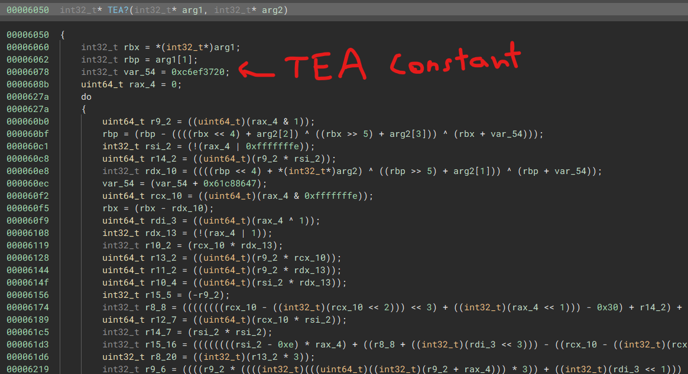

Then a 0xfa004 byte array is created and the decoded buffer (vm code) is copied into it.
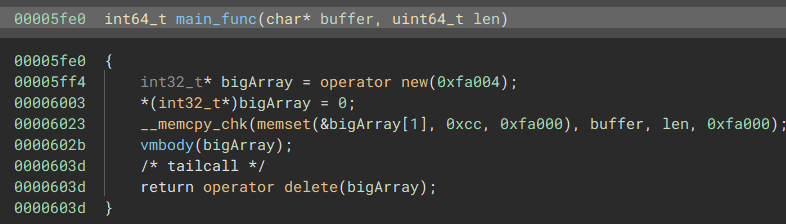

Then the actual virtual machine starts and is ran until it terminates.
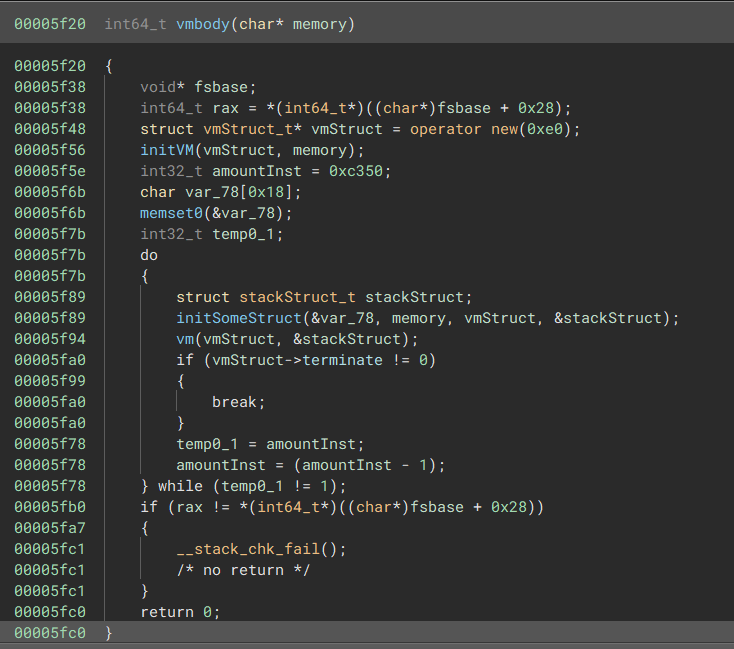

Using [`angr.analyses.bindiff`](ncuts_compare.py) to compare the binaries we could see that all the binaries for (a) use the exact same virtual machine and code, except for the virtual machine program provided to them.
The binaries could be furthermore separated into the 3 sizes of 55448, 51352 and 71832 bytes - assumingly being 3 different types of virtual machine programs we need to solve automatically.

While we need quite a lot of reversing of the virtual machine architecture and dynamic debugging solving all 3 different types actually requires none of that.

### Type 0 (55448)

```
$ python3 ncuts_frida_debug.py
Binary '0'
Input:  b'AAAAAAAA'
[000F9F70] F9 FA FB FC FD FE FF 00 01 02 03 04 05 06 07 08  |
[000F9F80] 09 0A 0B 0C 41 00 00 00 00 00 00 00 41 00 00 00  |     A       A
[000F9F90] 00 00 00 00 41 00 00 00 00 00 00 00 41 00 00 00  |     A       A
[000F9FA0] 00 00 00 00 41 00 00 00 00 00 00 00 41 00 00 00  |     A       A
[000F9FB0] 00 00 00 00 41 00 00 00 00 00 00 00 41 00 00 00  |     A       A
[000F9FC0] 00 00 00 00 CC CC CC CC CC CC CC CC 4E 4E 4E 4E  |             NNNN
[000F9FD0] 4E 4E 4E 4E 0D 0D 0D 0F E0 45 5A 4F 00 01 00 00  | NNNN     EZO
[000F9FE0] 00 01 00 00 00 01 00 00 00 01 00 00 00 01 00 00  |
[000F9FF0] 00 01 00 00 CC CC CC CC CC CC CC CC 00 00 00 00  |
Binary '0'
Input:  b'BBBBBBBB'
[000F9F70] F9 FA FB FC FD FE FF 00 01 02 03 04 05 06 07 08  |
[000F9F80] 09 0A 0B 0C 42 00 00 00 00 00 00 00 42 00 00 00  |     B       B
[000F9F90] 00 00 00 00 42 00 00 00 00 00 00 00 42 00 00 00  |     B       B
[000F9FA0] 00 00 00 00 42 00 00 00 00 00 00 00 42 00 00 00  |     B       B
[000F9FB0] 00 00 00 00 42 00 00 00 00 00 00 00 42 00 00 00  |     B       B
[000F9FC0] 00 00 00 00 CC CC CC CC CC CC CC CC 4F 4F 4F 4F  |             OOOO
[000F9FD0] 4F 4F 4F 4F 0D 0D 0D 0F E0 45 5A 4F 00 01 00 00  | OOOO     EZO
[000F9FE0] 00 01 00 00 00 01 00 00 00 01 00 00 00 01 00 00  |
[000F9FF0] 00 01 00 00 CC CC CC CC CC CC CC CC 00 00 00 00  |
Binary '0'
Input:  b'AABBCCDD'
[000F9F70] F9 FA FB FC FD FE FF 00 01 02 03 04 05 06 07 08  |
[000F9F80] 09 0A 0B 0C 44 00 00 00 00 00 00 00 44 00 00 00  |     D       D
[000F9F90] 00 00 00 00 43 00 00 00 00 00 00 00 43 00 00 00  |     C       C
[000F9FA0] 00 00 00 00 42 00 00 00 00 00 00 00 42 00 00 00  |     B       B
[000F9FB0] 00 00 00 00 41 00 00 00 00 00 00 00 41 00 00 00  |     A       A
[000F9FC0] 00 00 00 00 CC CC CC CC CC CC CC CC 51 51 50 50  |             QQPP
[000F9FD0] 4F 4F 4E 4E 0D 0D 0D 0F E0 45 5A 4F 00 01 00 00  | OONN     EZO
[000F9FE0] 00 01 00 00 00 01 00 00 00 01 00 00 00 01 00 00  |
[000F9FF0] 00 01 00 00 CC CC CC CC CC CC CC CC 00 00 00 00  |
```

Running a binary of type 0 and dumping the memory after the `vmbody` is done shows everything needed to solve this type (and all others).
As we can see the input we provide changes the 8 byte array at `0xf9fcc`, a bit of testing shows that each character is independent, just that the order is reversed.
By trying a bit around with the inputs we can see that the 8 byte array is in fact our input `+13`.
Now interestingly there is another 8 byte array directly after it (`0D 0D 0D 0F E0 45 5A 4F`), so what happens when me make both arrays match? 

```python
>>> pw = bytes([(b-13) for b in bytes.fromhex("0D0D0D0FE0455A4F")[::-1]])
>>> pw .hex()
'424d38d302000000'
```
```python
>>> from pwn import *
>>> p = process('./output/0')
>>> p.send(pw)
>>> p.recvline())
b'ID: 0\n'
>>> p.close()
```

So indeed this solves the binary 0. 
To generalize this:
    - we provide the input `AAAAAAAA`
    - we read the modified input array at `0xf9fcc`
    - we calculate the offset `[0xf9fcc]-'A'`
    - we read the encoded password array at `0xf9fd4`
    - we apply the negative offset to the encoded password array to get the original password
    
### Type 1 (51352)

```
$ python3 ncuts_frida_debug.py
Binary '1'
Input:  b'AAAAAAAA'
[000F9F70] CC CC CC CC CC CC CC CC CC CC CC CC CC CC CC CC  |
[000F9F80] CC CC CC CC CC CC CC CC CC CC CC CC CC CC CC CC  |
[000F9F90] CC CC CC CC CC CC CC CC 3A 28 0A 00 41 00 00 00  |         :(  A
[000F9FA0] 00 00 00 00 41 00 00 00 00 00 00 00 41 00 00 00  |     A       A
[000F9FB0] 00 00 00 00 41 00 00 00 00 00 00 00 41 00 00 00  |     A       A
[000F9FC0] 00 00 00 00 41 00 00 00 00 00 00 00 41 00 00 00  |     A       A
[000F9FD0] 00 00 00 00 41 00 00 00 00 00 00 00 CC CC CC CC  |     A
[000F9FE0] CC CC CC CC 5E 0D A7 67 1C 6D D6 E9 1F 64 E6 26  |     ^  g m   d &
[000F9FF0] 5D 1A 97 A8 CC CC CC CC CC CC CC CC 00 00 00 00  | ]
Binary '1'
Input:  b'BBBBBBBB'
[000F9F70] CC CC CC CC CC CC CC CC CC CC CC CC CC CC CC CC  |
[000F9F80] CC CC CC CC CC CC CC CC CC CC CC CC CC CC CC CC  |
[000F9F90] CC CC CC CC CC CC CC CC 3A 28 0A 00 42 00 00 00  |         :(  B
[000F9FA0] 00 00 00 00 42 00 00 00 00 00 00 00 42 00 00 00  |     B       B
[000F9FB0] 00 00 00 00 42 00 00 00 00 00 00 00 42 00 00 00  |     B       B
[000F9FC0] 00 00 00 00 42 00 00 00 00 00 00 00 42 00 00 00  |     B       B
[000F9FD0] 00 00 00 00 42 00 00 00 00 00 00 00 CC CC CC CC  |     B
[000F9FE0] CC CC CC CC 5E 0D A7 67 1C 6D D6 E9 1C 67 E5 25  |     ^  g m   g %
[000F9FF0] 5E 19 94 AB CC CC CC CC CC CC CC CC 00 00 00 00  | ^
```

Type 1 again behaves quite similar, just that we first have the encoded password array and then the encoded input array.
Again with a bit of testing around and educated guesses we can see that it applies a 8 byte xor key on our input.

So what we do is get the xor key from the encoded input (from `0xf9fec`) and decode the output (from `0xf9fe4`) with it.

```python
>>> xorkey = bytes([b^ord('A') for b in bytes.fromhex("1F64E6265D1A97A8")[::-1]])
>>> encoded = bytes.fromhex("5E0DA7671C6DD6E9")[::-1]
>>> pw = bytes([encoded[i]^xorkey[i] for i in range(8)])
>>> pw.hex()
'0000360000002800'
```

### Type 2 (71832)

```
$ python3 ncuts_frida_debug.py
Binary '2'
Input:  b'AAAAAAAA'
[000F9F70] CC CC CC CC CC CC CC CC CC CC CC CC CC CC CC CC  |
[000F9F80] CC CC CC CC CC CC CC CC CC CC CC CC CC CC CC CC  |
[000F9F90] 3A 28 0A 00 41 00 00 00 00 00 00 00 41 00 00 00  | :(  A       A
[000F9FA0] 00 00 00 00 41 00 00 00 00 00 00 00 41 00 00 00  |     A       A
[000F9FB0] 00 00 00 00 41 00 00 00 00 00 00 00 41 00 00 00  |     A       A
[000F9FC0] 00 00 00 00 41 00 00 00 00 00 00 00 41 00 00 00  |     A       A
[000F9FD0] 00 00 00 00 CC CC CC CC CC CC CC CC CC CC CC CC  |
[000F9FE0] CC CC CC 28 28 28 28 28 28 28 28 00 2F 00 00 20  |    (((((((( /
[000F9FF0] 04 00 00 28 CC CC CC CC CC CC CC CC 00 00 00 00  |    (
Binary '2'
Input:  b'\x01\x02\x04\x08\x10\x20\x40\x80'
[000F9F70] CC CC CC CC CC CC CC CC CC CC CC CC CC CC CC CC  |
[000F9F80] CC CC CC CC CC CC CC CC CC CC CC CC CC CC CC CC  |
[000F9F90] 3A 28 0A 00 80 00 00 00 00 00 00 00 40 00 00 00  | :(          @
[000F9FA0] 00 00 00 00 20 00 00 00 00 00 00 00 10 00 00 00  |
[000F9FB0] 00 00 00 00 08 00 00 00 00 00 00 00 04 00 00 00  |
[000F9FC0] 00 00 00 00 02 00 00 00 00 00 00 00 01 00 00 00  |
[000F9FD0] 00 00 00 00 CC CC CC CC CC CC CC CC CC CC CC CC  |
[000F9FE0] CC CC CC 04 08 02 01 10 80 40 20 00 2F 00 00 20  |          @  /
[000F9FF0] 04 00 00 04 CC CC CC CC CC CC CC CC 00 00 00 00  |
```

Type 2 again has first the encoded input and then the encoded password in memory easily visible.
What the program actually does is shuffling the bits around.
So what we do is, we give it the input `b'\x01\x02\x04\x08\x10\x20\x40\x80'` then get the shuffled input from `0xf9fe3`, through that we get the shuffel order which we apply inversed on the array at `0xf9feb`.

 
```python
import math
def unbitshuffle(encInput, encFlag):
    shuffle = [int(math.log(int(s), 2)) for s in encInput]
    reshuffled = []
    for i in range(len(encFlag)):
        v = 0
        for j in range(8):
            v = v | (((encFlag[i]>>shuffle[j])&1)<<j)
        reshuffled.append(v)
    return bytes(reshuffled)
    
>>> pw = unbitshuffle(bytes.fromhex("0408020110804020")[::-1], bytes.fromhex("002F000020040000")[::-1])
>>> pw.hex()
'000080010000f100'
```


### Solve Script

```python
import frida
import time
import math
import os

device = frida.get_local_device()

typ = -1
pid = 0
output = None

def unbitshuffle(encInput, encFlag):
    shuffle = [int(math.log(int(s), 2)) for s in encInput]

    reshuffled = []
    for i in range(len(encFlag)):
        v = 0
        for j in range(8):
            v = v | (((encFlag[i]>>shuffle[j])&1)<<j)
        reshuffled.append(v)
    return bytes(reshuffled)
     

def run(name, last=None):
    global typ, pid, output
    
    output = None

    fileSizeMap = {
        55448: 0,
        51352: 1,
        71832: 2,
    }
    
    size = os.path.getsize('./output/%s' % name)
    typ = -1
    typ = fileSizeMap[size] 
    
    pid = device.spawn(['./output/%s' % name], stdio='pipe')
    session = frida.attach(pid)

    # address of vmbody
    baseAddressMap = {
        0: "0x5f20",
        1: "0x4c70",
        2: "0xa920"
    }
    
    content = """
    var base = Module.getBaseAddress("%s");
    Interceptor.attach(base.add(%s), {
        onEnter: function (args) {
            this.mem = args[0];
        },
        onLeave: function (ret) {
            send("vmmem", this.mem.readByteArray(0xfa000));
        }
    });
    """ % (name, baseAddressMap[typ])

   
    """
    55KB -  apply offset on all?#
    51KB -  apply 8 byte xor key
    71kB -  bitshuffle
    """
    def on_message(message, data):
        global typ, output
        if not 'payload' in message:
            print(message)
        else:
            if message['payload'] == "vmmem":
                if output != None: return
                
                # Solve Type 0
                if typ == 0:
                    encFlag = data[1023956:][:8][::-1]
                    encInput = data[1023948:][:8][::-1]
                    offset = encInput[0]-ord('A')
                    output = bytes([(b-offset)&0xff for b in encFlag])

                # Solve Type 1
                elif typ == 1:
                    encFlag = data[1023972:][:8][::-1]
                    encInput = data[1023980:][:8][::-1]
                    hexKey = bytes([encInput[i]^ord('A') for i in range(8)])
                    output = bytes([hexKey[i]^encFlag[i] for i in range(8)])
                    
                # Solve Type 2
                elif typ == 2:
                    encFlag = data[1023979:][:8][::-1]
                    encInput = data[1023971:][:8][::-1]
                    output = unbitshuffle(encInput, encFlag)
                
            else:
                print(message, data)

    script = session.create_script(content)
    script.on('message', on_message)
    script.load()
    device.resume(pid)

    if last != None:
        device.input(pid, last)
    
    if typ == 0 or typ == 1:
        device.input(pid, b"A"*8)
    elif typ == 2:
        device.input(pid, bytes([1<<i for i in range(8)]))

    while output == None:
        time.sleep(0.2)

    session.detach()

    return output

last = None
for i in range(2228):
    last = run(str(i), last)
    # binary name, password
    print(i, last.hex(), flush=True)
```

While somewhat inefficient, the solve script just combines all the techniques and iterates the binaries in order, using the previous ones solution as the decryption passphrase.

The resulting output shoud look something like this:

```
0 424d38d302000000
1 0000360000002800
2 000080010000f100
3 0000010010000000
4 000002d30200120b
5 0000120b00000000
6 000000000000c218
7 8310e21823210319
8 421da210630ca310
9 031d822582212221
10 e218231d21368225
11 a5316325421da310
...
```

Concatinating the password bytes gives a (corrupt) bmp file with the flag:


# ncuts (b)

    A (binary?) ninja cut the chain of flag into many links. Can you put all links together, reassemble the chain, and recover the flags?

    If a link requires a passphrase, it is the input that the previous link takes.
    To make your life easier, each link will print out its intended ID in the chain -- once you figure out the intended input the link takes.
    Download the file from nlinks (part a). Solve all binaries to get the second flag.
   
In addition to the binaries from ncuts (a) we now have to solve 20915 more binaries, which are no longer ordered (their names are hashes) and that are internally a bit different.

# Solution

To start with, the only difference the actual binaries have is that their vm opcode dispatcher has randomized opcodes.

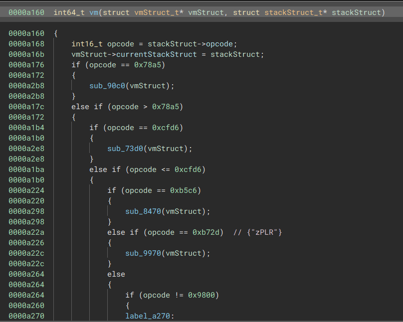

Since our solver script doesn't interact with the bytecode, this doesn't matter for us.

So the actual challenge we have to overcome is figure out the order in which the challenges need to be solved.
Trying each password on each binary is infeasible so we need a smarter approach.
Also interestingly there are quite a few binaries that do not require a password prompt `['3e2602be855854be57db191e130a3bc1', '89b911dd4dda756832f11feb9067b8b8', '99e2d0caac4cd77fdd0637df4bed6635', 'a694d2033fab44b94014505a5c255b2d', 'aa2c34e360e5c58351557843e0c32fc7', 'af41fb8f081aee3077c780f60a004a11', 'caaf7f0c6d9c9b33041be58b5dee103b', 'ebf7f7fc0a5a4cac993e121a7243654c']`
so it doesn't seem like there is a strict order in which (b) is supposed to be solved.
Given the description we can later get the order meant in the solution by asking the binary (the ID it returns is the index),
so the first task is to get the password for binaries and save both the password and decryption password so we can ask it which ID it is.

For this we observed the interesting aspect that all decrypted virtual machine programs we saw in (a) start with `2a00020000000000000000020000000000000000020000000000000000000000`.
From the work we did reversing the vm we knew that only the first two bytes of this are the opcode (which is randomized for the binaries of (b)) while the rest are the operands that should stay constant.
Based on this and TEA being relatively fast, we decided to extract the first few bytes of each binary and store them for fast access, and then bruteforce them all when we get a new key to see which decrypt to this.

```python
import os
import os.path
import struct

fileMap = {}
magicSequence = bytes.fromhex("0200000000000000000200000000")


def initDB():
    # iterate all files and extract first few encrypted vm program bytes
    if not os.path.exists("encdb.txt"):
        arr = os.listdir('output')
        log = open("encdb.txt", "w")
        for a in arr:
            print(a)
            f = open("output/"+a, "rb")
            d = f.read(0x3219+(0x1d*3))[0x3219:]
            f.close()
            log.write(a+" "+d.hex()+"\n")
        log.close()

    log = open("encdb.txt", "r")
    for line in log:
        name, data = line.split(" ")
        data = bytes.fromhex(data)
        fileMap[name] = data
        
initDB()

    
# Find all binaries that are not encrypted
def findEntrypoint():
    lst = []
    for key, value in fileMap.items():
        if value[2:16] == magicSequence:
            lst.append(key)
    return lst
        
# TEA implementation as in binary
def tea_decrypt_block(block, key):
    key = struct.unpack("<IIII", key)
    v0, v1  = struct.unpack("<II", block)
    sm = 0xC6EF3720

    for i in range(0x20): 
        v1 = (v1 - ((((v0<<4)+key[2]) ^ (v0+sm) ^ ((v0>>5)+key[3]))&0xffffffff))&0xffffffff
        v0 = (v0 - ((((v1<<4)+key[0]) ^ (v1+sm) ^ ((v1>>5)+key[1]))&0xffffffff))&0xffffffff
        sm = sm + 0x61C88647;

    return struct.pack("<II", v0, v1)

def tea_decrypt(block, key, count):
    output = b''
    for i in range(count):
        output += tea_decrypt_block(block[i*8:(i+1)*8], key)
    return output
        
        
# Bruteforce given a key to find likely continuations
def findCandidate(candidate):
    lst = []
    # TEA key made out of password + hardcoded bytes
    candidate = candidate + bytes.fromhex("381337133a133913")
    for key, value in fileMap.items():
        buffer = value[:16]
        buffer = tea_decrypt(buffer, candidate, 2) 
        # ignore first 2 bytes opcodes are randomized
        if buffer[2:] == magicSequence:
            lst.append(key)
    return lst
```

Now we just add a stack based exploration strategy to our solve script from (a) and make them output the decryption password as well


```python
alreadyExplored = []
exploreStack = []

# needed if you need to restart the process
starts = flagcombiner.findEntries()
for frm, key in starts:
    alreadyExplored.append(frm)
    if key == "None": continue
    key = bytes.fromhex(key)
    paths = findcandidate.findCandidate(key)
    for path in paths:
        if flagcombiner.already(path): continue
        exploreStack.append((path, frm, key))

# find all entry points as start points
starts = findcandidate.findEntrypoint()
for start in starts:
    if start in alreadyExplored: continue
    exploreStack.append((start, None, None))

while len(exploreStack) > 0:
    name, frm, key = exploreStack.pop()
    if len(name) < 5: continue # ignore the first "0"-"2227" binaries 
    if name in alreadyExplored: continue
    
    res = run(name, key)
    alreadyExplored.append(name)
    
    print(len(alreadyExplored), frm, "=>", name, ";", (None if key == None else key.hex()), "=>", res.hex(), flush=True)
    
    paths = findcandidate.findCandidate(res)
    for path in paths:
        exploreStack.append((path, name, res))
```

and we should get an output similar to this:

```
1 None => ebf7f7fc0a5a4cac993e121a7243654c ; None => 221966604774c548
2 ebf7f7fc0a5a4cac993e121a7243654c => b1625ae96ec4a2598ad1bb67765f282a ; 221966604774c548 => 421d0215e214031d
3 b1625ae96ec4a2598ad1bb67765f282a => cba9218d38f9b9a956b4f8731bfe8469 ; 421d0215e214031d => 2e5fea5a0742a531
4 cba9218d38f9b9a956b4f8731bfe8469 => ba111919dc43e7060cae2ac76c5f387d ; 2e5fea5a0742a531 => c314a4444774a760
5 ba111919dc43e7060cae2ac76c5f387d => b23e9e19ecf1fe484a8e3a1e96ec6e19 ; c314a4444774a760 => 4d63c435043a0319
6 b23e9e19ecf1fe484a8e3a1e96ec6e19 => 32d930f30cffdf55b9a4abecac772613 ; 4d63c435043a0319 => 231d4319611d4b42
7 32d930f30cffdf55b9a4abecac772613 => c5fc4dda25b2ccd1c945702000947bd1 ; 231d4319611d4b42 => 56670c36c2102215
8 c5fc4dda25b2ccd1c945702000947bd1 => a628009ee0f398bf4dd16406ae55f548 ; 56670c36c2102215 => 42194319e2100111
9 a628009ee0f398bf4dd16406ae55f548 => 6c59c3ed4dacd57752018f88564e37d9 ; 42194319e2100111 => 61198121c4350842
10 6c59c3ed4dacd57752018f88564e37d9 => 756773376737a36fc92b19fbf0579b8c ; 61198121c4350842 => c4356121621d421d
11 756773376737a36fc92b19fbf0579b8c => 5ecfb902037af02429d0188561dfae4e ; c4356121621d421d => 02150319a225851d
12 5ecfb902037af02429d0188561dfae4e => f49e9c5ef553cc85c31217aceba38363 ; 02150319a225851d => 0215421924158121
13 f49e9c5ef553cc85c31217aceba38363 => e097b632c204cf8f02c9626ea4398787 ; 0215421924158121 => 811d62218221611d
14 e097b632c204cf8f02c9626ea4398787 => 323df44ef72aa548501e7e1acbc30079 ; 811d62218221611d => 41190836641d2215
```

Now we get the ID of each of them by running them and combine them in the end (by calling `makeImage`):

```python
flagMap = {}

def initDB(fn):
    try:
        log = open(fn, "r")
        for line in log:
            idd, _, frm, to, _, key, _, pwd = line.split(" ")
            pwd = pwd.strip()
            flagMap[to] = (key, pwd)
        
        log.close()
    except Exception as e:
        print(e)
    
initDB("passwords-b-dump.txt")

# frm, key pairs - continue from
def findEntries():
    l = []
    for key, value in flagMap.items():
        l.append((key, value[1]))
    return l

# used to reduce redundancy during the search
def already(n):
    return n in flagMap
    
def getID(name):
    import pwn
    pwn.context.log_level = 'warn'
    p = pwn.process('./output/'+name)
    key, pwd = flagMap[name]
    
    # send decrypt password
    if key != "None":
        p.send(bytes.fromhex(key))
        p.recvline()
        
    # send password
    p.send(bytes.fromhex(pwd))
    
    v = 0
    try:
        v = int(p.recvline().strip().split(b"ID: ")[1])
    except Exception as e:
        print("[!] "+name+" could not be parsed correctly") 
        v = 0
    p.close()
    return v
    
def makeImage():
    imageMap = {}
    
    # part (b) binaries
    i = 0
    for key, value in flagMap.items():
        if i % 1000 == 0:
            print(str(i)+" binaries processed")
        idd = getID(key)
        imageMap[idd] = bytes.fromhex(value[1])
        i = i + 1
        
    # backup (b) binary mapping
    log = open("passwords-b.txt", "w")
    for key, value in imageMap.items(): 
        log.write(str(key)+" "+value.hex()+"\n")
    log.close()
    
    # solution from (a)
    log = open("passwords-a.txt", "r")
    for line in log:
        idd, pwd = line.split(" ")
        pwd = bytes.fromhex(pwd.strip())
        idd = int(idd)
        imageMap[idd] = pwd
    log.close()
    
    # check for missing index stuff
    for i in range(len(imageMap)):
        if not (i in imageMap):
            print("[!] "+str(i)+" is missing in the map")

    
    # write all bytes in order
    img = open("output2.bmp", "wb")
    for i in range(len(imageMap)):
        if not (i in imageMap): 
            img.write(b"\x00"*8)
        else:
            img.write(imageMap[i]) 
    img.close()
```


And we get the flag:

