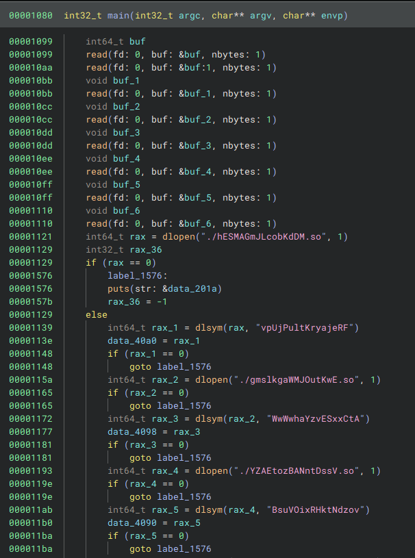
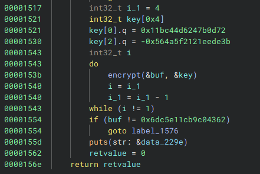
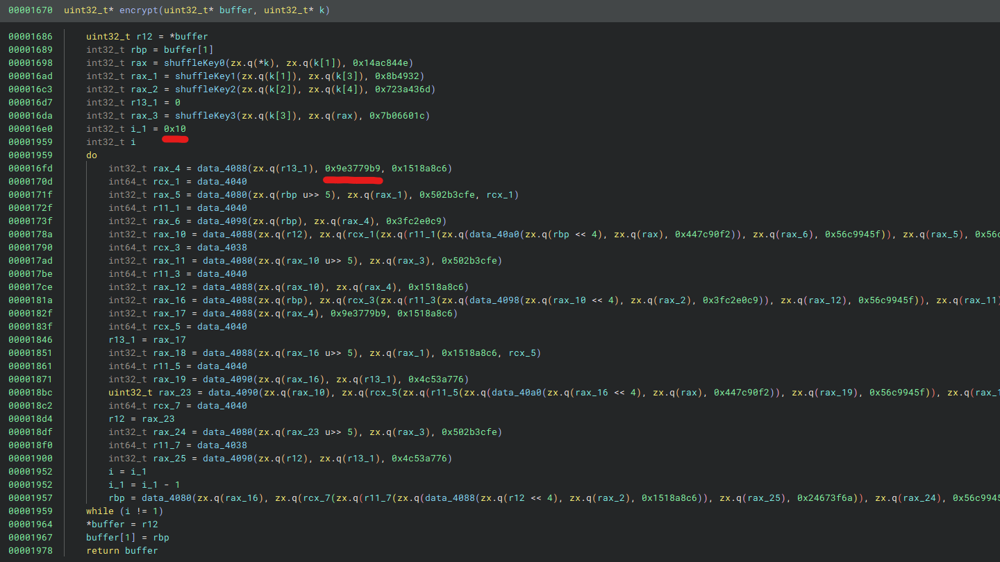

# nloads

    ChatGPT: "Why did the application break up with the dynamic library? Because every time they got close, it changed its address!"

    Don't break up. Get the flag. There is only one flag.


nloads provides us with 13613 folders of binaries, each folder contains a `./beatme` binary that takes 8 bytes of input.
Concatenating all inputs in order of the folder numbers gives a JPG that contains the flag.

## Solution

As the last few years this DEFCON Qualifiers had another ncuts challenge. 

In this version of the challenge we are given 13613 folders of binaries that contain a `beatme` executable and lots of shared objects that get loaded dynamically.



The `main` function of the `beatme` binaries first read in 8 bytes of input, load the shared objects and resolve a function pointer from them that is stored globally.

The functions that are loaded sometimes just load another shared object and resolve another function.
Some of them also open files and do checks on them. At the end of the loading chain have some sort of simple mathematical operation done on two 32 bit integer arguments.

For the `0` folder the path of loaded objects and their code looks like this:

```
./nloads/output/0/beatme
├── ./hESMAGmJLcobKdDM.so | vpUjPultKryajeRF | dlopen
│   └── ./fXIojFVxtoKLAQkl.so | cYUjXnCTKSsoWuTc | dlopen
│       └── ./faqPTjZOOHXeXEpy.so | LEFxYyssPEkFvpMv | ADD
├── ./gmslkgaWMJOutKwE.so | WwWwhaYzvESxxCtA | dlopen - fopen("/bin/cat")
│   └── ./OpcfQADLYqnRHIrD.so | NfyDgNIyzqJBsfGC | dlopen
│       └── ./PTOzoTFUytSUryUH.so | yyhOPBzqxJFfoibe | dlopen - fopen("/etc/passwd")
│           └── ./gZqXyItfVsTnykLE.so | RZKYSMmIiDZRwEUo | clock_gettime
├── ./YZAEtozBANntDssV.so | BsuVOixRHktNdzov | dlopen - fopen("/etc/passwd")
│   └── ./giECPkQyMzTUivnO.so | dkCJxnpfHJkjQOXs | dlopen - fopen("/bin/cat")
│       └── ./LbBISXFSnbuzCqLA.so | JhbxjMZkFnGqzKGo | ADD
├── ./WtnSjtVeJWLcIgBy.so | IDnaWMupKzPlMsYd | dlopen - fopen("/bin/cat")
│   └── ./OxQLBttjUWpVxuSj.so | WruKphsJMAMgFhlt | dlopen - fopen("/tmp//etcoypYMnEdeE")
│       └── ./VexOOKcjwUCANWfb.so | MhiCbmiDRGeevfGO | dlopen - fopen("/bin/cat")
│           └── ./INaRqvvzUowYHXvy.so | ZJjXnFqRtjlYvBMB | dlopen
│               └── ./fYDIVIPIuHskBvRY.so | GmTLZFPmQdhOVGtQ | ADD
├── ./AOinIPkXvMtrtbha.so | pnstlKQzXnehUbWP | dlopen
│   └── ./WDhDHuuesoPtRCMX.so | XdpJmBLmALOHLqWC | ADD
├── ./oSeJlOQqzYFRkBXO.so | tYUJnAiKvXEypybB | dlopen - fopen("/tmp//etcvPysvbcgxV")
│   └── ./NeBYfDnofuzcfcOa.so | uqoOmnnLydHceoaY | dlopen
│       └── ./AmiOWZLBXmVOGVXC.so | ZREWkEkEJCljQjvN | ADD
├── ./qtgdwCpVabuYgJeB.so | WauZUfHZMyZrGIRm | dlopen - fopen("/bin/cat")
│   └── ./vwhDqObLEawhHzbG.so | CMSpCHdOrDvZYIEI | dlopen
│       └── ./WxpDsAgcpVmEBIjR.so | hQTzWnhthFHlfCJR | dlopen
│           └── ./rhsHpKBVaYQbaajf.so | gxULzTOsTWmdkjsG | dlopen
│               └── ./ZSRjpLdKATimmynK.so | HjjdWoMQsPLLmUsq | SUB
├── ./kKEoBUyIcsAleOQv.so | CndYDHCucWiGGHUM | dlopen - fopen("/tmp//etckFbnJjRnlz")
│   └── ./FDQnKbBRxLwoBlIC.so | ELvmvTCBVmvsrFSn | dlopen - fopen("/tmp//usrKcNrWpYxaF")
│       └── ./VaQnStigqoUcueNM.so | JyEUFKjxJWxwnbGD | dlopen
│           └── ./IMXDndASCwPZnwOi.so | AtwBjsyfzbJaxqPK | dlopen
│               └── ./XySmDZCRsDnORgil.so | AXONVpGXcUIuvLUD | SUB
├── ./XOowkkodSIJHeQPx.so | AXWAPxECOPaEjmyt | dlopen
│   └── ./KGJKDiOHoMzSmBrC.so | xudGJZvVCYuVCghJ | dlopen - fopen("/bin/cat")
│       └── ./HHihKcFlkVOCyUoL.so | PmNOoCHGFJERNWlY | dlopen - fopen("/etc/passwd")
│           └── ./cbbPXuHeBYqzplll.so | fBTPLOVODtulwcIt | SUB
├── ./UvwLhcZXVYyFTrOJ.so | KLKwJYfZKPkXRFvN | dlopen
│   └── ./eKreUawgmdxBusSk.so | uSoOkCwSububLxRP | dlopen - fopen("/tmp//etcNriwdawvUu")
│       └── ./FuQuBWtSCsOCnzXm.so | akKKIwUmiVjZEQKS | dlopen - fopen("/bin/sh")
│           └── ./zaLckaGIWFXKwdAP.so | SfhgFobsxgiYiTQG | dlopen - fopen("/bin/sh")
│               └── ./UmhuSlDMokkmZlNQ.so | NHDgVTdZhKyQIGoi | SUB
├── ./JmMUtAorIujHtIbX.so | sCwDlfEOldeMrKhy | dlopen - fopen("/bin/cat")
│   └── ./UHoVMGHkrluvZRXp.so | jhyMUEjwBHUJIKNP | dlopen - fopen("/bin/sh")
│       └── ./hVrxgzMLDlzslgIr.so | NzSKCTuUaHnyBQyg | SUB
├── ./zNNidAnJboLBCBIs.so | xBAvRbuqtBsJtzFN | dlopen - fopen("/bin/sh")
│   └── ./seJTauTedfaBkIgC.so | xKJdZbgYTiIVDUox | XOR
├── ./GEtnxdbVfDmvIwFC.so | EvnUyQofXwDSGpZB | XOR
├── ./JyIolYzAMfpUSEKT.so | ulyILNvejqqyPsZg | dlopen - fopen("/tmp//etcvBwSjsGsTB")
│   └── ./gFyyIhMdoWtMTvfJ.so | dlKZgUCkhJHTtEup | KEY SHUFFLE
├── ./iRncDoXjGXNizFTC.so | CtVaDQBnebZIKTzI | KEY SHUFFLE
├── ./WOIyABNGeMkgJjhG.so | RIfpDnyUTxPAZYbm | dlopen - fopen("/tmp//usreQCCVKCvme")
│   └── ./IuScbufhNSCdfYTn.so | IwufdPKvfVXQceox | dlopen - fopen("/tmp//etchSoMkTLslV")
│       └── ./WDNxbvSyNIjywCBl.so | woyRTGrXkqhZsZZv | dlopen
│           └── ./GnMlHrWdlQtLfHhw.so | ahWQzTEVccWdtIPX | KEY SHUFFLE
└── ./YQMdeAtASVBKahuB.so | EaaEllDnCAVVihsj | dlopen - fopen("/etc/passwd")
    └── ./UEPOVenSIxiDOhPf.so | SRUckolcFjIykxbU | dlopen - fopen("/tmp//usrQDtJEyexaa")
        └── ./tjviHHXLiGhjmuhw.so | GzXoCldywcoGdEtz | dlopen - fopen("/tmp//usruhBgcIYSbY")
            └── ./YVJNDrZJLSOYOJNg.so | DgqpAJtAPoBEmjEW | dlopen - fopen("/bin/sh")
                └── ./xkVCBzrNnSsCwPno.so | gvHfpcEhaPRWdkhX | KEY SHUFFLE
```

Notable here:

- `fopen` calls to existing files (`/bin/sh`, `/etc/passwd`) which the functions verify exist or exit
- `fopen` calls to non-existing files (`/tmp/<something`) which the functions verify do not exist or exit
- `clock_gettime` calls which are just `arg0+arg1` but evaluate to `arg0+arg1+1` if function is not executed fast enough (e.g. under a debugger)
- `ADD` / `SUB` / `XOR` which all do `arg0 op arg1`
- `"KEY SHUFFLE"` which do some simple operation using `arg0`, `arg2` and hardcoded constants that are different in each folder




The actual functionality of the `beatme` binaries are at the end where given a `key` and an amount of iterations the input is encrypted and compared against a hardcoded value.
If our encrypted input matches we get a `:)` output, `:(` otherwise.




The `encrypt` function here is the most interesting part as it is obfuscated with the function pointers we resolved at the start of `main`.

To start with we wrote angr code to generically solve this by inverting `encrypt`  for each `beatme` binary individually but it turned out to be very slow.

After more analysis we realized the following similarities between the sub-challenges:

- The `encrypt` code always does 16 loop iterations
- The constant `0x9e3779b9` always appears
- The `"KEY SHUFFLE"` functions only ever appear the beginning and operate on the `k` input

This (together with cleaning the code up for one specific binary and verifying it) made us realize that this is just plain TEA with modified keys.

So each of sub-challenges has a `key`, an `iteration count`, `key scrambling functions` and an `encrypted input`.
We need to apply TEA decryption `iteration count`-times on the `encrypted input` with the `key` run through the `key scrambling functions` to get the correct input.
To do this we need to extract these values from the sub-challenges/folders.

Instead of extracting the `key` and `key scrambling functions` separately we chose to just get the `scrambled key` that is actually used in the TEA encryption by evaluating the code up to that point and extracting the key.

Our solution is build using angr again and does the following things:

- Preload the shared objects in the sub-challenge folder and hook `dlopen` and `dlsym` to resolve the function pointers correctly
- Hook `fopen` and `fclose` and code in behavior to pass the checks for existing and non-existing files without accessing the file-system
- Use `CFGFast` to find the `main` (from `__libc_start_main`), the `encrypt` function (only internal call in `main`) and some specific basic blocks
- Count the amount of `encrypt` calls (if this number is higher than 1, then `iteration count` was inlined and the amount of calls is our count)
- Extract `iteration count`  if it wasn't inlined from a `mov ebx, <amount>` instruction just before the `encrypt` loop
- Get the hardcoded `encrypted input` from the only comparison in `main`
- Find the start of the TEA loop in the `encrypt` function and use angr to explore up to here to extract the scrambled key

With this we have all necessary information to try decrypting the `encrypted input` and see if running the binary confirms it with a `:)`.

```python

import angr
import claripy
import logging
import glob
import subprocess
import multiprocessing
import tqdm

logging.getLogger('angr').setLevel(logging.ERROR)

# The actual function of the encryption is just TEA
def tea_decrypt(a, b, k):
    sum = 0xC6EF3720
    delta = 0x9E3779B9

    for n in range(32, 0, -1):
        b = (b - ((a << 4) + k[2] ^ a + sum ^ (a >> 5) + k[3]))&0xffffffff
        a = (a - ((b << 4) + k[0] ^ b + sum ^ (b >> 5) + k[1]))&0xffffffff
        sum = (sum - delta)&0xffffffff

    return [a, b]


def verify_binary(num_path, inp):
    proc = subprocess.Popen("./beatme", cwd=num_path, stdin=subprocess.PIPE, stdout=subprocess.PIPE)
    stdout, stderr = proc.communicate(inp)
    if b":)" in stdout:
        return True
    else:
        return False

def find_values(num_path):

    class Dlopen(angr.SimProcedure):
        # We already force-loaded all the libraries so no need to resolve them at runtime
        def run(self, *skip):
            return 1

    class FcloseHook(angr.SimProcedure):
        # Ignore closing of fake fopen'd files
        def run(self, *skip):
            return 1

    class FopenHook(angr.SimProcedure):
        def run(self, name, thing):
        
            name = self.state.mem[name.to_claripy()].string.concrete
            name = name.decode('utf-8')

            # Some wrappers try to open random files in /tmp/
            # and expects them to fail
            if "tmp" in name:
                return 0
                
            # Some other wrappers try to known good files
            # and expects them to open successfully
        
            return 9

    class DlsymHook(angr.SimProcedure):
        # manually resolve dlsym using already loaded symbols
        def run(self, frm, name):
            name = self.state.mem[name].string.concrete
            name = name.decode('utf-8')
            lo = list(proj.loader.find_all_symbols(name))
            return lo[0].rebased_addr


    load_options = {}
    # load all libraries in the binary folder
    # this way we do not need to load them "at runtime"
    load_options['force_load_libs'] = glob.glob(f"{num_path}/*.so")

    proj = angr.Project(num_path+"/beatme", auto_load_libs=False, load_options=load_options, main_opts = {'base_addr': 0x400000, 'force_rebase': True})

    # Replacing those for quick resolving of dlsym calls
    proj.hook_symbol('dlopen', Dlopen())
    proj.hook_symbol('dlsym', DlsymHook())
    
    # Replacements for "anti-angr" fopen calls
    proj.hook_symbol('fopen', FopenHook())
    proj.hook_symbol('fclose', FcloseHook())


    # This gets us the main function address from _start
    # The CFGFast settings here are optional and only set to increase speed (~2x)
    # This is the main bottleneck
    cfg = proj.analyses.CFGFast(force_smart_scan=False, symbols=False, indirect_jump_target_limit=1)
    entry_node = cfg.get_any_node(proj.entry)
    main_addr = entry_node.successors[0].successors[0].addr
    main_f = cfg.kb.functions[main_addr]

    
    encrypt_function = None
    encrypt_callsite = None
    encrypt_function_calls = 0
    breakpoint_address = None

    # Get all call sites within main
    for x in main_f.get_call_sites():
        fun = cfg.kb.functions[main_f.get_call_target(x)]
        # The only call main makes that isn't an imported function is the call to the encrypt function
        if fun.name.startswith('sub_'):
            encrypt_function = fun
            
            # Store the first call site of encrypt to get the loop limit
            if encrypt_callsite == None:
                encrypt_callsite = x
            
            # Count the actual calls in case the loop got inlined (this will be 2 if not inlined because of loop placement, 2 if inlined 2 iterations or 3 if inlined 3 iterations)
            encrypt_function_calls += 1
            
            # if no break point address has been found yet search for it
            if breakpoint_address == None:
                srcHighest = 0
                # the breakpoint should be at the start of the encrypt loop to extract the unscrambled key
                # we can get there from the transition graph by getting the destination of the last jump backwards (which happens at the end of the loop)
                for src, dst in fun.transition_graph.edges:
                    if src.addr < srcHighest:
                        continue
                    if dst.addr > src.addr:
                        continue
                    srcHighest = src.addr
                    breakpoint_address = dst.addr
                    
                    
    loop_count = None
    
    call_bb = cfg.model.get_any_node(encrypt_callsite)
    
    # If the loop is not inlined then the call basic block contains "mov ebx, <amount>"
    for instr in call_bb.block.capstone.insns:
        if instr.mnemonic == 'mov' and instr.op_str.startswith('ebx, '):
            j_end = instr.op_str.index(' ')
            loop_count = int(instr.op_str[j_end+1:].replace("h", ""), 16)
 
    # If no mov ebx, <amount> have been found in the first call bb then it is inlined
    if loop_count == None:
        # The loop got inlined and the amount of calls to encrypt are the amount of iterations
        loop_count = encrypt_function_calls
        
    assert loop_count != None

    encrypted_compare_constant = None
    
    # Search main for the basic block that compares against the encrypted input
    for block in main_f.blocks:
        last_constant = None
        for instr in block.capstone.insns:
            # store the last found constant move
            if instr.mnemonic == 'movabs':
                end = instr.op_str.index(' ')
                last_constant = int(instr.op_str[end+1:].replace("h", ""), 16)
            # the last constant moved into a register is the compare constant
            if instr.mnemonic == 'cmp':
                encrypted_compare_constant = last_constant
                break
        if encrypted_compare_constant != None:
            break

    assert encrypted_compare_constant != None
    
    # Initialize angr
    bytes_list = [claripy.BVS('flag_%d' % i, 8) for i in range(8)]
    flag = claripy.Concat(*bytes_list)
    st = proj.factory.entry_state(stdin=flag)
    st.options.ZERO_FILL_UNCONSTRAINED_MEMORY = True
    sm = proj.factory.simulation_manager(st)

    # At the breakpoint these registers always contain the key
    sm.explore(find=breakpoint_address)
    state = sm.found[0]
    k0 = state.solver.eval(state.regs.ebx)
    k1 = state.solver.eval(state.regs.r15d)
    k2 = state.solver.eval(state.regs.r14d)
    k3 = state.solver.eval(state.regs.eax)

    # TEA a and b from encrypted value
    a = (encrypted_compare_constant)&0xffffffff
    b = (encrypted_compare_constant>>32)&0xffffffff
    
    # Decrypt the expected input
    for i in range(loop_count):
        a,b = tea_decrypt(a, b, [k0, k1, k2, k3])
    
    # Convert it to a byte string
    decrypted_input = bytes([a&0xff, (a>>8)&0xff, (a>>16)&0xff, (a>>24)&0xff, b&0xff, (b>>8)&0xff, (b>>16)&0xff, (b>>24)&0xff])
    
    # Verify that the binary agrees on this input
    confirmed_working = verify_binary(num_path, decrypted_input)
    
    return (k0, k1, k2, k3, encrypted_compare_constant, loop_count, decrypted_input.hex(), confirmed_working)

def solve_binary(nr):
    k0, k1, k2, k3, encrypted_compare_constant, loop_count, decrypted_input, confirmed_working = find_values("./nloads/output/"+str(nr))
    return (nr, decrypted_input, confirmed_working, k0, k1, k2, k3, encrypted_compare_constant, loop_count)

# This takes about 3 hours on 16 cores
nprocesses = 16

start = 0
end = 13612


if __name__ == '__main__':
    
    with multiprocessing.Pool(processes=nprocesses) as p:
        result = list(tqdm.tqdm(p.imap_unordered(solve_binary, range(start, end+1)), total=(end-start+1)))
        result = sorted(result, key=lambda x: x[0])
        
        # This is useful for diagnostics if something goes wrong
        lines = ""
        for entry in result:
            lines += (','.join([str(x) for x in entry])) + "\n"
        lines = lines[:-1]
        file = open("output.csv", "w")
        file.write(lines)
        file.close()
        print("Done writing CSV..")
        
        # This is the output
        binary = b''
        for entry in result:
            binary += bytes.fromhex(entry[1])
            
        file = open("output.jpg", "wb")
        file.write(binary)
        file.close()
        print("Done writing JPG..")
```

Running this with multiple processes (which takes multiple hours, during the competitions we used 64 cores for this) and concatenating the correct inputs of the sub-challenges gives us a JPEG with the flag:

