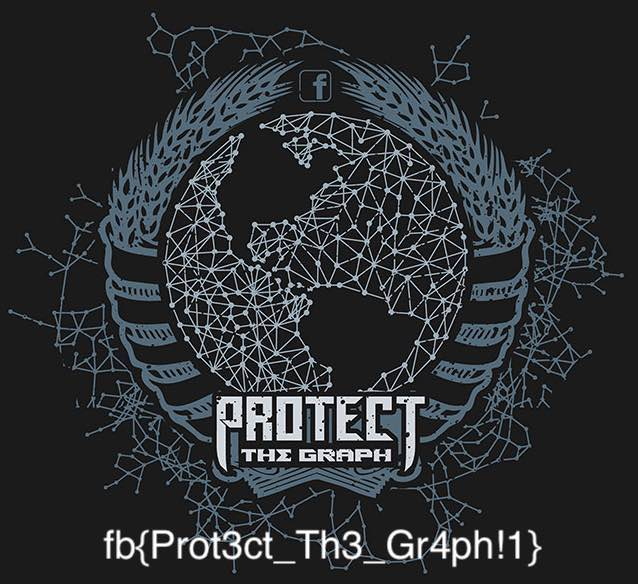
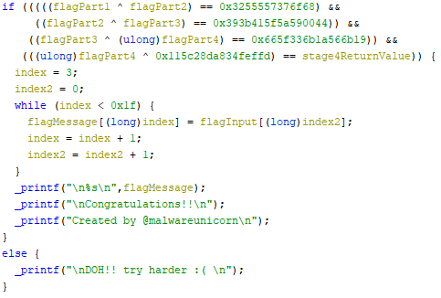
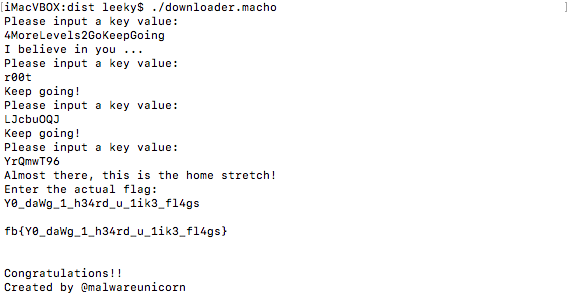

# imageprot

    We have had some issues with profile photo theft as of late, so I built a proof of concept vault to store your pictures, it's so secure, even I don't know how to get the photo back out!
    
imageprot is a non-stripped 64bit Linux rust binary (clang LLVM (rustc version 1.34.2 (6c2484dc3 2019-05-13))) which contains an encrypted image meant to be extracted and decoded.

## Solution

At the start of the program the binary tries to make a request to http://challenges.fbctf.com/vault_is_intern which doesn't exist causing the program to crash.
Simply adding challenges.fbctf.com to the hosts file and redirecting it to a local http server providing an arbitrary file with that name fixes this first hurdle.

Notable following is the  "anti-hacking tool" functionality which searches the whole system for gdb, vmtoolsd, vagrant and VBoxClient, exiting if any are found.

Some small patches remove this if necessary
```
File Offsets  Bytes       Instruction     
00056d22      e829edffff  call    core::str::_$LT$impl$u20$str$GT$::contains::h146be2e340aeb096
->
00056d22      b800000000  mov     eax, 0x0

00056d60      e8ebecffff  call    core::str::_$LT$impl$u20$str$GT$::contains::h146be2e340aeb096
->
00056d60      b800000000  mov     eax, 0x0
```

Further looking into the binary reveals that another request is made to get a decryption key and run a 88516 bytes long array (starts at file offset 0x2BF11A) through imageprot::decrypt::h56022ac7eed95389.
The functionality of this decrypt function is relatively simple as it just base64 decodes the input and runs repeating-xor on the output (Easily confirmed in dynamic analysis).
The key is initialized with "1337" at the start of the program and later switches to the one from the http request whereas the URL of it is encoded with the default key.

"WUdHR0IJHBhZR0dHU1pdGV5BVBhCR1JDREAcAwAL" (with key "1337") => https://httpbin.org/status/418

```

    -=[ teapot ]=-

       _...._
     .'  _ _ `.
    | ."` ^ `". _,
    \_;`"---"`|//
      |       ;/
      \_     _/
        `"""`

```

Using this to decode the byte array at the offset reveals the flag

```python
import base64
import requests

def repeatingXOR(a, b): return ([chr(ord(a[i])^ord(b[i%len(b)])) for i in range(len(a))])

with open("imageprot", "rb") as file:
    data = file.read()[0x2BF11A:][:88516]
    
data = base64.b64decode(data)

key = requests.get('https://httpbin.org/status/418').content
    
dec = ''.join(repeatingXOR(data, key))
with open("image.jpg", "wb") as file:
    file.write(dec)
```



Within the image the flag is shown: `fb{Prot3ct_Th3_Gr4ph!1}`

# matryoshka

    There was a downloader found on a Mac desktop. It's your job to have layers of fun getting the flag.
    
matryoshka is a 64bit Mach-O executable containing multiple password prompts where the last password entered represents the flag.

## Solution

At the beginning the binary sends a HTTP GET request to 157.230.132.171/pickachu_wut.png and saves the result in memory.
From there on the binary confirms the PNG header of the image and copies 0x1002 bytes starting from offset 0x60000 in the file to a separate memory region with read,write and execution rights.

(The relevant bytes)
```
55 48 89 E5 68 3A 20 0A 00 C7 44 24 04 00 00 00 00 68 65 79 20 76 C7 44 24 04 61 6C 75 65 68 6E 70 75 74 C7 44 24 04 20 61 20 6B 68 50 6C 65 61 C7 44 24 04 73 65 20 69 B8 04 00 00 02 BF 01 00 00 00 48 89 E6 BA 1B 00 00 00 0F 05 58 58 58 58 B8 03 00 00 02 BF 00 00 00 00 48 8D 35 29 01 00 00 BA 1B 00 00 00 0F 05 41 BC 00 00 00 00 66 44 8B 15 14 01 00 00 4C 8D 35 0D 01 00 00 49 83 FC 17 7D 68 43 0F B6 0C 26 83 F9 41 7C 21 83 F9 5A 7F 1C 83 C1 0D 83 F9 5A 7F 06 43 88 0C 26 EB 0C 43 0F B6 0C 26 83 E9 0D 43 88 0C 26 EB 38 43 0F B6 0C 26 83 F9 61 7C 25 83 F9 7A 7F 20 89 C8 83 C0 0D 83 F8 7A 7F 08 88 C1 43 88 0C 26 EB 0C 43 0F B6 0C 26 83 E9 0D 43 88 0C 26 EB 09 43 0F B6 0C 26 43 88 0C 26 49 FF C4 EB 92 4D 31 C0 4D 31 E4 4C 8D 2D 7A 00 00 00 49 83 FC 17 7D 24 43 0F B6 0C 26 43 0F B6 54 25 00 39 D1 75 08 41 B8 01 00 00 00 EB 08 41 B8 00 00 00 00 EB 05 49 FF C4 EB D6 41 83 F8 01 75 24 B8 04 00 00 02 BF 01 00 00 00 48 8D 35 6C 00 00 00 BA 15 00 00 00 0F 05 31 C0 66 B8 4C 35 66 44 31 D0 5D C3 B8 04 00 00 02 BF 01 00 00 00 48 8D 35 5D 00 00 00 BA E6 00 00 00 0F 05 31 C0 B8 01 00 00 02 BF 00 00 00 00 0F 05 34 5A 62
```

Following the allocation it calls this memory region and uses the return value to copy another 0x1002 bytes from the image with the return value as the offset to also execute it.

After that the code requests the "Actual password" which it then splits into pieces and xors with each other.
Only if the parts xored with each other match given constants they are considered correct, the last part is xored with a constant though and checked if it matches the return value of the second shell code call.

Uppon actual execution it's also apparent that the shell code makes further password requests and terminates execution if the input doesn't fulfills its constraints.

The first part is pretty easy as it runs the input through the following symmetrical encoding:

```python
def stage1(input):
    charArray = [ord(c) for c in input]
    charArray = charArray + [0]*20

    for i in range(0x18):
        ecx = charArray[i]
        if ecx < 65 or ecx > 90:
            if ecx < 97 or ecx > 0x7A:
                charArray[i] = ecx
            else:
                eax = ecx + 13
                if eax > 0x7A:
                    charArray[i] = ecx-13
                else:
                    charArray[i] = eax
        else:
            eax = ecx + 13
            if eax > 90:
                charArray[i] = ecx -13
            else:
                charArray[i] = eax
                
    return ''.join([chr(c) for c in charArray if c != 0]) # filter 0 bytes out
    
print(stage1("4MoreLevels2GoKeepGoing") == "4ZberYriryf2TbXrrcTbvat")
```
and checks if it matches the string "4ZberYriryf2TbXrrcTbvat".
Running the string through the function decodes the first pass phrase "4MoreLevels2GoKeepGoing".

The offset returned with the correct input is 0x7878, so the second shell code is at file offset 0x67878:
```
55 48 89 E5 68 3A 20 0A 00 C7 44 24 04 00 00 00 00 68 65 79 20 76 C7 44 24 04 61 6C 75 65 68 6E 70 75 74 C7 44 24 04 20 61 20 6B 68 50 6C 65 61 C7 44 24 04 73 65 20 69 B8 04 00 00 02 BF 01 00 00 00 48 89 E6 BA 1B 00 00 00 0F 05 58 58 58 58 B8 03 00 00 02 BF 00 00 00 00 48 8D 35 4E 07 00 00 BA 10 00 00 00 0F 05 41 B9 00 00 00 00 41 BA 00 00 00 00 4C 8D 2D BC 00 00 00 4C 8D 35 2D 07 00 00 4C 8D 3D 36 07 00 00 49 81 F9 78 06 00 00 7D 1A 49 83 FA 04 75 03 4D 31 D2 43 0F B6 0C 16 43 88 0C 0F 49 FF C1 49 FF C2 EB DD 4D 31 C9 49 81 F9 78 06 00 00 7D 2C 43 0F B6 4C 0D 00 43 0F B6 14 0F 29 D1 81 C1 00 01 00 00 BA 00 00 00 00 89 C8 99 BE 00 01 00 00 F7 FE 43 88 54 0D 00 49 FF C1 EB CB 41 8B 55 00 81 FA 55 48 89 E5 75 1F B8 04 00 00 02 BF 01 00 00 00 48 8D 35 36 0D 00 00 BA 0C 00 00 00 0F 05 31 C0 41 FF D5 EB 26 B8 04 00 00 02 BF 01 00 00 00 48 8D 35 23 0D 00 00 BA E6 00 00 00 0F 05 31 C0 B8 01 00 00 02 BF 00 00 00 00 0F 05 5D C3 C7 78 B9 59 DA 6A 50 7E 72 F7 74 98 76 30 30 74 72 98 95 ED 92 A6 F7 B8 96 34 91 E0 E7 95 98 E2 E2 A5 A4 3B B6 54 34 94 D3 50 9B DC C2 9C 95 D5 39 74 54 78 E5 95 50 DD 2A 34 30 74 74 EF 31 74 72 30 78 FD 58 EA 4B 74 72 30 3F 79 CA 88 88 CC 2A 33 30 74 74 EF 30 74 72 30 78 01 A7 45 35 74 72 EA 40 74 72 30 3F 79 BA 61 02 BC FD 45 34 79 72 30 78 35 5C 50 B1 6E E7 7F 81 BE 81 B5 B2 74 72 30 7C 01 AF D3 30 74 72 7C BD A9 58 34 30 74 B3 EC 30 74 72 30 79 F5 6E 7A 34 74 72 AD 6B 2C 7A 30 30 74 BE B9 11 BD FB FA 71 83 28 44 3F B5 FB F3 74 FD 42 71 B9 45 0B 74 B9 52 69 2E 78 D7 3C 71 3F 2A 86 3E 74 FD 41 61 07 B5 FA 28 7C FD 53 75 B8 78 81 79 2F 38 5D EC 71 FF 89 B1 2A C9 BA B9 15 E9 91 E8 34 74 72 32 EF 75 72 30 30 BC FF 65 C0 78 72 30 EA 80 72 30 30 83 77 61 F0 B5 71 07 1B 9A 2A 34 30 74 74 EF 31 74 72 30 78 01 A7 AD 34 74 72 EA 16 74 72 30 3F 79 A3 F0 E8 75 72 30 32 33 72 30 30 74 81 35 8D 37 8B 32 1A FB 8F A5 A1 B4 BE BD 57 BA E3 7F 81 BE BE 52 36 8F C7 69 C6 82 DA 7E 32 82 72 5A 69 98 AE 6F 47 19 A3 9B 85 DE 9F 9A 38 7E 97 53 64 9F FD 3E 77 DA 78 5A A1 97 66 7E 93 D6 E9 20 80 BE BE 7A 5B 5F 05 25 7A BE BE 7A 9C DB 9F 47 39 86 66 79 93 D6 E9 20 81 BE BE 7A 5B 63 B2 EC 80 BE BE 20 A3 D6 E7 7F 8E C3 76 F1 A6 FB E6 7F 81 76 FF D0 73 57 01 68 35 E7 EC 6F 41 9E 6A 72 B3 BF BE 7A 5B 4C EF 7F 81 BE BE 7A 93 D6 AB F2 84 0F BF 7A 93 FE 80 7F 81 BE 76 F7 9E 5B E6 7F 81 76 68 AA 93 D6 E7 7F 81 BE BE 36 1E DB 73 7E 81 BE 72 F7 9E 43 E6 7F 81 16 06 7A 93 D6 3F 7B 81 BE C0 25 92 D6 E7 7F 49 3B EB 4D 92 D6 E7 37 02 00 B6 20 7B D6 E7 7F 8E C3 76 F1 96 9B E6 7F 81 76 EF C1 5B C7 2E 37 90 0C 76 AB CC B3 28 27 85 BE BE 78 0C D7 E7 7F 81 76 33 AF 35 D4 E7 7F 1B 20 BE 7A 93 E1 E2 AE C1 66 BF 7A 93 D4 3C 7F 81 BE BE 75 96 AB AF F6 E4 76 EF BA 52 4D C7 7F 81 BE 77 23 9B DE EF 77 89 B6 B6 72 5A 4C E7 7E 83 BD BA 7F 95 D9 AB A6 B9 B2 B2 37 1A EA 27 32 80 F4 76 E5 D3 FD 0C 37 90 FE 73 AB DA A3 B6 CD 4C B9 6C 86 93 A3 E6 C6 67 77 B5 54 D0 A0 EC 29 7D CF 73 7B EA A3 B6 C4 44 36 F9 37 14 1D AC 70 17 CA B6 3F 1B F2 E7 59 48 B9 A4 B9 54 5E DB 77 48 29 00 37 82 2D AB A6 B3 7B B5 3E E0 9E FC BF 05 FE AB 26 6E 15 92 37 08 23 76 AB D3 A3 B6 CD 67 77 B5 54 D1 78 AE 70 6F F4 76 A3 D1 8A 72 59 48 B9 A4 B8 5A 11 29 32 90 05 7B F2 E0 78 AE 70 6F FD 75 75 05 EA DE 59 48 B9 A4 B1 35 9F EC 51 B3 7B BF C0 5E C7 20 3A 09 0D 9C 33 9C 80 30 30 8E 70 CA 83 35 9F EC 51 BB A0 77 75 4D 15 A4 F7 75 C7 9C 33 9C 90 30 59 48 B9 A4 C8 54 5E D3 86 67 77 B5 64 E8 A3 E6 C5 4C EF 09 3F 1B 25 AC 70 17 D2 C7 36 9C 48 DB 7E 4C EF 08 3F 1B EA E7 37 DE FE 19 FC 6E 15 F5 93 53 C4 C1 03 9D 8E 3A 0F E8 96 0E 53 84 BF FF 8D D5 23 0E E1 C0 90 79 5E 58 C7 13 3E A1 A4 F2 E6 2B D2 EC 77 AC 44 99 54 D3 94 08 07 BF D2 E7 7F 81 BE BE 7A 93 D6 E7 7F 81 BE BE 7A 93 D6 E7 7F 81 BE BE 7A 93 D6 E7 7F 81 BE BE 7A 93 D6 E7 7F 81 BE BE 7A 93 D6 E7 7F 81 BE BE 7A 93 D6 E7 7F 81 BE BE 7A 93 D6 E7 7F 81 BE BE 7A 93 D6 E7 7F 81 BE BE 7A 93 D6 E7 7F 81 BE BE 7A 93 D6 E7 7F 81 BE BE 7A 93 D6 E7 7F 81 BE BE 7A 93 D6 E7 7F 81 BE BE 7A 93 D6 E7 7F 81 BE BE 7A 93 D6 E7 7F 81 BE BE 7A 93 D6 E7 7F 81 BE BE 7A 93 D6 E7 7F 81 BE BE 7A 93 D6 E7 7F 81 BE BE 7A 93 D6 E7 7F 81 BE BE 7A 93 D6 E7 7F 81 BE BE 7A 93 D6 E7 7F 81 BE BE 7A 93 D6 E7 7F 81 BE BE 7A 93 D6 E7 7F 81 BE BE 7A 93 D6 E7 7F 81 BE BE 7A 93 D6 E7 7F 81 BE BE 7A 93 D6 E7 7F 81 BE BE 7A 93 D6 E7 7F 81 BE BE 7A 93 D6 E7 7F 81 BE BE 7A 93 D6 E7 7F 81 BE BE 7A 93 D6 E7 7F 81 BE BE 7A 93 D6 E7 7F 81 BE BE 7A 93 D6 E7 7F 81 BE BE 7A 93 D6 E7 7F 81 BE BE 7A 93 D6 E7 7F 81 BE BE 7A 93 D6 C7 9F A1 DE DE 3C 52 9F AB 9F 36 76 7F 36 56 B7 F1 75 36 DE DE 9A 73 B6 94 9F A1 DE DE 9A 73 A9 C7 9F A1 DE DE 9A 73 B6 F1 48 A1 DE DE 9A 73 B6 C7 9F 36 DE DE 4D 73 B6 C7 9F A1 91 DE 9A 73 B6 F1 9F A1 DE DE 9A 73 B6 C7 9F A1 DE DE 9A 73 B9 CD 9F A1 91 DE 9A 73 B6 C7 9F 8B DE DE 94 7E B4 C9 92 AF 89 DE 9A 73 B6 C7 43 A1 8A D4 97 7E 92 C7 9F 8B DE D5 9A 73 B6 C7 9F A1 DE E0 97 7D C0 9C 40 A8 DE D4 97 74 B6 C7 9F 8B AA DE 9A 73 B6 C7 40 A1 DE DE 9A 73 B6 C7 9F A1 D9 DE 9A 73 B6 C7 9F 8B 8A DD 97 7D B1 9C 93 A1 DE DE 94 6C B1 CD 93 A6 DE DE 9A 73 B6 C7 9F 8B DE 9E 9D 7E C3 CA 92 A6 D8 85 46 7E C3 C4 9F A1 DE DE 9A 73 DC 95 49 37 90 8C 4C 65 A8 95 49 37 90 8C 4C 65 A8 95 49 37 90 8C 70 30 74 72 30 30 74 72 30 30 74 72 30 30 74 72 30 7B D9 D7 A0 50 DB E1 99 9E DB 93 3A 50 94 92 50 50 BA B3 79 7C 94 C9 78 71 C0 B7 51 3A 7E C9 50 50 94 92 50 87 94 92 50 50 94 92 87 50 94 92 50 50 94 92 50 3A CB 92 50 50 94 92 50 50 94 C9 50 50 CB 92 50 50 94 92 87 50 94 92 50 3A 94 92 50 50 94 92 50 50 94 92 50 50 94 92 57 5E 94 92 87 50 94 92 50 50 94 7C 50 50 A2 9F 52 52 A1 A0 8F 50 94 92 50 50 D0 92 8C 5E A1 9F AC 50 94 7C 50 5F 94 92 50 50 94 92 50 52 A1 A0 5E 8F D3 9B 50 5E A1 99 50 50 94 7C AC 50 94 92 50 50 D3 92 50 50 94 92 50 50 94 92 5F 50 94 92 50 50 94 7C 8C 57 A1 A0 8F 8F A0 92 50 50 A2 D1 8F 5E A0 99 50 50 94 92 50 50 94 7C 50 90 9B 9F 5D 5D A1 99 5E 8F D0 9F 5D 57 94 92 50 50 94 92 3A 86 CA C8 86 86 CA C8 86 86 CA C8 86 86 CA C8 86 86 CA C8 86 86 7E 00 00 00 00 00 00 00 00 00 00 00 00 00 00 00 00 00 00 00 00 00 00 00 00 00 00 00 00 00 00 00 00 00 00 00 00 00 00 00 00 00 00 00 00 00 00 00 00 00 00 00 00 00 00 00 00 00 00 00 00 00 00 00 00 00 00 00 00 00 00 00 00 00 00 00 00 00 00 00 00 00 00 00 00 00 00 00 00 00 00 00 00 00 00 00 00 00 00 00 00 00 00 00 00 00 00 00 00 00 00 00 00 00 00 00 00 00 00 00 00 00 00 00 00 00 00 00 00 00 00 00 00 00 00 00 00 00 00 00 00 00 00 00 00 00 00 00 00 00 00 00 00 00 00 00 00 00 00 00 00 00 00 00 00 00 00 00 00 00 00 00 00 00 00 00 00 00 00 00 00 00 00 00 00 00 00 00 00 00 00 00 00 00 00 00 00 00 00 00 00 00 00 00 00 00 00 00 00 00 00 00 00 00 00 00 00 00 00 00 00 00 00 00 00 00 00 00 00 00 00 00 00 00 00 00 00 00 00 00 00 00 00 00 00 00 00 00 00 00 00 00 00 00 00 00 00 00 00 00 00 00 00 00 00 00 00 00 00 00 00 00 00 00 00 00 00 00 00 00 00 00 00 00 00 00 00 00 00 00 00 00 00 00 00 00 00 00 00 00 00 00 00 00 00 00 00 00 00 00 00 00 00 00 00 00 00 00 00 00 00 00 00 00 00 00 00 00 00 00 00 00 00 00 00 00 00 00 00 00 00 00 00 00 00 00 00 00 00 00 00 00 00 00 00 00 00 00 00 00 00 00 00 00 00 00 00 00 00 00 00 00 00 00 00 00 00 00 00 00 00 00 00 00 00 00 00 00 00 00 00 00 00 00 00 00 00 00 00 00 00 00 00 00 00 00 00 00 00 00 00 00 00 00 00 00 00 00 00 00 00 00 00 00 00 00 00 00 00 00 00 00 00 00 00 00 00 00 00 00 00 00 00 00 00 00 00 00 00 00 00 00 00 00 00 00 00 00 00 00 00 00 00 00 00 00 00 00 00 00 00 00 00 00 00 00 00 00 00 00 00 00 00 00 00 00 00 00 00 00 00 00 00 00 00 00 00 00 00 00 00 00 00 00 00 00 00 00 00 00 00 00 00 00 00 00 00 00 00 00 00 00 00 00 00 00 00 00 00 00 00 00 00 00 00 00 00 00 00 00 00 00 00 00 00 00 00 00 00 00 00 00 00 00 00 00 00 00 00 00 00 00 00 00 00 00 00 00 00 00 00 00 00 00 00 00 00 00 00 00 00 00 00 00 00 00 00 00 00 00 00 00 00 00 00 00 00 00 00 00 00 00 00 00 00 00 00 00 00 00 00 00 00 00 00 00 00 00 00 00 00 00 00 00 00 00 00 00 00 00 00 00 00 00 00 00 00 00 00 00 00 00 00 00 00 00 00 00 00 00 00 00 00 00 00 00 00 00 00 00 00 00 00 00 00 00 00 00 00 00 00 00 00 00 00 00 00 00 00 00 00 00 00 00 00 00 00 00 00 00 00 00 00 00 00 00 00 00 00 00 00 00 00 00 00 00 00 00 00 00 00 00 00 00 00 00 00 00 00 00 00 00 00 00 00 00 00 00 00 00 00 00 00 00 00 00 00 00 00 00 00 00 00 00 00 00 00 00 00 00 00 00 00 00 00 00 00 00 00 00 00 00 00 00 00 00 00 00 00 00 00 00 00 00 00 00 00 00 00 00 00 00 00 00 00 00 00 00 00 00 00 00 00 00 00 00 00 00 00 00 00 00 00 00 00 00 00 00 00 00 00 00 00 00 00 00 00 00 00 00 00 00 00 00 00 00 00 00 00 00 00 00 00 00 00 00 00 00 00 00 00 00 00 00 00 00 00 00 00 00 00 00 00 00 00 00 00 00 00 00 00 00 00 00 00 00 00 00 00 00 00 00 00 00 00 00 00 00 00 00 00 00 00 00 00 00 00 00 00 00 00 00 00 00 00 00 00 00 00 00 00 00 00 00 00 00 00 00 00 00 00 00 00 00 00 00 00 00 00 00 00 00 00 00 00 00 00 00 00 00 00 00 00 00 00 00 00 00 00 00 00 00 00 00 00 00 00 00 00 00 00 00 00 00 00 00 00 00 00 00 00 00 00 00 00 00 00 00 00 00 00 00 00 00 00 00 00 00 00 00 00 00 00 00 00 00 00 00 00 00 00 00 00 00 00 00 00 00 00 00 00 00 00 00 00 00 00 00 00 00 00 00 00 00 00 00 00 00 00 00 00 00 00 00 00 00 00 00 00 00 00 00 00 00 00 00 00 00 00 00 00 00 00 00 00 00 00 00 00 00 00 00 00 00 00 00 00 00 00 00 00 00 00 00 00 00 00 00 00 00 00 00 00 00 00 00 00 00 00 00 00 00 00 00 00 00 00 00 00 00 00 00 00 00 00 00 00 00 00 00 00 00 00 00 00 00 00 00 00 00 00 00 00 00 00 00 00 00 00 00 00 00 00 00 00 00 00 00 00 00 00 00 00 00 00 00 00 00 00 00 00 00 00 00 00 00 00 00 00 00 00 00 00 00 00 00 00 00 00 00 00 00 00 00 00 00 00 00 00 00 00 00 00 00 00 00 00 00 00 00 00 00 00 00 00 00 00 00 00 00 00 00 00 00 00 00 00 00 00 00 00 00 00 00 00 00 00 00 00 00 00 00 00 00 00 00 00 00 00 00 00 00 00 00 00 00 00 00 00 00 00 00 00 00 00 00 00 00 00 00 00 00 00 00 00 00 00 00 00 00 00 00 00 00 00 00 00 00 00 00 00 00 00 00 00 00 00 00 00 00 00 00 00 00 00 00 00 00 00 00 00 00 00 00 00 00 00 00 00 00 00 00 00 00 00 00 00 00 00 00 00 00 00 00 00 00 00 00 00 00 00 00 00 00 00 00 00 00 00 00 00 00 00 00 00 00 00 00 00 00 00 00 00 00 00 00 00 00 00 00 00 00 00 00 00 00 00 00 00 00 00 00 00 00 00 00 00 00 00 00 00 00 00 00 00 00 00 00 00 00 00 00 00 00 00 00 00 00 00 00 00 00 00 00 00 00 00 00 00 00 00 00 00 00 00 00 00 00 00 00 00 00 00 00 00 00 00 00 00 00 00 00 00 00 00 00 00 00 00 00 00 00 00 00 00 00 00 00 00 00 00 00 00 00 00 00 00 00 00 00 00 00 00 00 00 00 00 00 00 00 00 00 00 00 00 00 00 00 00 00 00 00 00 00 00 00 00 00 00 00 00 00 00 00 00 00 00 00 00 00 00 00 00 00 00 00 00 00 00 00 00 00 00 00 00 00 00 00 00 00 00 00 00 00 00 00 00 00 00 00 00 00 00 00 00 00 00 00 00 00 00 00 00 00 00 00 00 00 00 00 00 00 00 00 00 00 00 00 00 00 00 00 00 00 00 00 00 00 00 00 00 00 00 00 00 00 00 00 00 00 00 00 00 00 00 00 00 00 00 00 00 00 00 00 00 00 00 00 00 00 00 00 00 00 00 00 00 00 00 00 00 00 00 00 00 00 00 00 00 00 00 00 00 00 00 00 00 00 00 00 00 00 00 00 00 00 00 00 00 00 00 00 00 00 00 00 00 00 00 00 00 00 00 00 00 00 00 00 00 00 00 00 00 00 00 00 00 00 00 00 00 00 00 00 00 00 00 00 00 00 00 00 00 00 00 00 00 00 00 00 00 00 00 4B 65 65 70 20 67 6F 69 6E 67 21 0A 20 20 20 20 20 46 41 49 4C 20 57 48 41 4C 45 21 0A 0A 57 20 20 20 20 20 57 20 20 20 20 20 20 57 20 20 20 20 20 20 20 20 0A 57 20 20 20 20 20 20 20 20 57 20 20 57 20 20 20 20 20 57 20 20 20 20 0A 20 20 20 20 20 20 20 20 20 20 20 20 20 20 27 2E 20 20 57 20 20 20 20 20 20 0A 20 20 2E 2D 22 22 2D 2E 5F 20 20 20 20 20 5C 20 5C 2E 2D 2D 7C 20 20 0A 20 2F 20 20 20 20 20 20 20 22 2D 2E 2E 5F 5F 29 20 2E 2D 27 20 20 20 0A 7C 20 20 20 20 20 5F 20 20 20 20 20 20 20 20 20 2F 20 20 20 20 20 20 0A 5C 27 2D 2E 5F 5F 2C 20 20 20 2E 5F 5F 2E 2C 27 20 20 20 20 20 20 20 0A 20 60 27 2D 2D 2D 2D 27 2E 5F 5C 2D 2D 27 20 20 20 20 20 20 0A 56 56 56 56 56 56 56 56 56 56 56 56 56 56 56 56 56 56 56 56 56 0A 24 8C AF AA F9 98 40 06 76 EC 44 8E 90 C9 B3 AE 20 BE BC 44 40 E8 B5 45 37 73 C0 2B D2 0E 7A 90 CB 09 BC FB A7 7F F8 F5 8B 37 73 D1 63 FA 58 E2 0F BF FF 73 4F 3B 68 07 DA 81 76 A0 1D 68 07 DA 81 76 A0 1D 68 07 DA 81 76 E0 B1 3B B0 BB 93 48 0B BB F9 CB B8 99 48 9B 9E C5 CE 0E 5B 21 1E 11 F3 19 49 6C 40 C6 9D 95 C1 D8 A2 79 59 04 9C 23 01 3F 39 C2 73 F0 B1 00 27 0E D3 0C 04 5D D3 81 19 A9 D0 12 27 2A 32 69 7E 12 6A 06 F6 F1 74 0B 6E 02 A4 57 D1 F3 7E CD 98 EF 24 FA 2F 31 C7 CD 43 17 9E 03 2C CF 2B 00 4E 8D 73 C3 81 2B 07 62 C7 5D C7 55 96 9D 18 00 30 C6 DC 8C 8C 68 BE D6 A6 6A 2D 0E BD B8 86 42 DF FB C7 12 26 B5 11 A9 75 4A BA 2E 91 A2 68 95 8E
```

Within the second shellcode there are 3 more stages, luckily the first two are really simple:

At first it requests a password again and runs some subtractions on a byte sequence with the input as a rotating-key of length 4.
After that it checks whether the first 4 bytes of the byte sequence match a constant after decoding and calls the now decoded byte sequences which is the next stage.

```python
def dumpHex(arr):
    s = ""
    for b in arr:
        s = s +(" %02X"%b)
    print(s.strip())
    
def stage2(input):
    charArray = [ord(c) for c in input]
    charArray = charArray + [0]*0x10
    
    resArray = [0]*0x678
    
    byteCode = [0xC7, 0x78, 0xB9, 0x59, 0xDA, 0x6A, 0x50, 0x7E, 0x72, 0xF7, 0x74, 0x98, 0x76, 0x30, 0x30, 0x74, 0x72, 0x98, 0x95, 0xED, 0x92, 0xA6, 0xF7, 0xB8, 0x96, 0x34, 0x91, 0xE0, 0xE7, 0x95, 0x98, 0xE2, 0xE2, 0xA5, 0xA4, 0x3B, 0xB6, 0x54, 0x34, 0x94, 0xD3, 0x50, 0x9B, 0xDC, 0xC2, 0x9C, 0x95, 0xD5, 0x39, 0x74, 0x54, 0x78, 0xE5, 0x95, 0x50, 0xDD, 0x2A, 0x34, 0x30, 0x74, 0x74, 0xEF, 0x31, 0x74, 0x72, 0x30, 0x78, 0xFD, 0x58, 0xEA, 0x4B, 0x74, 0x72, 0x30, 0x3F, 0x79, 0xCA, 0x88, 0x88, 0xCC, 0x2A, 0x33, 0x30, 0x74, 0x74, 0xEF, 0x30, 0x74, 0x72, 0x30, 0x78, 0x01, 0xA7, 0x45, 0x35, 0x74, 0x72, 0xEA, 0x40, 0x74, 0x72, 0x30, 0x3F, 0x79, 0xBA, 0x61, 0x02, 0xBC, 0xFD, 0x45, 0x34, 0x79, 0x72, 0x30, 0x78, 0x35, 0x5C, 0x50, 0xB1, 0x6E, 0xE7, 0x7F, 0x81, 0xBE, 0x81, 0xB5, 0xB2, 0x74, 0x72, 0x30, 0x7C, 0x01, 0xAF, 0xD3, 0x30, 0x74, 0x72, 0x7C, 0xBD, 0xA9, 0x58, 0x34, 0x30, 0x74, 0xB3, 0xEC, 0x30, 0x74, 0x72, 0x30, 0x79, 0xF5, 0x6E, 0x7A, 0x34, 0x74, 0x72, 0xAD, 0x6B, 0x2C, 0x7A, 0x30, 0x30, 0x74, 0xBE, 0xB9, 0x11, 0xBD, 0xFB, 0xFA, 0x71, 0x83, 0x28, 0x44, 0x3F, 0xB5, 0xFB, 0xF3, 0x74, 0xFD, 0x42, 0x71, 0xB9, 0x45, 0x0B, 0x74, 0xB9, 0x52, 0x69, 0x2E, 0x78, 0xD7, 0x3C, 0x71, 0x3F, 0x2A, 0x86, 0x3E, 0x74, 0xFD, 0x41, 0x61, 0x07, 0xB5, 0xFA, 0x28, 0x7C, 0xFD, 0x53, 0x75, 0xB8, 0x78, 0x81, 0x79, 0x2F, 0x38, 0x5D, 0xEC, 0x71, 0xFF, 0x89, 0xB1, 0x2A, 0xC9, 0xBA, 0xB9, 0x15, 0xE9, 0x91, 0xE8, 0x34, 0x74, 0x72, 0x32, 0xEF, 0x75, 0x72, 0x30, 0x30, 0xBC, 0xFF, 0x65, 0xC0, 0x78, 0x72, 0x30, 0xEA, 0x80, 0x72, 0x30, 0x30, 0x83, 0x77, 0x61, 0xF0, 0xB5, 0x71, 0x07, 0x1B, 0x9A, 0x2A, 0x34, 0x30, 0x74, 0x74, 0xEF, 0x31, 0x74, 0x72, 0x30, 0x78, 0x01, 0xA7, 0xAD, 0x34, 0x74, 0x72, 0xEA, 0x16, 0x74, 0x72, 0x30, 0x3F, 0x79, 0xA3, 0xF0, 0xE8, 0x75, 0x72, 0x30, 0x32, 0x33, 0x72, 0x30, 0x30, 0x74, 0x81, 0x35, 0x8D, 0x37, 0x8B, 0x32, 0x1A, 0xFB, 0x8F, 0xA5, 0xA1, 0xB4, 0xBE, 0xBD, 0x57, 0xBA, 0xE3, 0x7F, 0x81, 0xBE, 0xBE, 0x52, 0x36, 0x8F, 0xC7, 0x69, 0xC6, 0x82, 0xDA, 0x7E, 0x32, 0x82, 0x72, 0x5A, 0x69, 0x98, 0xAE, 0x6F, 0x47, 0x19, 0xA3, 0x9B, 0x85, 0xDE, 0x9F, 0x9A, 0x38, 0x7E, 0x97, 0x53, 0x64, 0x9F, 0xFD, 0x3E, 0x77, 0xDA, 0x78, 0x5A, 0xA1, 0x97, 0x66, 0x7E, 0x93, 0xD6, 0xE9, 0x20, 0x80, 0xBE, 0xBE, 0x7A, 0x5B, 0x5F, 0x05, 0x25, 0x7A, 0xBE, 0xBE, 0x7A, 0x9C, 0xDB, 0x9F, 0x47, 0x39, 0x86, 0x66, 0x79, 0x93, 0xD6, 0xE9, 0x20, 0x81, 0xBE, 0xBE, 0x7A, 0x5B, 0x63, 0xB2, 0xEC, 0x80, 0xBE, 0xBE, 0x20, 0xA3, 0xD6, 0xE7, 0x7F, 0x8E, 0xC3, 0x76, 0xF1, 0xA6, 0xFB, 0xE6, 0x7F, 0x81, 0x76, 0xFF, 0xD0, 0x73, 0x57, 0x01, 0x68, 0x35, 0xE7, 0xEC, 0x6F, 0x41, 0x9E, 0x6A, 0x72, 0xB3, 0xBF, 0xBE, 0x7A, 0x5B, 0x4C, 0xEF, 0x7F, 0x81, 0xBE, 0xBE, 0x7A, 0x93, 0xD6, 0xAB, 0xF2, 0x84, 0x0F, 0xBF, 0x7A, 0x93, 0xFE, 0x80, 0x7F, 0x81, 0xBE, 0x76, 0xF7, 0x9E, 0x5B, 0xE6, 0x7F, 0x81, 0x76, 0x68, 0xAA, 0x93, 0xD6, 0xE7, 0x7F, 0x81, 0xBE, 0xBE, 0x36, 0x1E, 0xDB, 0x73, 0x7E, 0x81, 0xBE, 0x72, 0xF7, 0x9E, 0x43, 0xE6, 0x7F, 0x81, 0x16, 0x06, 0x7A, 0x93, 0xD6, 0x3F, 0x7B, 0x81, 0xBE, 0xC0, 0x25, 0x92, 0xD6, 0xE7, 0x7F, 0x49, 0x3B, 0xEB, 0x4D, 0x92, 0xD6, 0xE7, 0x37, 0x02, 0x00, 0xB6, 0x20, 0x7B, 0xD6, 0xE7, 0x7F, 0x8E, 0xC3, 0x76, 0xF1, 0x96, 0x9B, 0xE6, 0x7F, 0x81, 0x76, 0xEF, 0xC1, 0x5B, 0xC7, 0x2E, 0x37, 0x90, 0x0C, 0x76, 0xAB, 0xCC, 0xB3, 0x28, 0x27, 0x85, 0xBE, 0xBE, 0x78, 0x0C, 0xD7, 0xE7, 0x7F, 0x81, 0x76, 0x33, 0xAF, 0x35, 0xD4, 0xE7, 0x7F, 0x1B, 0x20, 0xBE, 0x7A, 0x93, 0xE1, 0xE2, 0xAE, 0xC1, 0x66, 0xBF, 0x7A, 0x93, 0xD4, 0x3C, 0x7F, 0x81, 0xBE, 0xBE, 0x75, 0x96, 0xAB, 0xAF, 0xF6, 0xE4, 0x76, 0xEF, 0xBA, 0x52, 0x4D, 0xC7, 0x7F, 0x81, 0xBE, 0x77, 0x23, 0x9B, 0xDE, 0xEF, 0x77, 0x89, 0xB6, 0xB6, 0x72, 0x5A, 0x4C, 0xE7, 0x7E, 0x83, 0xBD, 0xBA, 0x7F, 0x95, 0xD9, 0xAB, 0xA6, 0xB9, 0xB2, 0xB2, 0x37, 0x1A, 0xEA, 0x27, 0x32, 0x80, 0xF4, 0x76, 0xE5, 0xD3, 0xFD, 0x0C, 0x37, 0x90, 0xFE, 0x73, 0xAB, 0xDA, 0xA3, 0xB6, 0xCD, 0x4C, 0xB9, 0x6C, 0x86, 0x93, 0xA3, 0xE6, 0xC6, 0x67, 0x77, 0xB5, 0x54, 0xD0, 0xA0, 0xEC, 0x29, 0x7D, 0xCF, 0x73, 0x7B, 0xEA, 0xA3, 0xB6, 0xC4, 0x44, 0x36, 0xF9, 0x37, 0x14, 0x1D, 0xAC, 0x70, 0x17, 0xCA, 0xB6, 0x3F, 0x1B, 0xF2, 0xE7, 0x59, 0x48, 0xB9, 0xA4, 0xB9, 0x54, 0x5E, 0xDB, 0x77, 0x48, 0x29, 0x00, 0x37, 0x82, 0x2D, 0xAB, 0xA6, 0xB3, 0x7B, 0xB5, 0x3E, 0xE0, 0x9E, 0xFC, 0xBF, 0x05, 0xFE, 0xAB, 0x26, 0x6E, 0x15, 0x92, 0x37, 0x08, 0x23, 0x76, 0xAB, 0xD3, 0xA3, 0xB6, 0xCD, 0x67, 0x77, 0xB5, 0x54, 0xD1, 0x78, 0xAE, 0x70, 0x6F, 0xF4, 0x76, 0xA3, 0xD1, 0x8A, 0x72, 0x59, 0x48, 0xB9, 0xA4, 0xB8, 0x5A, 0x11, 0x29, 0x32, 0x90, 0x05, 0x7B, 0xF2, 0xE0, 0x78, 0xAE, 0x70, 0x6F, 0xFD, 0x75, 0x75, 0x05, 0xEA, 0xDE, 0x59, 0x48, 0xB9, 0xA4, 0xB1, 0x35, 0x9F, 0xEC, 0x51, 0xB3, 0x7B, 0xBF, 0xC0, 0x5E, 0xC7, 0x20, 0x3A, 0x09, 0x0D, 0x9C, 0x33, 0x9C, 0x80, 0x30, 0x30, 0x8E, 0x70, 0xCA, 0x83, 0x35, 0x9F, 0xEC, 0x51, 0xBB, 0xA0, 0x77, 0x75, 0x4D, 0x15, 0xA4, 0xF7, 0x75, 0xC7, 0x9C, 0x33, 0x9C, 0x90, 0x30, 0x59, 0x48, 0xB9, 0xA4, 0xC8, 0x54, 0x5E, 0xD3, 0x86, 0x67, 0x77, 0xB5, 0x64, 0xE8, 0xA3, 0xE6, 0xC5, 0x4C, 0xEF, 0x09, 0x3F, 0x1B, 0x25, 0xAC, 0x70, 0x17, 0xD2, 0xC7, 0x36, 0x9C, 0x48, 0xDB, 0x7E, 0x4C, 0xEF, 0x08, 0x3F, 0x1B, 0xEA, 0xE7, 0x37, 0xDE, 0xFE, 0x19, 0xFC, 0x6E, 0x15, 0xF5, 0x93, 0x53, 0xC4, 0xC1, 0x03, 0x9D, 0x8E, 0x3A, 0x0F, 0xE8, 0x96, 0x0E, 0x53, 0x84, 0xBF, 0xFF, 0x8D, 0xD5, 0x23, 0x0E, 0xE1, 0xC0, 0x90, 0x79, 0x5E, 0x58, 0xC7, 0x13, 0x3E, 0xA1, 0xA4, 0xF2, 0xE6, 0x2B, 0xD2, 0xEC, 0x77, 0xAC, 0x44, 0x99, 0x54, 0xD3, 0x94, 0x08, 0x07, 0xBF, 0xD2, 0xE7, 0x7F, 0x81, 0xBE, 0xBE, 0x7A, 0x93, 0xD6, 0xE7, 0x7F, 0x81, 0xBE, 0xBE, 0x7A, 0x93, 0xD6, 0xE7, 0x7F, 0x81, 0xBE, 0xBE, 0x7A, 0x93, 0xD6, 0xE7, 0x7F, 0x81, 0xBE, 0xBE, 0x7A, 0x93, 0xD6, 0xE7, 0x7F, 0x81, 0xBE, 0xBE, 0x7A, 0x93, 0xD6, 0xE7, 0x7F, 0x81, 0xBE, 0xBE, 0x7A, 0x93, 0xD6, 0xE7, 0x7F, 0x81, 0xBE, 0xBE, 0x7A, 0x93, 0xD6, 0xE7, 0x7F, 0x81, 0xBE, 0xBE, 0x7A, 0x93, 0xD6, 0xE7, 0x7F, 0x81, 0xBE, 0xBE, 0x7A, 0x93, 0xD6, 0xE7, 0x7F, 0x81, 0xBE, 0xBE, 0x7A, 0x93, 0xD6, 0xE7, 0x7F, 0x81, 0xBE, 0xBE, 0x7A, 0x93, 0xD6, 0xE7, 0x7F, 0x81, 0xBE, 0xBE, 0x7A, 0x93, 0xD6, 0xE7, 0x7F, 0x81, 0xBE, 0xBE, 0x7A, 0x93, 0xD6, 0xE7, 0x7F, 0x81, 0xBE, 0xBE, 0x7A, 0x93, 0xD6, 0xE7, 0x7F, 0x81, 0xBE, 0xBE, 0x7A, 0x93, 0xD6, 0xE7, 0x7F, 0x81, 0xBE, 0xBE, 0x7A, 0x93, 0xD6, 0xE7, 0x7F, 0x81, 0xBE, 0xBE, 0x7A, 0x93, 0xD6, 0xE7, 0x7F, 0x81, 0xBE, 0xBE, 0x7A, 0x93, 0xD6, 0xE7, 0x7F, 0x81, 0xBE, 0xBE, 0x7A, 0x93, 0xD6, 0xE7, 0x7F, 0x81, 0xBE, 0xBE, 0x7A, 0x93, 0xD6, 0xE7, 0x7F, 0x81, 0xBE, 0xBE, 0x7A, 0x93, 0xD6, 0xE7, 0x7F, 0x81, 0xBE, 0xBE, 0x7A, 0x93, 0xD6, 0xE7, 0x7F, 0x81, 0xBE, 0xBE, 0x7A, 0x93, 0xD6, 0xE7, 0x7F, 0x81, 0xBE, 0xBE, 0x7A, 0x93, 0xD6, 0xE7, 0x7F, 0x81, 0xBE, 0xBE, 0x7A, 0x93, 0xD6, 0xE7, 0x7F, 0x81, 0xBE, 0xBE, 0x7A, 0x93, 0xD6, 0xE7, 0x7F, 0x81, 0xBE, 0xBE, 0x7A, 0x93, 0xD6, 0xE7, 0x7F, 0x81, 0xBE, 0xBE, 0x7A, 0x93, 0xD6, 0xE7, 0x7F, 0x81, 0xBE, 0xBE, 0x7A, 0x93, 0xD6, 0xE7, 0x7F, 0x81, 0xBE, 0xBE, 0x7A, 0x93, 0xD6, 0xE7, 0x7F, 0x81, 0xBE, 0xBE, 0x7A, 0x93, 0xD6, 0xE7, 0x7F, 0x81, 0xBE, 0xBE, 0x7A, 0x93, 0xD6, 0xE7, 0x7F, 0x81, 0xBE, 0xBE, 0x7A, 0x93, 0xD6, 0xE7, 0x7F, 0x81, 0xBE, 0xBE, 0x7A, 0x93, 0xD6, 0xC7, 0x9F, 0xA1, 0xDE, 0xDE, 0x3C, 0x52, 0x9F, 0xAB, 0x9F, 0x36, 0x76, 0x7F, 0x36, 0x56, 0xB7, 0xF1, 0x75, 0x36, 0xDE, 0xDE, 0x9A, 0x73, 0xB6, 0x94, 0x9F, 0xA1, 0xDE, 0xDE, 0x9A, 0x73, 0xA9, 0xC7, 0x9F, 0xA1, 0xDE, 0xDE, 0x9A, 0x73, 0xB6, 0xF1, 0x48, 0xA1, 0xDE, 0xDE, 0x9A, 0x73, 0xB6, 0xC7, 0x9F, 0x36, 0xDE, 0xDE, 0x4D, 0x73, 0xB6, 0xC7, 0x9F, 0xA1, 0x91, 0xDE, 0x9A, 0x73, 0xB6, 0xF1, 0x9F, 0xA1, 0xDE, 0xDE, 0x9A, 0x73, 0xB6, 0xC7, 0x9F, 0xA1, 0xDE, 0xDE, 0x9A, 0x73, 0xB9, 0xCD, 0x9F, 0xA1, 0x91, 0xDE, 0x9A, 0x73, 0xB6, 0xC7, 0x9F, 0x8B, 0xDE, 0xDE, 0x94, 0x7E, 0xB4, 0xC9, 0x92, 0xAF, 0x89, 0xDE, 0x9A, 0x73, 0xB6, 0xC7, 0x43, 0xA1, 0x8A, 0xD4, 0x97, 0x7E, 0x92, 0xC7, 0x9F, 0x8B, 0xDE, 0xD5, 0x9A, 0x73, 0xB6, 0xC7, 0x9F, 0xA1, 0xDE, 0xE0, 0x97, 0x7D, 0xC0, 0x9C, 0x40, 0xA8, 0xDE, 0xD4, 0x97, 0x74, 0xB6, 0xC7, 0x9F, 0x8B, 0xAA, 0xDE, 0x9A, 0x73, 0xB6, 0xC7, 0x40, 0xA1, 0xDE, 0xDE, 0x9A, 0x73, 0xB6, 0xC7, 0x9F, 0xA1, 0xD9, 0xDE, 0x9A, 0x73, 0xB6, 0xC7, 0x9F, 0x8B, 0x8A, 0xDD, 0x97, 0x7D, 0xB1, 0x9C, 0x93, 0xA1, 0xDE, 0xDE, 0x94, 0x6C, 0xB1, 0xCD, 0x93, 0xA6, 0xDE, 0xDE, 0x9A, 0x73, 0xB6, 0xC7, 0x9F, 0x8B, 0xDE, 0x9E, 0x9D, 0x7E, 0xC3, 0xCA, 0x92, 0xA6, 0xD8, 0x85, 0x46, 0x7E, 0xC3, 0xC4, 0x9F, 0xA1, 0xDE, 0xDE, 0x9A, 0x73, 0xDC, 0x95, 0x49, 0x37, 0x90, 0x8C, 0x4C, 0x65, 0xA8, 0x95, 0x49, 0x37, 0x90, 0x8C, 0x4C, 0x65, 0xA8, 0x95, 0x49, 0x37, 0x90, 0x8C, 0x70, 0x30, 0x74, 0x72, 0x30, 0x30, 0x74, 0x72, 0x30, 0x30, 0x74, 0x72, 0x30, 0x30, 0x74, 0x72, 0x30, 0x7B, 0xD9, 0xD7, 0xA0, 0x50, 0xDB, 0xE1, 0x99, 0x9E, 0xDB, 0x93, 0x3A, 0x50, 0x94, 0x92, 0x50, 0x50, 0xBA, 0xB3, 0x79, 0x7C, 0x94, 0xC9, 0x78, 0x71, 0xC0, 0xB7, 0x51, 0x3A, 0x7E, 0xC9, 0x50, 0x50, 0x94, 0x92, 0x50, 0x87, 0x94, 0x92, 0x50, 0x50, 0x94, 0x92, 0x87, 0x50, 0x94, 0x92, 0x50, 0x50, 0x94, 0x92, 0x50, 0x3A, 0xCB, 0x92, 0x50, 0x50, 0x94, 0x92, 0x50, 0x50, 0x94, 0xC9, 0x50, 0x50, 0xCB, 0x92, 0x50, 0x50, 0x94, 0x92, 0x87, 0x50, 0x94, 0x92, 0x50, 0x3A, 0x94, 0x92, 0x50, 0x50, 0x94, 0x92, 0x50, 0x50, 0x94, 0x92, 0x50, 0x50, 0x94, 0x92, 0x57, 0x5E, 0x94, 0x92, 0x87, 0x50, 0x94, 0x92, 0x50, 0x50, 0x94, 0x7C, 0x50, 0x50, 0xA2, 0x9F, 0x52, 0x52, 0xA1, 0xA0, 0x8F, 0x50, 0x94, 0x92, 0x50, 0x50, 0xD0, 0x92, 0x8C, 0x5E, 0xA1, 0x9F, 0xAC, 0x50, 0x94, 0x7C, 0x50, 0x5F, 0x94, 0x92, 0x50, 0x50, 0x94, 0x92, 0x50, 0x52, 0xA1, 0xA0, 0x5E, 0x8F, 0xD3, 0x9B, 0x50, 0x5E, 0xA1, 0x99, 0x50, 0x50, 0x94, 0x7C, 0xAC, 0x50, 0x94, 0x92, 0x50, 0x50, 0xD3, 0x92, 0x50, 0x50, 0x94, 0x92, 0x50, 0x50, 0x94, 0x92, 0x5F, 0x50, 0x94, 0x92, 0x50, 0x50, 0x94, 0x7C, 0x8C, 0x57, 0xA1, 0xA0, 0x8F, 0x8F, 0xA0, 0x92, 0x50, 0x50, 0xA2, 0xD1, 0x8F, 0x5E, 0xA0, 0x99, 0x50, 0x50, 0x94, 0x92, 0x50, 0x50, 0x94, 0x7C, 0x50, 0x90, 0x9B, 0x9F, 0x5D, 0x5D, 0xA1, 0x99, 0x5E, 0x8F, 0xD0, 0x9F, 0x5D, 0x57, 0x94, 0x92, 0x50, 0x50, 0x94, 0x92, 0x3A, 0x86, 0xCA, 0xC8, 0x86, 0x86, 0xCA, 0xC8, 0x86, 0x86, 0xCA, 0xC8, 0x86, 0x86, 0xCA, 0xC8, 0x86, 0x86, 0xCA, 0xC8, 0x86, 0x86, 0x7E]
    
    r9 = 0
    r10 = 0
    while r9 < 0x678:
        if r10 == 4:
            r10 = 0
        ecx = charArray[r10]
        resArray[r9] = ecx
        r9 = r9 + 1
        r10 = r10 + 1
    r9 = 0
    while r9 < 0x678:
        byteCode[r9] = ((byteCode[r9] - resArray[r9])+0x100) % 0x100
        r9 = r9 + 1
        
    if(byteCode[0] != 0x55): return False # 0x55  0xC7-0x55 = 'r'
    if(byteCode[1] != 0x48): return False # 0x48  0x78-0x48 = '0'
    if(byteCode[2] != 0x89): return False # 0x89  0xB9-0x89 = '0'
    if(byteCode[3] != 0xE5): return False # 0xE5  0x59-0xE5 = 't'
    
    dumpHex(byteCode)
    
    return True
    
print(stage2("r00t")) 
```

The decoded 3rd stages bytecode:
```
55 48 89 E5 68 3A 20 0A 00 C7 44 24 04 00 00 00 00 68 65 79 20 76 C7 44 24 04 61 6C 75 65 68 6E 70 75 74 C7 44 24 04 20 61 20 6B 68 50 6C 65 61 C7 44 24 04 73 65 20 69 B8 04 00 00 02 BF 01 00 00 00 48 89 E6 BA 1B 00 00 00 0F 05 58 58 58 58 B8 03 00 00 02 BF 00 00 00 00 48 8D 35 15 05 00 00 BA 10 00 00 00 0F 05 48 31 D2 48 8B 15 04 05 00 00 48 C1 EA 20 81 FA 75 4F 51 4A 0F 85 82 00 00 00 4C 8D 3D A3 00 00 00 4C 8D 35 E6 04 00 00 41 BC 00 00 00 00 49 81 FC 4A 04 00 00 7D 3B B8 08 00 00 00 4C 89 E1 49 89 CA 41 0F B6 14 0F 41 89 C3 44 89 D0 41 89 D1 99 44 89 DE F7 FE 48 63 CA 41 0F B6 14 0E 44 89 CF 31 D7 41 88 F8 4C 89 E1 45 88 04 0F 49 FF C4 EB BC 41 8B 17 81 FA 55 48 89 E5 75 1F B8 04 00 00 02 BF 01 00 00 00 48 8D 35 90 04 00 00 BA 0C 00 00 00 0F 05 31 C0 41 FF D7 EB 26 B8 04 00 00 02 BF 01 00 00 00 48 8D 35 7D 04 00 00 BA E6 00 00 00 0F 05 31 C0 B8 01 00 00 02 BF 00 00 00 00 0F 05 5D C3 19 02 EA 87 1D 75 71 40 4C 8D 27 46 71 4F 51 4A 4C 22 06 1B 55 39 96 0E 68 4E 02 0E 00 2A 39 24 3C 3F 17 A5 31 6B 55 6A 2D 6A 08 0A 25 23 34 2B 8B 0E 47 66 06 2A 71 23 F4 4E 63 62 77 F0 50 4A 4C 4A 2B EB 93 F5 4A 4A 4C 4A 6C 67 2D 17 09 12 F4 49 63 62 77 F0 51 4A 4C 4A 2B EF 40 BC 50 4A 4C F0 73 62 75 4F 5E 4F 04 C1 76 87 74 4F 51 02 8D A0 43 E3 8F 38 05 73 7A 3F 11 2A F8 42 83 4B 4C 4A 2B D8 7D 4F 51 4A 4C 4A 63 62 39 C2 54 9B 4D 4A 63 8A 0E 4F 51 4A 04 C7 6E E7 74 4F 51 02 F6 7A 63 62 75 4F 51 4A 4C 06 EE 67 01 4E 51 4A 00 C7 6E CF 74 4F 51 A2 94 4A 63 62 CD 4B 51 4A 4E F5 62 62 75 4F 19 C7 79 1D 62 62 75 07 D2 8C 44 F0 4B 62 75 4F 5E 4F 04 C1 66 27 74 4F 51 02 7D 91 2B 53 BC 07 60 98 04 7B 9C 3F B6 F7 55 4A 4C 48 DC 63 75 4F 51 02 C1 7F 05 60 75 4F EB AC 4C 4A 63 6D 70 7E 91 F2 4D 4A 63 60 CA 4F 51 4A 4C 45 66 37 3D C6 B4 02 7D 8A 22 D9 55 4F 51 4A 05 F3 6B 6A 7D 47 59 42 44 42 2A D8 75 4E 53 49 48 4F 65 65 39 76 89 3E 40 07 EA 76 B5 02 50 80 04 B5 A3 89 9A 07 60 8A 01 7B AA 2F 44 9D 1C 45 FA 56 63 2F 74 96 37 03 43 24 A0 2C 7A F9 4D 5B 01 4B BA 2F 44 94 14 C2 87 07 E4 A9 3A 40 E7 56 44 0F EB 7E 75 29 18 45 32 89 24 EA 69 47 18 B5 8E 07 52 B9 39 76 83 07 43 0E B0 2A 8A 8F D5 8A 39 F6 3E A1 20 07 D8 AF 04 7B A3 2F 44 9D 37 03 43 24 A1 04 3C 40 3F 80 04 73 A1 16 00 29 18 45 32 88 2A 9D B7 02 60 91 09 C2 B0 04 3C 40 3F 89 03 45 D5 76 6C 29 18 45 32 81 05 2B 7A 21 83 07 4D 90 2E 53 AE 0A D9 99 2A 03 6C 0C BE 00 5E FC 58 53 05 2B 7A 21 8B 2C 05 45 1D A1 32 C7 45 53 2A 03 6C 1C BE 29 18 45 32 98 24 EA 61 56 37 03 43 34 B8 2F 74 95 1C 7B 97 0F EB B1 3A 40 E7 5E 55 06 6C D4 69 4E 1C 7B 96 0F EB 76 75 07 AE 8A A7 CC 3E A1 83 63 23 50 4F D3 6D 1A C8 DF B8 22 9C 23 54 4B 8D 5D A5 AF 9C B1 90 1C 07 2E 28 53 A1 0E 71 30 80 B6 FB 5E 7A 47 7C D0 27 24 A3 20 96 D7 8F 5E 75 4F 51 4A 4C 4A 63 62 75 4F 51 4A 4C 4A 63 62 75 4F 51 4A 4C 4A 63 62 75 4F 51 4A 4C 4A 63 62 75 4F 51 4A 4C 4A 63 62 75 4F 51 4A 4C 4A 63 62 75 4F 51 4A 4C 4A 63 62 75 4F 51 4A 4C 4A 63 62 75 4F 51 4A 4C 4A 63 62 75 4F 51 4A 4C 4A 63 62 75 4F 51 4A 4C 4A 63 62 75 4F 51 4A 4C 4A 63 62 75 4F 51 4A 4C 4A 63 62 75 4F 51 4A 4C 4A 63 62 75 4F 51 4A 4C 4A 63 62 75 4F 51 4A 4C 4A 63 62 75 4F 51 4A 4C 4A 63 62 75 4F 51 4A 4C 4A 63 62 75 4F 51 4A 4C 4A 63 62 75 4F 51 4A 4C 4A 63 62 75 4F 51 4A 4C 4A 63 62 75 4F 51 4A 4C 4A 63 62 75 4F 51 4A 4C 4A 63 62 75 4F 51 4A 4C 4A 63 62 75 4F 51 4A 4C 4A 63 62 75 4F 51 4A 4C 4A 63 62 75 4F 51 4A 4C 4A 63 62 75 4F 51 4A 4C 4A 63 62 75 4F 51 4A 4C 4A 63 62 75 4F 51 4A 4C 4A 63 62 75 4F 51 4A 4C 4A 63 62 75 4F 51 4A 4C 4A 63 62 75 4F 51 4A 4C 4A 63 62 75 4F 51 4A 4C 4A 63 62 55 6F 71 6A 6C 0C 22 2B 39 6F 06 02 0D 06 26 43 7F 45 06 6A 6C 6A 43 42 22 6F 71 6A 6C 6A 43 35 55 6F 71 6A 6C 6A 43 42 7F 18 71 6A 6C 6A 43 42 55 6F 06 6A 6C 1D 43 42 55 6F 71 1D 6C 6A 43 42 7F 6F 71 6A 6C 6A 43 42 55 6F 71 6A 6C 6A 43 45 5B 6F 71 1D 6C 6A 43 42 55 6F 5B 6A 6C 64 4E 40 57 62 7F 15 6C 6A 43 42 55 13 71 16 62 67 4E 1E 55 6F 5B 6A 63 6A 43 42 55 6F 71 6A 6E 67 4D 4C 2A 10 78 6A 62 67 44 42 55 6F 5B 36 6C 6A 43 42 55 10 71 6A 6C 6A 43 42 55 6F 71 65 6C 6A 43 42 55 6F 5B 16 6B 67 4D 3D 2A 63 71 6A 6C 64 3C 3D 5B 63 76 6A 6C 6A 43 42 55 6F 5B 6A 2C 6D 4E 4F 58 62 76 64 13 16 4E 4F 52 6F 71 6A 6C 6A 43 68 23 19 07 1C 1A 1C 35 34 23 19 07 1C 1A 1C 35 34 23 19 07 1C 1A 40 00 00 00 00 00 00 00 00 00 00 00 00 00 00 00 00 4B 65 65 70 20 67 6F 69 6E 67 21 0A 20 20 20 20 20 46 41 49 4C 20 57 48 41 4C 45 21 0A 0A 57 20 20 20 20 20 57 20 20 20 20 20 20 57 20 20 20 20 20 20 20 20 0A 57 20 20 20 20 20 20 20 20 57 20 20 57 20 20 20 20 20 57 20 20 20 20 0A 20 20 20 20 20 20 20 20 20 20 20 20 20 20 27 2E 20 20 57 20 20 20 20 20 20 0A 20 20 2E 2D 22 22 2D 2E 5F 20 20 20 20 20 5C 20 5C 2E 2D 2D 7C 20 20 0A 20 2F 20 20 20 20 20 20 20 22 2D 2E 2E 5F 5F 29 20 2E 2D 27 20 20 20 0A 7C 20 20 20 20 20 5F 20 20 20 20 20 20 20 20 20 2F 20 20 20 20 20 20 0A 5C 27 2D 2E 5F 5F 2C 20 20 20 2E 5F 5F 2E 2C 27 20 20 20 20 20 20 20 0A 20 60 27 2D 2D 2D 2D 27 2E 5F 5C 2D 2D 27 20 20 20 20 20 20 0A 56 56 56 56 56 56 56 56 56 56 56 56 56 56 56 56 56 56 56 56 56 0A
```

The 3rd stage very much behaves like the 2nd, but this time the key has to have a fixed length of 8, it uses xor instead of subtraction and the last 4 characters are a fixed requirement ("uOQJ"):

```python
def dumpHex(arr):
    s = ""
    for b in arr:
        s = s +(" %02X"%b)
    print(s.strip())
    
def stage3(input):
    charArray = [ord(c) for c in input]
    charArray = charArray + [0]*0x10
    
    byteCode = [0x19, 0x02, 0xEA, 0x87, 0x1D, 0x75, 0x71, 0x40, 0x4C, 0x8D, 0x27, 0x46, 0x71, 0x4F, 0x51, 0x4A, 0x4C, 0x22, 0x06, 0x1B, 0x55, 0x39, 0x96, 0x0E, 0x68, 0x4E, 0x02, 0x0E, 0x00, 0x2A, 0x39, 0x24, 0x3C, 0x3F, 0x17, 0xA5, 0x31, 0x6B, 0x55, 0x6A, 0x2D, 0x6A, 0x08, 0x0A, 0x25, 0x23, 0x34, 0x2B, 0x8B, 0x0E, 0x47, 0x66, 0x06, 0x2A, 0x71, 0x23, 0xF4, 0x4E, 0x63, 0x62, 0x77, 0xF0, 0x50, 0x4A, 0x4C, 0x4A, 0x2B, 0xEB, 0x93, 0xF5, 0x4A, 0x4A, 0x4C, 0x4A, 0x6C, 0x67, 0x2D, 0x17, 0x09, 0x12, 0xF4, 0x49, 0x63, 0x62, 0x77, 0xF0, 0x51, 0x4A, 0x4C, 0x4A, 0x2B, 0xEF, 0x40, 0xBC, 0x50, 0x4A, 0x4C, 0xF0, 0x73, 0x62, 0x75, 0x4F, 0x5E, 0x4F, 0x04, 0xC1, 0x76, 0x87, 0x74, 0x4F, 0x51, 0x02, 0x8D, 0xA0, 0x43, 0xE3, 0x8F, 0x38, 0x05, 0x73, 0x7A, 0x3F, 0x11, 0x2A, 0xF8, 0x42, 0x83, 0x4B, 0x4C, 0x4A, 0x2B, 0xD8, 0x7D, 0x4F, 0x51, 0x4A, 0x4C, 0x4A, 0x63, 0x62, 0x39, 0xC2, 0x54, 0x9B, 0x4D, 0x4A, 0x63, 0x8A, 0x0E, 0x4F, 0x51, 0x4A, 0x04, 0xC7, 0x6E, 0xE7, 0x74, 0x4F, 0x51, 0x02, 0xF6, 0x7A, 0x63, 0x62, 0x75, 0x4F, 0x51, 0x4A, 0x4C, 0x06, 0xEE, 0x67, 0x01, 0x4E, 0x51, 0x4A, 0x00, 0xC7, 0x6E, 0xCF, 0x74, 0x4F, 0x51, 0xA2, 0x94, 0x4A, 0x63, 0x62, 0xCD, 0x4B, 0x51, 0x4A, 0x4E, 0xF5, 0x62, 0x62, 0x75, 0x4F, 0x19, 0xC7, 0x79, 0x1D, 0x62, 0x62, 0x75, 0x07, 0xD2, 0x8C, 0x44, 0xF0, 0x4B, 0x62, 0x75, 0x4F, 0x5E, 0x4F, 0x04, 0xC1, 0x66, 0x27, 0x74, 0x4F, 0x51, 0x02, 0x7D, 0x91, 0x2B, 0x53, 0xBC, 0x07, 0x60, 0x98, 0x04, 0x7B, 0x9C, 0x3F, 0xB6, 0xF7, 0x55, 0x4A, 0x4C, 0x48, 0xDC, 0x63, 0x75, 0x4F, 0x51, 0x02, 0xC1, 0x7F, 0x05, 0x60, 0x75, 0x4F, 0xEB, 0xAC, 0x4C, 0x4A, 0x63, 0x6D, 0x70, 0x7E, 0x91, 0xF2, 0x4D, 0x4A, 0x63, 0x60, 0xCA, 0x4F, 0x51, 0x4A, 0x4C, 0x45, 0x66, 0x37, 0x3D, 0xC6, 0xB4, 0x02, 0x7D, 0x8A, 0x22, 0xD9, 0x55, 0x4F, 0x51, 0x4A, 0x05, 0xF3, 0x6B, 0x6A, 0x7D, 0x47, 0x59, 0x42, 0x44, 0x42, 0x2A, 0xD8, 0x75, 0x4E, 0x53, 0x49, 0x48, 0x4F, 0x65, 0x65, 0x39, 0x76, 0x89, 0x3E, 0x40, 0x07, 0xEA, 0x76, 0xB5, 0x02, 0x50, 0x80, 0x04, 0xB5, 0xA3, 0x89, 0x9A, 0x07, 0x60, 0x8A, 0x01, 0x7B, 0xAA, 0x2F, 0x44, 0x9D, 0x1C, 0x45, 0xFA, 0x56, 0x63, 0x2F, 0x74, 0x96, 0x37, 0x03, 0x43, 0x24, 0xA0, 0x2C, 0x7A, 0xF9, 0x4D, 0x5B, 0x01, 0x4B, 0xBA, 0x2F, 0x44, 0x94, 0x14, 0xC2, 0x87, 0x07, 0xE4, 0xA9, 0x3A, 0x40, 0xE7, 0x56, 0x44, 0x0F, 0xEB, 0x7E, 0x75, 0x29, 0x18, 0x45, 0x32, 0x89, 0x24, 0xEA, 0x69, 0x47, 0x18, 0xB5, 0x8E, 0x07, 0x52, 0xB9, 0x39, 0x76, 0x83, 0x07, 0x43, 0x0E, 0xB0, 0x2A, 0x8A, 0x8F, 0xD5, 0x8A, 0x39, 0xF6, 0x3E, 0xA1, 0x20, 0x07, 0xD8, 0xAF, 0x04, 0x7B, 0xA3, 0x2F, 0x44, 0x9D, 0x37, 0x03, 0x43, 0x24, 0xA1, 0x04, 0x3C, 0x40, 0x3F, 0x80, 0x04, 0x73, 0xA1, 0x16, 0x00, 0x29, 0x18, 0x45, 0x32, 0x88, 0x2A, 0x9D, 0xB7, 0x02, 0x60, 0x91, 0x09, 0xC2, 0xB0, 0x04, 0x3C, 0x40, 0x3F, 0x89, 0x03, 0x45, 0xD5, 0x76, 0x6C, 0x29, 0x18, 0x45, 0x32, 0x81, 0x05, 0x2B, 0x7A, 0x21, 0x83, 0x07, 0x4D, 0x90, 0x2E, 0x53, 0xAE, 0x0A, 0xD9, 0x99, 0x2A, 0x03, 0x6C, 0x0C, 0xBE, 0x00, 0x5E, 0xFC, 0x58, 0x53, 0x05, 0x2B, 0x7A, 0x21, 0x8B, 0x2C, 0x05, 0x45, 0x1D, 0xA1, 0x32, 0xC7, 0x45, 0x53, 0x2A, 0x03, 0x6C, 0x1C, 0xBE, 0x29, 0x18, 0x45, 0x32, 0x98, 0x24, 0xEA, 0x61, 0x56, 0x37, 0x03, 0x43, 0x34, 0xB8, 0x2F, 0x74, 0x95, 0x1C, 0x7B, 0x97, 0x0F, 0xEB, 0xB1, 0x3A, 0x40, 0xE7, 0x5E, 0x55, 0x06, 0x6C, 0xD4, 0x69, 0x4E, 0x1C, 0x7B, 0x96, 0x0F, 0xEB, 0x76, 0x75, 0x07, 0xAE, 0x8A, 0xA7, 0xCC, 0x3E, 0xA1, 0x83, 0x63, 0x23, 0x50, 0x4F, 0xD3, 0x6D, 0x1A, 0xC8, 0xDF, 0xB8, 0x22, 0x9C, 0x23, 0x54, 0x4B, 0x8D, 0x5D, 0xA5, 0xAF, 0x9C, 0xB1, 0x90, 0x1C, 0x07, 0x2E, 0x28, 0x53, 0xA1, 0x0E, 0x71, 0x30, 0x80, 0xB6, 0xFB, 0x5E, 0x7A, 0x47, 0x7C, 0xD0, 0x27, 0x24, 0xA3, 0x20, 0x96, 0xD7, 0x8F, 0x5E, 0x75, 0x4F, 0x51, 0x4A, 0x4C, 0x4A, 0x63, 0x62, 0x75, 0x4F, 0x51, 0x4A, 0x4C, 0x4A, 0x63, 0x62, 0x75, 0x4F, 0x51, 0x4A, 0x4C, 0x4A, 0x63, 0x62, 0x75, 0x4F, 0x51, 0x4A, 0x4C, 0x4A, 0x63, 0x62, 0x75, 0x4F, 0x51, 0x4A, 0x4C, 0x4A, 0x63, 0x62, 0x75, 0x4F, 0x51, 0x4A, 0x4C, 0x4A, 0x63, 0x62, 0x75, 0x4F, 0x51, 0x4A, 0x4C, 0x4A, 0x63, 0x62, 0x75, 0x4F, 0x51, 0x4A, 0x4C, 0x4A, 0x63, 0x62, 0x75, 0x4F, 0x51, 0x4A, 0x4C, 0x4A, 0x63, 0x62, 0x75, 0x4F, 0x51, 0x4A, 0x4C, 0x4A, 0x63, 0x62, 0x75, 0x4F, 0x51, 0x4A, 0x4C, 0x4A, 0x63, 0x62, 0x75, 0x4F, 0x51, 0x4A, 0x4C, 0x4A, 0x63, 0x62, 0x75, 0x4F, 0x51, 0x4A, 0x4C, 0x4A, 0x63, 0x62, 0x75, 0x4F, 0x51, 0x4A, 0x4C, 0x4A, 0x63, 0x62, 0x75, 0x4F, 0x51, 0x4A, 0x4C, 0x4A, 0x63, 0x62, 0x75, 0x4F, 0x51, 0x4A, 0x4C, 0x4A, 0x63, 0x62, 0x75, 0x4F, 0x51, 0x4A, 0x4C, 0x4A, 0x63, 0x62, 0x75, 0x4F, 0x51, 0x4A, 0x4C, 0x4A, 0x63, 0x62, 0x75, 0x4F, 0x51, 0x4A, 0x4C, 0x4A, 0x63, 0x62, 0x75, 0x4F, 0x51, 0x4A, 0x4C, 0x4A, 0x63, 0x62, 0x75, 0x4F, 0x51, 0x4A, 0x4C, 0x4A, 0x63, 0x62, 0x75, 0x4F, 0x51, 0x4A, 0x4C, 0x4A, 0x63, 0x62, 0x75, 0x4F, 0x51, 0x4A, 0x4C, 0x4A, 0x63, 0x62, 0x75, 0x4F, 0x51, 0x4A, 0x4C, 0x4A, 0x63, 0x62, 0x75, 0x4F, 0x51, 0x4A, 0x4C, 0x4A, 0x63, 0x62, 0x75, 0x4F, 0x51, 0x4A, 0x4C, 0x4A, 0x63, 0x62, 0x75, 0x4F, 0x51, 0x4A, 0x4C, 0x4A, 0x63, 0x62, 0x75, 0x4F, 0x51, 0x4A, 0x4C, 0x4A, 0x63, 0x62, 0x75, 0x4F, 0x51, 0x4A, 0x4C, 0x4A, 0x63, 0x62, 0x75, 0x4F, 0x51, 0x4A, 0x4C, 0x4A, 0x63, 0x62, 0x75, 0x4F, 0x51, 0x4A, 0x4C, 0x4A, 0x63, 0x62, 0x75, 0x4F, 0x51, 0x4A, 0x4C, 0x4A, 0x63, 0x62, 0x75, 0x4F, 0x51, 0x4A, 0x4C, 0x4A, 0x63, 0x62, 0x75, 0x4F, 0x51, 0x4A, 0x4C, 0x4A, 0x63, 0x62, 0x55, 0x6F, 0x71, 0x6A, 0x6C, 0x0C, 0x22, 0x2B, 0x39, 0x6F, 0x06, 0x02, 0x0D, 0x06, 0x26, 0x43, 0x7F, 0x45, 0x06, 0x6A, 0x6C, 0x6A, 0x43, 0x42, 0x22, 0x6F, 0x71, 0x6A, 0x6C, 0x6A, 0x43, 0x35, 0x55, 0x6F, 0x71, 0x6A, 0x6C, 0x6A, 0x43, 0x42, 0x7F, 0x18, 0x71, 0x6A, 0x6C, 0x6A, 0x43, 0x42, 0x55, 0x6F, 0x06, 0x6A, 0x6C, 0x1D, 0x43, 0x42, 0x55, 0x6F, 0x71, 0x1D, 0x6C, 0x6A, 0x43, 0x42, 0x7F, 0x6F, 0x71, 0x6A, 0x6C, 0x6A, 0x43, 0x42, 0x55, 0x6F, 0x71, 0x6A, 0x6C, 0x6A, 0x43, 0x45, 0x5B, 0x6F, 0x71, 0x1D, 0x6C, 0x6A, 0x43, 0x42, 0x55, 0x6F, 0x5B, 0x6A, 0x6C, 0x64, 0x4E, 0x40, 0x57, 0x62, 0x7F, 0x15, 0x6C, 0x6A, 0x43, 0x42, 0x55, 0x13, 0x71, 0x16, 0x62, 0x67, 0x4E, 0x1E, 0x55, 0x6F, 0x5B, 0x6A, 0x63, 0x6A, 0x43, 0x42, 0x55, 0x6F, 0x71, 0x6A, 0x6E, 0x67, 0x4D, 0x4C, 0x2A, 0x10, 0x78, 0x6A, 0x62, 0x67, 0x44, 0x42, 0x55, 0x6F, 0x5B, 0x36, 0x6C, 0x6A, 0x43, 0x42, 0x55, 0x10, 0x71, 0x6A, 0x6C, 0x6A, 0x43, 0x42, 0x55, 0x6F, 0x71, 0x65, 0x6C, 0x6A, 0x43, 0x42, 0x55, 0x6F, 0x5B, 0x16, 0x6B, 0x67, 0x4D, 0x3D, 0x2A, 0x63, 0x71, 0x6A, 0x6C, 0x64, 0x3C, 0x3D, 0x5B, 0x63, 0x76, 0x6A, 0x6C, 0x6A, 0x43, 0x42, 0x55, 0x6F, 0x5B, 0x6A, 0x2C, 0x6D, 0x4E, 0x4F, 0x58, 0x62, 0x76, 0x64, 0x13, 0x16, 0x4E, 0x4F, 0x52, 0x6F, 0x71, 0x6A, 0x6C, 0x6A, 0x43, 0x68, 0x23, 0x19, 0x07, 0x1C, 0x1A, 0x1C, 0x35, 0x34, 0x23, 0x19, 0x07, 0x1C, 0x1A, 0x1C, 0x35, 0x34, 0x23, 0x19, 0x07, 0x1C, 0x1A, 0x40, 0x00]
    
    r12 = 0
    while r12 < 0x44a:
        byteCode[r12] = byteCode[r12]^charArray[r12%8]
        r12 = r12+1
        
    if(byteCode[0] != 0x55): return False # 0x55  0x19^0x55 = 'L'
    if(byteCode[1] != 0x48): return False # 0x48  0x02^0x48 = 'J'
    if(byteCode[2] != 0x89): return False # 0x89  0xEA^0x89 = 'c'
    if(byteCode[3] != 0xE5): return False # 0xE5  0x87^0xE5 = 'b'
    
    if(input[4:8] != "uOQJ"): return False
    
    dumpHex(byteCode)
    
    return True
    
print(stage3("LJcbuOQJ"))
```

The decoded 4th stages bytecode:
```
55 48 89 E5 68 3A 20 0A 00 C7 44 24 04 00 00 00 00 68 65 79 20 76 C7 44 24 04 61 6C 75 65 68 6E 70 75 74 C7 44 24 04 20 61 20 6B 68 50 6C 65 61 C7 44 24 04 73 65 20 69 B8 04 00 00 02 BF 01 00 00 00 48 89 E6 BA 1B 00 00 00 0F 05 58 58 58 58 B8 03 00 00 02 BF 00 00 00 00 48 8D 35 F3 01 00 00 BA 10 00 00 00 0F 05 48 8B 15 E5 01 00 00 48 C1 EA 20 81 FA 77 54 39 36 75 72 48 8D 0D D2 01 00 00 48 BA 08 00 00 00 00 00 00 00 4C 8D 05 D1 01 00 00 E8 7B 00 00 00 48 8D 0D 85 01 00 00 48 BA 30 00 00 00 00 00 00 00 4C 8D 05 74 01 00 00 4C 8D 0D AD 01 00 00 E8 D8 00 00 00 B8 04 00 00 02 BF 01 00 00 00 48 8D 35 57 01 00 00 48 83 C6 08 BA 28 00 00 00 0F 05 48 8B 05 45 01 00 00 48 31 DB 48 31 C9 48 31 D2 48 31 FF 5D C3 B8 04 00 00 02 BF 01 00 00 00 48 8D 35 66 02 00 00 BA E6 00 00 00 0F 05 31 C0 B8 01 00 00 02 BF 00 00 00 00 0F 05 55 48 89 E5 48 31 C0 41 BB 20 00 00 00 49 B9 08 08 08 08 08 08 08 08 49 BA 00 01 02 03 04 05 06 07 4C 39 D8 74 0C 4D 89 14 C0 4D 01 CA 48 FF C0 EB EF 48 31 C0 4D 31 C9 4D 31 D2 4D 0F B6 1C 00 4D 01 D9 66 49 0F 6E C3 4E 0F B6 1C 11 4D 01 D9 4D 31 DB 45 88 CB 4D 87 CB 4F 0F B6 1C 08 45 88 1C 00 66 49 0F 7E C3 47 88 1C 08 49 FF C2 4D 31 DB 4C 39 D2 4D 0F 44 D3 48 FF C0 84 C0 75 BC 5D C3 55 48 89 E5 48 31 C0 4D 31 D2 66 49 0F 6E C2 66 49 0F 6E CA 48 39 C2 74 75 66 49 0F 7E C2 49 FF C2 4D 31 DB 45 88 D3 66 49 0F 6E C3 4F 0F B6 14 19 66 49 0F 7E CB 66 49 0F 6E D2 4D 01 DA 4D 31 DB 45 88 D3 66 49 0F 6E CB 4F 0F B6 14 19 66 49 0F 6E DA 66 49 0F 7E C3 47 88 14 19 66 49 0F 7E CB 66 49 0F 7E D2 47 88 14 19 66 49 0F 7E DB 4D 01 DA 4D 31 DB 45 88 D3 4F 0F B6 14 19 4C 0F B6 1C 01 4D 31 DA 45 88 14 00 48 FF C0 EB 86 5D C3 F6 2C 72 1A 03 99 0E 78 BD 90 E9 68 D0 69 37 29 F8 12 F4 E5 D0 FB F3 7E 72 61 79 19 ED 44 12 52 F5 F9 AA 14 36 0D 1F B2 52 6B F2 6A DA 9D EC 3C 00 00 00 00 00 00 00 00 00 00 00 00 00 00 00 00 00 00 00 00 00 00 00 00 00 00 00 00 00 00 00 00 00 00 00 00 00 00 00 00 00 00 00 00 00 00 00 00 00 00 00 00 00 00 00 00 00 00 00 00 00 00 00 00 00 00 00 00 00 00 00 00 00 00 00 00 00 00 00 00 00 00 00 00 00 00 00 00 00 00 00 00 00 00 00 00 00 00 00 00 00 00 00 00 00 00 00 00 00 00 00 00 00 00 00 00 00 00 00 00 00 00 00 00 00 00 00 00 00 00 00 00 00 00 00 00 00 00 00 00 00 00 00 00 00 00 00 00 00 00 00 00 00 00 00 00 00 00 00 00 00 00 00 00 00 00 00 00 00 00 00 00 00 00 00 00 00 00 00 00 00 00 00 00 00 00 00 00 00 00 00 00 00 00 00 00 00 00 00 00 00 00 00 00 00 00 00 00 00 00 00 00 00 00 00 00 00 00 00 00 00 00 00 00 00 00 00 00 00 00 00 00 00 00 00 00 00 00 00 00 00 00 00 00 00 00 00 00 00 00 00 00 00 00 00 00 00 00 00 00 00 00 00 00 00 00 00 00 00 00 00 00 20 20 20 20 20 46 41 49 4C 20 57 48 41 4C 45 21 0A 0A 57 20 20 20 20 20 57 20 20 20 20 20 20 57 20 20 20 20 20 20 20 20 0A 57 20 20 20 20 20 20 20 20 57 20 20 57 20 20 20 20 20 57 20 20 20 20 0A 20 20 20 20 20 20 20 20 20 20 20 20 20 20 27 2E 20 20 57 20 20 20 20 20 20 0A 20 20 2E 2D 22 22 2D 2E 5F 20 20 20 20 20 5C 20 5C 2E 2D 2D 7C 20 20 0A 20 2F 20 20 20 20 20 20 20 22 2D 2E 2E 5F 5F 29 20 2E 2D 27 20 20 20 0A 7C 20 20 20 20 20 5F 20 20 20 20 20 20 20 20 20 2F 20 20 20 20 20 20 0A 5C 27 2D 2E 5F 5F 2C 20 20 20 2E 5F 5F 2E 2C 27 20 20 20 20 20 20 20 0A 20 60 27 2D 2D 2D 2D 27 2E 5F 5C 2D 2D 27 20 20 20 20 20 20 0A 56 56 56 56 56 56 56 56 56 56 56 56 56 56 56 56 56 56 56 56 56 0A 00
```

The 4th stage is more tricky because it's the one determining the return value of the shellcode but the only check for validity it has for its 8 character password is whether it ends with "wT96".
The code executed within it is also more complex than the previous stages as it contains two subroutines.

Rewriting it into python yielded me the following:

```python
def stage4(input):

    # check if last 4 characters match requirement
    if input[4:8] != "wT96":
        return None
        
    # first subroutine prepares the decryption key buffer
    buffer = [0]*0x100
    for i in range(0x100):
        buffer[i] = i
    
    # and also embeds the user input into it
    hashValue = 0
    for i in range(0x100):
        curValue = buffer[i]
        hashValue = (ord(input[i%8])+buffer[i]+hashValue)&0xFF
        buffer[i] = buffer[hashValue]
        buffer[hashValue] = curValue
        
    # the second routine uses the buffer to decrypt the message
    encrypted = [0xF6, 0x2C, 0x72, 0x1A, 0x03, 0x99, 0x0E, 0x78, 0xBD, 0x90, 0xE9, 0x68, 0xD0, 0x69, 0x37, 0x29, 0xF8, 0x12, 0xF4, 0xE5, 0xD0, 0xFB, 0xF3, 0x7E, 0x72, 0x61, 0x79, 0x19, 0xED, 0x44, 0x12, 0x52, 0xF5, 0xF9, 0xAA, 0x14, 0x36, 0x0D, 0x1F, 0xB2, 0x52, 0x6B, 0xF2, 0x6A, 0xDA, 0x9D, 0xEC, 0x3C]
    decrypted = [0]*0x30
    
    nextIndex = 0
    hashValue = 0
    for i in range(0x30):
        nextIndex = (nextIndex + 1) & 0xFF
        nextEntry = buffer[nextIndex]
        hashValue = (hashValue + nextEntry) & 0xFF
        hashEntry = buffer[hashValue]
        buffer[nextIndex] = buffer[hashValue]
        buffer[hashValue] = nextEntry
        decrypted[i] = encrypted[i] ^ buffer[(hashEntry+nextEntry)&0xFF]
        
    return decrypted 
```


As the last stage was just the "Actual password" part with some constant xor result compares the only variable part left was the return value of stage4:



```
fp2 ^ fp1 = 0x0003255557376F68
fp3 ^ fp2 = 0x393B415F5A590044
fp4 ^ fp3 = 0x665F336B1A566B19
fp4 ^ 0x115C28DA834FEFFD = stage4ReturnValue

Which can be rearrange to:

fp4  = stage4ReturnValue ^ 0x115C28DA834FEFFD
fp3 = fp4 ^ 0x665F336B1A566B19
fp2 = fp3 ^ 0x393B415F5A590044
fp1 = fp2 ^ 0x0003255557376F68
```


After some more experimentation I came up with the following brute force code trying to calculate all correcting inputs that are actual printable, written in C to be as fast as possible, yielding the flag in under a minute:

```C
#include <stdio.h>
#include <ctype.h>

unsigned char encrypted[] = {0xF6, 0x2C, 0x72, 0x1A, 0x03, 0x99, 0x0E, 0x78, 0xBD, 0x90, 0xE9, 0x68, 0xD0, 0x69, 0x37, 0x29, 0xF8, 0x12, 0xF4, 0xE5, 0xD0, 0xFB, 0xF3, 0x7E, 0x72, 0x61, 0x79, 0x19, 0xED, 0x44, 0x12, 0x52, 0xF5, 0xF9, 0xAA, 0x14, 0x36, 0x0D, 0x1F, 0xB2, 0x52, 0x6B, 0xF2, 0x6A, 0xDA, 0x9D, 0xEC, 0x3C};
    

void printPart(unsigned long long value, int amount) {
    for (int i = amount-1; i >= 0; --i ) {
        unsigned char c = value&0xFF;
        value >>= 8;
        printf("%c", c);
    }
}

int isPrintable(unsigned long long value, int amount) {
    for (int i = amount-1; i >= 0; --i ) {
        unsigned char c = value&0xFF;
        value >>= 8;
        if(!isprint(c)) return 0;
    }
    return 1;
}

// Calculate whether this value produces valid stage5 passwords when used as the stage4 password
int trySolve(int value) {
    
    unsigned char input[8];
    // The value we want to figure out
    *((unsigned int*)&input[0]) = value;
    // "wT96" as the binary enforces
    *((unsigned int*)&input[4]) = 0x36395477;
    
    // Check if the password is even printable
    if(!isPrintable(*((unsigned long long*)&input[0]),8)) return 0;
    
    // Create an array filled with 0..255
    unsigned char buffer[0x100];
    for(int i=0;i<0x100;i++)
        buffer[i] = i;
    
    // First function in shell code (preparing the key)
    unsigned char hashValue = 0;
    unsigned char curValue = 0;
    for(int i=0;i<0x100;i++) {
        curValue = buffer[i];
        hashValue = (input[i%8]+buffer[i]+hashValue);
        buffer[i] = buffer[hashValue];
        buffer[hashValue] = curValue;
    }
    
    // Second function in shell code (using the key to decrypt the message)
    unsigned char decrypted[8]; // (should be 0x30 but only 8 are interesting)
    unsigned char nextIndex = 0;
    unsigned char hashValue2 = 0;
    unsigned char nextEntry = 0;
    unsigned char hashEntry = 0;
    unsigned char resultValue = 0;
    
    for(int i=0;i<8;i++) { // as only the first 8 elements are needed for the value no more need to be calculated
        nextIndex = (nextIndex + 1);
        nextEntry = buffer[nextIndex];
        hashValue2 = (hashValue2 + nextEntry);
        hashEntry = buffer[hashValue2];
        buffer[nextIndex] = buffer[hashValue2];
        buffer[hashValue2] = nextEntry;
        decrypted[i] = encrypted[i] ^ buffer[(hashEntry+nextEntry)&0xFF];
    }
    
    // Reverse Verify

    unsigned long long c = 0;
    for (int i = 0; i < 8; i++ )
        c = ((unsigned  long long)decrypted[i]&0xFF) | (c << 8);

    // As the last part is only 4 bytes long the last 4 bytes of the xor compare are fixed
    if((c&0xFFFFFFFF00000000LL) != 0x115C28DA00000000LL) return 0;
    
    // Calculate the last part and check if it's printable
    unsigned int fp4  = c ^ 0x115C28DA834FEFFDLL;
    if(!isPrintable(fp4,4))
        return 0;

    // Calculate the third part and check if it's printable
    unsigned long long fp3 = 0x665F336B1A566B19LL ^ fp4;
    if(!isPrintable(fp3,8))
        return 0;

    // Calculate the second part and check if it's printable
    unsigned long long fp2 = 0x393B415F5A590044LL ^ fp3;
    if(!isPrintable(fp2,8))
        return 0;

    // Calculate the first part and check if it's printable
    unsigned long long fp1 = 0x3255557376F68LL ^ fp2;
    if(!isPrintable(fp1,8))
        return 0;
    
    // HOORAY! A value that matches all conditions and is actually writable
    
    // Print some values to compare against the binary
    printf("%016llx\n", c);
    puts("=>");
    printf("%016llx\n", fp1);   
    printf("%016llx\n", fp2);
    printf("%016llx\n", fp3);
    printf("%08x\n", fp4);
    
    // Output the pass phrase in a line
    printPart(fp1,8);
    printPart(fp2,8);
    printPart(fp3,8);
    printPart(fp4,4);
    puts("");
    
    // Output the 4th stages matching pass phrase in a line
    printPart(*((unsigned long long*)&input[0]),8);
    puts("");
    
    return 1;
}

void main() {
    puts("Starting..");
    int lastDiv = 0;
    // for 4 elements 4 loops are a quick solution and provide the ability to adjust the loop borders easier
    for(unsigned int a=0;a<0x80;a++)
        for(unsigned int b=0;b<0x80;b++)
            for(unsigned int c=0;c<0x80;c++)
                for(unsigned int d=0;d<0x80;d++) {
                    unsigned int i = (a<<24)|(b<<16)|(c<<8)|d; // calculate the value together
                    
                    // Give some regular updates to see progress speed 
                    if(i/0x10000000!=lastDiv) {
                        puts(".");
                        lastDiv = i/0x10000000;
                    }
                    
                    trySolve(i);
                }
}
```

Which outputs:
```
Starting..
.
.
.
.
.
.
115c28daf028db91
=>
5f675761645f3059
5f64723433685f31
665f336b69315f75
7367346c
Y0_daWg_1_h34rd_u_1ik3_fl4gs
YrQmwT96
.
```



`fb{Y0_daWg_1_h34rd_u_1ik3_fl4gs}`