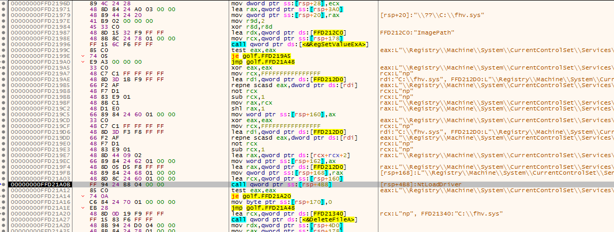
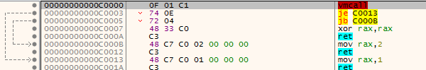
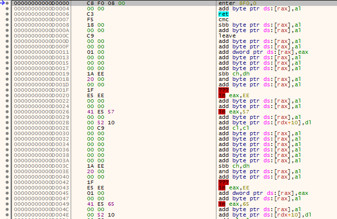
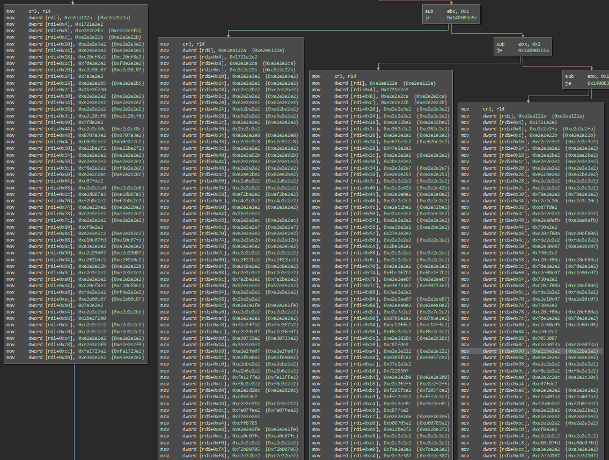
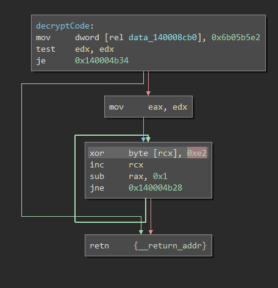
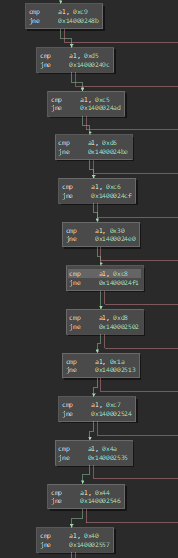
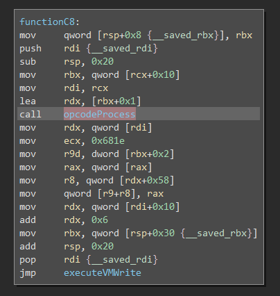
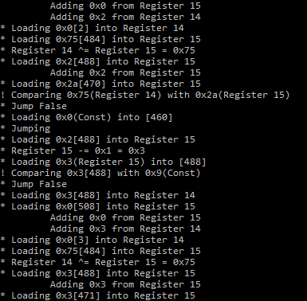
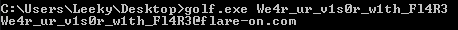

# golf

golf was another very interesting challenge which at first didn't even run for me as I tested it in VirtualBox (well it did run but crashed the VirtualBox process).
After setting up the same environment using VMware Workstation and configuring that to allow nested virtual machines it worked after fulfilling the base conditions this binary sets:

It requires to be started as an administrator, an additional 24 character parameter and the system to allow to load not signed drivers (which can be enabled with "Bcdedit.exe -set TESTSIGNING ON").
The binary then loads a driver to check the correctness of the 24 character password which if correct is then outputted as the flag.



Looking into the exact behavior of how the process interacts with the kernel driver I found multiple VMCALL instructions, which are probably the reason why it crashed in VirtualBox.



Further inspecting the execution on userland shows that it at some point gives code execution to "gibberish code" which wouldn't really make much sense to be actually executed



Now just as a warning in advance, I did the whole challenge after this point purely by statically analyzing the dropped kernel driver binary (fhv.sys):

After finding the weird userland code I asked myself where it came from as it was dynamically allocated and written, in the driver I found code that looked like 4 big write operations:



the data here doesn't look like the weird code I saw earlier but after the writes into a buffer the whole data gets xored with 0xE2



0xC8^0xE2 = 0x2A, 0xF0^0xE2 = 0x12, 0x08^0xE2 = 0xEA, 0x00^0xE2 = 0xE2  yep looks like the first line of all of those write to buffer blocks (mov dword [rdi], 0xE2EA122A)

Now looking even further into the driver I found a point where a value is compared to a lot of different possibilities



and each of them is connected to specific function



After looking into those for a while I realised that I had some sort of instruction set of a virtual machine in front of me which is processing code instead of it being directly executed on the cpu.

To solve this I first extracted and xored all of those possibly executed instructions and wrote a python script for the emulation.
Every time I hit a missing opcode I looked into the driver and implemented it to prevent having to work through everything.

The extracted virtual machine programs weren't completely trivial but with enough verbose output and a bit trial and error I figured out that each of them get a small part of the password to check and return the success of the comparison in what I called register 15.

For code snippet 3 it for example looked like this:



Based on that I figured out what the snippets do and got the password parts:

```
1. Fullify the following restrictions: c[0]+c[1]+c[2]+c[3]+c[4] == 0x16b, c[0] == 'F', c[4] == '3',  c[2]+c[3] == 0x86, c[1]+c[2] == 0xa0 (solved with a short z3 script with those constrains) ["Fl4R3"]
2. Xor inputed values with 0x52 and another index depending value and compare to hard coded values (solved xoring with the compare value instead of user input) ["w1th_"]
3. Xor all inputed characters with 0x75 and compare them to some hard coded values (same as 2.) ["ur_v1s0r_"]
4. Compare values directly with hard coded characters ["We4r_"]
```



[Link to the script and code dumps](https://github.com/Pusty/writeups/tree/master/FlareOn2018/scripts/golfSolution/)