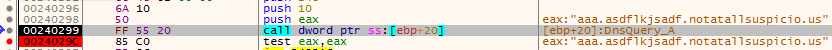
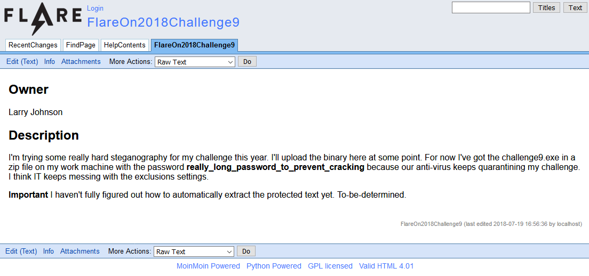
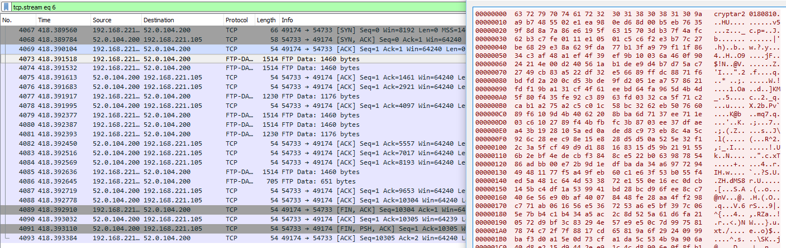
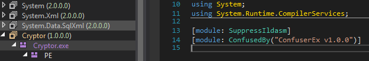
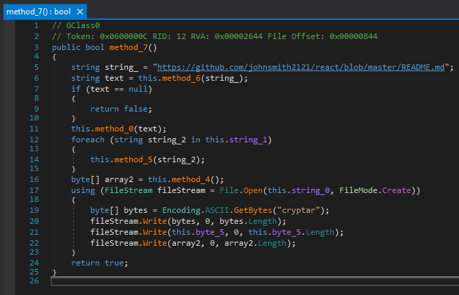
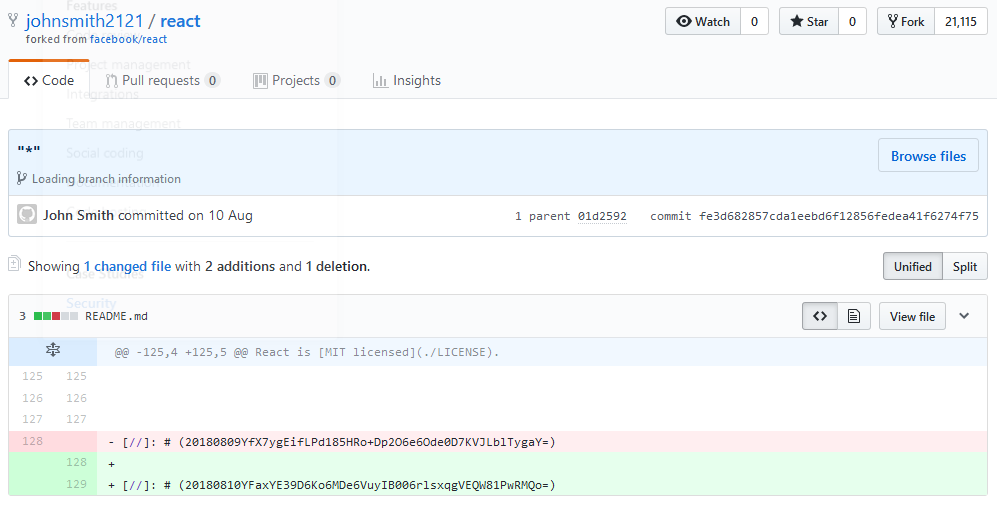
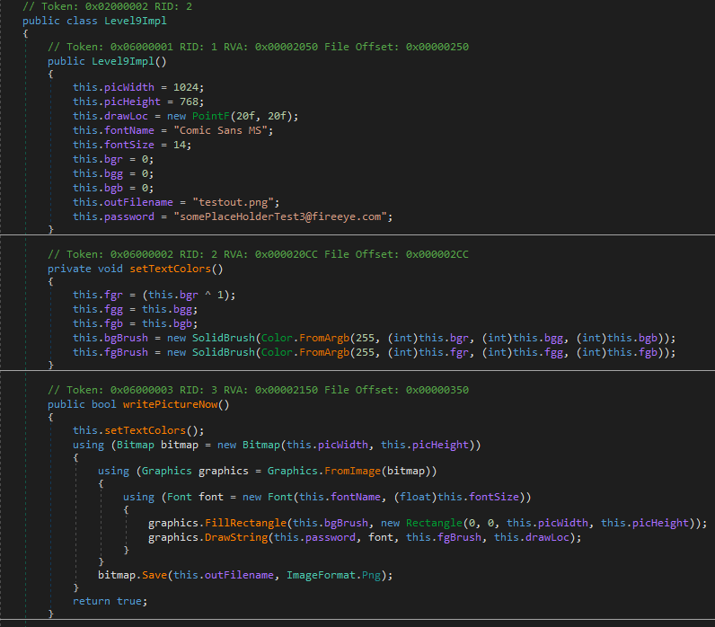

# malware_skillz


Ok now we are at the last two challenges which were actually very time consuming and hard for me which means my solutions aren't straight forward nor very detailed.
Also the resources I provided probably are not enough to fully reconstruct the process I explain here, mainly because getting them work was each around a week of work with lots of scrapped or half working steps (although I still added everything I still had into the github repository for the ones interested).

The pcap given with the binary starts out with lots of sequential DNS requests which are used within the binary to load code, so my first step was to emulate this traffic within the binary.



As it seems a executable gets transmitted over the DNS requests which then connects to the malware host at ```analytics.notatallsuspicio.us:9443```.

Next, I patched the binary that is loaded at runtime to send all traffic to localhost instead which made it possible for me to replay the interaction with the binary.


As it turns out the malware can both accept, decrypt and work with the commands and responses which made it possible (by recording the content of the buffers where the data got decrypted in) to decrypt large parts of the communication without further reverse engineering on the malware itself:

```
cd c:\
dir 

06/10/2009  02:42 PM                24 autoexec.bat
06/10/2009  02:42 PM                10 config.sys
07/13/2009  07:37 PM    <DIR>          PerfLogs
02/20/2013  05:08 PM    <DIR>          Program Files
08/01/2017  10:07 AM    <DIR>          staging
07/23/2018  12:38 PM    <DIR>          temp
05/24/2017  11:45 AM    <DIR>          Users
02/20/2013  05:18 PM    <DIR>          Windows
07/23/2018  07:45 AM    <DIR>          work

cd c:\work\
dir

07/23/2018  07:45 AM    <DIR>          .
07/23/2018  07:45 AM    <DIR>          ..
05/26/2013  08:36 AM    <DIR>          AX_Code
05/26/2013  08:37 AM    <DIR>          EX_Code
05/26/2013  08:40 AM    <DIR>          FlareOn2016
05/26/2013  08:37 AM    <DIR>          FlareOn2017
07/23/2018  07:53 AM    <DIR>          FlareOn2018
05/26/2013  08:41 AM    <DIR>          HX_Code
05/26/2013  08:41 AM    <DIR>          Malware
05/26/2013  08:40 AM    <DIR>          NX_Code
05/26/2013  08:37 AM    <DIR>          RSA_factoring
       
cd c:\work\flareon2018\
dir

07/23/2018  07:53 AM    <DIR>          .
07/23/2018  07:53 AM    <DIR>          ..
07/23/2018  07:45 AM    <DIR>          Challenge01
07/23/2018  07:45 AM    <DIR>          Challenge02
07/23/2018  07:45 AM    <DIR>          Challenge03
07/23/2018  07:46 AM    <DIR>          Challenge04
07/23/2018  07:46 AM    <DIR>          Challenge05
07/23/2018  07:46 AM    <DIR>          Challenge06
07/23/2018  07:46 AM    <DIR>          Challenge07
07/23/2018  07:46 AM    <DIR>          Challenge08
07/23/2018  10:44 AM    <DIR>          Challenge09
07/23/2018  07:46 AM    <DIR>          Challenge10
07/23/2018  07:53 AM    <DIR>          Challenge11
07/23/2018  07:53 AM    <DIR>          Challenge12
          
cd c:\work\flareon2018\Challenge09
dir

07/23/2018  10:44 AM    <DIR>          .
07/23/2018  10:44 AM    <DIR>          ..
07/23/2018  10:45 AM               119 README.md
           
type README.md

Larry is running late again. Check the wiki (http://wiki.flare.fireeye.com:8081) for latest updates.

ping wiki.flare.fireeye.com

Pinging wiki.flare.fireeye.com [192.168.200.4] with 32 bytes of data:
Reply from 192.168.200.4: bytes=32 time<1ms TTL=64
```

After pinging the server the further communication packets contains the files meant to be displayed in a browser.
The last of the transmitted pages is the most interesting as it contains the password to a file I later get my hands on:



After displaying the webpages the packet dump contains the transfer and execution of the malware to another host over SMB, but instead of connecting to the original malware host it connects to the first infected device which acts as the host for that connection.

Further looking over the connection shows the upload of a easily dumpable "level9.crypt" file over FTP from the second infected device.


Considering we are after the unencrypted version of this I reconstructed and analyzed the connection between the first and second infected device and saw that it drops a "Cryptor.exe" executable that is used to encrypt the wanted file before uploading it over FTP.

```
cd c:\
dir

06/10/2009  02:42 PM                24 autoexec.bat
06/10/2009  02:42 PM                10 config.sys
07/13/2009  07:37 PM    <DIR>          PerfLogs
07/19/2018  03:02 PM    <DIR>          Program Files
07/23/2018  09:29 PM    <DIR>          temp
05/24/2017  11:45 AM    <DIR>          Users
08/10/2018  08:21 AM    <DIR>          Windows
07/23/2018  10:26 AM    <DIR>          work
             
cd cd:\work
dir

07/23/2018  10:26 AM    <DIR>          .
07/23/2018  10:26 AM    <DIR>          ..
07/23/2018  10:26 AM    <DIR>          FlareOn2017_challenge10
08/10/2018  08:08 AM    <DIR>          FlareOn2018_Challenge9
07/23/2018  10:26 AM    <DIR>          Helix
07/23/2018  10:25 AM    <DIR>          NX_Code
07/23/2018  10:26 AM    <DIR>          X16

cd c:\work\FlareOn2018_Challenge9
dir

08/10/2018  08:08 AM    <DIR>          .
08/10/2018  08:08 AM    <DIR>          ..
07/19/2018  02:24 PM             6,656 level9.exe
08/10/2018  07:35 AM            14,502 level9.png
08/10/2018  07:40 AM            10,223 level9.zip

...
CreateFileW(c:\work\FlareOn2018_Challenge9\Cryptor.exe")
...
WriteFile("Cryptor level9.crypt level9.zip")
...
del level9.zip
```

To get that file I repeated exactly the relevant upload traffic within the malware which made it drop the Crypto executable in the "C:\work\FlareOn2018_Challenge9" folder I created for that.



A quick run through de4dot made it pretty readable:



The encryption program operates in an interesting way:
    1. It makes a GET request to "https://github.com/johnsmith2121/react/blob/master/README.md" which is a fork of React.
    2. It searches for a specific string in the file which looks something like

    3. It uses the first 8 numbers for identification and adds them after the "cryptar" to the encrypted file
    4. It uses the next 16 byte as a key and the last 16 byte as IV for the AES encryption of the files with additional information (name length, name, sha256 hash, length, content)
    
Knowing the inner workings and that the identification dates are chronologically sorted made the decryption of the zip file pretty easy.
Opening it with the password shown previously on the page reveals another executable and a completely white looking picture.



A quick look inside shows that it just draws the flag in a very similar to the background looking color, changing the color of the background reveals the flag:


