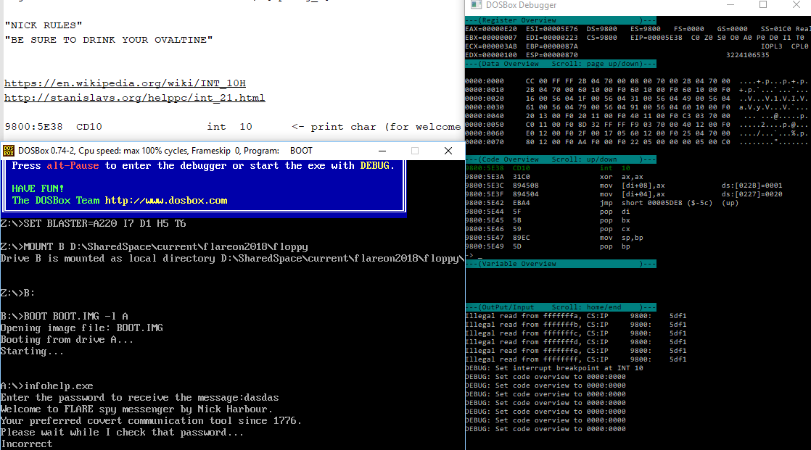
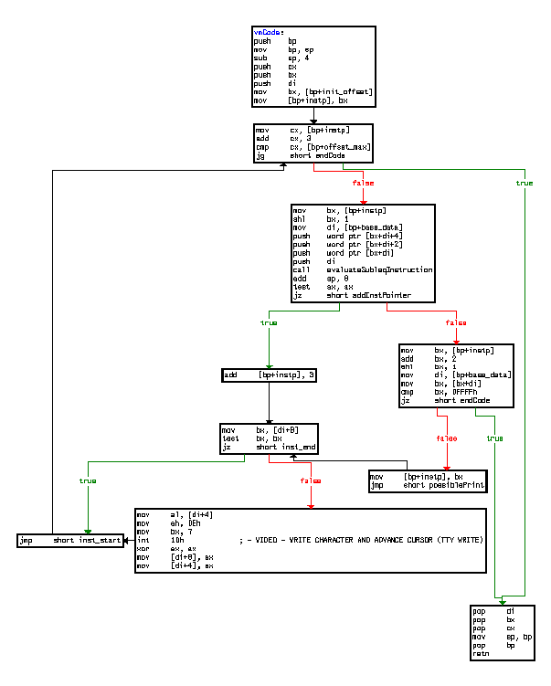
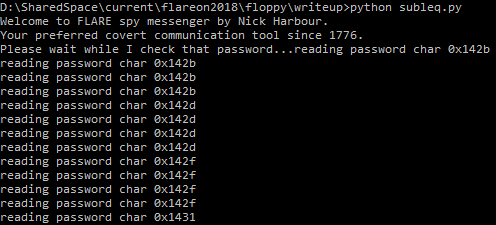
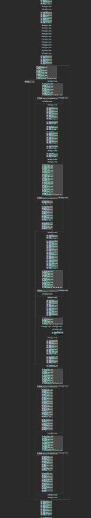
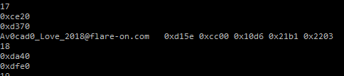

# suspicious floppy

For the last challenge we get a big .img file to work with.

After figuring out that the img file is a normal DOS image with an additional executable added to the autostart I downloaded DOS Box Debugging tools and ran the executable multiple times while searching for different things:



Searching for the origin of the characters getting printed (int 0x10) lead to me to the actual relevant code getting executed. Also noteworthy is the very slow speed the characters get written at (which isn't DOS Box fault but the actual very high number of executed instructions).

Even more inspection showed me that the executed code wasn't directly part of the executed binary, so I dumped it and inspected it more throughout:

Inside DOS Box debug window:
```
BP 9800:0220
<Running>
<Enter something into the program>
MEMDUMPBIN 9800:0000 FFFF
-> MEMDUMP.bin (I named it BEFORE_EXECUTION.bin)
```



A day of research later made clear that this is in fact a [Subleq](https://esolangs.org/wiki/Subleq) VM!

To get a first overview I wrote a Python implementation of it and tried to mark relevant reads and writes to the input



But as it turns out it's not just a normal subleq program, after a day of further static reversing it turns out that even the subleq code executes something VM like:



After many further hours reversing it I at some point started to treat the VM within the subleq VM as a blackbox and only focused on analysing input and output relations without any further understanding of the inner workings.

So to speed up execution I wrote a fitting subleq implementation in C and added lots of different methods of debug output to get the actual data written and context for it.
After that I ran it with lots of different inputs and inspected parts of the 38000 lines log multiple times over a few days until I worked through what is affected by the memory cells given by the user and found out about certain calculations done with them and subtractions/comparisons done with the results.

For example that there is a memory cell calculated through adding all user input values together and adding the length*0xC00 to it (which is then used for further calculations)

After that I found out that this base value and the character in groups of two are calculated into a temporary value ``` (base+(input[index*2+1]<<7+input[index*2])) ``` and then compared to a constant value which depending on its outcome changed the code flow, from that I concluded that all groups of two characters should match the conditions to make the outcome of the subtraction with the constant 0.

Now the last piece was to find out the difference between the calculation of groups, which was that they were xored with different numbers.
By calculating ```(base+(input[index*2+1]<<7+input[index*2]))^actualValueFromLog ``` I was able to find out that depending on the index they were xored with ``` 0x21*index ``` so the final calculation made for each pair was:
```
(base+((input[index*2+1]<<7+input[index*2])^(0x21*index)))
```

Now for to finish it up I put all those math equations into a fancy script and let [Z3](https://github.com/Z3Prover/z3) solve it all:

