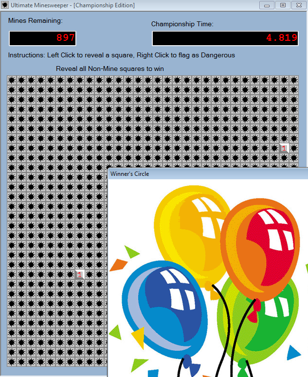

# Ultimate Minesweeper

This time it's a time limited minesweeper game that contains a lot of mines.

Using dnspy I again got a pretty good view of the decompiled code

Using dnspys feature to recompile modified code I changed the MineFieldControl_Paint function to this:

The small changes I did made all fields visible (thus revealing all mines and number fields) and marks the already clicked ones with the flag symbol

