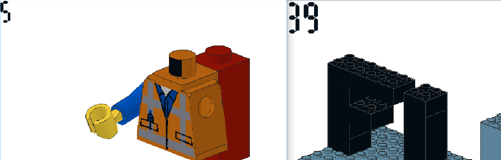

# FLEGGO

The FLEGGO challenge consists out of 48 weirdly named binaries that are very similar in functionality, all of them ask for a password and decrypt a image if the right password is entered.
After looking at it dynamically I spotted that the password of each binary is hard coded and actually within the binaries in string format (as a unicode string).

Running [this](https://github.com/Pusty/writeups/tree/master/FlareOn2018/scripts/FLEGGO.py) small script, that bascially just runs "strings" on the binaries and saves the output, made all binaries drop their content (images) and produce this mapping:

```plain
['65141174.png => w', '85934406.png => m', '67782682.png => m', '75072258.png => r', '16544936.png => e', '67322218.png => _', '58770751.png => o', '64915798.png => 3', '88763595.png => e', 
'18376743.png => _', '36870498.png => m', '72501159.png => c', '47619326.png => p', '70037217.png => m', '18309310.png => @', '15566524.png => e', '82100368.png => m', '60075496.png => s', 
'71290032.png => a', '33718379.png => .', '42255131.png => t', '16295588.png => a', '61333226.png => f', '13147895.png => w', '16785906.png => 4', '80333569.png => o', '37723511.png => n', 
'44958449.png => _', '30171375.png => s', '72263993.png => h', '82236857.png => e', '33098947.png => _', '33662866.png => r', '47893007.png => _', '61006829.png => l', '89295012.png => 0', 
'87730986.png => 0', '65626704.png => 3', '72562746.png => -', '36494753.png => 0', '79545849.png => s', '63223880.png => a', '51227743.png => a', '73903128.png => u', '52817899.png => n', 
'19343964.png => o', '12268605.png => s', '47202222.png => n']
```



As you can see each of those images contains a number, sorting the to the pictures mapped characters after the given numbers reveals the flag:

``` mor3_awes0m3_th4n_an_awes0me_p0ssum@flare-on.com ```