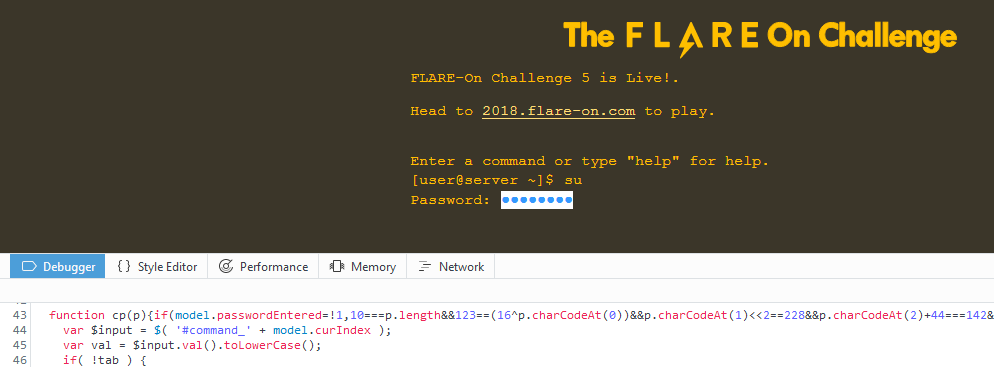
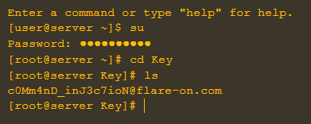

# binstall

This time it's about malware.
Running the binstall binary already shows possibly malicious behaviour as it drops a file named "browserassist.dll" and registers it to AppInit_Dlls.


This registry entry causes the dropped DLL to be loaded into every new 32bit process.
Inspecting its behaviour in a debugger (and following the "especially if they are a Firefox user" hint) reveals that the DLLs main function aborts if the started program isn't Firefox or if the Firefox version is above 54.

When running [Firefox 54 32bit](https://ftp.mozilla.org/pub/firefox/releases/54.0/win32/) with an internet connection after running binstall I noticed an interesting GET request (InternetOpenA) from the DLL to ```http://pastebin.com/raw/hvaru8NU``` and by stepping through the process in a debugger I also found that the content is at a later point decrypted


The decrypted data (available [here](https://github.com/Pusty/writeups/tree/master/FlareOn2018/scripts/binstall_decrypted.js) for anyone interested) consists out of a structure dictating javascript injections for the content of the website ``` http://flare-on.com ```.
Looking into the injections reveals that they add a "su" command and a "folder" that only root can go into



Reversing the relatively simple password checking code, entering the password ("k9btBW7k2y") and going into the secret folder ("Key") prints out the flag

