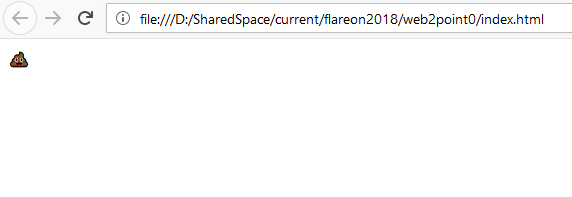

# Web 2.0

Web 2.0 consists out of a Webpage that uses WebAssembly to determine whether the given input is correct or not.

By default (or entering wrong input) it displays this:



A quick look into the JavaScript that invokes the WebAssembly shows that the input is given by the url parameter q

```JavaScript
    let b = new Uint8Array(new TextEncoder().encode(getParameterByName("q")));
```

and that based on the input the displayed emoji changes

```JavaScript
    if (instance.exports.Match(pa, a.byteLength, pb, b.byteLength) == 1) {
        // PARTY POPPER
        document.getElementById("container").innerText = "🎉";
    } else {
        // PILE OF POO
        document.getElementById("container").innerText = "💩";
    }
```

Stepping through the executed WebAssembly code quickly reveals a point of character comparison though, so not too much reversing is necessary:


Manually converting and writing down the compare characters reveals the flag:

