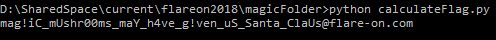

# Magic

Magic is in contrary to the previous challenges an ELF Executable for Linux.

The challenges expects you to enter 666 passwords until it finally reveals the flag, looking into the code shows that there is no bypass to this as the flag is the result of xoring all entered passwords.

Inspecting it further showed me that there are a few rather long functions in place that check whether the password is correct.
Interesting here is that those functions are always only given 1 to 3 characters of the password to check and that after each password the verification code changes itself.

My solution (that avoided reversing all validation functions) was to write a gdb python script that halts before the validation functions start, copy them into a [unicorn](https://www.unicorn-engine.org/) emulation environment and brute force the correct character combination based on the given character length.
This was pretty slow so I added rainbow tables for some of the functions used for checking 3 characters at once and while that speed it up quite a bit it still took multiple hours to brute force all 666 passwords.

After all flags were bruteforced I used a simple script to xor them together onto the base values defined in the binary to calculate the flag:

(The scripts I used are accessible [here](https://github.com/Pusty/writeups/tree/master/FlareOn2018/scripts/magicSolution/))
