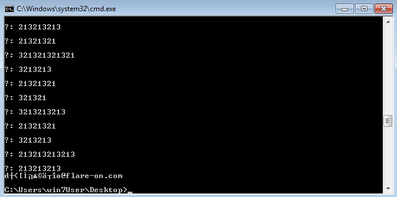
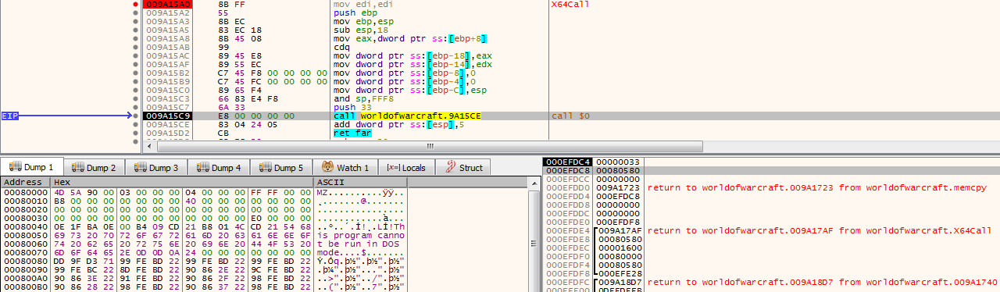
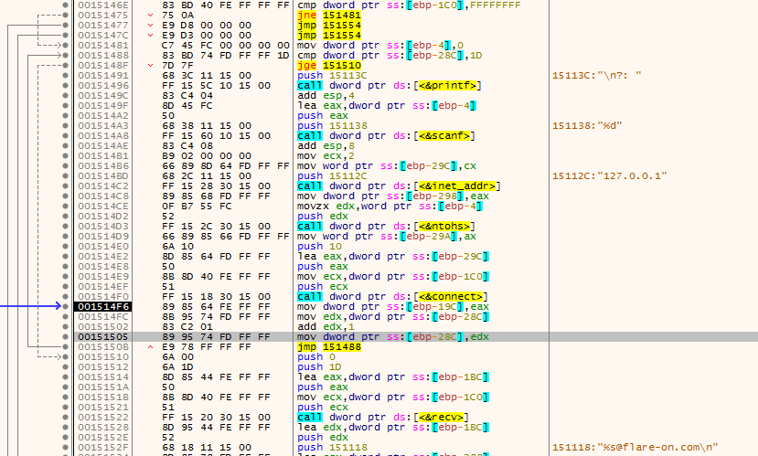
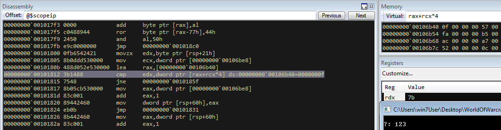
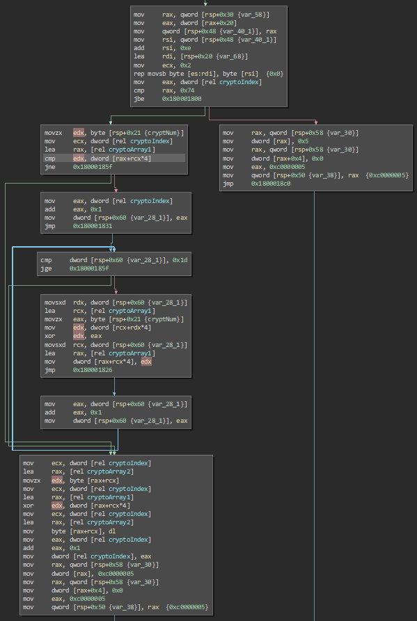
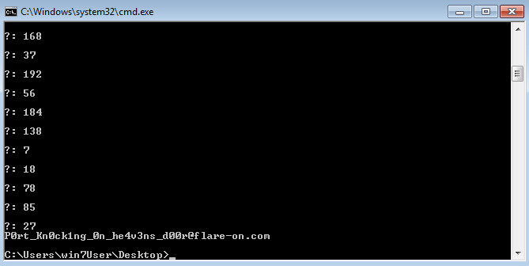

# WOW

WOW is an interesting challenge because it doesn't validate whether what we enter is correct (and that it didn't even run on my normal VM):



Setting a breakpoint at the exported function (X64Call) reveals that the executable contains a 64 bit DLL and calls into it (even though the binary itself is a 32bit one)



Continuing execution shows the code that prompts the input and that it starts trying to connect to localhost with the given number input as the port.



Inspecting this behaviour showed me that it doesn't really try to connect, but that the 64bit DLL hooked a ntdll 64bit low level handler (ZwDeviceIoControlFile) and overwrote the behaviour and output for it.
Following it leads to the following comparison:



While I could just have read the compare values from there and restart it after each read value I instead looked into how the comparison value is calculated:



Based on that I wrote a very simple python script that outputs me the correct "ports" and entered them into the binary:


```python
data = [15, 87, 97, 119, 11, 250, 181, 209, 129, 153, 172, 167,144, 88, 26, 82, 12, 160, 8, 45, 237, 213, 109, 231,224, 242, 188, 233, 242]
data2 = []
data2.append(data[0])
for cryptoIndex in range(1,len(data)):
        data2.append(data[cryptoIndex]^data[cryptoIndex-1])
print data2
```


