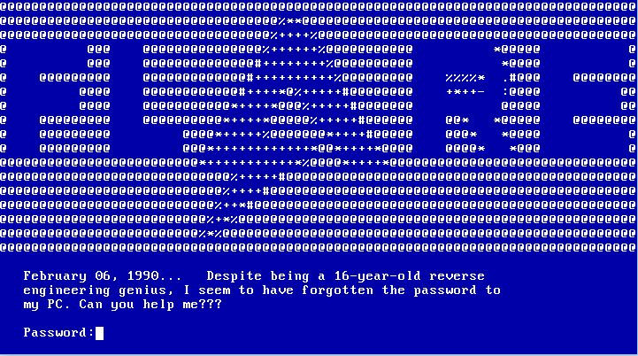
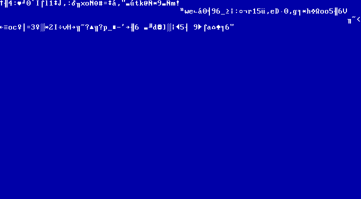
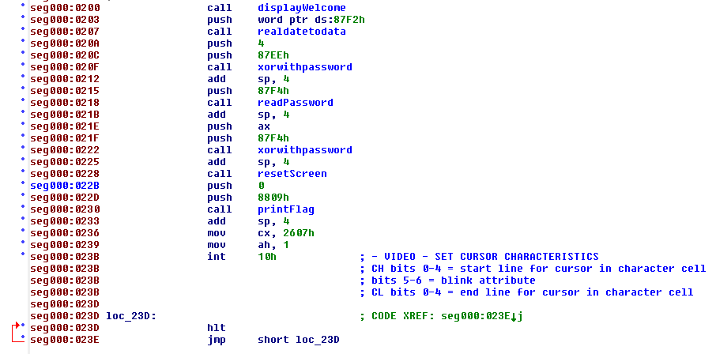
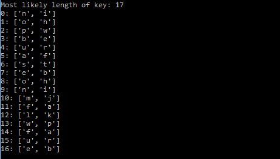
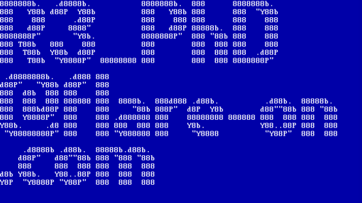

# Doogie Hacker

Doogie Hacker is a plain binary file, inspecting it in a Hexeditor reveals that it might start with a x86 boot sector because of a 0x55 at offset 510 and 0xAA at offset 511 (which is the convention to indicate such).

Booting it with qemu greets with some ascii art and a password prompt:

Again there is no password validation and entering something wrong results in gibberish being displayed:

Reversing the relative simple realmode code I saw that it repeat xors the data first with the current date (day, month, year, century) and then with the entered password and prints the output until it hits a null byte.

Although not perfect, my solution for finding the password was first xoring the data with the date given in the welcome (February 06, 1990), then calculating the key length with the smallest hamming distance from the parts to each other and then trying to search for newlines and carriage returns, which returns this:

It took a bit of fiddling around to finally get the correct password "ioperateonmalware" out of that. I then changed the result from the date getting function from within a debugger to the date from the password screen  and got the flag:

([Link to the script](https://github.com/Pusty/writeups/tree/master/FlareOn2018/scripts/doggie.py) for anyone interested)