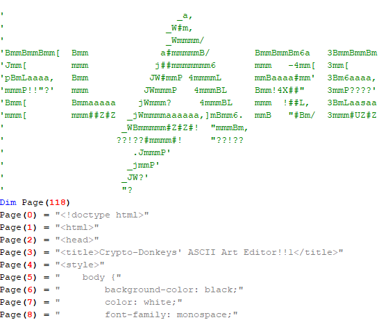
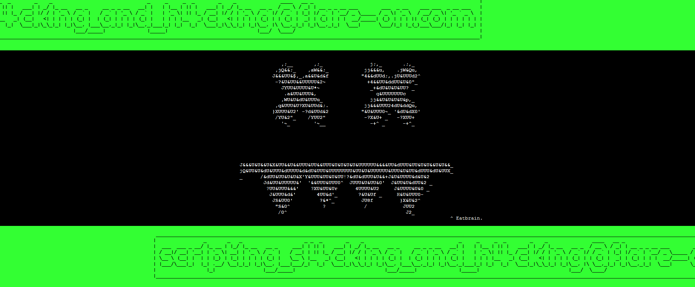

# leet editr

leet editr is a binary that opens up Internet Explorer with an interactive webpage after confirming that one actually wants to run it.


When trying to start it with some common debugging tools active it doesn't start at all for which I found the reason when looking into the event-logs:


This is easily circumvented by just renaming the tool binaries to something not on the list.
Now looking further into the code it seems that there are instructions executed that don't really make sense there and the behaviour (jumps) doesn't match what it displays:


As it turns out the program initializes an exception handlers for execution/single-stepping and reading outside of virtual memory allowed for that and initializes it's code in memory without any access right (meaning that they can't be read, written or executed).
The exception handler catches this illegal read/execute, makes the page readable and executable, changes the illegal read/executed instruction to what it actually is, enables single-step (causing another exception on the next instruction to revert everything) and returns code execution to the now correct instruction.

Using [x64dbgpy](https://github.com/x64dbg/x64dbgpy) I wrote 3 scripts that first dump the actual executed code, then dump some read memory handled a bit differently and at last load/prepare the binary in a way where the obfuscated code and data is replaced and executed in a readable and followable format.

Looking at the deobfuscated code I found this:


and a VBS script that gets executed by the binary and which controls the Internet Explorer webpage displayed



Within the VBS script the following JavaScript statements are executed under the Internet Explorer webpage context to validate whether the ASCII-Art and Title match the wanted answer before they get forwarded to the decryption of the flag:
```js
g_interval = setInterval(function(){
        if ((textin.value.indexOf('j##mmmmmmm6') != -1) && (strhash(textin.value) == 1164071950)) { 
            hint(' - But did you think of a title for your masterpiece?'); 
            textin.style.color = '#5ccfe6';
            clearInterval(g_interval); 
        } 
    }, 2500)
g_interval2 = setInterval(function(){ 
        if ((title.value.indexOf('title') != -1) && (title.value.indexOf('FLARE') != -1) && (strhash(title.value) == -1497458761)) {
            hint(' - That\'s a nice title!');
            clearInterval(g_interval2);
        }
    }, 2500)
```

With those given restrictions and the information I had I was able to figure out the correct combination after some annoying hours of trying everything out that seemed somewhat reasonable:


And got the flag:




[Link to the scripts](https://github.com/Pusty/writeups/tree/master/FlareOn2018/scripts/leet_editrSolution/)
[Link to dumped functions,data and internal script](https://github.com/Pusty/writeups/tree/master/FlareOn2018/scripts/leet_editrSolution/dumped/)