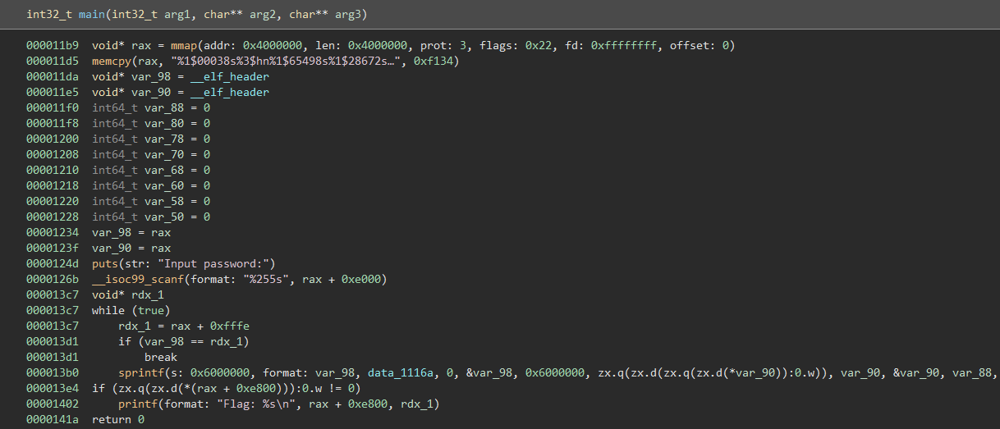
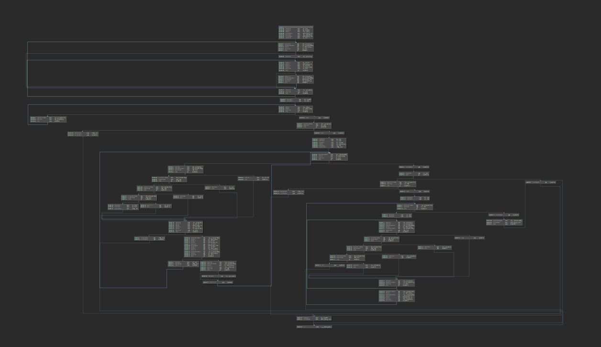
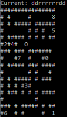

# sprint

    Sprint faster than this binary!
    
sprint is a Linux binary that hides its internal logic by using format strings as instructions.

## Solution

### Understanding what is happening

Initially, a memory map is reserved by the binary and filled with 61748 bytes of zero-terminated format strings, lots of zeroed memory, and some random-looking bytes (later used as data by the program).
After this, the binary asks for password input, executes format strings in a loop, and under the right conditions prints a flag from memory.



The first step here was trying to figure out what exactly the format strings do.

Given for example the first format string:

    %1$00038s%3$hn%1$65498s%1$28672s%9$hn
    
which consists of
    
    %1$00038s
    %3$hn
    %1$65498s
    %1$28672s
    %9$hn
    
What is happening here is that the number before the `$` qualifier overwrites the default sequential order in which format string arguments are picked from and chooses the specified one instead.
The number before the `s` specifies how many characters are printed independently of how long the specified parameter is.
And the `hn` specifier writes the amount of already printed characters into the parameter specified.

So a more readable format of this would be:
    
    $3 = (0+38) = 38
    $9 = (38+65498+28672)&0xFFFF = 28672
    
There are also format strings that contain patterns like `%1$*8$s` which in this specific case prints the 1st parameter but pads it to the amount specified in the 8th parameter.
And probably the most interesting ones are format strings like `%14$c%1$00186s%2$c%4$s%1$00429s%3$hn` which depending on whether the 14th parameter is `\x00` writes a vastly different number to the 3rd parameter.

The next interesting part is how these format strings interact with each other and how the next format string is chosen after one is executed.
This is done through the parameters given to the sprinf call:

    - 1st: ""
    - 2nd: 0
    - 3rd: the address of the format string pointer
    - 4th: 0x6000000
    - 5th: &&regA
    - 6th: &regA
    - 7th: regA
    - 8th: &regB
    - 9th: regB
    and so forth with following registers/local variables

By writing over the lower 2 bytes of the pointer to the format string (aka the 3rd argument) the next chosen format string is selected for each execution of sprintf.
The first register/local variable differs from the others as it can not only be written and read from but also acts as a modifiable pointer.

### Converting the format strings

After inspecting how this format string machine works the next step was to make the actual executed code more understandable.

A small parsing script (`spring_parse.py`) reveals the inner logic of the program to a better degree:

```
146 INSTRUCTIONS:
0000:  regB = 0x7000
0026:  regA = regB
004A:  [regA] = 0x1
006C:  regA = 0x2 + regB
0095:  [regA] = 0x1
00B7:  regC = 0x2
00DA:  regF = regC + regC
0108:  regA = 0x7000 + regF
0136:  regE = [regA]
015B:  if(regE != 0) pc = 0x324
0180:  regD = regC + regC
01AE:  regA = 0xffef
01D4:  [regA] = regD
01F9:  regA = 0xfff0
021F:  regE = [regA]
0244:  if(regE != 0) pc = 0x324
0269:  regF = regD + regD
0297:  regA = 0x7000 + regF
02C5:  [regA] = 0x1
02E7:  regD = regD + regC
0315:  pc = 0x1ae
0324:  regC = 0x1 + regC
034F:  if(regC != 0) pc = 0xda
0374:  regB = 0xe000
039A:  regC = 0x0
03BD:  regA = regB
03E1:  regD = [regA]
0406:  if(regD != 0) pc = 0x43a
042B:  pc = 0x4a1
043A:  regC = 0xffff + regC
0469:  regB = 0x1 + regB
0492:  pc = 0x3bd
04A1:  regF = 0xfe + regC
04D0:  if(regF != 0) pc = 0x504
04F5:  pc = 0x536
0504:  regI = 0x5
0527:  pc = 0x13d9
0536:  regB = 0x0
0558:  regC = 0x0
057B:  regA = 0xf100
05A1:  regD = [regA]
05C6:  regE = 0x1
05E9:  regI = 0x0
060C:  regA = 0xe000 + regB
0639:  regF = [regA]
065E:  if(regF != 0) pc = 0x692
0683:  pc = 0xd97
0692:  regB = 0x1 + regB
06BB:  regG = 0xff8b + regF
06EA:  if(regG != 0) pc = 0x745
070F:  regF = 0xfff0
0736:  pc = 0x945
0745:  regG = 0xff8e + regF
0774:  if(regG != 0) pc = 0x7cb
0799:  regF = 0x1
07BC:  pc = 0x945
07CB:  regG = 0xff9c + regF
07FA:  if(regG != 0) pc = 0x852
081F:  regF = 0x10
0843:  pc = 0x945
0852:  regG = 0xff94 + regF
0881:  if(regG != 0) pc = 0x8dc
08A6:  regF = 0xffff
08CD:  pc = 0x945
08DC:  regE = 0x0
08FF:  regF = 0x0
0922:  regI = 0x1
0945:  regD = regD + regF
0973:  regA = 0xffef
0999:  [regA] = regD
09BE:  regA = 0xfff0
09E4:  regF = [regA]
0A09:  if(regF != 0) pc = 0xd65
0A2E:  regA = 0xf000 + regD
0A5C:  regF = [regA]
0A81:  regA = 0xffef
0AA7:  [regA] = regF
0ACC:  regA = 0xfff0
0AF2:  [regA] = 0x0
0B14:  regA = 0xffef
0B3A:  regF = [regA]
0B5F:  regF = regF + regF
0B8D:  regA = 0x7000 + regF
0BBB:  regF = [regA]
0BE0:  if(regF != 0) pc = 0xd10
0C05:  regF = 0x1 + regC
0C30:  regA = 0xf102 + regF
0C5E:  regF = [regA]
0C83:  regF = regF + regD
0CB1:  if(regF != 0) pc = 0xd01
0CD6:  regC = 0x1 + regC
0D01:  pc = 0x60c
0D10:  regE = 0x0
0D33:  regI = 0x2
0D56:  pc = 0x60c
0D65:  regI = 0x4
0D88:  pc = 0xfffe
0D97:  if(regE != 0) pc = 0xdcb
0DBC:  pc = 0x13d9
0DCB:  regF = 0xfff7 + regC
0DFA:  if(regF != 0) pc = 0xe2e
0E1F:  pc = 0xe60
0E2E:  regI = 0x3
0E51:  pc = 0x13d9
0E60:  regB = 0x0
0E82:  regC = 0x0
0EA5:  regD = 0xffd9 + regB
0ED3:  if(regD != 0) pc = 0xf07
0EF8:  pc = 0x137b
0F07:  regE = 0x4
0F2A:  regD = 0x0
0F4D:  regD = regD + regD
0F7B:  regD = regD + regD
0FA9:  regA = 0xe000 + regC
0FD7:  regF = [regA]
0FFC:  regG = 0xff8b + regF
102B:  if(regG != 0) pc = 0x105f
1050:  pc = 0x1218
105F:  regG = 0xff8e + regF
108E:  if(regG != 0) pc = 0x10ed
10B3:  regD = 0x1 + regD
10DE:  pc = 0x1218
10ED:  regG = 0xff9c + regF
111C:  if(regG != 0) pc = 0x117b
1141:  regD = 0x2 + regD
116C:  pc = 0x1218
117B:  regG = 0xff94 + regF
11AA:  if(regG != 0) pc = 0x1209
11CF:  regD = 0x3 + regD
11FA:  pc = 0x1218
1209:  pc = 0x13d9
1218:  regC = 0x1 + regC
1243:  regE = 0xffff + regE
1272:  if(regE != 0) pc = 0xf4d
1297:  regA = 0xf10c + regB
12C4:  regE = [regA]
12E9:  regA = 0xe800 + regB
1316:  [regA] = regE + regD
1343:  regB = 0x1 + regB
136C:  pc = 0xea5
137B:  regA = 0xe800 + regB
13A8:  [regA] = 0x0
13CA:  pc = 0xfffe
13D9:  regA = 0xe800
13FF:  [regA] = 0x0
```

Stepping through the debugger and comparing local variable values before and after shows that this decoding is correct, but it's still quite obfuscated.
My idea here was to translate it to x86 assembly and then use already existing tools to make working with it easier (See `sprint_x86.py` for the translation script, `sprint_x86.asm` for the assembly and `sprint_x86.elf` for the binary).



```C
_WORD* D7000; // pointing at 0x7000

// init some memory

_WORD* a3 = D7000;
a3[0] = 1;
a3[1] = 1;
_WORD a2 = 2;
do {
    if ( !D7000[a2] ) {
      for ( i = 2 * a2; ; i += a2 ) {
        *0xFFEF = i;
        if ( *0xFFF0 )
          break;
        D7000[i] = 1;
      }
    }
    a2 = a2 + 1;
}while ( a2 );

// next part


// check length

char* a3 = 0xE000;
_WORD a2 = 0;
while ( 1 ) {
    if ( !*a3 ) break;
    a2 = a2 - 1;
    a3 = a3 + 1;
}
v6 = a2 + 0xFE;
if ( a2 != 0xFF02 ) goto BAD_ENDING;

// next part

DWORD a3 = 0;
a2 = 0;
_WORD* = 0xF100;
DWORD i = *v5;
bad_var = 1;

while ( 1 ) {
    char f = input[a3];
    if ( !f ) break;
    a3 = a3 + 1;
    switch ( f ) {
        case 'u':
            rel = -16;
            break;
        case 'r':
            rel = 1;
            break;
        case 'd':
            rel = 16;
            break;
        case 'l':
            rel = -1;
            break;
        default:
            bad_var = 0;
            rel = 0;
            break;
    }
    i += rel;
    *0xFFEF = i;
    if ( *0xFFF0 ) 
        return 0xFFF0;
    *0xFFEF = 0xF000[i];
    *0xFFF0 = 0;

    if (0x7000[*0xFFEF]) {
      bad_var = 0;
    } else {
      v10 = a2 + 1;
      v10 = 0xF103[a2];
      v6 = v10+i;
      if ( !v6 )
        a2 = a2 + 1;
    }
}

// last part

if ( bad_var && a2 == 9 ) {
    a3 = 0;
    a2 = 0;
    while ( 1 ) {
        v11 = a3 + 0xFFD9;
        if ( a3 == 0x27 )
            break;
        a4 = 4;
        v11 = 0;
        do {
            v11 *= 4LL;
            v12 = D7000[a2];
            if ( v12 != 'u' )
            {
                switch ( v12 ) {
                    case 'r':
                    ++v11;
                    break;
                    case 'd':
                    v11 += 2LL;
                    break;
                    case 'l':
                    v11 += 3LL;
                    break;
                    default:
                    goto BAD_ENDING;
                }
            }
            a2 = a2 + 1;
            a4 = a4 - 1;
        }while (a4);
        a3[0x7400] = a3[0x7886];
        a3[0x7400] += v11;
        a3 = a3 + 1;
    }
    v5 = 0xE827;
    a3[0x7400] = 0;
} else {
    BAD_ENDING:
    v5 = 0xE800;
    *v5 = 0;
}
return v5;
```

A barely correct and ugly C representation of the x86 version reveals some interesting behavior:

    - The program initializes memory in a loop of some sort
    - The program checks if the input is 254 bytes long
    - Only the characters u, d, r, and l are accepted
    - Relative to them a counter changes
    - Some counter values result in failure
    - Otherwise, 9 specific values need to be reached in sequence to execute the last code part
    - The last code part does no further validation and probably calculates the flag
    
    
### Solving the Labyrinth

After some more playing around with the program, we figured out that the relative movement can be modeled as a 16 by 16 2d labyrinth.
By dumping the data initialized at the start and the end of the mapped memory within the sprint binary we were also able to calculate all accepted and not-accepted positions with a script (`sprint_solve.py`) and represented them as such.
u(p), d(own), r(ight), l(eft) represent the corresponding movement input of the player, so the password is a 254 input sequence that reaches all goals in sequential order.



```python
import struct
bitvec = "01 00 01 00 00 00 00 00 01 00 00 00 01 00 00 00 01 00 01 00 01 00 00 00 01 00 00 00 01 00 01 00 01 00 00 00 01 00 00 00 01 00 01 00 01 00 00 00 01 00 01 00 01 00 01 00 01 00 00 00 01 00 00 00 01 00 01 00 01 00 01 00 01 00 00 00 01 00 01 00 01 00 00 00 01 00 00 00 01 00 01 00 01 00 00 00 01 00 01 00 01 00 01 00 01 00 00 00 01 00 01 00 01 00 01 00 01 00 00 00 01 00 00 00 01 00 01 00 01 00 01 00 01 00 00 00 01 00 01 00 01 00 00 00 01 00 00 00 01 00 01 00 01 00 01 00 01 00 00 00 01 00 01 00 01 00 00 00 01 00 01 00 01 00 01 00 01 00 00 00 01 00 01 00 01 00 01 00 01 00 01 00 01 00 00 00 01 00 01 00 01 00 00 00 01 00 00 00 01 00 01 00 01 00 00 00 01 00 00 00 01 00 01 00 01 00 00 00 01 00 01 00 01 00 01 00 01 00 01 00 01 00 01 00 01 00 01 00 01 00 01 00 01 00 00 00 01 00 01 00 01 00 00 00 01 00 01 00 01 00 01 00 01 00 00 00 01 00 00 00 01 00 01 00 01 00 01 00 01 00 01 00 01 00 01 00 01 00 00 00 01 00 00 00 01 00 01 00 01 00 01 00 01 00 00 00 01 00 01 00 01 00 01 00 01 00 00 00 01 00 01 00 01 00 00 00 01 00 01 00 01 00 01 00 01 00 00 00 01 00 01 00 01 00 01 00 01 00 00 00 01 00 00 00 01 00 01 00 01 00 01 00 01 00 01 00 01 00 01 00 01 00 00 00 01 00 00 00 01 00 01 00 01 00 00 00 01 00 00 00 01 00 01 00 01 00 01 00 01 00 01 00 01 00 01 00 01 00 01 00 01 00 00 00 01 00 01 00 01 00 01 00 01 00 01 00 01 00 01 00 01 00 01 00 01 00 00 00 01 00 01 00 01 00 00 00 01 00 00 00 01 00 01 00 01 00 00 00 01 00 01 00 01 00 01 00 01 00 00 00 01 00 00 00 01 00 01 00 01 00 01 00 01 00 01 00 01 00 01 00 01 00 00 00 01 00 01 00 01 00 01 00"
bitvec = bitvec.replace(" ", "").decode("hex")

data = "ccb0e77bbcc0ee3afc7381d07a6984e248e3d759116bf1b3860b89c5bf536565f0ef6abf0878c42c99353c6cdce0c899c83bef29970bb38bcc9dfc051b67b5ad15c108d045452643456df4efbb4906ca736bbce9509705e597d3b5472bad258baeaf41e5d814f483e6f0c0980aaca195f5b5d353f097ef9dd43b3b0be717071f6cf11e4492b25707b7368f53c9ea109062df1d07b37153611a2b78bfc1b5c63bea2b4417a084ca8fb73b382fe87384ad44eff8ad8c1fea7fcdc5b349050395a744b59169f8956ce587534e4792be80d0801dadf13de3df3561f1e70d71c5024f205ea28bc461320fa8be7e29d16d2ad955470783ea2b79954f3da311ddc11d891100ef8301af49adc10f8be19effa126143b68606bc734c40a1b6d8cc947766532745fe225723274620ab9816ec617e3c5667d00".decode("hex")


mapping  = {-1: 'l', 1: 'r', 16: 'd', -16: 'u'}
possible = [-1, 1, 16, -16]

curPos = 17 # start position


def calcPos(str):
    i = 17
    for s in str:
        if s == 'l': i = i - 1
        if s == 'r': i = i + 1
        if s == 'd': i = i + 16
        if s == 'u': i = i - 16
    return i
    
currentInput = ""

import msvcrt

while True:
    print("Current: "+currentInput)
    curPos = calcPos(currentInput)

    goals = [0x83, 0x01, 0xAF, 0x49, 0xAD, 0xC1, 0x0F, 0x8B, 0xe1] # dumped goals
    goals = [0x100 - g for g in goals]

    for y in range(16):
        layer = []
        for x in range(16):
            pos = x + y*16
            d = ord(data[pos])
            v = struct.unpack("H", bitvec[d*2:d*2+2])[0]
            if pos in goals:
                layer.append(str(goals.index(pos))) # goal location and index of it
            elif v == 0:
                if pos == curPos:
                    layer.append('O') # player
                else:
                    layer.append(' ') # empty space
            else:
                layer.append('#') # wall
        print(''.join(layer))
        
    currentInput = currentInput +msvcrt.getch() # wait for key input and add it to current sequence
```
    
Solving the maze in order using the shortest paths reveals the correct password 

```
$ ./sprint
Input password:
ddrrrrrrddrrrrrrrrddllrruullllllllddddllllllddddrrrrrrrruurrddrrddrrlluulluullddlllllllluuuurrrrrruuuuuulllllldduurrrrrrddddddllllllddddrrrrrruuddlllllluuuuuurruuddllddrrrrrruuuurrrrrruurrllddllllllddddllllllddddrrddllrruulluuuurrrrrruullrruurruuuurrrrrr
Flag: CTF{n0w_ev3n_pr1n7f_1s_7ur1ng_c0mpl3te}
```

# dotnet

A solver script for dotnet is in `dotnet.py`