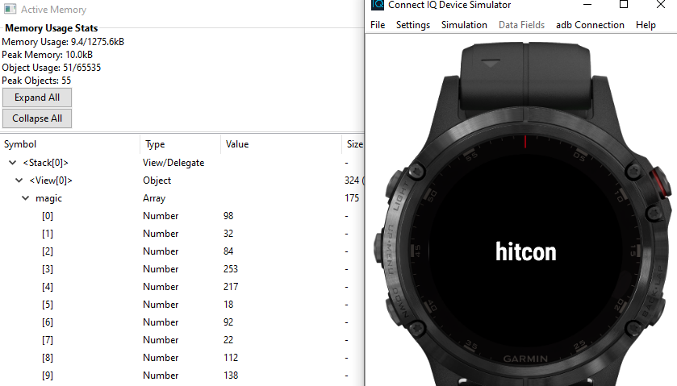
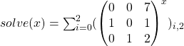

# Tenet 

    You have to start looking at the world in a new way.
    
Tenet is a service that takes up to 2000 bytes of shellcode the user supplies and executes given some constraints, then if it successfully deleted a token it is executed in reverse and checks if the token has been written back

## Solution

### The constraints from the service 

    - The shellcode can only be up to 2000 bytes long
    - The start of the shellcode is in a Read-Execute memory page at `0xDEAD0000`
    - The service puts 0x80 bytes of shellcode for preparation before so the supplied shellcode starts at `0xDEAD0080`
    - The shellcode process has a Read-Write memory page at `0x02170000`
    - The preparation shellcode unmaps the stack so we only have the RX `0xDEAD0000` and RW `0x02170000` memory page
    
### Looking at the execution loop

```C
  while ( 1 ) {
    if (ptrace(PTRACE_SINGLESTEP, pid, 0, 0))   // Step a single instruction
      err(1, "ptrace");
    waitForPID = wait(&stat_loc);               // Wait for the instruction
    if (!(stat_loc & 0x7F))
      break;
    isChildDead = (stat_loc >> 8) & 0xFF;
    if (isChildDead != 5)                       // Stop if the shellcode died
      errorMessage("Child dead unexpectedly.");
    if (stepCounter > 0xFFF)                    // Only do 0xFFF steps
      errorMessage("Too many steps.");
    if (shellcodeReached != 1 && getRIP() == 0xDEAD0080) { // Start of shellcode
      shellcodeReached = 1;
      nop();
      resetState();                             // Reset all registers
      nullMemory();                             // Zero the 0x2170000 memory page
      writeCookie();                            // Write a random 8 byte cookie to 0x2170000
    }
    if (shellcodeReached) {                     // In the actual shellcode don't execute
                                                // syscalls
      if (waitForExitSyscall())   {             // Skip all syscalls
                                                // Exit on a exit syscall
        doesExit = 1;                           // Stop the execution
        break;
      }
      currentStep = stepCounter++;
      RIPArray[currentStep] = getCurrentRIP();  // Save the instruction pointer
                                                // of each executed instruction
    }
  }
```

The execution loop does some interesting things.
For example after the preparation shellcode ends the register state is cleared, the Read-Write memory is cleared and a 8 byte cookie is written to the start of the memory.
Then the code waits for either the execution of 0x1000 steps, the death of the shellcode or an exit syscall.
Each step the current instruction pointer is sequentially saved. While waiting for the exit syscall all other syscalls get skipped over and switching code or stack segment away from 64-bit is forbidden as well.

So the following additional constrains apply:

- A maximum of 0xFFF instruction steps
- Only a 8 byte cookie in the RW page
- A cleared register state at the start
- No syscalls / sysenter
- Ends with sys_exit


### The goal

After the shellcode the following code is executed

```C
  if (!doesExit)                                // Check that shellcode exists
    errorMessage("...?");
    
  if (!memoryCleared())                         // Check if RW memory is only 0's
    errorMessage("Please swallow the cookie.");
    
  timemachine();                                // Travel back in time!
  
  if (!cookieReset())                           // Check if cookie has been written back
    errorMessage("You should vomit the cookie out.");
    
  printFlag();                                  // Print the flag on success
```

so our shellcode has to zero the 8 byte cookie and not write any other data to the memory but after `timemachine` is triggered the cookie has to reappear.

Looking into the `timemachine` we see that the register state is reset again and then the executed instructions are executed in reverse order:

```C
void timemachine() {

  int wstatus;
  int curStep;
  pid_t waitForPID; 
  int isChildDead;
  user_regs_struct regs;

  resetState(); // Reset registers
  
  for ( curStep = stepCounter - 1; curStep >= 0; --curStep ) { // Iterate backwards to travel back in time
  
    if (ptrace(PTRACE_GETREGS, pid, 0, &regs)) // Read the current register state
      err(1, "ptrace");
      
    regs.rip = RIPArray[curStep];  // Set instruction pointer to saved one
    
    if (ptrace(PTRACE_SETREGS, pid, 0, &regs)) // Write the changed register
      err(1, "ptrace");
      
    if (ptrace(PTRACE_SINGLESTEP, pid, 0, 0)) // Step a instruction
      err(1, "ptrace");
      
    waitForPID = wait(&wstatus); // Wait for it to be executed
    
    // Handle unexpected death of the shellcode
    if (!(stat_loc & 0x7F)) { 
      puts("exit too early..");
      exit(1);
    }
    isChildDead = (stat_loc >> 8) & 0xFF;
    if (isChildDead != 5)
      errorMessage("Child dead..");
      
  }
}
```

This means our shellcode has to delete the cookie when executed and rewrite the cookie back to memory when executed in reverse order while somehow preserving the cookie somewhere to access after register resets.


### AVX!

Looking into detail how the registers are reset:

```C
void resetState() {

  user_regs_struct userRegs; 
  user_fpregs_struct userFloatRegs;

  memset(&userRegs, 0, sizeof(userRegs)); // zero the register state
  userRegs.rip = 0xDEAD0080;              // set the instruction pointer to 0xDEAD0080
  userRegs.cs = 0x33;                     // sets the code segment to 0x33 -> 64bit code segment
  userRegs.ss = 0x2B;                     // sets the stack segment to 0x2B -> 64bit data segment
  
  if (ptrace(PTRACE_SETREGS, pid, 0, &userRegs)) // reset the user registers
    err(1, "ptrace");
    
  memset(&userFloatRegs, 0, sizeof(userFloatRegs)); // zero the floating point register state
  
  if (ptrace(PTRACE_SETFPREGS, pid, 0, &userFloatRegs)) // reset the floating point registers
    err(1, "ptrace");
    
}
```

the `user_fpregs_struct` structure is especially interesting:

```C
struct user_fpregs_struct
{
  __uint16_t                cwd;
  __uint16_t                swd;
  __uint16_t                ftw;
  __uint16_t                fop;
  __uint64_t                rip;
  __uint64_t                rdp;
  __uint32_t                mxcsr;
  __uint32_t                mxcr_mask;
  __uint32_t                st_space[32];   /* 8*16 bytes for each FP-reg = 128 bytes */
  __uint32_t                xmm_space[64];  /* 16*16 bytes for each XMM-reg = 256 bytes */
  __uint32_t                padding[24];
};
```

Noticeable here is that `xmm_space` doesn't account for `YMM` registers, and while the lower 16-bytes of them are mapped to the same named `XMM` registers the upper 16-bytes are not.

### Shellcode


By using the upper 16-bytes of the `YMM` registers we keep the cookie even through the state reset before it's executed in reverse:


```asm
mov rax, 0x02170000       ; set rax to the cookie
mov rdi, qword [rax]      ; read the cookie
mov [rax], rdi        
mov [rax+16], rdi         ; write the cookie to rax+16 (making it appear in the upper bits of the ymm register)
mov rdi, [rax+16] 
vmovups ymm0,yword [rax]  ; read the yword at rax
vmovups yword  [rax],ymm0
xor rdi, rdi              ; set rdi to 0
mov qword [rax], rdi      ; clear the cookie
mov qword [rax+16], rdi   ; clear the copy of the cookie
mov rax, 0x02170000     

mov eax, 0x3C             ; sys_exit / end of shellcode
syscall
```

In Reverse:

```asm
mov eax, 0x3C

mov rax, 0x02170000       ; set rax to the cookie            
mov qword [rax+16], rdi   ; zero already zeroed memory
mov qword [rax], rdi
xor rdi, rdi
vmovups yword  [rax],ymm0 ; write ymm0 back (xmm0 was reset as such only the upper half is preserved)
vmovups ymm0,yword [rax] 
mov rdi, [rax+16]         ; read the upper copy of the cookie
mov [rax+16], rdi         
mov [rax], rdi            ; write the cookie back to the original position
mov rdi, qword [rax]  
mov rax, 0x02170000 
```


    $ python solve.py 
    [+] Opening connection to 52.192.42.215 on port 9427: Done
    Size of shellcode? (MAX: 2000)

    Reading 49 bytes..

    [+] Receiving all data: Done (123B)
    [*] Closed connection to 52.192.42.215 port 9427
    Shellcode receieved. Launching Time Machine..
    Perfect.
    hitcon{whats happened happened, this is the mechanism of the world}


    
# 11011001

    0100111001101111001000000110100001101001011011100111010000100000011010000110010101110010011001010010110000100000011101110110100001100001011101000010000001100001011100100110010100100000011110010110111101110101001000000110010101111000011100000110010101100011011101000110100101101110011001110010000001100110011011110111001000111111
    
11011001 is a 64-bit binary written in C++ that takes in 20 32-bit integer and either prints "Zzz.." or the flag if the input matches a list of criteria

## Solution


This challenge was pretty easy, the binary contained all the constrains for the 20 input numbers after each other.
The control flow was a unusual but besides that reimplementing them in python and solving for them with z3 directly worked:

```python
from z3 import *
import math

s = Solver()

inputBuffer = [BitVec("inp_"+str(i), 32) for i in range(20)]

# Start of Constrains

compareData = [0x81002, 0x1000, 0x29065, 0x29061,
               0, 0, 0x16C40, 0x16C00,
               0x20905, 0x805, 0x10220, 0x220,
               0x98868, 0x80860, 0x21102, 0x21000,
               0x491, 0x481, 0x31140, 0x1000,
               0x801, 0x0, 0x60405, 0x400,
               0x0C860, 0x60, 0x508, 0x400, 
               0x40900, 0x800, 0x12213, 0x10003,
               0x428C0, 0x840, 0x840C, 0x0C,
               0x43500, 0x2000, 0x8105A,0x1000]
               
for index in range(20):
    s.add((compareData[2 * index] & inputBuffer[index]) == compareData[2 * index + 1])
    
    
for index in range(20):
    for shift in range(18):
        s.add(((inputBuffer[index] >> shift) & 7) != 7)
        s.add(((inputBuffer[index] >> shift) & 7) != 0)


for shiftIndex in range(20):
    orValue = 0
    for index in range(20):
        shiftedValue = inputBuffer[index] >> shiftIndex;
        orValue = ((shiftedValue & 1) << index) | orValue;
        
    for shift in range(18):
        s.add(((orValue >> shift) & 7) != 7)
        s.add(((orValue >> shift) & 7) != 0)
        
        
def popcount(bvec): # Hamming Weight
    return Sum([ ZeroExt(int(math.ceil(math.log(bvec.size(), 2.0))), Extract(i,i,bvec)) for i in range(bvec.size())])
  
for index in range(20):
    s.add(popcount(inputBuffer[index]) == 10)
    
for shiftIndex in range(20):
    orValue = 0
    for index in range(20):
        shiftedValue = inputBuffer[index] >> shiftIndex;
        orValue = ((shiftedValue & 1) << index) | orValue;
      
    s.add(popcount(orValue) == 10)
    
s.add(Distinct(inputBuffer))


for untilValue in range(19):
    for innerValue in range(untilValue):
        orValue = 0
        for index in range(20):
            shiftedValue = inputBuffer[index] >> untilValue;
            orValue = ((shiftedValue & 1) << index) | orValue;
        orValue2 = 0
        for index in range(20):
            shiftedValue2 = inputBuffer[index] >> innerValue;
            orValue2 = ((shiftedValue2 & 1) << index) | orValue2;
        
        s.add(orValue != orValue2)
        
# Enf of Constraints
        
print(s.check())
m = s.model()

print(m)

for i in range(20):
    print(str(m[inputBuffer[i]]))
```

    ./11011001-878450f7a8f95309ce756975ce912376d829c1d7caeed7f80da72ee3bc67e5ca 
    350617
    693097
    828630
    224554
    629333
    304811
    682342
    742996
    370089
    318099
    676716
    634010
    340837
    412886
    699033
    349483
    183638
    864940
    731731
    447908
    Congratulations!
    Here's your gift: hitcon{fd05b10812d764abd7d853dfd24dbe6769a701eecae079e7d26570effc03e08d}
    
# Run Run Run!

    just run it and get the flag
    
Run Run Run! is a Garmin Connect IQ executable written in Monkey C. Goal is to run it, but the code execution will be not feasibly slow so reimplementation needed to solve it.

## Solution

### Step 1 - What even is a Connect IQ executable / PRG File

To this the [garmin developer documentation](https://developer.garmin.com/connect-iq/connect-iq-basics/getting-started/) mentions it's the output of the Monkey C compiler:

    monkeyc calls the Monkey C compiler. The compiler can take code from multiple files and link them together into a single Connect IQ executable (a PRG file).
    
Ok, and what is Money C?

Connect IQ apps are created in Monkey C, an object-oriented language designed for easy app development. [[...]](https://developer.garmin.com/connect-iq/connect-iq-basics/)

Like Java, Monkey C compiles into byte code that is interpreted by a virtual machine. [[...]](https://developer.garmin.com/connect-iq/monkey-c/)

So a PRG file is somewhat like what a JAR file is for Java classes. Actually it seems to be more like mushed together classes but we'll go with this.

### Step 2 - What tools are available for this format

There is for one the official [SDK](https://developer.garmin.com/connect-iq/sdk/) which most interestingly contains a compiler and simulator.
There also is an unofficial project called [ciqdb](https://github.com/pzl/ciqdb) for parsing PRG files and even though a lot of functionality seems to be missing it's still helpful.

### Step 3 - Try out all the tools

Starting with the simulator, running the application shows characters of the flag appearing.
At first it's pretty fast but it slows down and after 7 characters nothing appears anymore and it seems frozen.
The most interesting feature I noticed in the simulator is the memory viewer:



Interesting a `magic` array. Also notable was an array called `target` which contained a few powers of three.


Ok next ciqdb, which outputs tons of information regarding entry points, data, fields, code, classes, line of code tables, symbols, resources, exceptions and the signature.

A bit of browsing and the interesting `timerCallback`, `solve` and `drawFlag` names turn up.

```
    extends Offset: 400000d7
    static Entry: 0
    parent module: globals
    module ID: Unknown Symbol ID: 0
    app types: 7f
    fields:
        magic: 0  Null
        target: 0  Null
        idx: 4294967295  Int
        myTimer: 0  Null
        timerCallback: 268435913  Method
        solve: 268435953  Method
        drawFlag: 268436065  Method
        idx: 268436654 hidden  Method
        Unknown Symbol ID: 94: 268435554  Method
        Unknown Symbol ID: 174: 32  Int
        globals/Rez: 268435611  Method
        globals/Rez/Menus: 268435636  Method
        Unknown Symbol ID: 123: 850  String
        Unknown Symbol ID: 255: 1073742039 hidden  ClassDefinition
```

The Line Number Table says these all belong to the `hitconView.mc` file, interesting.

```
    C:\Users\lyc\eclipse-workspace\hitcon\source\hitconView.mc:41 timerCallback (pc 268435913)
    C:\Users\lyc\eclipse-workspace\hitcon\source\hitconView.mc:42 timerCallback (pc 268435917)
    C:\Users\lyc\eclipse-workspace\hitcon\source\hitconView.mc:43 timerCallback (pc 268435936)
    C:\Users\lyc\eclipse-workspace\hitcon\source\hitconView.mc:46 solve (pc 268435953)
    C:\Users\lyc\eclipse-workspace\hitcon\source\hitconView.mc:47 solve (pc 268435957)
    C:\Users\lyc\eclipse-workspace\hitcon\source\hitconView.mc:48 solve (pc 268435964)
    C:\Users\lyc\eclipse-workspace\hitcon\source\hitconView.mc:50 solve (pc 268435985)
    C:\Users\lyc\eclipse-workspace\hitcon\source\hitconView.mc:51 solve (pc 268436008)
    C:\Users\lyc\eclipse-workspace\hitcon\source\hitconView.mc:52 solve (pc 268436018)
    C:\Users\lyc\eclipse-workspace\hitcon\source\hitconView.mc:53 solve (pc 268436046)
    C:\Users\lyc\eclipse-workspace\hitcon\source\hitconView.mc:54 solve (pc 268436050)
    C:\Users\lyc\eclipse-workspace\hitcon\source\hitconView.mc:55 solve (pc 268436054)
    C:\Users\lyc\eclipse-workspace\hitcon\source\hitconView.mc:57 solve (pc 268436061)
    C:\Users\lyc\eclipse-workspace\hitcon\source\hitconView.mc:60 drawFlag (pc 268436065)
    C:\Users\lyc\eclipse-workspace\hitcon\source\hitconView.mc:61 drawFlag (pc 268436069)
    C:\Users\lyc\eclipse-workspace\hitcon\source\hitconView.mc:62 drawFlag (pc 268436105)
    C:\Users\lyc\eclipse-workspace\hitcon\source\hitconView.mc:63 drawFlag (pc 268436117)
    C:\Users\lyc\eclipse-workspace\hitcon\source\hitconView.mc:64 drawFlag (pc 268436153)
    C:\Users\lyc\eclipse-workspace\hitcon\source\hitconView.mc:65 drawFlag (pc 268436172)
    C:\Users\lyc\eclipse-workspace\hitcon\source\hitconView.mc:66 drawFlag (pc 268436191)
```

### Step 4 - Looking at the code

Wait, ciqdb shows `c0debabe - Code (2243 bytes)` but no disassembly or anything of the sort?
The official debugger doesn't seem to be able to show bytecode either (or even load binaries without additional debug information).
[And there is no documentation of the bytecode either..](https://forums.garmin.com/developer/connect-iq/f/discussion/7675/is-there-some-reference-of-the-connect-iq-vm-instruction-set)

This would be pretty bad.... if the compiler the sdk provides wasn't within a potential interesting JAR file.
Through lots of dedication this lead to `runrunrun/disassemble.py` which also incorporates the knowledge from the Line Number Table.

```
timerCallback:
   0x100001c9: ARGC 01
   0x100001cb: INCSP 00
   0x100001cd: LGETV 00
   0x100001cf: SPUSH 00000018
   0x100001d4: DUP 01
   0x100001d6: DUP 01
   0x100001d8: GETV 
   0x100001d9: IPUSH 00000001
   0x100001de: ADD 
   0x100001df: PUTV 
   0x100001e0: SPUSH 00800011
   0x100001e5: GETM 
   0x100001e6: SPUSH 008001a2
   0x100001eb: GETV 
   0x100001ec: FRPUSH 
   0x100001ed: INVOKE 01
   0x100001ef: POPV 
   0x100001f0: RETURN 
```

The parameters are naively just append as hex-bytes, but this seems to work for all relevant instructions.
For anyone familiar with Java or Dalvik Bytecode this probably already looks very understandable.

What we have here is a stack machine with relative simple instructions.


Annotated this function would be:


```
timerCallback:
   0x100001c9: ARGC 01        ; This function has 1 argument (I assume the *this* context)
   0x100001cb: INCSP 00       ; Reserve 0 local variables
   0x100001cd: LGETV 00       ; Get the *this* context  
   0x100001cf: SPUSH 00000018 ; Push the symbol 24 "idx"
   0x100001d4: DUP 01         ; Duplicate stack value 
   0x100001d6: DUP 01         ; Duplicate stack value
   0x100001d8: GETV           ; Read the symbols value 
   0x100001d9: IPUSH 00000001 ; Push the integer 1 
   0x100001de: ADD            ; Add top two elements 
   0x100001df: PUTV           ; Write value to symbol, so idx = idx + 1; 
   0x100001e0: SPUSH 00800011 ; Push the symbol 8388625 "Toybox_WatchUi"
   0x100001e5: GETM           ; Read the symbols value
   0x100001e6: SPUSH 008001a2 ; Push the symbol 8389026 "requestUpdate" 
   0x100001eb: GETV           ; Read the symbols value
   0x100001ec: FRPUSH         ; Push the method?
   0x100001ed: INVOKE 01      ; Invoke function
   0x100001ef: POPV           ; Pop return value
   0x100001f0: RETURN         ; return from the function
```

Some of this annotation is still lacking but it's good enough to understand the functionality.
Now to the actual interesting methods:

```
onUpdate:
   0x100000b4: ARGC 02         ; This function has 2 arguments, *this* and *dc*, The device context (https://developer.garmin.com/connect-iq/api-docs/Toybox/WatchUi/View.html)
   0x100000b6: INCSP 01        ; Reserve one local variable
   0x100000b8: LGETV 00 
   0x100000ba: SPUSH 008002ff  ; Push the symbol 8389375 "WatchFace"
   0x100000bf: GETV
   0x100000c0: SPUSH 00800204  ; Push the symbol 8389124 "onUpdate"
   0x100000c5: GETV
   0x100000c6: FRPUSH 
   0x100000c7: LGETV 01
   0x100000c9: INVOKE 02
   0x100000cb: POPV 
   0x100000cc: LGETV 00
   0x100000ce: SPUSH 00000019 ; Push the symbol 25 "myTimer"
   0x100000d3: GETV
   0x100000d4: SPUSH 0080005b ; Push the symbol 8388699 "stop"
   0x100000d9: GETV         
   0x100000da: FRPUSH 
   0x100000db: INVOKE 01
   0x100000dd: POPV 
   0x100000de: LGETV 00
   0x100000e0: SPUSH 00000018 ; Push the symbol 24 "idx"
   0x100000e5: GETV   
   0x100000e6: IPUSH 00000000
   0x100000eb: GTE 
   0x100000ec: DUP 00
   0x100000ee: BF 0012
   0x100000f1: LGETV 00
   0x100000f3: SPUSH 00000018 ; Push the symbol 24 "idx"
   0x100000f8: GETV 
   0x100000f9: LGETV 00
   0x100000fb: SPUSH 008000ae ; Pushg the symbol 8388782 "size"
   0x10000100: GETV 
   0x10000101: LT 
   0x10000102: AND 
   0x10000103: BF 004e
   0x10000106: LGETV 00       ; Get the *this* context
   0x10000108: SPUSH 0000001b ; Push the symbol 27 "solve"
   0x1000010d: GETV           ; Get the "solve" method value
   0x1000010e: FRPUSH         ; Push the method?
   0x1000010f: INVOKE 01      ; Invoke the "solve" method
   0x10000111: IPUSH 00000100 ; Push 0x100
   0x10000116: MOD            ; Push solve(this) % 0x100
   0x10000117: LPUTV 02       ; local2 = solve(this) % 0x100
   0x10000119: LGETV 02       ; Push local2
   0x1000011b: LGETV 00       ; Get the *this* context
   0x1000011d: SPUSH 00000016 ; Push the symbol 22 "magic"
   0x10000122: GETV           ; Get the "magic" array value
   0x10000123: LGETV 00       ; Get the *this* context
   0x10000125: SPUSH 00000018 ; Push the symbol 24 "idx"
   0x1000012a: GETV           ; Get the "idx" integer value
   0x1000012b: AGETV          ; Push this.magic[this.idx]
   0x1000012c: XOR            ; Push this.magic[this.idx] ^ solve(this) % 0x100
   0x1000012d: LPUTV 02       ; local2 = this.magic[this.idx] ^ solve(this) % 0x100
   0x1000012f: LGETV 00       ; Get the *this* context
   0x10000131: SPUSH 0080027b ; Push the symbol 8389243 "flag"
   0x10000136: DUP 01         ; Duplicate stack value 
   0x10000138: DUP 01         ; Duplicate stack value 
   0x1000013a: GETV           ; Read "flag" value
   0x1000013b: LGETV 02       ; Push local2
   0x1000013d: SPUSH 008004c6 ; Push the symbol 8389830 "toChar"
   0x10000142: GETV           ; Get the "toChar" value
   0x10000143: FRPUSH         ; Push the method?
   0x10000144: INVOKE 01      ; Invoke toChar(local2)
   0x10000146: SPUSH 008000af ; Push symbol 8388783 "toString"
   0x1000014b: GETV           ; Get the "toString" value
   0x1000014c: FRPUSH         ; Push the method?
   0x1000014d: INVOKE 01      ; Invoke toString(toChar(local2))
   0x1000014f: ADD            ; Push flag+toString(toChar(local2))
   0x10000150: PUTV           ; flag = flag+toString(toChar(local2))
   0x10000151: GOTO 0000
   0x10000154: LGETV 00
   0x10000156: SPUSH 0000001c ; Push the symbol 28 "drawFlag"
   0x1000015b: GETV 
   0x1000015c: FRPUSH 
   0x1000015d: LGETV 01
   0x1000015f: LGETV 00
   0x10000161: SPUSH 0080027b ; Push the symbol 8389243 "flag"
   0x10000166: GETV 
   0x10000167: INVOKE 03
   0x10000169: POPV 
   0x1000016a: LGETV 00
   0x1000016c: SPUSH 00000018 ; Push the symbol 24 "idx"
   0x10000171: GETV 
   0x10000172: IPUSH 00000001
   0x10000177: ADD 
   0x10000178: LGETV 00
   0x1000017a: SPUSH 008000ae ; Pushg the symbol 8388782 "size"
   0x1000017f: GETV 
   0x10000180: LT 
   0x10000181: BF 0044
   0x10000184: LGETV 00
   0x10000186: SPUSH 00000019 ; Push the symbol 25 "myTimer"
   0x1000018b: GETV 
   0x1000018c: SPUSH 0080005a ; Push the symbol 8388698 "start"
   0x10000191: GETV 
   0x10000192: FRPUSH 
   0x10000193: LGETV 00
   0x10000195: SPUSH 008000b2 ; Push the symbol 8388786 "method"
   0x1000019a: GETV 
   0x1000019b: FRPUSH 
   0x1000019c: SPUSH 0000001a ; Push the symbol 26 "timerCallback"
   0x100001a1: INVOKE 02
   0x100001a3: LGETV 00
   0x100001a5: SPUSH 00000017 ; Push the symbol 23 "target"
   0x100001aa: GETV 
   0x100001ab: LGETV 00
   0x100001ad: SPUSH 00000018 ; Push the symbol 24 "idx"
   0x100001b2: GETV 
   0x100001b3: IPUSH 00000001
   0x100001b8: ADD 
   0x100001b9: AGETV 
   0x100001ba: IPUSH 00000064
   0x100001bf: MUL 
   0x100001c0: BPUSH 00
   0x100001c2: INVOKE 04
   0x100001c4: POPV 
   0x100001c5: GOTO 0000
   0x100001c8: RETURN 
```

Now for the `solve` function:

```
solve:
   0x100001f1: ARGC 01        ; This function has 1 argument (I assume the *this* context)
   0x100001f3: INCSP 05       ; There are 5 local variables
   0x100001f5: IPUSH 00000000
   0x100001fa: LPUTV 01       ; lvar1 = 0
   0x100001fc: IPUSH 00000001
   0x10000201: LPUTV 02       ; lvar2 = 1
   0x10000203: IPUSH 00000001
   0x10000208: LPUTV 03       ; lvar3 = 1
   0x1000020a: IPUSH 00000001
   0x1000020f: LPUTV 04       ; lvar4 = 1
   0x10000211: LGETV 01       ; Push lvar1
   0x10000213: LGETV 00       ; Get the *this* context
   0x10000215: SPUSH 00000017 ; Push the symbol 23 "target"
   0x1000021a: GETV           ; Get the target value
   0x1000021b: LGETV 00       ; Get the *this* context
   0x1000021d: SPUSH 00000018 ; Push the symbol 24 "idx"
   0x10000222: GETV           ; Get the idx value
   0x10000223: AGETV          ; Push this.target[this.idx]
   0x10000224: LT             ; Compared lvar1 < this.target[this.idx]
   0x10000225: BF 0035        ; If false goto 0x1000025d
   0x10000228: LGETV 01       
   0x1000022a: IPUSH 00000001 
   0x1000022f: ADD           
   0x10000230: LPUTV 01       ; lvar1 = lvar + 1
   0x10000232: IPUSH 00000002
   0x10000237: LGETV 02
   0x10000239: MUL            ; push lvar2 * 2
   0x1000023a: LGETV 03
   0x1000023c: ADD            ; push lvar2 * 2 + lvar3
   0x1000023d: IPUSH 00000007 
   0x10000242: LGETV 04
   0x10000244: MUL            ; push lvar4 * 7
   0x10000245: ADD            ; push lvar2 * 2 + lvar3 + lvar4 * 7
   0x10000246: IPUSH 00007a69
   0x1000024b: MOD            ; push (lvar2 * 2 + lvar3 + lvar4 * 7) % 31337
   0x1000024c: LPUTV 05       ; lvar5 = (lvar2 * 2 + lvar3 + lvar4 * 7) % 31337
   0x1000024e: LGETV 03  
   0x10000250: LPUTV 04       ; lvar4 = lvar3
   0x10000252: LGETV 02
   0x10000254: LPUTV 03       ; lvar3 = lvar2
   0x10000256: LGETV 05
   0x10000258: LPUTV 02       ; lvar2 = lvar5
   0x1000025a: GOTO ffb4      ; Goto 0x10000211
   0x1000025d: LGETV 02
   0x1000025f: RETURN         ; Return lvar2
   0x10000260: RETURN 
```


### Step 5 - Reimplementation

The relevant part of the `onUpdate` can be easily translated to 

```python
flag = ""
for i in range(len(magic)):
    flag += chr((solve(i)%0x100) ^ magic[i])
```

For the reimplementation of `solve` it's important to recall that in memory we saw that the `target` array contains the powers of 3 in sequential order:

```python
def solve(idx):
    lvar2 = 1
    lvar3 = 1
    lvar4 = 1
    for lvar1 in range(0, (3**idx)):
        lvar5 = ((lvar3 + (lvar2 * 2)) + (lvar4 * 7))% 31337
        lvar4 = lvar3 
        lvar3 = lvar2
        lvar2 = lvar5
    return lvar2
```

    hitcon{You_hAv3_
    
We are getting there! But why is this taking so long... turns out `3**idx` can get quite large, for the last character this would mean `617673396283947` iterations... yeah that isn't happening.


### Step 6 - Smart Math Trickery

I wasn't smart enough for the optimizing but my teammate esrever from polygl0ts was quick to find the answer:

It turns out

    s(-2) = 1, s(-1) = 1, s(0) = 1, s(x) = 2*s(x-1) + s(x-2) + 7*s(x-3)
    
can be turned into 



With

    s(x) =  solve(x)[0][2] + solve(x)[1][2] + solve(x)[2][2]

(Assuming that input x > 0)

Computing the solve values this way is very fast (especially within modulo 31337), making it finally possible to solve this challenge:

```python
magic = [98, 32, 84, 253, 217, 18, 92, 22, 112, 138, 147, 46, 168, 229, 31, 149, 72, 94, 191, 124, 21, 176, 10, 104, 154, 213, 235, 25, 237, 61, 18, 15]

solveArray = [10, 73, 3360, 20638, 28598, 17532, 5671, 17999, 7711, 3071, 22732, 26694, 20457, 1939, 10540, 11722, 24188, 4718, 9952, 24078, 9312, 22526, 30293, 13358, 29098, 19623, 27022, 27759, 9438, 21839, 21043, 6258, 29448]
    
flag = ""
for i in range(len(magic)):
    flag += chr((solveArray[i]%0x100) ^ magic[i])
print(flag)
```

    hitcon{You_hAv3_40_ruN_F0rev3r!}

