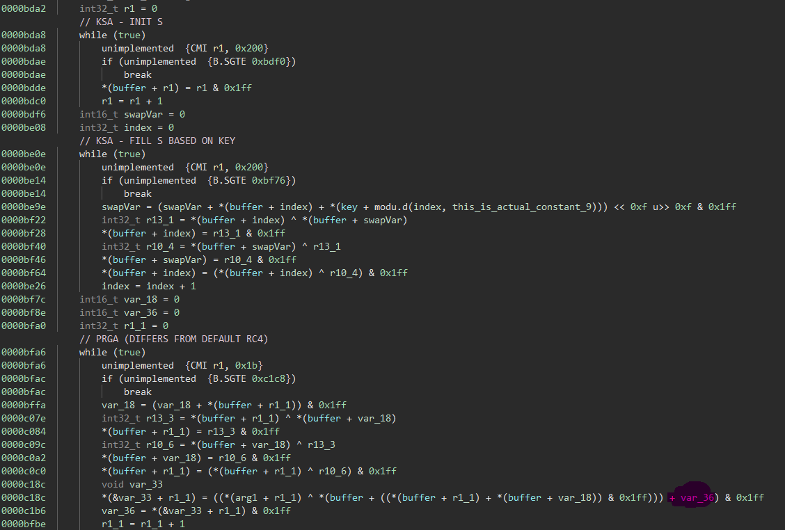

# mercy

    Description:
    The mercy of DEF CON 25.

mercy provides a binary blob which itself doesn't expose any information.
With the hint of it being related to DEF CON 25 the assumption was that it is a [cLEMENCy](https://blog.legitbs.net/2017/10/clemency-showing-mercy.html) binary.

## Solution

A first step is to figure out what architecture this binary blob is.
Starting with the assumption that it is indeed cLEMENCy, I started looking at [the official documentation and tooling](https://blog.legitbs.net/2017/07/the-clemency-architecture.html).
Trying to run the blob in the emulator with a `flag` file full of 0's worked and the disassembly in the debugger seemed reasonable.

With the help of [Trail of Bits tooling](https://blog.trailofbits.com/2017/07/30/an-extra-bit-of-analysis-for-clemency/) the binary blob can be loaded into Binary Ninja.
Their [original code](https://github.com/trailofbits/binjascripts/tree/master/clemency) didn't work for me for current Binary Ninja version, so I ported it to python3, fixed some problems that occurred and later added a few lifting features for the challenge.

The first step is to convert the binary blob, in which each word is 9 bits in size to a more handy format of 16 bits per word.
Trail of Bits tooling has the [transform.py](TrailofBits_clemency/transform.py) script for that.

Running strings on the unpacked blob with the 16 bits per word size in mind, returns a lot of libc strings:
```
> strings -e b mercy16.bin
Invalid error number
Operation not permitted
No such file or directory
No such process
Interrupted system call
I/O error
No such device or address
Argument list too lon
...
October
November
December
%b %a %d %k:%M:%S %Z %Y
%m/%d/%y
%Y/%m/%d
%I:%M:%S %p
%H:%M
%H:%M:%S
%b %a %d
%k:%M:%S
ice job: %s
```

Browsing through the code makes the disassembly look correct as well:


Identifying the main function can be done by browsing the code and searching for the most interesting strings (while keeping in mind that the addresses in the unpacked binary blob are all twice of what they are in the original one).


The actual verification logic is luckily not too complex. Because the Binary Ninja plugin already had lifting features implemented, I added some missing parts to it, which makes understanding the logic much easier than staring at the weird disassembly:



Having seen similar code already, it wasn't difficult to identify it as being similar to RC4.

The key-scheduling algorithm of it is exactly like one would expect in a RC4 implementation:

```python
MOD = 0x200

def ksa(key):
    S = [i for i in range(MOD)]
    j = 0
    for i in range(MOD):
        j = (j + S[i] + key[i % len(key)]) % MOD
        S[j], S[i] = S[i], S[j] 
    return S
```

The only interesting part is that MOD is 0x200 instead of the usual 0x100. This is because we are working with 9bit words and not 8bit words/bytes.

The actual encryption part of it isn't exactly like rc4 though, after the xoring the previous encrypted word value is added to the current one.
Because of this the cipher is not directly symmetric anymore either.

```python
def rc4modified_encrypt(S, inp):
    out = []
    v18 = 0
    v36 = 0
    for i in range(len(inp)):
        v18 = (v18 + S[i]) % MOD
        S[v18], S[j] = S[i], S[v18] 
        K = S[(S[i] + S[v18]) % MOD]     # so far normal rc4
        v36 = ((inp[i] ^ K) + v36) % MOD # + v36 addition :(
        out.append(v36)
    return out
```

The decryption of it is rather trivial though, by subtracting the previous `v36` value from the ciphertext before xoring it.

```python
def rc4modified_decrypt(S, inp):
    out = []
    v18 = 0
    v36 = 0
    for i in range(len(inp)):
        v18 = (v18 + S[i]) % MOD
        S[v18], S[i] = S[i], S[v18] 
        K = S[(S[i] + S[v18]) % MOD]
        out.append((((inp[i]-v36)% MOD) ^ K)) # remove v36 then decode like normal rc4
        v36 = inp[i]                          # next v36 key is last encrypted char
    return out
```

Ok, so far so good. Now we just need to figure out what this algorithm compares against and get the encoding right.

The key is hardcoded at address 0x6b33 in the actual memory or 0xD666 from the unpacked binary: `2B 01 62 00 BC 00 9C 00 3B 00 34 00 11 01 89 00 44 01`.

Packing the 16-bit per word to 9-bit per word again is rather simple:

```python
# decode 16bit unpacked numbers to 9 bit numbers
def h16to9(inpHex):
    data = bytes.fromhex(inpHex)
    out = []
    for i in range(len(data)//2):
        out.append(data[i*2] + (data[i*2+1] << 8))
    return out
```

A bit more annoying was decoding the hardcoded constants the program verifies against:


The encrypted input gets compared against the middle-endian encoded 27-bit numbers.

```python
constMap = {
    0x7fffff7: 0xc7a45e,
    0x7ffffe2: 0x441d6a8,
    0x7fffff1: 0x624e22d,
    0x7ffffee: 0x6f30d11,
    0x7ffffeb: 0x40ff43f,
    0x7ffffdf: 0x4062ee8,
    0x7fffff4: 0x183716f,
    0x7ffffe5: 0x69edf0e,
    0x7ffffe8: 0x7885b66
}

# decode the check values to 9 bit - words
data = c27to9(constMap)
```

After extracting them directly, they still need to be sorted and decoded into individual 9-bit words:

```python
# decode 27bit hex number with middle endianess to 3 9 bit numbers
def c27to9(m):
    # sort them based on the stack offset
    keys = []
    for k in m:
        keys.append(k) 
    keys.sort()
    out = []
    # middle endianess!
    for i in range(len(keys)):
        num = m[keys[i]]
        c = num&0x1ff
        num = num >> 9
        a = num&0x1ff
        num = num >> 9
        b = num&0x1ff
        out.append(a)
        out.append(b)
        out.append(c)
    return out
```

The official debugger was very helpful in figuring out some initial misunderstandings and encoding problems!


Combining everything together into [a single script](solve.py) yields the flag:

```
>python solve.py
Key in 9-bit words:  ['0x12b', '0x62', '0xbc', '0x9c', '0x3b', '0x34', '0x111', '0x89', '0x144']
Constants in 9-bit words:  0x1b ['0x117', '0x101', '0xe8', '0xeb', '0x110', '0xa8', '0x16f', '0x1a7', '0x10e', '0x2d', '0x1e2', '0x166', '0x1fa', '0x103', '0x3f', '0x186', '0x1bc', '0x111', '0x71', '0x189', '0x2d', '0x1b8', '0x60', '0x16f', '0x1d2', '0x31', '0x5e']
Decrypted Data in 27-bit words:  ['0x1a4d074', '0x1bcc66e', '0xd8f664', '0x1986065', '0xe46e66', '0xc46437', '0xc47237', '0x1906a64', '0x1f4c20a']
Decrypted Data in 9-bit words:  ['0x68', '0x69', '0x74', '0x63', '0x6f', '0x6e', '0x7b', '0x36', '0x64', '0x30', '0x66', '0x65', '0x37', '0x39', '0x66', '0x32', '0x31', '0x37', '0x39', '0x31', '0x37', '0x35', '0x64', '0x64', '0x61', '0x7d', '0xa']
Decrypted Data as a String:   hitcon{6d0fe79f2179175dda}
```