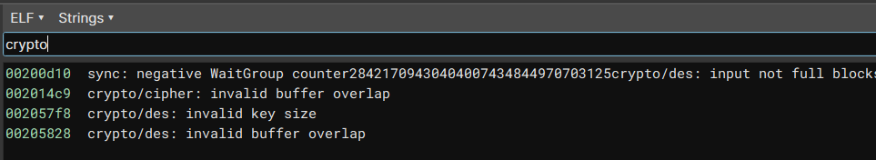
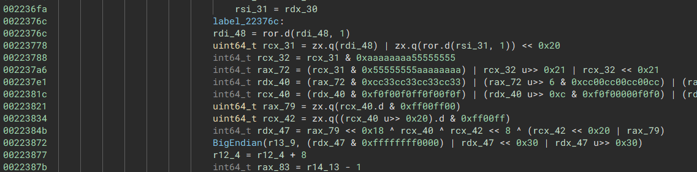
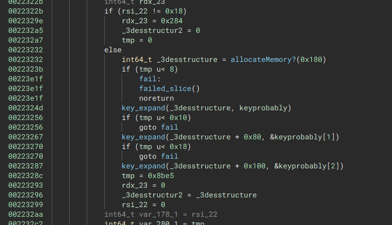
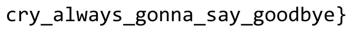

# gocrygo

    Description:
    If your file system is encrypted clap your hands.
    If your file system is encrypted clap your hands.
    If your file system is encrypted and you really want to decrypt it.
    Then find the encryption key with your bare hands.

gocrygo provides a stripped go binary, a core dump and directories with encrypted data. The Notes also state that a standard encryption algorithm was used and that we shouldn't waste too much time with the details of it and instead search for the keys in the core dump after knowing which it is.


## Solution

So the first step was figuring out which crypto algorithm was used:



Following the [go crypto/des](https://cs.opensource.google/go/go/+/refs/tags/go1.19.3:src/crypto/des/cipher.go) source code this means it is either DES or Triple DES.

For further hints we decrypted the "base64" looking strings (just decoding them with base64 resulted in nonsense) by making the program decode them for us:

```
0x2074D7 - linux
0x20750B - Please run this binary on Linux
0x2074e3 - gocrygo_victim_directory
0x20753F - Hey! I don't want to break your file system. Please create a directory './gocrygo_victim_directory' and place all the files you want to encrypt in it.
0x200720 - .gocrygo
0x20763b - Cannot access directory 'gocrygo_victim_directory': permission denied
0x2076e7 - Oops, your file system has been encrypted.
0x20772F - Sadly, 'gocrygo' currently does not provide any decryption services.
0x2077a3 - You're doomed. Good luck ~
0x200f38 - .qq
0x2076af - Failed to encrypt %v: lucky you~~
```



Based on the constants we also figured out where the actual encryption is happening.



Within the function we also found out which part matches with the go code for the subkey generation for Triple DES.

We then ran some tests by encrypting our own data and setting a breakpoint at the key generation.
As assumed given the task the keys are randomly generated, more interesting the output file is 8 bytes longer than the input we gave.

Just directly decrypting our encrypted test files with the keys in ECB mode didn't work at all, after that we tried around with all the modes and saw that OFB mode decrypted the first block correctly: 

```python
iv = ciphertext[0:8]
flag = ciphertext[8:]

cipher = DES3.new(key, DES3.MODE_OFB, iv=iv)
f = cipher.decrypt(flag)
print(f)
```

This means that for the first basic block everything is correct, but the feedback mechanism is different.
OFB encrypts the IV with our key and xors it with the plaintext block, then uses the encrypted output as the input for the next encryption block.
Playing around with modes that behave the same for the first block we found out that CTR mode decrypts the file correct, just that we initially ignored it because pycrypto didn't allow for a 8 byte IV or Nonce for a 8 byte blocksize cipher.
CyberChef didn't have that restriction and just decrypted it for us, so after a bit of fiddling around it also works in python:

```python
cipher = DES3.new(key, DES3.MODE_CTR, nonce=iv[0:1], initial_value =iv[1:8])
f = cipher.decrypt(flag)
```


Now to get the keys from the core dump we can just iterate over the coredump file.
We can see from the coredump and code that the key will be properly aligned, and that after a certain memory address only very little relevant data pops up, but besides that no optimizations are necessary to search for the flag from the output of the encrypted flag file.

```python
from Crypto.Cipher import DES3

flagFile = open("./gocrygo_victim_directory/Desktop/flаg.txt.qq", "rb")
flagContent = flagFile.read()
flagFile.close()

iv = flagContent[0:8]
flag = flagContent[8:]

coreDump = open("core", "rb")
data = coreDump.read(0x100000)
coreDump.close()

for keyCandidateIndex in range(0, len(data), 8):
    key = data[keyCandidateIndex:keyCandidateIndex+24]
    try:
        cipher = DES3.new(key, DES3.MODE_CTR, nonce=iv[0:1], initial_value =iv[1:8])
        res = cipher.decrypt(flag)
        if b"hitcon" in res.lower():
            print(key.hex())
            print(res)
            break
    except ValueError as e:
        pass
print("Done.")
```

```
$ python getkeys.py
b389ae528f9a34bd9835599b9766851b82b42580b720a318
b'Cyrillic letters are fun right?\nFirst part: `HITCON{always_gonna_make_you_`\nHint: The second part is at `Pictures/rickroll.jpg`\n _    _.--.____.--._\n( )=.-":;:;:;;\':;:;:;"-._\n \\\\\\:;:;:;:;:;;:;::;:;:;:\\\n  \\\\\\:;:;:;:;:;;:;:;:;:;:;\\\n   \\\\\\:;::;:;:;:;:;::;:;:;:\\\n    \\\\\\:;:;:;:;:;;:;::;:;:;:\\\n     \\\\\\:;::;:;:;:;:;::;:;:;:\\\n      \\\\\\;;:;:_:--:_:_:--:_;:;\\\n       \\\\\\_.-"             "-._\\\n        \\\\\n         \\\\\n          \\\\\n           \\\\\n            \\\\\n             \\\\\n'
Done.
```

Decrypting the image gives the second part of the flag:



So `hitcon{always_gonna_make_you_cry_always_gonna_say_goodbye}`