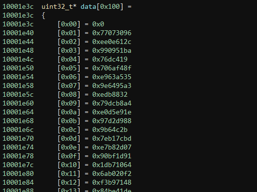
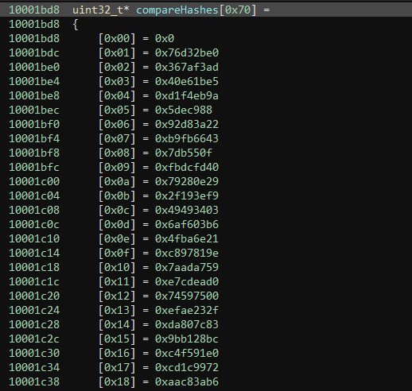
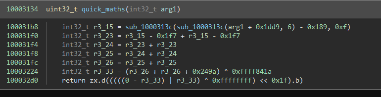
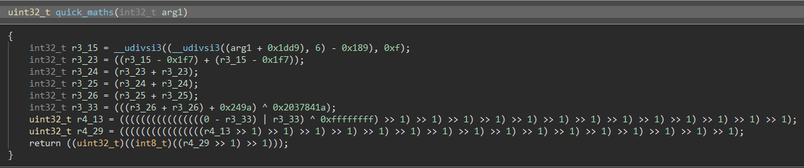

# Small Hashes Anyways

    Micro hashes for micro blaze ¯\_(ツ)_/¯
    
The challenge provides a  "microblaze-linux.tar" which contains all the tools and libraries required to run linux usermode microblaze programs.
This is used for this and all following microblaze challenges.
The main challenge is a 14KB microblaze binary named small_hashes_anyways.

## Solution

Running the binary with some input shows that it complains that the input is suppost to be 112 characters long:

```
$ QEMU_LD_PREFIX=~/microblaze-linux LD_LIBRARY_PATH=~/microblaze-linux/lib qemu-microblaze ./small_hashes_anyways
small hashes anyways:
potato
wrong length wanted 112 got 6
```

When running it with the right length input the program complains about the first index mismatch.

```
$ QEMU_LD_PREFIX=~/microblaze-linux LD_LIBRARY_PATH=~/microblaze-linux/lib qemu-microblaze ./small_hashes_anyways
small hashes anyways:
AAAAAAAAAAAAAAAAAAAAAAAAAAAAAAAAAAAAAAAAAAAAAAAAAAAAAAAAAAAAAAAAAAAAAAAAAAAAAAAAAAAAAAAAAAAAAAAAAAAAAAAAAAAAAAAA
mismatch 1 wanted 1993550816 got 3554254475
```

From this the solution is easy as we can bruteforce character per character using qemu:

```python
import subprocess, os
import string

customenv = os.environ.copy()

# microblaze-linux in user home folder
customenv["QEMU_LD_PREFIX"] = os.path.expanduser("~")+"/microblaze-linux/"
customenv["LD_LIBRARY_PATH"] = os.path.expanduser("~")+"/microblaze-linux/lib/"

# binary tells us that it wants 112 bytes input
inp = [0x20]*112

for curIndex in range(112):
    # bruteforce for all ascii characters that one would expect in the flag
    for c in string.ascii_letters + string.digits + string.punctuation:
        inp[curIndex] = ord(c)
        # run in qemu
        proc = subprocess.Popen(["qemu-microblaze", "./small_hashes_anyways"], env=customenv, stdin=subprocess.PIPE, stdout=subprocess.PIPE)
        
        # give it the hash
        proc.stdin.write(bytes(inp)+b"\n")
        proc.stdin.close()
        while proc.returncode is None:
            proc.poll()
            
        # small hashes anyways:
        # mismatch 1 wanted 1993550816 got 3916222277
        stin = proc.stdout.read().decode("utf-8")
        res = stin.split("\n")[1].split(" ")
        
        # if it's a digit then the hash was wrong, otherwise the input was correct
        if res[1].isdigit():
            wrongIndex = int(res[1])-1
        else:
            print(stin)
            break
        
        # found correct character
        if wrongIndex != curIndex:
            break

    print(bytes(inp[:(curIndex+1)]).decode("utf-8"))
```

Alternatively we might notice that the binary complained about the wrong hash of `A...` being `3554254475 = 0xd3d99e8b` which is equal to `zlib.crc32(b'A')`

A quick look into the binary confirms that it is hashing using crc32:



Looking for the hash table it is compared against



With this it is possible to calculate the flag way faster

```python
import zlib
import string

data = [
	0x76d32be0, 0x367af3ad, 0x40e61be5, 0xd1f4eb9a,
	0x05dec988, 0x92d83a22, 0xb9fb6643, 0x07db550f,
	0xfbdcfd40, 0x79280e29, 0x2f193ef9, 0x49493403,
	0x6af603b6, 0x4fba6e21, 0xc897819e, 0x7aada759,
	0xe7cdead0, 0x74597500, 0xefae232f, 0xda807c83,
	0x9bb128bc, 0xc4f591e0, 0xcd1c9972, 0xaac83ab6,
	0x1812e53d, 0xf27578db, 0xe528a105, 0xf5e58686,
	0x87f22c24, 0x51569866, 0x77590c7e, 0x09ce7f57,
	0x79da1cab, 0x8f132e93, 0x02edea54, 0x71bc0213,
	0x827622b3, 0xdfedf391, 0x9cd9812a, 0xb0432bd3,
	0xe56a9756, 0xf43eb5b6, 0x3f4e5218, 0xe6537823,
	0x595a041f, 0x5e88c97a, 0x3c520668, 0x135fa020,
	0x59af08c7, 0x18e1820f, 0xfcae038e, 0x05f39360,
	0x3c097d32, 0xa254127f, 0x2119cad7, 0xed96f09a,
	0x93eb031d, 0xee92e05f, 0x763db900, 0xd3afa332,
	0x1bdd60a8, 0x92c6398b, 0xba4d9a4c, 0xfdd7de90,
	0x11f3b6f2, 0xc47fd37e, 0xdaabad73, 0xe9b664e8,
	0x39e56fd6, 0xeb38b920, 0xe6870ec8, 0xe38ae66c,
	0xc0568c3b, 0x657fe53a, 0xefbf05bf, 0x683d668d,
	0xd9b10dca, 0xa8b10428, 0x767b9ae4, 0x31179f05,
	0x4ae1d8ae, 0xc424c110, 0xc71ce605, 0xf5c7b2c1,
	0x41fed7a2, 0xc3421a06, 0xf4189d3b, 0xf29972a3,
	0xe5284d0f, 0x3a5f13f3, 0xa852ea36, 0x5e79c194,
	0x7a3b4919, 0xe7cd7c3e, 0xe1e63f14, 0x27eccde5,
	0xa84f59e8, 0xea726210, 0x99ec49a8, 0xc39a0898,
	0xca7632f2, 0x19a92a33, 0xd4adf3b8, 0x41dfbde3,
	0x38967709, 0x0f370533, 0x29d994ed, 0xb340c9ca,
	0xfe6831cf, 0x69f7c0bf, 0x95d9d732, 0x34f46a5b
]

# binary tells us that it wants 112 bytes input
inp = [0x20]*112

for curIndex in range(112):
    # bruteforce for all ascii characters that one would expect in the flag
    for c in string.ascii_letters + string.digits + string.punctuation:
        inp[curIndex] = ord(c)
        # character matches
        if (zlib.crc32(bytes(inp[:(curIndex+1)]))&0xffffffff)==data[curIndex]:
            break
    print(bytes(inp[:(curIndex+1)]).decode("utf-8"))
```


# Ominous Etude

    we didn't start the fire

    you'll want microblaze-linux.tar.bz2 from "small hashes anyways"
    
Ominous Etude is a 11.6MB microblaze binary that asks for a number and outputs a positive or negative response.

# Solution

Running it shows that the program wants a number from us.

```
$ QEMU_LD_PREFIX=~/microblaze-linux LD_LIBRARY_PATH=~/microblaze-linux/lib qemu-microblaze ./ominous_etude
enter decimal number: 123
hmm… not happy :(
```

Compared to the first challenge we now actually need to look into the binary.
For this I used [a binary ninja microblaze plugin](https://github.com/amtal/microblaze) which even contains lifting features!
The problem is that at least for `Ominous Etude` the plugin had two bugs that prevented it from being immediate useful (state of 21th May 2022).

Analyzing the program a bit (even with just the disassembly) shows that it converts the input string to a number and runs it through a function called `quick_math(uint32_t)`.

Using the plugin the following wrong lifted code / decompilation is shown:



After matching this with the disassembly, the call destination, the xor immediate and the shift direction are wrong.


Fixing the shift direction was easy `microblaze/microblaze.py:489`:
replacing
```
                val = il.shift_left(4, a, one, flags='carry')
```

with

```
                val = il.logical_shift_right(4, a, one, flags='carry')
```

The reason why the xor immedaite and call destination are wrong is for the same reason.
Instead of just using the 16-bit immediate these instructions usually have in the microblaze architecture, an `imm` instruction is prepended.
Without the `imm` prefix the 16-bit immediates are sign extended to 32-bit, with the `imm` prefix the the immediate encoded in the `imm` instruction provides the upper 16-bit.

Here the bug was in `microblaze/arch.py:149` that the sign extended 16-bit immediate was logical or'ed with the upper 16-bit, but as they were sign extended those upper 16-bit would always be 0xffff which is wrong:

```
                    i=(x.b.i << 16) | (y.b.i),
```
with
```
                    i=(x.b.i << 16) | ((y.b.i)&0xFFFF),
```

Now the decompilation looks very good:



With this we can build a Z3 model to solve for the right input (careful with unsigned division and logical right shift here):

```python
from z3 import *
import ctypes

# manual translation of the decompilation
def quick_maths(arg1):
    r3_15 = UDiv(UDiv((arg1 + 0x1dd9), 6) - 0x189, 0xf)
    r3_23 = r3_15 - 0x1f7 + r3_15 - 0x1f7
    r3_24 = r3_23 + r3_23
    r3_25 = r3_24 + r3_24
    r3_26 = r3_25 + r3_25
    r3_33 = (r3_26 + r3_26 + 0x249a) ^ 0x2037841a
    return LShR(((0 - r3_33) | r3_33) ^ 0xffffffff, 0x1f)&0xFF
    
arg1 = BitVec("arg1", 32)

s = Solver()

# solve for the bit to be set
s.add(quick_maths(arg1)&1 == 1)

# check if the model is sat
print(s.check())

# convert the number to a 32bit signed integer
vl = s.model()[arg1].as_long()&0xffffffff
print(ctypes.c_long(vl).value)
```

Testing this locally works, and we get the flag if we send it to the remote server:

```
$ QEMU_LD_PREFIX=~/microblaze-linux LD_LIBRARY_PATH=~/microblaze-linux/lib qemu-microblaze ./ominous_etude
enter decimal number: 1520195799
cool :)
```

# Blazin' Etudes

    it was always burning since the world's been turning

    you'll need the microblaze-linux.tar.bz2 file from "Small Hashes Anyways"

Blazin' Etudes provides 178 (!!) different microblaze binaries that all differ in their `quick_maths` implementation.

# Solution

All the Blazin' Etudes are like the Ominous Etude binary, but instead dynamically linked. The only difference is that they all have different `quick_maths` implementations (and thus different numbers needed to solve them).

To solve this we need automation!

Thankfully [mdec](https://github.com/mborgerson/mdec) has code for automatically getting the decompilation using Binary Ninja.
In mdec it is meant to be executed headless for which a professional license is required, but instead we can also just run this in the Binary Ninja GUI Python Interpreter with `exec(open(r"blazing_etudes_decompile.py").read())`.

```
files = # list of all Blazin' Etudes binary file names

blazing_etudes_folder = # folder path to the binaries
blazing_etudes_decompilation_folder = # folder path where the decompilation will be saved to

def getDecompilation(file):
    v = open_view(blazing_etudes_folder+file)
    ds = DisassemblySettings()
    ds.set_option(DisassemblyOption.ShowAddress, False)
    ds.set_option(DisassemblyOption.WaitForIL, True)
    lv = LinearViewObject.language_representation(v, ds)
    out = []
    for f in v.functions:
        # only give decompilation for the quick_maths functions
        if not "quick_maths" in f.name: continue
        c = LinearViewCursor(lv)
        c.seek_to_address(f.highest_address)
        last = v.get_next_linear_disassembly_lines(c.duplicate())
        first = v.get_previous_linear_disassembly_lines(c)
        for line in (first + last): out.append(str(line))
    
    return '\n'.join(out)

# decompile and save
for file in files:
    dec = getDecompilation(file)
    f = open(blazing_etudes_decompilation_folder+file, "w")
    f.write(dec)
    f.close()
```


When trying to run it I ran into another bug in the microblaze plugin, which was just a typo and quickly fixed (`microblaze/reloc.py:208`)

```
                reloc.pcRelative = false
```
replaced with
```
                reloc.pcRelative = False
```


Ok, now we have 178 decompiled functions. The next step is to automatically generate a z3 model out of them. This is supprisingly easy:

```python
from z3 import *
import ctypes

files = # list of all Blazin' Etudes binary file names
blazing_etudes_decompilation_folder = # folder path where the decompilation will be saved to

def readDecompilation(file):
    f = open(blazing_etudes_decompilation_folder+file, "r")
    data = f.read()
    f.close()
    return data
    
# overwrite functions that may be used
# thanks to how function variables work (int32_t)(...) is valid call to int32_t, so let's just define them all

def __udivsi3(a, b):
    return UDiv(a, b)
    
def uint32_t(v):
    return ZeroExt(32, v)
    
def int32_t(v):
    return SignExt(32, v)
    
def uint8_t(v):
    return ZeroExt(32, Extract(7, 0, v))
    
def int8_t(v):
    return SignExt(32, Extract(7, 0, v))
    

# all the shifts in the decompilation are unsigned
# but python has no infix logical shift right
# so let's just define one
BitVecRef.__matmul__ = lambda a, b: LShR(a, b)
        

for file in files:

    # define arg1
    arg1 = BitVec("arg1", 32)
    s = Solver()

    # split the decompilation into lines
    decompilation = readDecompilation(file).split("\n")
    
    for line in decompilation:
        # skip empty and "{" or "}" lines
        if not(" " in line): continue
        # skip the function definition
        if "quick_maths" in line: continue
        # align correctly
        line = line.strip()
        
        # strip the type information
        prefix = line[:line.index(" ")]
        
        # content with ";" removed
        content = line[line.index(" ")+1:][:-1]
        
        # replace shifts with unsigned shifts (as only unsigned shift happen)
        content = content.replace(">>", "@")
        
        # if the function returns declare our res variable
        if prefix == "return":
            content = "res = "+content
            
        # just run the modified C line as python code
        exec(content)
    
    # the first bit of the return value needs to be one
    s.add(res&1 == 1)
    
    # solver go brrrrr
    if(s.check() == sat):
        # return back signed 32bit number
        vl = s.model()[arg1].as_long()&0xffffffff
        print(file, ctypes.c_long(vl).value)
    else:
        # note whether solving failed otherwise
        print(file, "unsat")
        
print("# done")
```

By slightly modifying the decompiled C lines to fit the python environment, we can just interpret them and make them set the variables correctly for us.
Then we use the solver to give us the correct input and it works. Note the hack of replacing `>>` with `@` and registering it as logical shift right, as python doesn't have an infix operation for it and restructing the decompilation more would take more effort.

This actually finds a solution for all 178 binaries and generates a list like this:

```
alarming_shuffle 961399395
alarming_study 258436646
anxious_ball 1230989635
anxious_concerto -1378532556
anxious_jitterbug 1451269225
anxious_mixer -1456257589
anxious_polka -1831522656
baleful_concerto 485533518
...
```

Verifying manually shows that the values are indeed correct:

```
$ QEMU_LD_PREFIX=~/microblaze-linux LD_LIBRARY_PATH=~/microblaze-linux/lib qemu-microblaze ./ghastly_dance
enter decimal number: 847747155
cool :)
```

Providing the remote service with the numbers for the binaries it asks for gives us the flag.