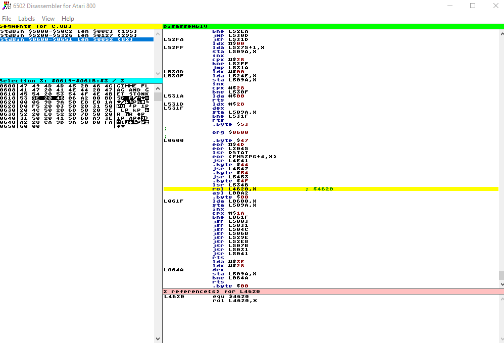
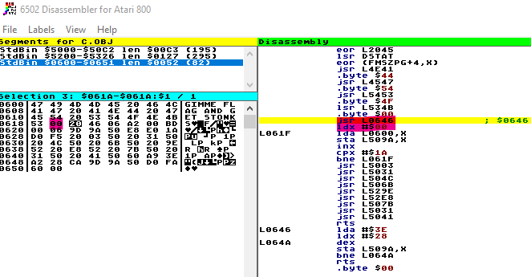
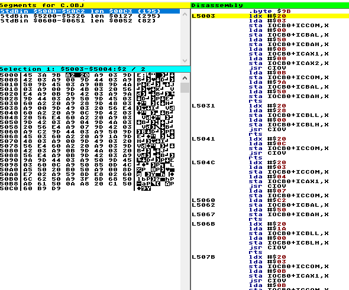
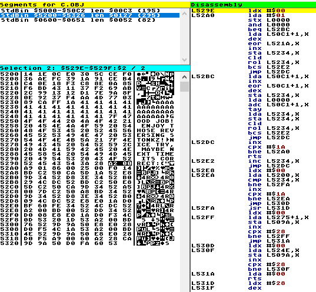

# atareee

    Chips are getting more expensive, so maybe its time to revisit some older hardware to get some fresh stonks (Altirra). And indeed you find some mysterious files... maybe there actually is something hidden in there.
    Hint: start is @ 061a
    Note: the flag format is different FLAG_.* instead of flag{.\*}
    

atareee provides an Atari 800 disk image and emulator safe state for [Altirra](https://www.virtualdub.org/altirra.html).

## Solution

As a first step I wanted to know what the disk image contained. For this I used [atari-tools](https://github.com/jhallen/atari-tools) to look at files on the system.

```
$ ./atari-tools/atr challenge.atr ls
a.obj        copy.com     dupdsk.com   mem.lis      sample.com
b.obj        do.com       init.com     menu.com     sample.m65
bug65.com    dosxl.sup    initdbl.com  noverify.com sysequ.asm
c.obj        dosxl.xl     iomac.lib    rs232.com    sysequ.m65
config.com   dupdbl.com   mac65.com    rs232fix.com verify.com
```

`a.obj`, `b.obj` and `c.obj` are especially interesting.
Dumping them individually shows rather small files that are not too interesting.

Using an [interactive 6502 disassembler](https://www.atarimax.com/dis6502/) it is possible to load all three files and check the disassembly:



Interestingly the disassembler is wrongly aligned for the entry point given in the hint, fixing that by patching the `>` to a `\x00` helps:



With this the actual reversing can begin:

The entry point is in the `c.obj` file: 
At the entry point the L509A memory is cleared and then the `GIMME FLAG AND GET STONKS>` string is copied to it.
After that only "external" (outside of `c.obj`) calls are done before the program exits.

The calls to addresses in the L50XX range all seem to relate hardware features, probably the writing to the screen and reading input:



Only the calls to L529E and L52E8, which are inside `b.obj` are interesting:



L529E seems to be encoding a buffer from L50C2 (probably the input) and storing the result at L5234.
L52E8 iterates over the encoded buffer from L5234 and compares it against values stored in L5200.

So L529E probably encodes our input and L52E8 checks if the encoded input matches the encoded flag.

Through some manual analysis on the disassembly the encoding function does the following:

```python
def L529E(L50C2):
    L5234 = []
    for i in range(0x1A):
        if (i & 1) == 1:
            L5234.append(rol(L50C2[i]^L521A[i-1], 1, 8))
        else:
            L5234.append(rol(L50C2[i]^L50C2[i+1], 1, 8))
    return L5234
```

The encoding is rather simple and easy to invert:

```python
def decode(encodedArr):
    decodedStr = []
    
    oddDecode = lambda i: ror(encodedArr[i], 1, 8) ^ xorArray[i-1]
    evenDecode = lambda i: ror(encodedArr[i], 1, 8) ^ oddDecode(i+1)
    
    for i in range(len(encodedArr)):
        if (i & 1) == 1:
            decodedStr.append(chr(oddDecode(i)))
        else:
            decodedStr.append(chr(evenDecode(i)))
            
    return ''.join(decodedStr)
```

applying this on the array stored at L5200 yields the flag:

`Decode(compareArray):  FLAG_G3T_D3M_R3TR0_ST0NKZ!`