# Doki Doki Anticheat

    Heyo stranger,
    I really need ur help! My PC hasn't been working for the past few days and the only thing I'm left with are my savefiles (I always have them on my USB-Stick, just in case). I need to know what's next in my favorite video game, could you please load these savefiles and tell me the following dialogue, please, I can't wait any longer!

    Here's a link to the game, you can even run it easily on Linux: https://teamsalvato.itch.io/ddlc

    I don't know how to contact you, so just text me the dialogue as a flag, ok?
    So if the dialogue says:"Sayori, what is up with you.." Then just send flag{Sayori,_what_is_up_with_you..}
    I'd be really REALLY thankful if you'd do that!

## Solution

RenPy save games are stored in `%AppData%/RenPy/<gameName>/` on Windows, so if we copy the files we got there we can see the following:


But thanks to [this random online save game editor website](https://www.saveeditonline.com/)


We can see some suspicious options - so if we turn them off:

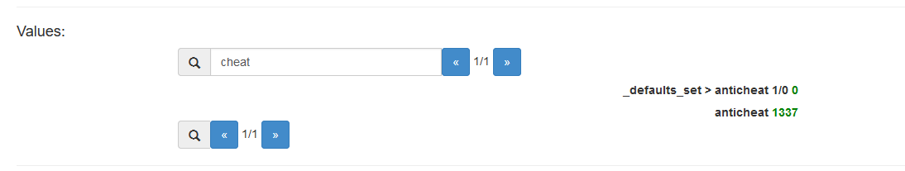

This gives us the flag to copy

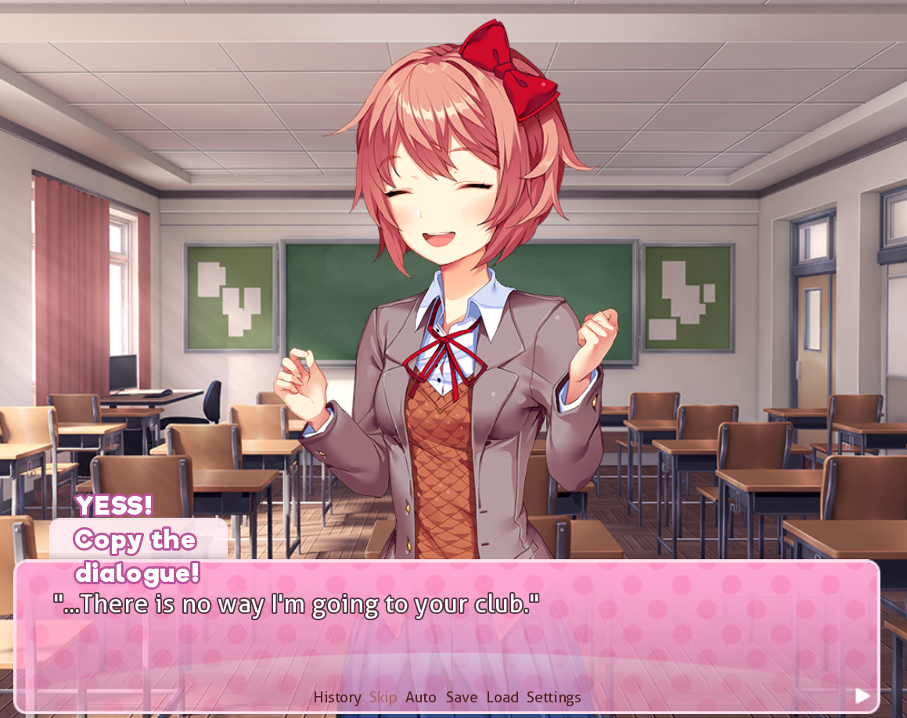

```
flag{...There_is_no_way_I'm_going_to_your_club.}
```

Note here, that it seems that the `anticheat` value actually matters and entering 1337 just seems to randomly work.
That makes this quite the scuffed writeup, but it seems other people have just extracted the next said sentence from the RenPy save directly,
if you know what you are looking for then it's very visible.

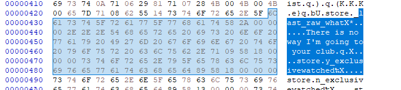


# Cube Hash

    I build a super secure hash function and encoded the hash in my login checker. But by my bad luck I lost the password. Do you dare to recover it?

## Solution

The program itself comes with symbols so there isn't much in detail low-level reverse engineering going on.

```python
CUBE_LENGTH = 0x28
CUBE_LENGTH_M1 = CUBE_LENGTH-1

def convChar(c):
    rcx = (c - 0x30)&0xff
    if rcx <= 0x4d:
        if rcx >= 0 and rcx <= 9:
            return (c-0x30)&0xff
        if rcx >= 0x11 and rcx <= 0x2a:
            return (c-0x37)&0xff
        if rcx >= 0x31 and rcx <= 0x4a:
            return (c-0x3d)&0xff
        if rcx == 0x4d:
            return 0x3f
        if (((((((((((((((((((((((((((rcx == 0x11 or rcx == 0x12) or rcx == 0x13) or rcx == 0x14) or rcx == 0x15) or rcx == 0x16) or rcx == 0x17) or rcx == 0x18) or rcx == 0x19) or rcx == 0x1a) or rcx == 0x1b) or rcx == 0x1c) or rcx == 0x1d) or rcx == 0x1e) or rcx == 0x1f) or rcx == 0x20) or rcx == 0x21) or rcx == 0x22) or rcx == 0x23) or rcx == 0x24) or rcx == 0x25) or rcx == 0x26) or rcx == 0x27) or rcx == 0x28) or rcx == 0x29) or rcx == 0x2a) or rcx == 0x4b)):
            return 0x3e
    return None

def read_a(buf, i, j, x, y):
    if y == 0:
        return buf[i][j][x]
    elif y == 1:
        return buf[i][x][j]
    elif y == 2:
        return buf[x][i][j]
    
def write_a(buf, i, j, x, y, v):
    if y == 0:
        buf[i][j][x] = v
    elif y == 1:
        buf[i][x][j] = v
    elif y == 2:
        buf[x][i][j] = v

def rotate_cub(buf, x, y):
    for i in range(CUBE_LENGTH//2):
        for j in range(i, CUBE_LENGTH_M1-i):
            v = read_a(buf, i, j, x, y)
            write_a(buf, i,                    j,                    x, y, read_a(buf, j,                    (CUBE_LENGTH_M1 - i), x, y))
            write_a(buf, j,                    (CUBE_LENGTH_M1 - i), x, y, read_a(buf, (CUBE_LENGTH_M1 - i), (CUBE_LENGTH_M1 - j), x, y))
            write_a(buf, (CUBE_LENGTH_M1 - i), (CUBE_LENGTH_M1 - j), x, y, read_a(buf, (CUBE_LENGTH_M1 - j), i,                    x, y))
            write_a(buf, (CUBE_LENGTH_M1 - j), i,                    x, y, v)

def hashCube(s):
    hashVal = [convChar(ord(s[i])) for i in range(len(s))]
    bigBuffer = makeCube()
    for x in range(len(s)):
        for y in range(3):
            k3 = (hashVal[x] >> (y*2))&3
            for k in range(k3):
                rotate_cub(bigBuffer, x, y)
    return bigBuffer
```

Notable here are how the rotates are simplified in `read_a` and `write_a`.

To what is happening is that each character encodes how many spins (0-3) to do on every axis.

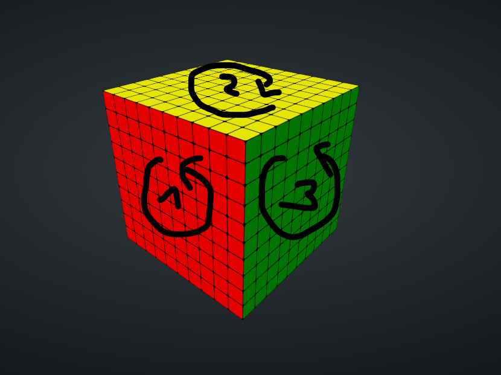

The amount of input that can be "hashed" is equal to the CUBE_LENGTH. Each characters "starting position" is `cube[i][i][i]` for a given index `i`.
Of course unlike an actual Rubik's cube we have cubes within and we do not care about faces but cube positions (but I still think they are good for visualization).

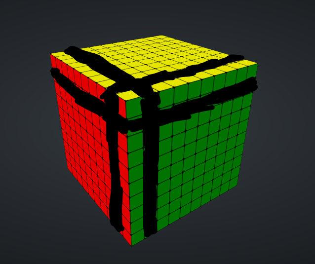

For `i=1` the black bars here demonstrate the cubes that will be rotates (plus all the inner cubes).

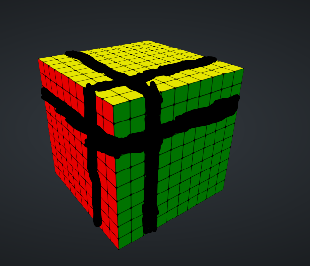

And here for `i=2`.
First thing to notice is that `cube[i][i][i]` is only ever getting rotated at index `i`. So the values in the fully "hashed" cube leak information about individual characters.
Even more so, something my teammate duk noticed (and these images make quite clear) is that for each index we have "subcubes" (going `cube[i-y][i-z][i-x]` for `0 < x,y,z < i+1`) that are never touched again and stay as they are - so in the "hashed" cube we have even more leaked information.
 
```python
def unhashCube(targetCube, x=0, already="", ln=CUBE_LENGTH):
    if x == ln:
        return already
    convCubeT = hashCube(already)

    sols = []
    for c in range(0x30, 0x7f):
        conv = convChar(c)
        if conv == None: continue

        convCube = copyCube(convCubeT)
        for y in range(3):
            k3 = (conv >> (y*2))&3
            for k in range(k3):
                rotate_cub(convCube, x, y)

        if convCube[x][x][x] != targetCube[x][x][x]:
            continue
        
        bad = False
        for i in range(x+1):
            for j in range(x+1):
                for k in range(x+1):
                    if convCube[i][j][k] != targetCube[i][j][k]:
                        bad = True
                        break
                if bad:
                    break
            if bad:
                break
        if not bad:
            sols.append(chr(c))
    print(x, sols)
    for c in sols:
        res = unhashCube(targetCube, x+1, already+c, ln)
        if res is not None:
            return res
    return None
    
def makeCubeFromBinary():
    f = open("chall", "rb")
    data = f.read()[0x0002150:]
    f.close()
    import struct
    return [[[struct.unpack("<I", data[((y*0x28*0x28)+(z*0x28)+x)*4:][:4])[0] for x in range(CUBE_LENGTH)] for z in range (CUBE_LENGTH)] for y in range(CUBE_LENGTH)]

hashed = makeCubeFromBinary()
print(unhashCube(hashed))
```

Using this information we can bruteforce our way through the cube hash, by first filtering candidates by the `cube[i][i][i]` property and then using the inner "subcube" to filter even more.
Effectively for everything except the first character (where there are no previous "subcubes") we reduce the possible character amount to 1 making this almost linear.

This will give us `flag{LuckyYouFoundMyPasswordInThisCube}0` as output, we ignore the `0` as it serves as filler and is equal to a null byte.

```
$ ./chall
Input the password: flag{LuckyYouFoundMyPasswordInThisCube}
Nice
```
 

# Ghost

    A wild ghost appeared! We can try our luck at scaring him away. Since you don't know how to use those magic spells yet, we asked our elders for a manual... which... they gave us? But.. Can you help me understand it and show your mastery of the Ghost-scaring by scaring this guy 50 times in a row?

## Solution

When running the ghost binary without arguments we are given quite a bit of information

```
Usage: ./ghost_no_flag <total_numer_of_games> <minimax_search_depth>
Typical examples values would be:
total_numer_of_games: 1000
minimax_search_depth: 32
Exiting due to incorrect command-line arguments.
```

Notable here are the amount of games and minimax_search_depth.


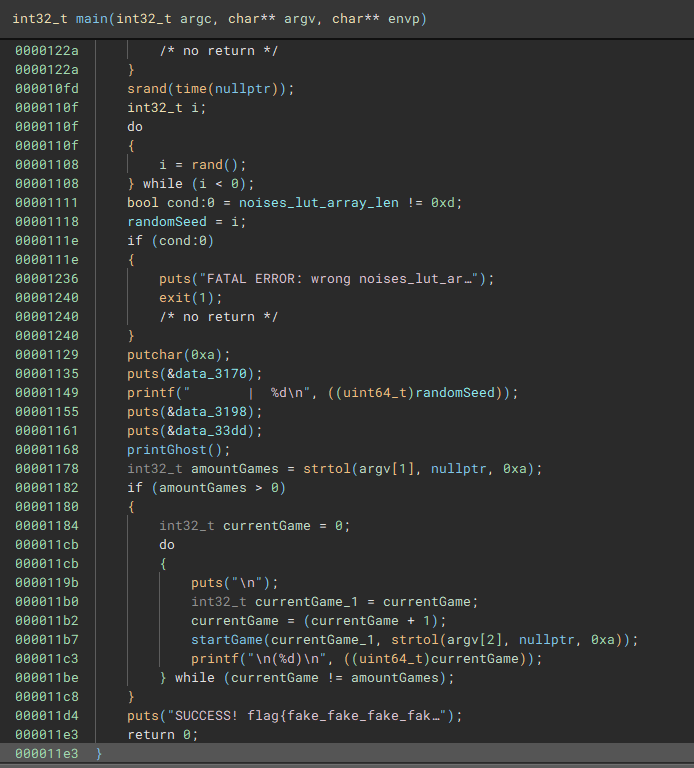

The main function calculates a random seed, prints it out and then starts games until all games have been played. Then it prints the flag - on the remote server it prints the real flag.

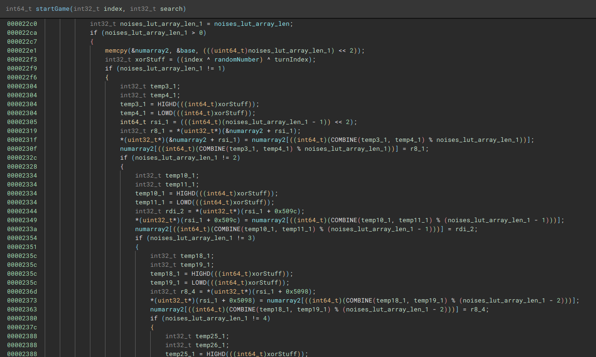

The actual game function does quite a lot of seemingly weird stuff, mostly because of optimized code.
First of all an array gets shuffled based on the randomSeed, the current game index and the turn index.

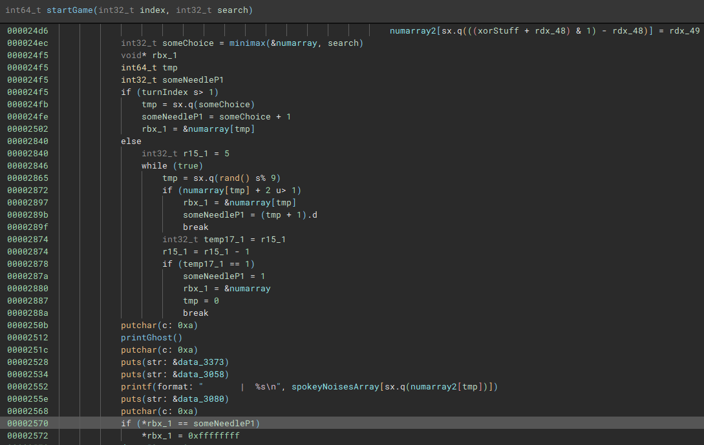

This shuffled array is then used to communicate a possibly random choice the binary takes.

We as a user are offered the options between 1 and 12 to enter but the binary actually just takes `(inputNumber-1)%9` and puts our choice in that array spot.

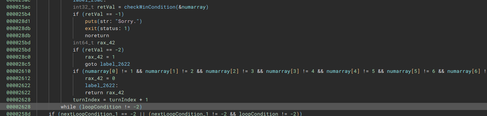

After each turn the game checks whether a win conditions has been fulfilled and either makes the player, the program or nobody win.
If the program wins the program exits - we need to prevent this from happening.


Now the interesting observation is that this is in fact a Tic-Tac-Toe game (which is also hinted at by the minimax parameter as it's a popular algorithm to solve the game).

So to solve this challenge we need to re implement the shuffle logic to keep track of the enemy turns and then use our own minimax implementation to always play a winning game or a draw.

A nice overview of how to implement this algorithm can be found [Here](https://thesharperdev.com/coding-the-perfect-tic-tac-toe-bot/ ).

```python
def swap(shuffle, a, xorStuff, m):
    tmp = shuffle[a] 
    shuffle[a] = shuffle[xorStuff%m]
    shuffle[xorStuff%m] = tmp
           
   
def shuffeArray(gameIndex, iterationIndex, seed):
    shuffle = [i for i in range(13)]
    xorStuff = gameIndex^seed^iterationIndex

    for i in range(12, 0, -1):
        swap(shuffle, i, xorStuff, i+1)
    return shuffle
        
spookyArray = [
    "*OoooOOOoooo*",
    "*Booooo-hoooo*",
    "*Eeeeek*",
    "*Hoooowl*",
    "*Sliiither*",
    "*Waaail*",
    "*Woooosh*",
    "*Eeeerie*",
    "*Creeeeeeak*",
    "*Haauuunt*",
    "*Woooo-woooo*",
    "*Gaaaasp*",
    "*Shiiivver*"
]


def getEnemyTurn(msg, iterationIndex, gameIndex, seed):
    shuffle = shuffeArray(gameIndex, iterationIndex, seed)
    unshuffle = [0 for _ in range(0xd)]
    for i in range(0xd):
        unshuffle[shuffle[i]] = i
        
    unspookyMap = {}

    for i in range(len(spookyArray)):
        unspookyMap[spookyArray[i]] = unshuffle[i]

    return unspookyMap[msg]
```

This is the implemented logic to translate the spooky noises given seed, game index and turn index.
The full script is [here](ghost.py).

Running it against the remote gives the flag

```
SUCCESS! flag{ghosts_can_play_tic_tac_toe_too}
```


# The Password Game

    Please choose a password.

## Solution

The password game provides us with a website which executes a complex circuit through CSS magic.
Our goal is to enter something that matches 11 hidden rules.

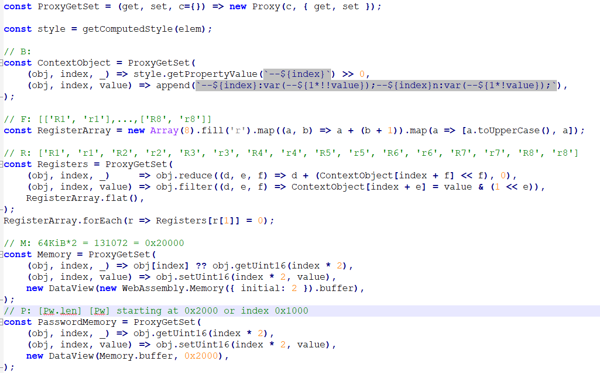

Going through the `game-animator.min.js` and giving things more useful names shows that this is a system with 8 16-bit registers and 0x20000 bytes of RAM.

One interesting thing is that the css "animation" is triggered many times until a halt condition is reached.
Each cycle represents something like an instruction and in between there is the very convenient `window.animationHook` function that is called that we can overwrite (of course we could also just modify the source for this).

```javascript
function decimalToHex(d) {
    var hex = Number(d).toString(16);
    hex = "0000".substr(0, 4 - hex.length) + hex;
    return hex;
}
window.animationHook = function() {
    var out = F.reduceRight((acc, cur) => cur[0]+": "+decimalToHex(R[cur[0]])+", "+acc, "")+" ha: "+B.ha;
    if(B.lf) {
        out = out+", lf: "+B.lf+", la: "+decimalToHex(R.la)+", ld: "+decimalToHex(M[R.la]);
    }
    if(B.sf) {
        out = out+", sf: "+B.sf+", sa: "+decimalToHex(R.sa)+", sd: "+decimalToHex(R.sd);
    }
    console.log(out);
}
```

Through this little added code (e.g. in the console or actually appended to the code) we get program traces from the password matching!


```
R1: 1000, R2: 0002, R3: 0000, R4: 0000, R5: 0000, R6: 0001, R7: 0000, R8: 0009,  ha: 0, lf: 1, la: 1000, ld: 0002
R1: 0000, R2: 0002, R3: 0000, R4: 0000, R5: 0000, R6: 0001, R7: 0000, R8: 000a,  ha: 0
R1: 0024, R2: 0002, R3: 0000, R4: 0000, R5: 0000, R6: 0001, R7: 0000, R8: 000b,  ha: 0
R1: 0024, R2: 0002, R3: 0000, R4: 0000, R5: 0000, R6: 0001, R7: 0000, R8: 000c,  ha: 0
```

For example when we enter 2 characters, we fail very early and get the following trace.
The password is stored in the format `[pwlen] [password]` at `0x1000`, so this reads the lengths and then fails.
Notably here is that there is another number that is a viable length - 36.
If we enter 36 characters we pass Rule 1 and a lot more computation happens directly afterwards.

Using this method of failing traces, and trying to make the program behave differently we can very easily deduce the first 8 rules:

Rule 1: The password has to be 36 characters
Rule 2: The password needs to contain a number
Rule 3: The password needs to contain an uppercase letter
Rule 4: Probably requirement for `{` and `}` letters
Rule 5: The numbers in the password need to add up to 9
Rule 6: The password needs to end with `}`
Rule 7: The password starts with `flag{`
Rule 8: All characters are valid printable ASCII letters


Rule 9 is a bit more complex.

It iterates for the following addresses and characters for each flag character:

```
lf: 1, la: 0105, ld: 007b
lf: 1, la: 0107, ld: 0031
lf: 1, la: 0109, ld: 0073
lf: 1, la: 010b, ld: 0075
lf: 1, la: 010d, ld: 0079
lf: 1, la: 010f, ld: 0030
lf: 1, la: 0111, ld: 0065
lf: 1, la: 0113, ld: 0042
lf: 1, la: 0115, ld: 0078
lf: 1, la: 0117, ld: 0064
lf: 1, la: 0119, ld: 0057
lf: 1, la: 011b, ld: 0038
lf: 1, la: 011d, ld: 004b
```

And if they match a certain other character has to follow.
Extracted this looks like this:

```python
def applyRule9(arr):
    for i in range(len(arr)-1):
        if arr[i] == 0x7b: arr[i+1] = arr[i] ^ 15
        elif arr[i] == 0x31: arr[i+1] = arr[i] ^ 66
        elif arr[i] == 0x73: arr[i+1] = arr[i] ^ 44
        elif arr[i] == 0x75: arr[i+1] = arr[i] ^ 25
        elif arr[i] == 0x79: arr[i+1] = arr[i] ^ 38  
        elif arr[i] == 0x30: arr[i+1] = arr[i] ^ 66
        elif arr[i] == 0x65: arr[i+1] = arr[i] ^ 58
        elif arr[i] == 0x42: arr[i+1] = arr[i] ^ 58 
        elif arr[i] == 0x78: arr[i+1] = arr[i] ^ 28
        elif arr[i] == 0x64: arr[i+1] = arr[i] ^ 51
        elif arr[i] == 0x57: arr[i+1] = arr[i] ^ 111
        elif arr[i] == 0x38: arr[i+1] = arr[i] ^ 115  
        elif arr[i] == 0x4b: arr[i+1] = arr[i] ^ 54  
```

Now to Rule 10:

This was a bit more trick to reverse.

On the following index pairs `[(6, 7), (0xa, 0xb), (0xe, 0xf), (0x13, 0x14), (0xd, 0x11), (0x1c, 0x1d)]` we are run through this checksum function to match the following hashes `[0xb9fe, 0xe249, 0x5d06, 0xa9df, 0x362c, 0x08ff]`.

```python
def checksum(a, b):
    v0 = data191[a^0xff]
    v1 = data191[(((~v0)>>8)&0xff)^b]
    res = v1^((v0<<8)&0xff00)
    return res 
```

This lookup table at address 0x191 can be dumped with `for(var i=0;i<0x100;i++) console.log(M[0x191+i]);` in the javascipt console.

The last Rule 11:

We currently have the following input `flag{th1s_is_truly_h0r??????mBxdW8K}`.
So we are missing 6 characters. This last rule is difficult to do by trace analysis because in reality it creates instructions for the underlying machine from these letters.
So instead of solving it "legit" we cheese!

First of all, from the `applyRule9` rules, all have been applied except the rule for the character `e`, which will unroll to `e_`.
Looking at the words, the flag probably wants to say `this is truly horrible`.
So we are at `flag{th1s_is_truly_h0r????e_mBxdW8K}`, missing `r`, `i`, `b` and `l`.
The obvious one where they are all lowercase does not work, but there are only 16 options so we can just bruteforce them all.

In the end `flag{th1s_is_truly_h0rrIbLe_mBxdW8K}` is the correct flag.

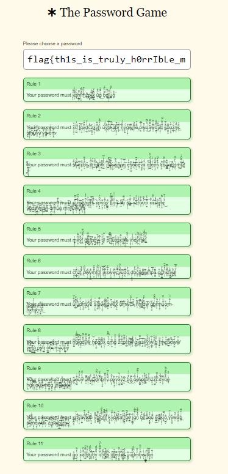