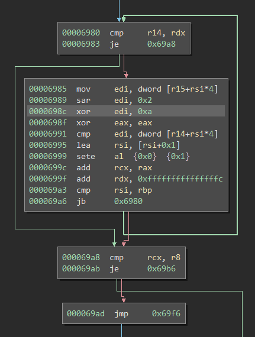

# beginner_reverse

    Description:
    A babyrust to become a hardcore reverser.

beginner_reverse is a 64bit Linux binary that reads a line of user input and either congratulates the user for the correct password or does print nothing.

## Solution

Following the execution flow of the binary and the content of the entered line of text reveals the following part of the code:



    r15 contains the address to an array of constant data
    r14 contains the address of an array where each character of the entered text has its own dword
    r8  contains the number 34
    
Here an element of a constant array is shifted two bits to the right, then xored with 0xA and compared to the matching character of the input string.


Copying the buffer and applying the calculations reveals the flag

```python
>>> compareData = [0x10E, 0x112, 0x166, 0x1C6, 0x1CE, 0x0EA, 0x1FE, 0x1E2, 0x156, 0x1AE, 0x156, 0x1E2, 0x0E6, 0x1AE, 0x0EE, 0x156, 0x18A, 0x0FA, 0x1E2, 0x1BA, 0x1A6, 0x0EA, 0x1E2, 0x0E6, 0x156, 0x1E2, 0x0E6, 0x1F2, 0x0E6, 0x1E2, 0x1E6, 0x0E6, 0x1e2, 0x1de]
>>> ''.join([chr((i>>2)^0xA) for i in compareData])
'INS{y0ur_a_r3a1_h4rdc0r3_r3v3rs3r}'
```


# Junkyard

    Description:
    Wall-E got stuck in a big pile of sh*t.
    To protect him from feeling too bad, its software issued an emergency lock down.
    Sadly, the software had a conscience and its curiosity caused him to take a glance at the pervasive filth.
    The filth glanced back, and then...

    Please free Wall-E. The software was invented by advanced beings, so maybe it is way over your head.
    Please skill up fast though, Wall-E cannot wait for too long.
    To unlock it, use the login "73FF9B24EF8DE48C346D93FADCEE01151B0A1644BC81" and the correct password.
    
Junkyard is a 64bit Linux binary that takes two additional command line parameters, a username and a password.
After doing some calculations it then prints out a message depending on the input and if the input matches some internal criteria it decrypts the flag with a key based on parts of the input.

## Solution

After reversing the function that takes the username and password as input it turn out that the internal flag decryption key is only based on two characters of the password.

Only the 1st and the 42th character influence the generated key and the amount of possible combination is further limited by the 5th to 8th character of the generated key in hex format having to match "7303".


```
def calculate(givenName, givenPassword):
    processedName = addPrimePadding(givenName, len(givenName), 0x40)
    processedPassword = addPrimePadding(givenPassword, len(givenPassword), 0x40)

    preValue = ord(processedPassword[0]) - 0x30
    mapValue = preValue + mapping[ord(processedPassword[0x2A])] + 0x27A

    assert 892360 == calculateUnionHash(processedName, processedName) # as name is constant this should be constant as well
    unionHash = mapValue + 892360 #calculateUnionHash(processedName, processedName)
    
    loopVar1 = mapping[0x9B - ord(processedPassword[0])] + unionHash
    key = [ord(c) for c in ("%lu" % loopVar1)[0:0x13]]
    key += ([0] * (0x10-len(key)))

    AtoSArray = range(0x41,0x54)
    currentLength = 0
    firstMapping = loopVar1

    # calculate how many characters the %lu already takes
    while loopVar1 != 0 and currentLength <= 15:
        loopVar1 = loopVar1 // 10
        currentLength += 1
        
    loopVar2 = firstMapping
    while loopVar2 != 0 and currentLength <= 15:
        index = loopVar2%10
        loopVar2 = loopVar2//10
        key[currentLength] = AtoSArray[index]
        currentLength += 1

    while currentLength <= 15:
        key[currentLength] = 0x61
        currentLength += 1

    keyHexString = ''.join(["%02x" % i for i in key])

    return keyHexString[5:9] == "7303"
```

Trying all possible combinations in my python script with those constrains results in less than 60 inputs

```
100000000000000000000000000000000000000000B0 X
200000000000000000000000000000000000000000C0 <-
...
```

The first one results in the binary crashing because of a failed decryption. But already the second one decrypts the flag correctly.

    ./junkyard 73FF9B24EF8DE48C346D93FADCEE01151B0A1644BC81 200000000000000000000000000000000000000000C0
    Computing stuff...
    INS{Ev3ryb0dy_go0d?PleNty_oF_sl4v3s_FoR_My_r0bot_Col0ny?}
    Well, stop wasting any more of your time and submit the flag...
