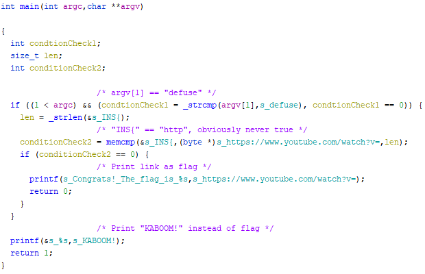
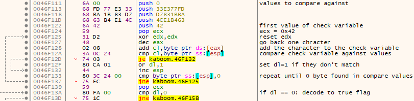

# Kaboom

    Defuse the bomb!
    
The challenge provides a 32bit Windows binary which answers with "KABOOM" unless the correct parameters are provided to it.

## Solution

The binary is packed with UPX and looking at the unpacked version shows the following in the main function:



Setting the first argument to "defuse" does change the execution flow, but fails at an impossible compare of two constant strings never changed within the unpacked binary.

After packing the unpacked version with UPX again it stands out that the first few instructions of the original binary and the repacked binary don't match at all.
After a call to GetCommandLineA the command line argument string is iterated till the end and eax is set to that address, after that the following check is done on the string:



A small python script reversing the process solves for a string that fulfills the check:

```python
s = [ord(c) for c in "63B4E14CBA1B83D7FD77E333".decode("hex")]
l = 0x42
sol = []
for i in s:
    sol.append(chr((i-l)&0xFF))
    l = i
sol.reverse()
print(''.join(sol)) # Plz&Thank-Q!
```

Executing the binary with the `defuse` string of the packed binary in addition to the additional requirement within the modified upx reveals the flag:

    > kaboom.exe defuse Plz^&Thank-Q!
    Congrats! The flag is INS{GG EZ clap PogU 5Head B) Kreygasm <3<3}