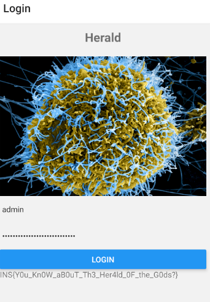

# Herald

    Description:
    Our lab administrator has just passed out from a strange virus. Please help us find the password to his messaging app so we can identify what he was working on and save his life.

Herald is an React Native Android App. The main code is in the `assets/index.android.bundle` file which is a Hermes JavaScript bytecode, version 84 file.

## Solution

The first step is to use `jadx` to decompile and extract all the assets.
After confirming that this is a React Native Android App that uses Hermes the `assets/index.android.bundle´ file is the main reversing target.
The app comes up with a login panel and the task is to figure out the password.


To solve this I used [hbctool](https://github.com/bongtrop/hbctool).
Sadly the bytecode version 84 is not supported as is, so I needed to add support for it my self, which luckily is very simple:

- Make a copy of `hbc/hbc76` named `hbc/hbc84`
- Change all references from version 76 to 84 in `hbc/hbc84/__init__.py`
- Add the new handler version handler in the `hbc/__init__.py` file
- Update all raw files in `hbc/hbc84/raw` with the appropriate files from https://github.com/facebook/hermes/blob/main/include/hermes/BCGen/HBC/ (at the time of writing the most recent bytecode version is 84, otherwise the files of an older release are required)
- Run `hbc/hbc84/tool/opcode_generator` to update the opcode json file


Running the tool on the bundle extracts the instructions, the strings and a metadata file.

The main interesting function within the `instruction.hasm` file is the `tryAuth` function which is responsible for verifying the username and password.


```
	GetById             	Reg8:0, Reg8:0, UInt8:2, UInt16:4142
	; Oper[3]: String(4142) 'username'

	LoadConstString     	Reg8:1, UInt16:801
	; Oper[1]: String(801) 'admin'

	JStrictNotEqual     	Addr8:38, Reg8:0, Reg8:1
```

The entered username is compared with the fixed string "admin".

```
	GetById             	Reg8:3, Reg8:0, UInt8:3, UInt16:4120
	; Oper[3]: String(4120) 'password'

	GetById             	Reg8:4, Reg8:2, UInt8:4, UInt16:3485
	; Oper[3]: String(3485) 'decodedText'

	NewArrayWithBuffer  	Reg8:0, UInt16:28, UInt16:28, UInt16:9398
	Call2               	Reg8:0, Reg8:4, Reg8:2, Reg8:0
	JStrictEqual        	Addr8:105, Reg8:3, Reg8:0
```

The entered password is compared with the content of a static buffer run through the `decodedText` function.

```
[...]
GetById             	Reg8:1, Reg8:2, UInt8:8, UInt16:3839
	; Oper[3]: String(3839) 'decodedFlag'

	NewArrayWithBuffer  	Reg8:0, UInt16:43, UInt16:43, UInt16:9512
	Call2               	Reg8:0, Reg8:1, Reg8:2, Reg8:0
```

If both the username and password match then the flag is calculated by running a static buffer through the `decodeFlag` function.

Interestingly the `decodeText` and `decodeFlag` function do the same thing.

```
Function<decodedText>4086(2 params, 18 registers, 0 symbols):
	LoadParam           	Reg8:6, UInt8:1
	LoadThisNS          	Reg8:7
	LoadConstString     	Reg8:0, UInt16:2849
	; Oper[1]: String(2849) ''

	GetGlobalObject     	Reg8:4
	LoadConstUInt8      	Reg8:3, UInt8:1
	GetByIdShort        	Reg8:2, Reg8:7, UInt8:1, UInt8:226
	; Oper[3]: String(226) 'setState'

	NewObject           	Reg8:1
	PutNewOwnById       	Reg8:1, Reg8:6, UInt16:3942
	; Oper[2]: String(3942) 'ascii_array'

	Call2               	Reg8:1, Reg8:2, Reg8:7, Reg8:1
	GetByIdShort        	Reg8:2, Reg8:6, UInt8:2, UInt8:176
	; Oper[3]: String(176) 'length'

	Mov                 	Reg8:1, Reg8:0
	Mov                 	Reg8:0, Reg8:1
	LoadConstZero       	Reg8:5
	JNotLess            	Addr8:52, Reg8:5, Reg8:2
	TryGetById          	Reg8:9, Reg8:4, UInt8:3, UInt16:35
	; Oper[3]: String(35) 'String'

	GetById             	Reg8:8, Reg8:9, UInt8:4, UInt16:5675
	; Oper[3]: String(5675) 'fromCharCode'

	GetByVal            	Reg8:7, Reg8:6, Reg8:5
	Call2               	Reg8:7, Reg8:8, Reg8:9, Reg8:7
	PutById             	Reg8:4, Reg8:7, UInt8:1, UInt16:2895
	; Oper[3]: String(2895) 'r'

	TryGetById          	Reg8:7, Reg8:4, UInt8:5, UInt16:2895
	; Oper[3]: String(2895) 'r'

	Add                 	Reg8:1, Reg8:1, Reg8:7
	AddN                	Reg8:5, Reg8:5, Reg8:3
	Mov                 	Reg8:0, Reg8:1
	JLess               	Addr8:-44, Reg8:5, Reg8:2
	Ret                 	Reg8:0
EndFunction
```

While this code looks complex at first glance what is happening is:

```javascript
function decodedText(ascii_array) {
    output = '';
    for(i = 0;i<ascii_array.length;i++) {
        r = String.fromCharCode(ascii_array[i]);
        output = output + r;
    }
    return output;
}
```

So the last step is to figure out the static content of the `NewArrayWithBuffer` instructions at offset `9398` (password) and `9512` (flag):

The [BytecodeList](https://github.com/facebook/hermes/blob/v0.11.0/include/hermes/BCGen/HBC/BytecodeList.def) comments for the instruction:

```
/// Create an array from a static list of values, as for var=[1,2,3].
/// Any non-constant elements can be set afterwards with PutOwnByIndex.
/// Arg1 is the destination.
/// Arg2 is a preallocation size hint.
/// Arg3 is the number of static elements.
/// Arg4 is the index in the array buffer table.
DEFINE_OPCODE_4(NewArrayWithBuffer, Reg8, UInt16, UInt16, UInt16)
DEFINE_OPCODE_4(NewArrayWithBufferLong, Reg8, UInt16, UInt16, UInt32)
```

and the metadata has a "arrayBuffer" field which contains the array buffer table content.

```python
import json

f = open("metadata.json")
data = json.load(f)

ab = data["arrayBuffer"]

def decode(o, l):
    print("> ", ab[o:o+l])
    o += 2 # skip [array tag] [array size]
    return ''.join([chr(ab[o+i*4+0])for i in range(l)]) # it's all ascii anways so just do this
        
print(decode(9398, 28)) # decodedText
print(decode(9512, 43)) # decodedFlag
```

Which gives both the password and the flag:

```
>python parseMetadata.py
>  [240, 28, 78, 0, 0, 0, 48, 0, 0, 0, 98, 0, 0, 0, 48, 0, 0, 0, 100, 0, 0, 0, 121, 0, 0, 0, 95, 0]
N0b0dy_C4n_f1nd_My_P4ssw0rd!
>  [240, 43, 73, 0, 0, 0, 78, 0, 0, 0, 83, 0, 0, 0, 123, 0, 0, 0, 89, 0, 0, 0, 48, 0, 0, 0, 117, 0, 0, 0, 95, 0, 0, 0, 75, 0, 0, 0, 110, 0, 0, 0, 48]
INS{Y0u_Kn0W_aB0uT_Th3_Her4ld_0F_the_G0ds?}
```

And for confirmation, testing it in the app:


