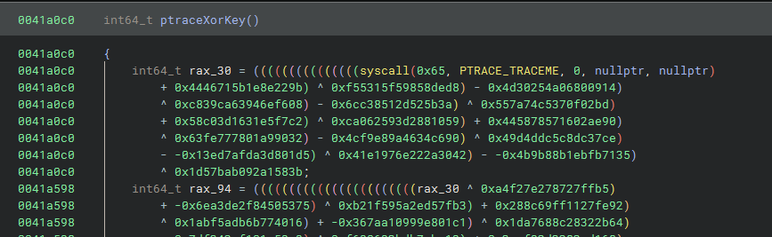

# rev/not-baby-crackme

    ~~Don't~~ start here:
    
not-baby-crackme is a linux crackem that validates a flag with a virtual machine.
    
## Solution

The binary takes in 64 bytes of input, runs those in blocks of 16 through a virtual machine and compares the output with a buffer calculated through integrity checks and anti-debugging features.

These anti-debugging techniques are ran as shellcode that is copied from the binary.

The only notable technique used is one shellcode which runs ptrace to see if a debugger is attached. All other techniques run a checksum on parts of the program (but not the shellcode).



Patching the syscall with the correct return value (`0`) allows for dumping these compare values from address `0x424540` by using hardware breakpoints during the comparison at the end.

```python
encoded_flag_buffer = [
0x39,0xce,0x69,0x39,0xa6,0x61,0x7c,0xf4,
0x0b,0x3a,0x21,0x8d,0x59,0xf0,0x15,0x80,
0x66,0x41,0x96,0x75,0xfb,0x36,0x67,0x5c,
0xa7,0x95,0x32,0xee,0xbc,0xf7,0xbf,0xc2,
0x95,0x75,0x60,0x51,0xb7,0xaa,0xa5,0xd5,
0x82,0x37,0xeb,0x47,0x7d,0x8e,0x60,0xc8,
0x9e,0x6f,0xa0,0x88,0x84,0x0c,0x3f,0x9e,
0x7c,0x09,0x17,0x8c,0x5f,0x96,0x0e,0xd7
]
```

The VM Architecture itself is pretty simple and the program relatively short, `crackme_emu.py` contains an emulator behaving the same as the binary and based on the disassembly and trace the program can be summerized as:

```python
def transform_round(table, key, r0):
    buffer = []
    for i in range(16):
        a = table[i]
        b = table[(i + 1) % 16]
        k = key[(i + r0) % 16]

        tmp = a ^ rotate_left(k, i % 8)
        tmp = (tmp + (b ^ r0)) & 0xFF
        tmp = (~tmp) & 0xFF
        tmp = rotate_right(tmp, (13 * i) % 8)

        if b & 0x80:
            tmp ^= 0xA5
        if b & 0x02:
            tmp = (tmp + 0x3C) & 0xFF
        if b & 0x04:
            tmp = (tmp - 0x7A) & 0xFF

        buffer.append(tmp)
    return [buffer[(16 + 5 * i - r0) % 16] for i in range(16)]
    
buf = input_data
for i in range(12):
    buf = transform_round(buf, key, i)
```

The key is just hardcoded in the memory at `memory[16:32]`:

```python
key = [66, 55, 145, 167, 89, 218, 190, 239, 1, 2, 3, 4, 105, 19, 55, 172]
```

It should be noted that this function does not have a unique input output mapping so collisions are possible.

```python
def inverse_transform_round(output, key, r0):
    buffer = [0] * 16
    for i in range(16):
        index = (16 + 5 * i - r0) % 16
        buffer[index] = output[i]
        
    table = [0] * 16
    for b0 in range(256):
        b = b0
        for i in range(15, -1, -1):
            r4 = buffer[i]
            if b & 0x04:
                r4 = (r4 + 0x7A) & 0xFF
            if b & 0x02:
                r4 = (r4 - 0x3C) & 0xFF
            if b & 0x80:
                r4 ^= 0xA5

            r4 = rotate_left(r4, (13 * i) % 8)
            r4 = (~r4) & 0xFF

            tmp3 = key[(i + r0) % 16]
            rotated = rotate_left(tmp3, i % 8)
            tmp2 = b ^ r0
            tmp = (r4 - tmp2) & 0xFF

            a = tmp ^ rotated
            table[i] = a
            b = a
        if table[0] == b0:
            yield table
    return
    
def nested_inverse(buf, key, amount):
    if amount == -1:
        yield buf
    for out in inverse_transform_round(buf, key, amount):
        for v in nested_inverse(out, key, amount-1):
            yield v
    
for i in range(4):
    buf = encoded_flag_buffer[0x10*i:0x10*(i+1)]
    for out in nested_inverse(buf, key, 11):
        outp = ''.join([chr(c) for c in out])
        if all([(c > 0x30 and c < 0x7f) or (c == 0) for c in out]):
            print("=>", outp)
            break
    print("=================")
```

```
=> maltactf{i_reall
=================
=> y_hope_the_reloc
=================
=> ations_got_you_:
=================
=> P}
=================
```

Which gives the flag `maltactf{i_really_hope_the_relocations_got_you_:P}`.

# rev/Painting

    I love painting! I love it so much that, I left a flag in my masterpiece, which I saved inside THE microsoft paint binary!

Painting is a modified ms_paint.exe that under the right constrains gives out a flag image

## Solution

Compared to the normal `ms_paint.exe` this is based on a patch was added that redirects to new code:

`14003582a  e8119e6300         call    newCode`

The main thing this routine does is insert a hook for paints file opening routine (this code can be found at `14066e600`).
Whenever a new file is opened it is checked against a set of constrains and if they match the content of the file is used to decrypt the stored flag image.

The function for verification of the input file is at `14066e900`.
The base constrains are that the files to have 729 bytes and consist entirely out of '0' and '1's with a sum of all characters of 0x8963.
If these base constrains are fulfilled an array of 819 additional constrains is iterated through.
The easiest way to solve this challenge with this information is to just translate all of these constrains to SMT solver constrains, which is mostly straightforward.

The only difficulty are the "box checks" which are non trivial to directly translate to constrains:

```python
def check2(box, expected):
    if expected > 4: return False

    for i in range(8):
        if box[i] == 1:
            if (box[(i+1)%8] == 0x1): 
                return False
            if (box[(i-1)%8] == 0x1):
                return False

    return True
```

The easiest way to encode this to iterate though all `2**8` possible boxes and see which fulfill the requirement.
Then we add the SMT solver constrain that the boxes at that respective index have to be either of the boxes that returned true.

```python
from z3 import *

value_table = [
    (4, 146),
    # ... 819 entries
]

def all_boxes():
    for x0 in [0, 1]:
        for x1 in [0, 1]:
            for x2 in [0, 1]:
                for x3 in [0, 1]:
                    for x4 in [0, 1]:
                        for x5 in [0, 1]:
                            for x6 in [0, 1]:
                                for x7 in [0, 1]:
                                    yield [x0, x1, x2, x3, x4, x5, x6, x7]
    
def check1(box, expected):
    if expected & 0xfffffff7 == 0: return True
    box = box+[]
    x0 = box[0]
    x1 = box[1]
    x2 = box[2]
    x3 = box[3]
    x4 = box[4]
    x5 = box[5]
    x6 = box[6]
    x7 = box[7]
    
    if (x0 == 0):
        while x0 == 0:
            rax = x0
            x0 = x7
            x7 = x6
            x6 = x5
            x5 = x4
            x4 = x3
            x3 = x2
            x2 = x1
            x1 = rax
        box[0] = x0;
        box[1] = rax;
        box[2] = x2;
        box[3] = x3;
        box[4] = x4;
        box[5] = x5;
        box[6] = x6;
        box[7] = x7;

    if (x7 == 1):
        while x7 == 1:
            rax = x0
            x0 = x7
            x7 = x6
            x6 = x5
            x5 = x4
            x4 = x3
            x3 = x2
            x2 = x1
            x1 = rax
        box[0] = x0;
        box[1] = rax;
        box[2] = x2;
        box[3] = x3;
        box[4] = x4;
        box[5] = x5;
        box[6] = x6;
        box[7] = x7;
        

    i = 0
    while box[i] != 0:
        i+=1
        if i>=8:
            break
            
    if expected != -1:
        return i == expected
        
    for j in range(i, 8):
        if box[j] == 1:
            return False
            
    return True
    
def check1_z3(arr, offset, expected):

    box2 = [None]*8
    box2[0] = arr[offset - 1];
    box2[1] = arr[offset + 0x1a];
    box2[2] = arr[offset + 0x1b];
    box2[3] = arr[offset + 0x1c];
    box2[4] = arr[offset + 1];
    box2[5] = arr[offset - 0x1a];
    box2[6] = arr[offset - 0x1b];
    box2[7] = arr[offset - 0x1c];
            
    bc = []
    for box in all_boxes():
        if len(set(box)) > 1 and check1(box, expected):
            bc.append(And([box2[i] == box[i] for i in range(8)]))
    
    return Or(bc)
    
    
def check2_z3(arr, offset, expected):
    box2 = [None]*8
    box2[0] = arr[offset - 1];
    box2[1] = arr[offset + 0x1a];
    box2[2] = arr[offset + 0x1b];
    box2[3] = arr[offset + 0x1c];
    box2[4] = arr[offset + 1];
    box2[5] = arr[offset - 0x1a];
    box2[6] = arr[offset - 0x1b];
    box2[7] = arr[offset - 0x1c];
            
    bc = []
    for box in all_boxes():
        if check2(box, expected):
            bc.append(And([box2[i] == box[i] for i in range(8)]))
    return (Or(bc))
    

def check2(box, expected):
    if expected > 4: return False

    for i in range(8):
        if box[i] == 1:
            if (box[(i+1)%8] == 0x1): 
                return False
            if (box[(i-1)%8] == 0x1):
                return False

    return True


solver = Solver()
arr = [BitVec("v_"+str(i), 1) for i in range(729)]
for i in range(len(arr)):
    solver.add(Or(arr[i] == 0, arr[i] == 1))

for offset, mask in value_table:
    if mask&2:
        expected_value = -1
    else:
        expected_value = (mask>>4)&0xf
   
    if mask&8:
        if not mask&4:
            solver.add(check1_z3(arr, offset, expected_value))
        else:
            solver.add(Or(check2_z3(arr, offset, expected_value), check1_z3(arr, offset, expected_value)))
    elif mask&4:
        solver.add(check2_z3(arr, offset, expected_value))

    if expected_value != -1:
        sumthis = [arr[offset + i] for i in [-0x1C, 0x1C, -0x1B, 0x1B, -0x1A, 0x1A, -1, 1]]
        solver.add(Sum([ZeroExt(15, a) for a in sumthis]) == expected_value)
    solver.add(arr[offset] == 0)


solver.add(Sum([ZeroExt(15, a) for a in arr]) == 179)

while solver.check() == sat:
    m = solver.model()
    
    out = ""
    for i in range(len(arr)):
        out += chr(m[arr[i]].as_long()+0x30)
    print(out)
    
    solver.add(Or([arr[i] != m[arr[i]] for i in range(len(arr))]))
    
print("done")
```

Running the script `painting_solve.py` will give the correct input sequence of:

`000000000000000000000000000010000010010000100001000010000000010011001110011000100010111000000000000001000010010000000000000000000000000011001101001110000100000010010001100001010100010010110001001100000110111001110100000001000000001111000011000010100110010001000001001010001000000000001111110000100000000010010000101011100000000010001000101001110000100000000010000000100010001010010010111101000000000000100000000000111000000000000000000000000000000000101100000011010100101001000111010000000100000000000100001100100001010101010000100011000100000100000010111110001001100000000000000101000010100000000001110000111000000010000011110010001010000010100000000110010001100000000001110010111000000000000000000000000000000000000000000000000`

Running the ms_paint binary and opening a (text) file with this content makes the binary create a `out_flag.jpg` with the flag:

!()[img/painting.png]


So the flag is `maltactf{one_sweep_later...look_at_all_these_beautiful_flowers}`.


# rev/mvms

    nvms, but mvms. mvm
    
mvms are 2000 similar VM binaries with randomized opcodes and different programs. Concatenating the correct input for all of them gives the flag as an image-

## Solution

The starting point I got from a teammate is that seemingly all the binaries use the same virtual machine architecture and run similar programs.
The only difference are the opcodes and the exact details of the programs.
Essentially the programs apply either addition, subtraction or xor on 16 byte constants or the 16 byte input and compare the result with 0.
If this comparison matches the input is correct.

My approach to solving this is to automatically find all 16 byte VM operations for ADD, SUB and XOR and then with dynamic analysis dump the values of the operands.
Then based on that reconstruct the operations and likely zero-comparison formula to then solve for the correct input.

Finding the ADD and SUB instructions is very easy as for the 16 byte operations they are doing a `add [lowerTarget], [lowerSource]; ...; adc [higherTarget], [higherSource]` and `sub [lowerTarget], [lowerSource]; ...; sbb [higherTarget], higherSource]` respectively.
For XOR finding two `xor` instructions that are nearby and are not zeroing the registers works, but the ordering isn't always the same. It seemed in practice that when the xoring only happens on registers it's always lower first higher later, but when operating on memory the ordering can swap (so for that the special case of detecting when a `+8` in the operands was added).

After setting the breakpoints the program is then executed with a fixed input pattern and the ADD, SUB and XOR dumps are recorded. The details are in the `mvms_solve.py`.

The output of the automatic static+dynamic analysis then is a chain of operations and their operands.

An example output would be:

```python
chain = [('ADD', 234963649065536960676246950826612897959, 204380626082398558572919383264596122643), ('SUB', 99061908226997055785791726659440809146, 234963649065536960676246950826612897959), ('XOR', 234963649065536960676246950826612897959, 204380626082398558572919383264596122643), ('XOR', 56257196190938421065296367824101619146, 88073083203066425837506969985972519233), ('XOR', 135739645333451682854756606458581766987, 71920929517443783748559410742843057406), ('SUB', 138327973727651703621225807105829893259, 106369204473723742725605434935367366581)]
```

then with the input pattern we go through the operations and try to reconstruct the operations in respect to the constants and input:

```python
inputTemplate = 0x42424242424242424141414141414141
```

```python
from z3 import *
x = BitVec("x", 8*16)

constantMap = {}
reverseMap = {}
constantMap[inputTemplate] = x
const_index = 0

for entry in chain:
    op = entry[0]
    left = entry[1]
    right = entry[2]
    
    if left not in constantMap:
        v = BitVec("const_"+str(const_index), 8*16)
        constantMap[left] = v
        reverseMap[v] = left
        const_index += 1
        
    if right not in constantMap:
        v = BitVec("const_"+str(const_index), 8*16)
        constantMap[right] = v
        reverseMap[v] = right
        const_index += 1
        
    if op == "XOR":
        constantMap[left^right] = constantMap[left] ^ constantMap[right]
    elif op == "ADD":
        constantMap[(left+right)&0xffffffffffffffffffffffffffffffff] = constantMap[left] + constantMap[right]
    elif op == "SUB":
        constantMap[(left-right)&0xffffffffffffffffffffffffffffffff] = constantMap[left] - constantMap[right]
    
print(constantMap)
```

This then gives a constant to expression map:

```python
{88073083203066425837506969985972519233: x,
234963649065536960676246950826612897959: const_0,
204380626082398558572919383264596122643: const_0 + const_1 - const_0,
99061908226997055785791726659440809146: const_0 + const_1,
54530081351191194918644814719619228852: const_0 ^ const_0 + const_1 - const_0,
56257196190938421065296367824101619146: const_2,
138327973727651703621225807105829893259: const_2 ^ x,
135739645333451682854756606458581766987: const_3,
71920929517443783748559410742843057406: const_4,
106369204473723742725605434935367366581: const_3 ^ const_4,
31958769253927960895620372170462526678: (const_2 ^ x) - (const_3 ^ const_4)
}
```

From this map we then take the longest expression that depends on the input as it is the most likely candidate for the `== 0` comparison:

```python
def countSize(expr):
    v = 1
    for c in expr.children():
        v += countSize(c)
    return v
    
def hasx(expr):
    res = False
    if expr == x: return True
    for c in expr.children():
        res = res | hasx(c)
    return res
    

longest = 0
longestKey = -1
for inp in constantMap:
    e = constantMap[inp]
    l = countSize(e)
    if not hasx(e): continue
    if l > longest:
        longest = l
        longestKey = inp
```

Which for this binary would be 

```python
(const_2 ^ x) - (const_3 ^ const_4)
```

and this expression (with the constants filled in with their actual values) we then solve for zero:

```
s = Solver()
for k in reverseMap:
    s.add(reverseMap[k] == k)

s.add(constantMap[longestKey] == 0)
print(s.check())
m = s.model()
print(m[x].as_long().to_bytes(16, "little").hex())
```

The solution is then correct input for the binary encoded in hex:

```python
7f42d0ab4710a89dcb42a1b9454b577a
```

Verifying shows that for this binary this is the correct input:

```
$ echo -n 7f42d0ab4710a89dcb42a1b9454b577a | xxd -r -p | ./rev_mvms/00000027
flag?
good
```

Doing this for all binaries and then concatenating the inputs gives a jpg with the flag:

