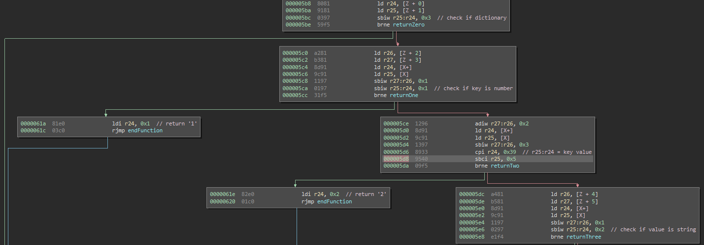
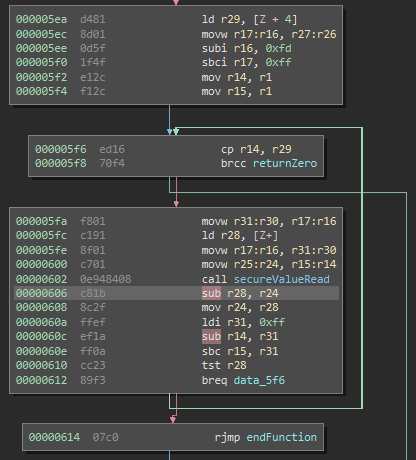

# Avr-rev

    Description:
    My Arduino now has internet access! :D
    
Avr-rev consists out of a Intel HEX format AVR Binary and a service to connect to.
The AVR program tries to parse the user input and gives out a number as response.


## Solution

Playing around with the online service reveals some interesting properties.

The parser supports numbers, strings, arrays and dictionaries in a limited fashion.
Matching it up with the parser code in the binary shows that there isn't much more either.

When entering a dictionary the output not only doesn't fail to parse but also outputs a '1' instead of '0'.

```
> {"test":1}
{"test": 1}
1
```

Further playing around shows that entering a number as the dictionary key makes it output a '2'.

```
> {1:2}
{1: 2}
2
```

Diving into the code confirms this behaviour and shows that the next step is to set the key value to 1337 (which is the base10 version of 0x539).



```
> {1337: 1}
{1337: 1}
3
```

Setting the value to a string results in variating output depending on the characters entered:

```
> {1337: "A"}
{1337: "A"}
251
```

A look into the code shows that it takes each character from the string entered and subtracts them from a value read from an internal register.
If the values match it continues with then next character, otherwise it outputs the difference and exits.



Using a small helper function and just entering A's as a start reveals the secret string by slowly matching it.

```python
def delta(v):
    if v > 0x7f:
        return chr(ord("A")+(0xff-v+1))
    return chr(ord("A")-v)
```

```
> {1337: "First: midnight{only31?} But AAA"}
{1337: "First: midnight{only31?} But AAA"}
205

> {1337: "First: midnight{only31?} But tAA"}
{1337: "First: midnight{only31?} But tAA"}
210

> {1337: "First: midnight{only31?} But toA"}
{1337: "First: midnight{only31?} But toA"}
33

> {1337: "First: midnight{only31?} But to "}
{1337: "First: midnight{only31?} But to "}
153
```
    
# Pybonhash

    Description:
    What's this newfangled secure hashing technique?
    
Pybonhash consists out of pybonhash.cpython-36.pyc and hash.txt.
When giving pybonhash an input file it "hashes" the content with the flag as key.

## Solution

Decompiling the `pybonhash.cpython-36.pyc` file with uncompyle6 shows a relatively simple "hashing" algorithm.

```python
import string, sys, hashlib, binascii
from Crypto.Cipher import AES
from flag import key
if not len(key) == 42:
    raise AssertionError
data = open(sys.argv[1], 'rb').read()
if not len(data) >= 191:
    raise AssertionError
FIBOFFSET = 4919
MAXFIBSIZE = len(key) + len(data) + FIBOFFSET

def fibseq(n):
    out = [
     0, 1]
    for i in range(2, n):
        out += [out[i - 1] + out[i - 2]]
    return out

FIB = fibseq(MAXFIBSIZE)
i = 0
output = ''
while i < len(data):
    data1 = data[FIB[i] % len(data)]
    key1 = key[(i + FIB[FIBOFFSET + i]) % len(key)]
    i += 1
    data2 = data[FIB[i] % len(data)]
    key2 = key[(i + FIB[FIBOFFSET + i]) % len(key)]
    i += 1
    tohash = bytes([data1, data2])
    toencrypt = hashlib.md5(tohash).hexdigest()
    thiskey = bytes([key1, key2]) * 16
    cipher = AES.new(thiskey, AES.MODE_ECB)
    enc = cipher.encrypt(toencrypt)
    output += binascii.hexlify(enc).decode('ascii')

print(output)
```


Because characters are MD5 hashed in pairs of two and AES encrypted with only two characters of the key each iteration it's possible to reconstruct the key and parts of the input data based on the hash.

By first creating a lookup table for all hashed data combinations:

```python
# Build Lookup table for the hashed data pairs
def buildTable():
    table = {}
    for data1 in range(0x100):
        for data2 in range(0x100):
            table[hashlib.md5(chr(data1)+chr(data2)).hexdigest()] = chr(data1)+chr(data2)
    return table
```

And then for each block trying each possible key until a matching entry is found:

```python
# Try all key combinations until a matching table entry was found
def tryKeys(table, data):
    for key1 in range(0x100):
        for key2 in range(0x100):
            thiskey = (chr(key1)+chr(key2)) * 16
            cipher = AES.new(thiskey, AES.MODE_ECB)
            enc = cipher.decrypt(data.decode("hex"))
            if enc in table:
                return ((chr(key1)+chr(key2)), table[enc])
    return None
```

Each block can be individually decrypted, each time leaking parts of the key and data:

```python
def decrypt(s):
    dataTable = buildTable() # create lookup table
    FIB = fibseq(MAXFIBSIZE) # create fib sequence like in the encoder
    i = 0
    keyR = list(" "*key_len)   # output key character list
    dataR = list(" "*data_len) # output data character list
    for j in range(len(s)/64):
        d1_i = FIB[i] % data_len # encoding index for the first data byte
        k1_i = (i + FIB[FIBOFFSET + i]) % key_len # encoding index for the first key byte
        i = i + 1
        d2_i = FIB[i] % data_len # encoding index for the second data byte
        k2_i = (i + FIB[FIBOFFSET + i]) % key_len # encoding index for the second key byte
        i = i + 1
        part = s[j*64:(j+1)*64] # extract the relevant 32 byte block from the hex encoded hash
        res = (tryKeys(dataTable, part)) # try all keys until a match is found, returns (key, data) pair
        keyR[k1_i] = res[0][0]           # save all entries
        keyR[k2_i] = res[0][1]
        dataR[d1_i] = res[1][0]
        dataR[d2_i] = res[1][1]
        print(''.join(keyR))             # print progress
    return (''.join(keyR) , ''.join(dataR)) # return resulting key and data
   
```

Which in the end recovers the full "hashing key":

```
midnight{xwJjPw4Vp0Zl19xIdaNuz6zTeMQ1wlNP}
```
    
# Indian guessing

    Description:
    Let's play an Indian guessing game!
    
Indian guessing is a service which approximates floating points entered to it.
    
## Solution

Normal behavior:

```
Let's play an Indian guessing game!
> 133.7
1 I guess 500000.0      Too big!
2 I guess 250000.0      Too big!
3 I guess 125000.0      Too big!
4 I guess 62500.0       Too big!
5 I guess 31250.0       Too big!
6 I guess 15625.0       Too big!
7 I guess 7812.5        Too big!
8 I guess 3906.25       Too big!
9 I guess 1953.125      Too big!
10 I guess 976.5625     Too big!
11 I guess 488.28125    Too big!
12 I guess 244.140625   Too big!
13 I guess 122.0703125  Too small!
14 I guess 183.10546875 Too big!
15 I guess 152.587890625        Too big!
16 I guess 137.3291015625       Too big!
17 I guess 129.69970703125      Too small!
18 I guess 133.514404296875     Too small!
19 I guess 135.4217529296875    Too big!
20 I guess 134.46807861328125   Too big!
21 I guess 133.99124145507812   Too big!
22 I guess 133.75282287597656   Too big!
23 I guess 133.63361358642578   Too small!
24 I guess 133.69321823120117   Too small!
25 I guess 133.72302055358887   Too big!
26 I guess 133.70811939239502   Too big!
27 I guess 133.7006688117981    Close enough! ;) I got you this time!
Let's play an Indian guessing game!
```

Non Number Input:

```
Let's play an Indian guessing game!
> some_input
could not convert string to float: 'some_input'
```

A solution which is technically a float but can't be approximated:

```
Let's play an Indian guessing game!
> NaN
1 I guess 500000.0      Too small!
2 I guess 750000.0      Too small!
3 I guess 875000.0      Too small!
4 I guess 937500.0      Too small!
5 I guess 968750.0      Too small!
6 I guess 984375.0      Too small!
7 I guess 992187.5      Too small!
8 I guess 996093.75     Too small!
9 I guess 998046.875    Too small!
10 I guess 999023.4375  Too small!
11 I guess 999511.71875 Too small!
12 I guess 999755.859375        Too small!
13 I guess 999877.9296875       Too small!
14 I guess 999938.96484375      Too small!
15 I guess 999969.482421875     Too small!
16 I guess 999984.7412109375    Too small!
17 I guess 999992.3706054688    Too small!
18 I guess 999996.1853027344    Too small!
19 I guess 999998.0926513672    Too small!
20 I guess 999999.0463256836    Too small!
21 I guess 999999.5231628418    Too small!
22 I guess 999999.7615814209    Too small!
23 I guess 999999.8807907104    Too small!
24 I guess 999999.9403953552    Too small!
25 I guess 999999.9701976776    Too small!
26 I guess 999999.9850988388    Too small!
27 I guess 999999.9925494194    Too small!
28 I guess 999999.9962747097    Too small!
29 I guess 999999.9981373549    Too small!
30 I guess 999999.9990686774    Too small!
You have beaten me. Here you go: midnight{rice_and_cu^H^Hsoju}
```