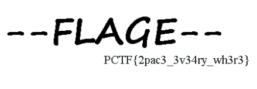

# i can count

    Description:
    Let's do this together. You do know how to count, don't you?
    
"i can count" is a 32bit Linux binary with symbols that requests the user to count up until a function identifies the entered number as the flag.

## Solution

The verification process consists out of a function that "encodes" each ASCII digit that was entered and checks if they match with a fixed array.
If 20 correct digits are entered the number is treated as correct and is outputted as the flag.

By mapping each digit to the encoded value and then mapping the compare array back to the digits the values originate from results in the flag `PCTF{2052419606511006177}`.

I automated this task with a small gdb script:

```python
gdb.execute("b *main") # break somewhere
gdb.execute("b *check_flag+35") # beginning of rol code
gdb.execute("b *check_flag+1330") # compare at the end
gdb.execute("run") # start the process

d = {} # dictionary of "encoded" values

for c in "0123456789": # iterate over all number character
    gdb.execute("jump *check_flag") # start the function
    gdb.execute("set *((int*)($ebp-0x1C)) = 0") # reset the index just in case
    gdb.execute("p flag_buf@1 = 0x%02X" % ord(c)) # set the first buffer character
    gdb.execute("continue") # encode the character
    v1 = int(gdb.parse_and_eval("$al"))&0xFF # read the encoded value
    d[v1] = c # save input and output character in a dictionary

res = [] # array containing finished number

for i in range(0x13):
    cmp = int(gdb.parse_and_eval("*((unsigned char*)(check_buf + "+str(i)+"))")) # check buffer value for the given index
    res.append(d[cmp]) # map the "encoded" value to a number

print("PCTF{%s}" % ''.join(res))
```


# Space Saver

    Description:
    we couldn't think of anything cute so here you go
    
Space Saver is a 100MB file starting with a DOS boot sector and some data within surrounded by zero bytes.

## Solution

Running "binwalk -e <binary>" extracts a RAR archive with a password protected picture called "final.png" from the image and also hints at the existence of PNG files in the file system.
Examining the image in a hex editor manually and searching for the PNG Header shows multiple files, but 3 of them contain a short string at the end which didn't belong the file itself ("Spac", "3ei2", "herE").

Using the password "Spac3ei2herE" to extract the final.png file works and reveals the flag:




# can you guess me

"can you guess me" consists out of a service that serves a python script that allows 10 unique characters to be entered and evaluated.

The challenge services source file:
```python
#! /usr/bin/env python3

from sys import exit
from secret import secret_value_for_password, flag, exec

print(r"")
print(r"")
print(r"  ____         __   __           ____                     __  __       ")
print(r" / ___|__ _ _ _\ \ / /__  _   _ / ___|_   _  ___  ___ ___|  \/  | ___  ")
print(r"| |   / _` | '_ \ V / _ \| | | | |  _| | | |/ _ \/ __/ __| |\/| |/ _ \ ")
print(r"| |__| (_| | | | | | (_) | |_| | |_| | |_| |  __/\__ \__ \ |  | |  __/ ")
print(r" \____\__,_|_| |_|_|\___/ \__,_|\____|\__,_|\___||___/___/_|  |_|\___| ")
print(r"                                                                       ")
print(r"")
print(r"")

try:
    val = 0
    inp = input("Input value: ")
    count_digits = len(set(inp))
    if count_digits <= 10:          # Make sure it is a number
        val = eval(inp)
    else:
        raise

    if val == secret_value_for_password:
        print(flag)
    else:
        print("Nope. Better luck next time.")
except:
    print("Nope. No hacking.")
    exit(1)
```

## Solution

Using the build-in help command on the flag results in the service giving it out:
```
  ____         __   __           ____                     __  __
 / ___|__ _ _ _\ \ / /__  _   _ / ___|_   _  ___  ___ ___|  \/  | ___
| |   / _` | '_ \ V / _ \| | | | |  _| | | |/ _ \/ __/ __| |\/| |/ _ \
| |__| (_| | | | | | (_) | |_| | |_| | |_| |  __/\__ \__ \ |  | |  __/
 \____\__,_|_| |_|_|\___/ \__,_|\____|\__,_|\___||___/___/_|  |_|\___|


Input value: help(flag)
No Python documentation found for 'PCTF{hmm_so_you_were_Able_2_g0lf_it_down?_Here_have_a_flag}'.
Use help() to get the interactive help utility.
Use help(str) for help on the str class.

Nope. Better luck next time.
```

Opening the interactive help() console and reading out the secret module also reveals that there is no correct number input:
```
DATA
    flag = 'PCTF{hmm_so_you_were_Able_2_g0lf_it_down?_Here_have_a_flag}'
    secret_value_for_password = 'not even a number; this is a damn string;...
    trollface = '\n@@@@@@@@@@@@@@@@@@@@@@@@@@@@@@@@@@@@@@@@@@@@@@@...@@@@@...
```