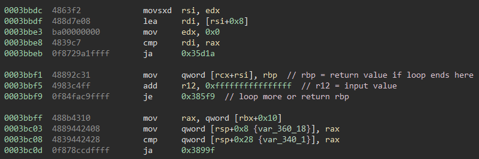
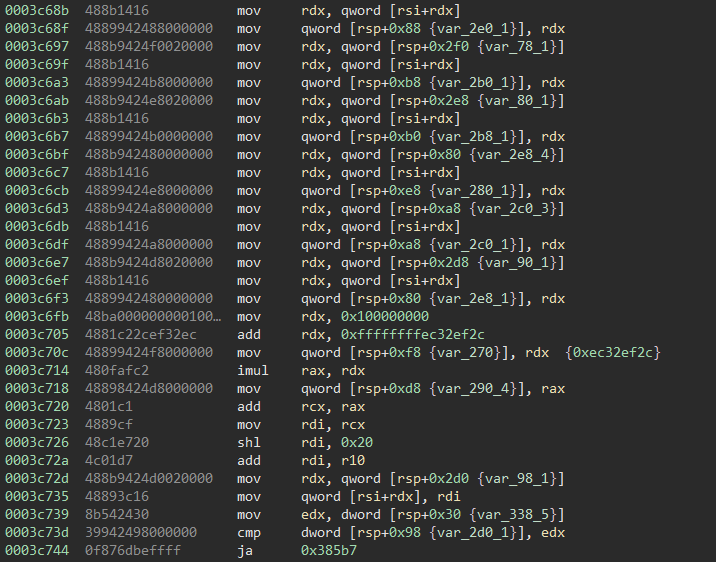

# Synergistic Hyperscale Interoperable Tokens

    Our Synergistic Hyperscale Interoperable Tokens allow protecting your data from even the most determined adversaries.
    Our performance focused architecture allows us to generate truly high-quality secrets that you can trust.
    Even if an attacker got a hold of our Secret Token Formulating Utility, through our Bleeding-edge Secure guarantee, we ensure that they cannot obtain the secrets that matter to your organization the most.

Synergistic Hyperscale Interoperable Tokens provides a Linux 4MB Rust binary and a service. The service asks for certain numbers being run as arguments on the binary, which outputs tokens for them. The binary is very slow though and it's infeasible to compute the tokens for the requested inputs.


## Solution

The binary luckily comes with symbols (which at least saves being stuck reversing Rust internals for half a day) but still has very large non-library/challenge-related functions.
They are all named "client::WasmModule::func_<id>"  (up to id 241) and contain very weird code (although that might just be Rust codegen).
Contrary to their naming, it doesn't seem like this is actually executing a WASM VM, but maybe it is WebAssembly transpiled to Rust?
 
The program crashes when supplied with no arguments, or when the first argument isn't a number.
Following the code execution (and which part the binary freezes when supplied with large input numbers) shows that `client::WasmModule::func_174::h36e0bfd11f57c262` and `client::WasmModule::func_53::h9761402b65816a8e` get executed from `0007f5f0  int64_t client::main::h556cebc31b99593e`, and most time calculating is spent in `client::WasmModule::func_15::he5b8622441173dc6`.




The program argument is converted to a 64bit integer and saved within `func_15` it is stored in register `r12`, tracing where it is used shows that it is only relevant to count how often this loop iterates (for input > 0).



Following the code execution from there shows that no function calls are done within the loop and most of it seems relevant to under- and overflow protection and other irrelevant code.
The interesting parts are relatively easy to spot (but still hard to understand). I sadly had no magic trick to make solving or understanding what is happening easy and instead did so very slowly by confirming every step dynamically in gdb.


The main logic of this program is based on it having 2x 10 element 128-bit number arrays.

```C
uint128 currentArray[10] = { /* some initial values */ };
uint128 newArray[10];
uint128 sumValue;

for(;inputValue>0;inputValue--) { // 0x3bbf5

    // 0x3c576
    newArray[9] = currentArray[0] * 0x654006A05AD681D0EC32EF2CA379F6EF; // 0x3c7ce
    newArray[8] = currentArray[1] * 0xF380C3E496070199646B9980E07FBDE6; // 0x38c9a 
    newArray[7] = currentArray[2] * 0x6154BEC0CD734930D005C98621B0A224; // 0x38ee1
    newArray[6] = currentArray[3] * 0x468F22365BD9E2ED0DED12B11AA38888; // 0x3910a
    newArray[5] = currentArray[4] * 0x603FFACC774E09F2895DD3AA6089713E; // 0x39359
    newArray[4] = currentArray[5] * 0x7BB0FFD1D80FB3212868836EDEE04734; // 0x395ab
    newArray[3] = currentArray[6] * 0x92C103F01E7DDCA6D313806DAD60830A; // 0x39822
    newArray[2] = currentArray[7] * 0xBA665904D9CE575BF63D4B112D6FD165; // 0x39a9b
    newArray[1] = currentArray[8] * 0x3B8EFD66D9AB488A4BDA5E346CF43679; // 0x39cdd
    newArray[0] = currentArray[9] * 0xAADC352D973570941C4EF5256BF7691F; // 0x39ee3
    
    // 0x3ab66
    for(int i=0;i<9;i++)
        currentArray[i] = currentArray[i+1];
    
    // 0x3b99d 
    sumValue = newArray[0] + newArray[1] + newArray[2] + newArray[3] + newArray[4] + newArray[5] + newArray[6] + newArray[7] + newArray[8] + newArray[9];
    
    // 0x3bafe
    currentArray[9] = sumValue;
}

return (uint64)sumValue;
```

Now we just need the initial values (or the `currentArray` values at a known iteration).

So after a quick breakpoint in gdb at `0x3bbf5` we have the `currentArray` after the first iteration.

```
gdb-peda$ x/20a $rsi+0x413cf0
0x7ffff78c7d00: 0xbdef1e03f8a42971      0x7c59a1115f898c02
0x7ffff78c7d10: 0x2ce572b38b540058      0x1d33f3fce0737437
0x7ffff78c7d20: 0x405943e2c746ef8a      0x29c91eb9cab7c67
0x7ffff78c7d30: 0x12da654bc29e00c       0xf4be5d2a92c9c93c
0x7ffff78c7d40: 0x4a901fc9b5e1f7ef      0x94aedb33a79acde6
0x7ffff78c7d50: 0x4707916c3f4f882c      0x2fc1c5cad1dbb675
0x7ffff78c7d60: 0x1e948b96dc61489       0x7953163b864eca95
0x7ffff78c7d70: 0x88c7af20a872b40f      0xa1ce9b3be90d1802
0x7ffff78c7d80: 0x2def3a950a3df2ee      0xf08d70b3923d1570
0x7ffff78c7d90: 0x173d73ea5e3d9e45      0xd4941922a13fe572
```

My first fully working python implementation looked like this:

```python
# data after first iteration
initData = [
    0x7c59a1115f898c02bdef1e03f8a42971,
    0x1d33f3fce07374372ce572b38b540058,
    0x029c91eb9cab7c67405943e2c746ef8a,
    0xf4be5d2a92c9c93c012da654bc29e00c,
    0x94aedb33a79acde64a901fc9b5e1f7ef,
    0x2fc1c5cad1dbb6754707916c3f4f882c,
    0x7953163b864eca9501e948b96dc61489,
    0xa1ce9b3be90d180288c7af20a872b40f,
    0xf08d70b3923d15702def3a950a3df2ee,
    0xd4941922a13fe572173d73ea5e3d9e45
]

# multiplication constants
multTable = [
    0x654006A05AD681D0ec32ef2ca379f6ef,
    0xf380c3e496070199646B9980E07FBDE6,
    0x6154BEC0CD734930D005C98621B0A224,
    0x468F22365BD9E2ED0DED12B11AA38888,
    0x603FFACC774E09F2895DD3AA6089713E,
    0x7BB0FFD1D80FB3212868836EDEE04734,
    0x92C103F01E7DDCA6D313806DAD60830A,
    0xBA665904D9CE575BF63D4B112D6FD165,
    0x3B8EFD66D9AB488A4BDA5E346CF43679,
    0xAADC352D973570941C4EF5256BF7691F
]

def calculateNext(values):
    return [(values[i] * multTable[i])&((2**128)-1) for i in range(10)][::-1]

def sumV(values):
    s = 0
    for d in values:
        s += d
        s &= (2**128)-1
    return s
    
data = initData

INPUT_VALUE = 27

for i in range(INPUT_VALUE-2):
    nextData = calculateNext(data)
    sumOfData = sumV(nextData)
    print(i+2, sumOfData&(2**64-1)) # iteration and output value

    for i in range(9):
        data[i] = data[i+1]
    data[-1] = sumOfData
```

While it is possible to optimize this further and run way faster natively, for the inputs requested (e.g. 17860729747217377493) this is still infeasibly slow.

By using a recurrence matrix it is possible to calculate the wanted depth way faster though, as it allows for logarithmic speed instead of linear.

```python
mtx = [
    [0,1,0,0,0,0,0,0,0,0],
    [0,0,1,0,0,0,0,0,0,0],
    [0,0,0,1,0,0,0,0,0,0],
    [0,0,0,0,1,0,0,0,0,0],
    [0,0,0,0,0,1,0,0,0,0],
    [0,0,0,0,0,0,1,0,0,0],
    [0,0,0,0,0,0,0,1,0,0],
    [0,0,0,0,0,0,0,0,1,0],
    [0,0,0,0,0,0,0,0,0,1],
    multTable
]
```

so now by calculating

```python
print((np.matmul(np.linalg.matrix_power(mtx, INPUT_VALUE-1), np.matrix.transpose(initData)))[9, 0]&(2**64-1))
```

It is possible to get the output token for large input values.
Note that in the [solution script](solve.py) I'm doing all the math on 64bit numbers, but this doesn't matter as the upper 64bit of the 128bit numbers are never used for anything.

With this it is now possible to calculate the tokens and get the flag!

```
$ nc synergistic.chal.pwni.ng 1337
hashcash -qmb24 782dcd001c3eab79374c
1:24:220409:782dcd001c3eab79374c::1FetKOOwMKjNwLgo:00000000000000000000000000000000000000001fGWv
[1/10] Produce a new secret token for 17860729747217377493
14374106084762345098
[2/10] Produce a new secret token for 15147372669834608516
10828245070329990904
[3/10] Produce a new secret token for 16662785504616378420
11866503141612552671
[4/10] Produce a new secret token for 16831935327532471480
10783774845812551478
[5/10] Produce a new secret token for 8821747144671330034
3496775970745821381
[6/10] Produce a new secret token for 9645784158016857605
9424360621800888175
[7/10] Produce a new secret token for 14365601667146450535
10066446322067701681
[8/10] Produce a new secret token for 1529582768984154719
269448959504278328
[9/10] Produce a new secret token for 6332495878073494928
1925389329404893998
[10/10] Produce a new secret token for 9912601586443166334
3659432410631191945
Congrats!
PCTF{rust2wasm2rust2wasm2rust_15a0fc7fa673ae85}
```