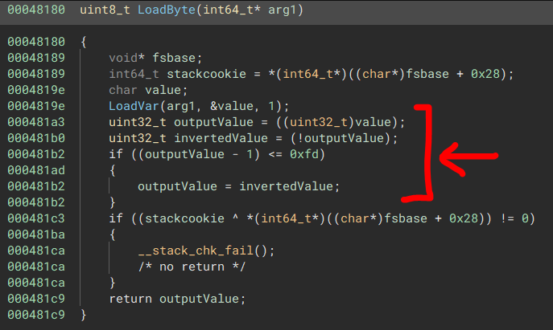
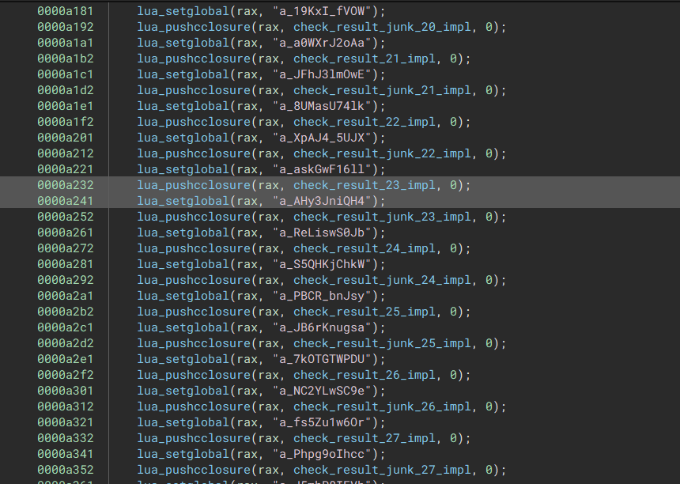
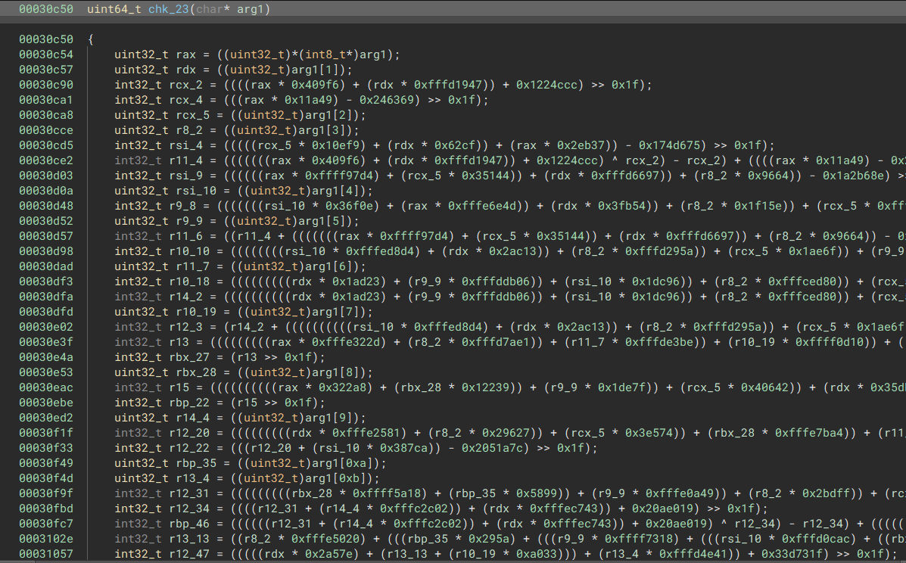

# RTTT

RTTT is a stripped Linux rust binary that takes some input.

## Solution

Since this is a stripped rust binary a large part of this task was just making educated guesses what the binary is doing and what the function do.
My understanding is that the program takes in a string, then generates a list of deterministic random values using the PCG algorithm (at `0xef38`).
It then sorts the position of the input string based on the random values at the same index (at `0xf1af`).
Then two vectors are created and xored with each other to the binary string `b'Welc0me to RCTF 2O22'` (at `0xf6a5`).

This xored vector together with the resorted input string go into the function at address `0xe310` which does some calculations but ultimately xors the shuffled input with some value calculated from the xored vector at `0xebc3`.
The output of this encryption operation is then compared against another vector at address `0xf9a8`.
If they match then another two vectors are xored resulting in `b'Congratulations'` (and it being printed to stdout), otherwise the program just exits.

From this the steps to solve it become apparent (not necessary in this order):

1. Get the array we compare against at the end

This is relatively simple because in the binary it's just sequentially byte writes to the memory address:

`vecThree = [0x34, 0xc2, 0x65, 0x2d, 0xda, 0xc6, 0xb1, 0xad, 0x47, 0xba, 6, 0xa9, 0x3b, 0xc1, 0xcc, 0xd7, 0xf1, 0x29, 0x24, 0x39, 0x2a, 0xc0, 0x15, 2, 0x7e, 0x10, 0x66, 0x7b, 0x5e, 0xea, 0x5e, 0xd0, 0x59, 0x46, 0xe1, 0xd6, 0x6e, 0x5e, 0xb2, 0x46, 0x6b, 0x31]`

The length of this is 42 so that is likely the wanted inputs length as well.

2. Get the  xor bytes which are used to encrypt the shuffled input

For this a breakpoint at `0xebc3` and just writing down the `cl` value for each index is enough (also verifying that the bytes are always the same independent of input can be seen here).

`xorKey = [0x77, 0xF5, 0x21, 0x69, 0xE3, 0xF7, 0x87, 0x98, 0x6A, 0xE8, 0x2B, 0x9E, 0x9, 0xEC, 0xE1, 0xAA, 0xC2, 0x1A, 0x16, 0x7d, 0x6F, 0xf0, 0x56, 0x40, 0x3b, 0x56, 0x5f, 0x38, 0x25, 0xDB, 0x69, 0xE7, 0x6F, 0x12, 0xD6, 0x92, 0x28, 0x6d, 0xf6, 0x05, 0x2e, 0x77]`

3. Get the order the input bytes are reordered in

Statically this could be derived from how the random values are calculated and the insertion into the tree works, dynamically we can just set a breakpoint at a point where the resorted array is visible (e.g. at the point where it is encrypted at `0xebc3`).

Then we just run the program 42 times with `"A"*(i) + "B" + "A"*(42-i-1)` and see where the `B` is sorted to:

```
BAAAAAAAAAAAAAAAAAAAAAAAAAAAAAAAAAAAAAAAAA ("AAAAAAAAAB", 'A' <repeats 32 times>, "\001")
ABAAAAAAAAAAAAAAAAAAAAAAAAAAAAAAAAAAAAAAAA ('A' <repeats 27 times>, "B", 'A' <repeats 14 times>, "\001")
AABAAAAAAAAAAAAAAAAAAAAAAAAAAAAAAAAAAAAAAA ('A' <repeats 33 times>, "BAAAAAAAA\001")
AAABAAAAAAAAAAAAAAAAAAAAAAAAAAAAAAAAAAAAAA ('A' <repeats 25 times>, "B", 'A' <repeats 16 times>, "\001")
AAAABAAAAAAAAAAAAAAAAAAAAAAAAAAAAAAAAAAAAA ('A' <repeats 28 times>, "B", 'A' <repeats 13 times>, "\001")
AAAAABAAAAAAAAAAAAAAAAAAAAAAAAAAAAAAAAAAAA ('A' <repeats 21 times>, "B", 'A' <repeats 20 times>, "\001")
AAAAAABAAAAAAAAAAAAAAAAAAAAAAAAAAAAAAAAAAA ('A' <repeats 37 times>, "BAAAA\001")
AAAAAAABAAAAAAAAAAAAAAAAAAAAAAAAAAAAAAAAAA ('A' <repeats 22 times>, "B", 'A' <repeats 19 times>, "\001")
AAAAAAAABAAAAAAAAAAAAAAAAAAAAAAAAAAAAAAAAA ('A' <repeats 16 times>, "B", 'A' <repeats 25 times>, "\001")
AAAAAAAAABAAAAAAAAAAAAAAAAAAAAAAAAAAAAAAAA ('A' <repeats 24 times>, "B", 'A' <repeats 17 times>, "\001")
AAAAAAAAAABAAAAAAAAAAAAAAAAAAAAAAAAAAAAAAA ("AAAAB", 'A' <repeats 37 times>, "\001")
AAAAAAAAAAABAAAAAAAAAAAAAAAAAAAAAAAAAAAAAA ('A' <repeats 23 times>, "B", 'A' <repeats 18 times>, "\001")
AAAAAAAAAAAABAAAAAAAAAAAAAAAAAAAAAAAAAAAAA ('A' <repeats 18 times>, "B", 'A' <repeats 23 times>, "\001")
AAAAAAAAAAAAABAAAAAAAAAAAAAAAAAAAAAAAAAAAA ('A' <repeats 13 times>, "B", 'A' <repeats 28 times>, "\001")
AAAAAAAAAAAAAABAAAAAAAAAAAAAAAAAAAAAAAAAAA ('A' <repeats 40 times>, "BA\001")
AAAAAAAAAAAAAAABAAAAAAAAAAAAAAAAAAAAAAAAAA ('A' <repeats 17 times>, "B", 'A' <repeats 24 times>, "\001")
AAAAAAAAAAAAAAAABAAAAAAAAAAAAAAAAAAAAAAAAA ('A' <repeats 30 times>, "B", 'A' <repeats 11 times>, "\001")
AAAAAAAAAAAAAAAAABAAAAAAAAAAAAAAAAAAAAAAAA ('A' <repeats 41 times>, "B\001")
AAAAAAAAAAAAAAAAAABAAAAAAAAAAAAAAAAAAAAAAA ('A' <repeats 14 times>, "B", 'A' <repeats 27 times>, "\001")
AAAAAAAAAAAAAAAAAAABAAAAAAAAAAAAAAAAAAAAAA ('A' <repeats 12 times>, "B", 'A' <repeats 29 times>, "\001")
AAAAAAAAAAAAAAAAAAAABAAAAAAAAAAAAAAAAAAAAA ('A' <repeats 36 times>, "BAAAAA\001")
AAAAAAAAAAAAAAAAAAAAABAAAAAAAAAAAAAAAAAAAA ('A' <repeats 38 times>, "BAAA\001")
AAAAAAAAAAAAAAAAAAAAAABAAAAAAAAAAAAAAAAAAA ("AAAAAAB", 'A' <repeats 35 times>, "\001")
AAAAAAAAAAAAAAAAAAAAAAABAAAAAAAAAAAAAAAAAA ("AAAAAAAAB", 'A' <repeats 33 times>, "\001")
AAAAAAAAAAAAAAAAAAAAAAAABAAAAAAAAAAAAAAAAA ("B", 'A' <repeats 41 times>, "\001")
AAAAAAAAAAAAAAAAAAAAAAAAABAAAAAAAAAAAAAAAA ("AAB", 'A' <repeats 39 times>, "\001")
AAAAAAAAAAAAAAAAAAAAAAAAAABAAAAAAAAAAAAAAA ('A' <repeats 11 times>, "B", 'A' <repeats 30 times>, "\001")
AAAAAAAAAAAAAAAAAAAAAAAAAAABAAAAAAAAAAAAAA ('A' <repeats 20 times>, "B", 'A' <repeats 21 times>, "\001")
AAAAAAAAAAAAAAAAAAAAAAAAAAAABAAAAAAAAAAAAA ("AAAAAAAAAAB", 'A' <repeats 31 times>, "\001")
AAAAAAAAAAAAAAAAAAAAAAAAAAAAABAAAAAAAAAAAA ("AAAAAAAB", 'A' <repeats 34 times>, "\001")
AAAAAAAAAAAAAAAAAAAAAAAAAAAAAABAAAAAAAAAAA ('A' <repeats 34 times>, "BAAAAAAA\001")
AAAAAAAAAAAAAAAAAAAAAAAAAAAAAAABAAAAAAAAAA ('A' <repeats 39 times>, "BAA\001")
AAAAAAAAAAAAAAAAAAAAAAAAAAAAAAAABAAAAAAAAA ('A' <repeats 26 times>, "B", 'A' <repeats 15 times>, "\001")
AAAAAAAAAAAAAAAAAAAAAAAAAAAAAAAAABAAAAAAAA ("AAAAAB", 'A' <repeats 36 times>, "\001")
AAAAAAAAAAAAAAAAAAAAAAAAAAAAAAAAAABAAAAAAA ('A' <repeats 19 times>, "B", 'A' <repeats 22 times>, "\001")
AAAAAAAAAAAAAAAAAAAAAAAAAAAAAAAAAAABAAAAAA ("AB", 'A' <repeats 40 times>, "\001")
AAAAAAAAAAAAAAAAAAAAAAAAAAAAAAAAAAAABAAAAA ('A' <repeats 31 times>, "BAAAAAAAAAA\001")
AAAAAAAAAAAAAAAAAAAAAAAAAAAAAAAAAAAAABAAAA ("AAAB", 'A' <repeats 38 times>, "\001")
AAAAAAAAAAAAAAAAAAAAAAAAAAAAAAAAAAAAAABAAA ('A' <repeats 35 times>, "BAAAAAA\001")
AAAAAAAAAAAAAAAAAAAAAAAAAAAAAAAAAAAAAAABAA ('A' <repeats 32 times>, "BAAAAAAAAA\001")
AAAAAAAAAAAAAAAAAAAAAAAAAAAAAAAAAAAAAAAABA ('A' <repeats 29 times>, "B", 'A' <repeats 12 times>, "\001")
AAAAAAAAAAAAAAAAAAAAAAAAAAAAAAAAAAAAAAAAAB ('A' <repeats 15 times>, "B", 'A' <repeats 26 times>, "\001")
```

This gives use the shuffle table:

`shuffleTable = {0: 9, 1: 27, 2: 33, 3: 25, 4: 28, 5: 21, 6: 37, 7: 22, 8: 16, 9: 24, 10: 4, 11: 23, 12: 18, 13: 13, 14: 40, 15: 17, 16: 30, 17: 41, 18: 14, 19: 12, 20: 36, 21: 38, 22: 6, 23: 8, 24: 0, 25: 2, 26: 11, 27: 20, 28: 10, 29: 7, 30: 34, 31: 39, 32: 26, 33: 5, 34: 19, 35: 1, 36: 31, 37: 3, 38: 35, 39: 32, 40: 29, 41: 15}`

and with this we can calculate the flag:


```
>>> array = bytes([xorKey[i]^vecThree[i] for i in range(42)])
>>> bytes([array[shuffleTable[i]] for i in range(42)])
b'RCTF{03C3E9B2-E37F-2FD6-CD7E-57C91D77DD61}'
```

# picStore(re)

picStore is a binary containing a lua runtime with symbols and a compiled lua thunk.

## Solution

Running strings on the binary shows that it is based on Lua 5.3, but when we look at the Lua bytecode file we can see that the signature does not match (first bytes are "1B 4C 75 61 AC" instead of the expected "1B 4C 75 61 53").
Comparing the compared file against normal Lua 5.3 quite a few similarities can be found but also a lot of values seem to be completely wrong.
Looking at them a bit it is noticeable that they are in fact the bit inverted of what is expected. Not all bytes are inverted though, so reversing the picStore binary to see the difference is necessary.

By following how the version byte is read in the normal Lua 5.3 source code we arrive at the `LoadByte` function in `lundump.c` (which in the binary does not have a symbol):



Indeed most bytes are inverted (which is not what the normal implementation does)!
This inverting is done for `LoadByte`, `LoadInt`, `LoadNumber` and `LoadInteger`:

```C
static lu_byte LoadByte (LoadState *S) {
  lu_byte x;
  LoadVar(S, x);
  lu_byte x2 = x;
  if(((x-1)&0xff) <= 0xFD) {
    x2 = ~x;
  }
  return x2;
}


static int LoadInt (LoadState *S) {
  int x;
  LoadVar(S, x);
  lu_byte* v1 = &x;
  for(int i=0;i<sizeof(x);i++) {
    if(((*v1-1)&0xff) <= 0xFD) {
        *v1 = ~*v1;
    }
    v1++;
  }
  return x;
}


static lua_Number LoadNumber (LoadState *S) {
  lua_Number x;
  LoadVar(S, x);
  lu_byte* v1 = &x;
  for(int i=0;i<sizeof(x);i++) {
    if(((*v1-1)&0xff) <= 0xFD) {
        *v1 = ~*v1;
    }
    v1++;
  }
  return x;
}


static lua_Integer LoadInteger (LoadState *S) {
  lua_Integer x;
  LoadVar(S, x);
  lu_byte* v1 = &x;
  for(int i=0;i<sizeof(x);i++) {
    if(((*v1-1)&0xff) <= 0xFD) {
        *v1 = ~*v1;
    }
    v1++;
  }
  return x;
}
```

With these patches to stock Lua 5.3 we can actually load the program and run it (though it will complain that some native functions are missing and not actually run).
Using `luac -l` we can now get a decent disassembly of the code. 
Personally I think luac's disassembly is still quite unreadable so I built [luadec](https://github.com/viruscamp/luadec) with the customized lua-5.3 and used that instead (sadly the decompilation seems to fail for the code).

```
; Function:        0_10
; Defined at line: 172
; #Upvalues:       1
; #Parameters:     1
; Is_vararg:       0
; Max Stack Size:  54

    0 [-]: GETTABUP  R1 U0 K0     ; R1 := U0["value_list"]
    1 [-]: MOVE      R2 R0        ; R2 := R0
    2 [-]: CALL      R1 2 2       ; R1 := R1(R2)
    3 [-]: NEWTABLE  R2 0 0       ; R2 := {} (size = 0,0)
    4 [-]: NEWTABLE  R3 48 0      ; R3 := {} (size = 48,0)
    5 [-]: LOADK     R4 K1        ; R4 := 105
    ...
  265 [-]: LOADK     R9 K256      ; R9 := 193
  266 [-]: SETLIST   R3 6 6       ; R3[250] to R3[255] := R4 to R9 ; R(a)[(c-1)*FPF+i] := R(a+i), 1 <= i <= b, a=3, b=6, c=6, FPF=50
  267 [-]: LOADK     R4 K73       ; R4 := 1
  268 [-]: LEN       R5 R1        ; R5 := #R1
  269 [-]: LOADK     R6 K73       ; R6 := 1
  270 [-]: FORPREP   R4 21        ; R4 -= R6; pc += 21 (goto 292)
  271 [-]: LOADK     R8 K257      ; R8 := "xor"
  272 [-]: GETTABUP  R8 U0 R8     ; R8 := U0[R8]
  273 [-]: GETTABLE  R9 R1 R7     ; R9 := R1[R7]
  274 [-]: SUB       R10 R7 K73   ; R10 := R7 - 1
  275 [-]: CALL      R8 3 2       ; R8 := R8(R9 to R10)
  276 [-]: SETTABLE  R1 R7 R8     ; R1[R7] := R8
  277 [-]: LOADK     R8 K257      ; R8 := "xor"
  278 [-]: GETTABUP  R8 U0 R8     ; R8 := U0[R8]
  279 [-]: GETTABLE  R9 R1 R7     ; R9 := R1[R7]
  280 [-]: LOADK     R10 K128     ; R10 := 255
  281 [-]: CALL      R8 3 2       ; R8 := R8(R9 to R10)
  282 [-]: SETTABLE  R1 R7 R8     ; R1[R7] := R8
  283 [-]: GETTABLE  R8 R1 R7     ; R8 := R1[R7]
  284 [-]: BAND      R8 R8 K128   ; R8 := R8 & 255
  285 [-]: SETTABLE  R1 R7 R8     ; R1[R7] := R8
  286 [-]: LEN       R8 R2        ; R8 := #R2
  287 [-]: ADD       R8 R8 K73    ; R8 := R8 + 1
  288 [-]: GETTABLE  R9 R1 R7     ; R9 := R1[R7]
  289 [-]: ADD       R9 R9 K73    ; R9 := R9 + 1
  290 [-]: GETTABLE  R9 R3 R9     ; R9 := R3[R9]
  291 [-]: SETTABLE  R2 R8 R9     ; R2[R8] := R9
  292 [-]: FORLOOP   R4 -22       ; R4 += R6; if R4 <= R5 then R7 := R4; PC += -22 , goto 271 end
  293 [-]: LOADK     R4 K258      ; R4 := "a_AHy3JniQH4"
  294 [-]: GETTABUP  R4 U0 R4     ; R4 := U0[R4]
  295 [-]: MOVE      R5 R2        ; R5 := R2
  296 [-]: CALL      R4 2 2       ; R4 := R4(R5)
  297 [-]: EQ        0 R4 K73     ; if R4 == 1 then goto 299 else goto 302
  298 [-]: JMP       R0 3         ; PC += 3 (goto 302)
  299 [-]: LOADBOOL  R4 1 0       ; R4 := true
  300 [-]: RETURN    R4 2         ; return R4
  301 [-]: JMP       R0 2         ; PC += 2 (goto 304)
  302 [-]: LOADBOOL  R4 0 0       ; R4 := false
  303 [-]: RETURN    R4 2         ; return R4
  304 [-]: RETURN    R0 1         ; return
```
The most interesting function is the function `0_10` used as `check_func` (See disassembly.txt for the full disassembly.)

The function gets a value list from the program, then builds a 256 byte list, and in a loop encrypts the value list.
The output of this encryption is then run through the function with the name `a_AHy3JniQH4` and if it outputs 1 will return true or else false.
If the output is true the program will output `"now, you know the flag~"` otherwise `"you fail!"`.



The `main` function of the picStore binary registers quite a few native functions, the `a_AHy3JniQH4` function corresponds to the native `check_result_23_impl` function, which contains some lua to C logic which then gives the array to the `chk_23` function.



The `chk_23` function in the end is heavily obfuscated and impossible to just read.
Trying to angr or directly symbolically solve the decompiled output didn't yield anything in a reasonable time and after checking it made sense why:

```C
  v1 = a1[0];
  v2 = a1[1];
  v3 = a1[2];
  v4 = a1[3];
  v5 = a1[4];
  v6 = a1[5];
  v7 = a1[6];
  v8 = a1[7];
  v10 = abs32(-236927 * v4+ 160169 * v5 + 41685 * v1 + -212842 * v7 + -189738 * v2 + 154401 * v3 - 230228 * v8 + 128214 * v6+ 30252865)
      + abs32(-34520 * v7 + 162797 * v5 + 6659 * v6 + -271188 * v3 + -174919 * v1 + 275012 * v4 - 76091 * v2 - 58044891)
      + abs32(-133824 * v5 + 264084 * v1 + 228954 * v3 + 255695 * v2 + 28625 * v6 - 26349 * v4 - 17179897)
      + abs32(157792 * v3 + -154611 * v4 + 144762 * v5 + 279204 * v2 + 63409 * v1 - 4498569)
      + abs32(159298 * v4 + -260026 * v2 - 49856 * v3 + 138310 * v1 - 54756696)
      + abs32(-147558 * v1 + 270817 * v3 - 85118 * v2 + 10280335)
      + abs32(87702 * v1 - 12015174)
      + abs32(273078 * v2 - 214016 * v1 + 29047114);
```
The function and other `chk` functions essentially do a sequence of operations like this (this is from chk_29).
The `abs32` is derived from the pattern of `y = x >> 31;  (x^y)-y` which is equal to `abs32`.
The first problem here is that is not obvious what value these formulas are calculating as the output is determined if the last two values calculated this way are equal.
The second problem is if you sequentially try to solve for this then the "first" equation has 8 unknown variables, the second 7, etc.
If we try to solve it without any further assumptions then this will never finish for all 30 bytes the function uses in the calculations.

One interesting thing though is that if we look at the smallest first term `abs32(87702 * v1 - 12015174)` which only has one unknown, and then try all possible byte values we can see that there is a solution where the output is 0 (for `v1 == 137`).
If we repeat this by ordering the terms by the amount of unknowns they contain and thus solve one new unknown each time we can see there is always one byte value for which the output is 0.

So if we assume we want all inputs to the absolute calculation to be 0 (and thus the sum of them also to be zero) we can calculate the result in a way more constrained way as we can solve each block that uses new input in order and do not have to solve for all 30 unknown bytes at the same time.
If we take it as is we still have the problem that a solver would try to first solve for the term with 8 unknowns first and then constrain it more by the following terms.
This is very inefficient and may not reasonable terminate either, so we also need to sort all these additions in order of the amount of unknown variables (like we did before when calculating for the 0 points manually).

Cleaning this up and then testing it with [KLEE](https://klee.github.io/) with the following configurations for running and abs32 (see `kleeMe.c` for the full file):

```C
int main() {
    unsigned char input[30];
	klee_make_symbolic(input, 30, "input");
    int res = chk_23(input);
    return res;
}

int abs32(int x) {
    klee_assume(x == 0);
    return 0;
}
```

Solves for the following bytes:

```
ktest file : './klee-out-1/test000001.ktest'
args       : ['kleeMe.bc']
num objects: 1
object 0: name: 'input'
object 0: size: 30
object 0: data: b'!\x92\xd0\xcf34\xe6\xbe\xc7\xd3n3\xcf\xbe.3O\xb7Ig*g\xc5S\xdd\x1d\xd1\xf0\xc2\x1a'
object 0: hex : 0x2192d0cf3334e6bec7d36e33cfbe2e334fb749672a67c553dd1dd1f0c21a
object 0: text: !...34....n3...3O.Ig*g.S......
```


Now looking back at the Lua Bytecode the encryption operation is equal to 

```python
def encrypt(inputValues):
    output = []
    for i in range(30):
        a = inputValues[i]^((i-1)&0xff)
        b = a^0xff
        output.append(byteTable[b])
```

So if we reverse these operations for valid input we get:

```
byteTable = "69f43f0a18a9f86b818a19b660b00e5938e5ce13171516c6b3a798421cc9d550a29766245b253211aa29035455e283264720128e462770dc10db9fde0b7763cb2f94b9375d30997101ed234b439ba14a6c4cb5e9ba2c7de858085fa3c8f978f3aed4fcea3a65e4566d90687975570f840c14a573888776454402527bfafb35ff33ddd3c3918cfe00742b1dd9c5b7a8bc22da92936295f6b4672128cfd0c08f1a9ae1648daf7ce63eb1cd6ecafdad2e3472a4a6899e7a0d53b285bdbb07b84df5d8bec2489dacabc7a02d311bcc51065c3bd1ef82613dd6d7495a7e2a1ef04fe04edf6f3c0405c4e76a408beb96e3eebf7f1f9c36f1f286f780415e39d2ec09c1"
validInput = "2192d0cf3334e6bec7d36e33cfbe2e334fb749672a67c553dd1dd1f0c21a"

byteTable = bytes.fromhex(byteTable)
validInput = bytes.fromhex(validInput)

invertedByteTable = {}
for i in range(0x100):
    invertedByteTable[byteTable[i]] = i

flag = ""
for i in range(30):
    v = invertedByteTable[validInput[i]]
    flag += (chr((v^0xff)^i))

print(flag)
```

`>>> flag{U_90t_th3_p1c5t0re_fl49!}`