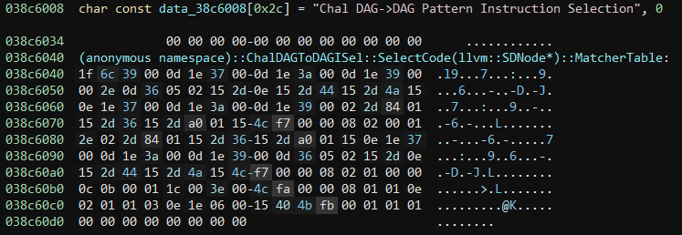

# backend

    Description:
    We have this weird compiler. Can you make it output '\x00' in code section?
    
backend provides a service and a modified unstripped LLVM 15.0.0rc3 static compiler binary. 
The service takes a file as input and then runs `./llc -filetype=obj -march=chal test.ll` and `"objcopy -O binary --only-section=.text test.o ans` on it, and if the `ans` file contains exactly one `00` byte then the flag is given.

    
## Solution

As a first step I tried some LLVM IR inputs for the added `chal` architecture to see what happens.
For most inputs the llc crashes at `LLVM ERROR: Cannot select: ` which if we run llc with `-debug` shows that this is coming from the `Instruction selection` step.
More precisely the `Chal DAG->DAG Pattern Instruction Selection`. Looking into the binary we can find the relevant code for it under `ChalDAGToDAGISel`.

So what is happening is that during the internal LLVM Data Dependence Graph to `Chal Native Code` translation not valid translations for our input are found.
Presumably there is one specific DAG input that generates the `00` byte we want in our output and everything else will be invalid. 


Looking how the actual code selection works, what is happening is that a MatcherTable which encodes a state-machine used for decoding instructions is supplied to [`llvm::SelectionDAGISel::SelectCodeCommon`](https://github.com/llvm/llvm-project/blob/release/15.x/llvm/lib/CodeGen/SelectionDAG/SelectionDAGISel.cpp#L2792).



So by understanding how the `SelectCodeCommon` function and the instruction matching state-machine work, it will be possible to figure out how the required input program should look like.

The opcode table for the state machine can be found [here](https://github.com/llvm/llvm-project/blob/release/15.x/llvm/include/llvm/CodeGen/SelectionDAGISel.h#L117).
The opcode table for the input LLVM DAG can be found [here](https://github.com/llvm/llvm-project/blob/release/15.x/llvm/include/llvm/CodeGen/ISDOpcodes.h#L40).

Based on those together with the source I manually reconstructed the MatcherTable to this:

```
OPC_SwitchOpcode
    Case Opcode: 0x039 "MUL"
        OPC_MoveChild0
        OPC_CheckOpcode (Opcode: ADD) 
        OPC_MoveChild0       
        OPC_CheckOpcode (Opcode: SDIV)
        OPC_MoveChild0
        OPC_CheckOpcode (Opcode: MUL)
        OPC_SCOPE
            Try:
                OPC_MoveChild0
                OPC_CheckOrImm (Val: 0x05)
                OPC_RecordChild0
                OPC_MoveParent
                OPC_CheckChild1Integer (Val: 0x07)
                OPC_MoveParent
                OPC_CheckChild1Integer (Val: 0x22)
                OPC_MoveParent
                OPC_CheckChild1Integer (Val: 0x25)
                OPC_MoveParent
                OPC_MoveChild1
                OPC_CheckOpcode (Opcode: ADD) 
                OPC_MoveChild0       
                OPC_CheckOpcode (Opcode: SDIV)
                OPC_MoveChild0
                OPC_CheckOpcode (Opcode: MUL)
                OPC_RecordChild0
                OPC_CheckChild1Integer (Value 0x42)
                OPC_MoveParent
                OPC_CheckChild1Integer (Value 0x1b)
                OPC_MoveParent
                OPC_CheckChild1Integer (Value 0x50)
                OPC_MoveParent
                OPC_MorphNodeTo1 (f7 00 00 08 02 00 01)
            Catch:
                OPC_RecordChild0
                OPC_CheckChild1Integer (Val: 0x42)
                OPC_MoveParent
                OPC_CheckChild1Integer (Val: 0x1b)
                OPC_MoveParent
                OPC_CheckChild1Integer (Val: 0x50)
                OPC_MoveParent
                OPC_MoveChild1
                OPC_CheckOpcode (Opcode: ADD) 
                OPC_MoveChild0       
                OPC_CheckOpcode (Opcode: SDIV)
                OPC_MoveChild0
                OPC_CheckOpcode (Opcode: MUL)
                OPC_MoveChild0
                OPC_CheckOrImm (Val: 0x05)
                OPC_RecordChild0
                OPC_MoveParent
                OPC_CheckChild1Integer (Val: 0x07)
                OPC_MoveParent
                OPC_CheckChild1Integer (Val: 0x22)
                OPC_MoveParent
                OPC_CheckChild1Integer (Val: 0x25)
                OPC_MoveParent
                OPC_MorphNodeTo1 (f7 00 00 08 02 01)
    Case Opcode: 0x00b "Constant"
        OPC_RecordNode
        OPC_CheckPredicate (Predicate: 00)
        OPC_EmitConvertToTarget (RecNo: 0)
        OPC_MorphNodeTo1 (fa 00 00 08 01 01)
    Case Opcdoe  0x102 "BR"
        OPC_RecordNode
        OPC_RecordChild1
        OPC_MoveChild1
        OPC_CheckOpcode (Opcode: BasicBlock)
        OPC_MoveParent
        OPC_EmitMergeInputChains1_0
        OPC_MorphNodeTo0 (fb 00 01 01 01) 
```
 
The only interesting part of it was to make sure the `OPC_CheckChild1Integer` values were correctly decoded as in the original program:

```
def GetVBR(vals):
    index = 0
    if (vals[0] & 128) == 0: return vals[0]
    index = 0
    shift = 0
    nextBits = vals[0]
    val = (nextBits&127)
    while (nextBits & 128) != 0:
        shift += 7
        index += 1
        nextBits = vals[index]
        val |= (nextBits&127) << shift
    return val
    
def decodeSignRotatedValue(val):
    if((val&1) == 0):
        return val >> 1
    if (val != 1):
        return -(v >> 1)
    return 1 << 63

def decode(vals):
    vbr = GetVBR(vals)
    dec = decodeSignRotatedValue(vbr)
    return hex(dec)

# Constant Values to decode
print(decode([0x0e]))
print(decode([0x44]))
print(decode([0x4a]))
print(decode([0x84, 0x01]))
print(decode([0x36]))
print(decode([0xa0, 0x01]))
```

Luckily there is no need to understand most instructions, to see what the challenge wants us to do.
The first switch case is what we are interested in:

    - If the node we are looking at is a multiplication (`%v  = mul i64 %p0, %q0`)
    - Move to the first child, check it is an addition (`%p0 = add i64 %p1, ??`)
    - Move to the first child, check it is a signed division  (`%p1 = sdiv i64 %p2, ??`)
    - Move to the first child, check it is a multiplication (`%p2 = mul i64 ??, ??`)
    - Try:
        - Move to the first child of `p2`, check it is a logical or operation with the constant `5` (`%o0 = or i64 ??, 5`)
        - Check that `p2`'s second child is a constant with the value `7`
        - Check that `p1`'s second child is a constant with the value `34`
        - Check that `p0`'s second child is a constant with the value `37`
        - Move to the second child of `v` and check that it is an addition (`%q0 = add i64 %q1, ??`)
        - Move to the first child, check that it is an addition (`%q0 = add i64 %q1, ??`)
        - Move to the first child, check it is a signed division  (`%q1 = sdiv i64 %q2, ??`)
        - Move to the first child, check it is a multiplication (`%q2 = mul i64 ??, ??`)
        - Check that `q2`'s second child is a constant with the value `66`
        - Check that `q1`'s second child is a constant with the value `27`
        - Check that `q0`'s second child is a constant with the value `80`
        - GENERATE `00`
    - Catch:
        - Check that `p2`'s second child is a constant with the value `66`
        - Check that `p1`'s second child is a constant with the value `27`
        - Check that `p0`'s second child is a constant with the value `80`
        - Move to the second child of `v` and check that it is an addition (`%q0 = add i64 %q1, ??`)
        - Move to the first child, check that it is an addition (`%q0 = add i64 %q1, ??`)
        - Move to the first child, check it is a signed division  (`%q1 = sdiv i64 %q2, ??`)
        - Move to the first child, check it is a multiplication (`%q2 = mul i64 ??, ??`)
        - Move to the first child of `q2`, check it is a logical or operation with the constant `5` (`%o0 = or i64 ??, 5`)
        - Check that `q2`'s second child is a constant with the value `7`
        - Check that `q1`'s second child is a constant with the value `34`
        - Check that `q0`'s second child is a constant with the value `37`
        - GENERATE `00`

This gives two valid paths for generating the `00` byte we want.

```
define i64 @f() #1  {
entry:
    %some = add i64 0, 42
    br label %middle
middle:
    %o0 = or i64 %some, 5

    %q2 = mul i64 %o0, 7
    %q1 = sdiv i64 %q2, 34
    %q0 = add i64 %q1, 37

    %p2 = mul i64 %some, 66
    %p1 = sdiv i64 %p2, 27
    %p0 = add i64 %p1, 80

    %v  = mul i64 %p0, %q0

    br label %end
end:
    ret i64 %v
}

attributes #1 = { noinline nounwind optnone ssp uwtable }
```

This very simple program fulfills the `catch` path of the parsing and yields the `00` byte as expected.
The program is split into 3 basic blocks so the data dependency doesn't optimize any of the values away. `%some = add i64, 0, 42` is represented as `%some = 42` during the DAG Instruction selection and is put into a separate basic block to prevent constant propagation to simplify the `middle` block. The `end` block is needed so the instructions in `middle` are evaluated at all.

Giving this program to the remote server yields the flag:
    `flag{I_fa1led_to_find_any_minimal_llvm_Target_example_online_|so_this_one_is_MANUALLY_minimized_fr0m__bpf_:(}`