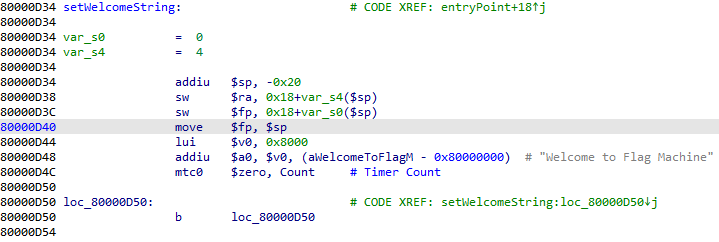

# flash-1

flash-1 is a raw MIPS image for qemu that requests the flag as input and verifies the correctness of it.

## Solution

Initially the first few sections of the image are loaded at address `0xBFC00000` which then continues to load more of the binary file into memory at address `0x80000000`.
The entry point for the loaded code starts at `0x80000500` which is at offset `0x10500` in the file.

Following the code flows shows many blocks of code that all end with interaction with co-processor 0 and a `while(1);` loop



Based on some interrupt, code is executed that redirects code flow from these loops to new blocks of code, fully understanding how exactly is done wasn't necessary to solve this challenge though:

The first flag input is saved starting at address `0x80008004`, setting a read/write watch-point for that address shows that initially the input is checked to start with `flag{` and to end with `}`,
after this the `flag{` and `}` part of the input are removed and the content between the brackets now resides at the initial `0x80008004` address.

Following the content we end up at address `0x80000B94` where 2 byte blocks of the flag are read and further moved around.
To get a grasp of the further code flow I created a list of breakpoints for all 'code blocks' that end in loops and a list for all conditional jumps.

The next relevant part of code is a multiplication (I've entered `flag{AABBCCDD}`, 0x4444 is the `DD` block in this case):

```
─────────────────────────────────────[ REGISTERS ]──────────────────────────────────────
 V0   0x4444
 V1   0x11
 A0   0x11
 A1   0x4
 A2   0x8
...
 PC   0x80000960
───────────────────────────────────────[ DISASM ]───────────────────────────────────────
 ► 0x80000960    mul    $v0, $v1, $v0
   0x80000964    move   $v1, $v0
   0x80000968    lui    $v0, 0x8000
   0x8000096c    addiu  $v0, $v0, 0x3d24
   0x80000970    sw     $v1, 4($v0)
   0x80000974    mtc0   $zero, $t1, 0
   0x80000978    b      0x80000978
────────────────────────────────────────────────────────────────────────────────────────
```

All 2 byte blocks go through this code, are multiplied with 17 and stored into memory.
What's interesting here is that the order the character blocks are processed in is reversed from what they were initially in the entered text.

Now the multiplication results are further used:

```
─────────────────────────────────────[ REGISTERS ]──────────────────────────────────────
 V0   0xb248
 V1   0x48884
 A0   0xb248
 A1   0x4
 A2   0x8
...
 PC   0x800009a4
───────────────────────────────────────[ DISASM ]───────────────────────────────────────
 ► 0x800009a4    divu   $zero, $v1, $v0
   0x800009a8    mfhi   $v0
   0x800009ac    andi   $v0, $v0, 0xffff
   0x800009b0    move   $a0, $v0
   0x800009b4    mtc0   $zero, $t1, 0
   0x800009b8    b      0x800009b8
────────────────────────────────────────────────────────────────────────────────────────
```

The `divu` + `mfhi` combination gets the reminder of the division, so for the `DD` block `0x4444*0x11 = 0x48884`, `0x48884 mod 0xb248 =  0x5ad4`.
`0xb248` is again a constant used for all character blocks.

Lastly the reminder is put into an exclusive-or operation with another hard-coded value which differs depending on the index of the character block.

```
─────────────────────────────────────[ REGISTERS ]──────────────────────────────────────
 V0   0x5ad4
 V1   0x72a9
 A0   0x72a9
 A1   0x4
 A2   0x8
...
 PC   0x80000a44
───────────────────────────────────────[ DISASM ]───────────────────────────────────────
 ► 0x80000a44    xor    $v0, $v1, $v0
   0x80000a48    sltiu  $v0, $v0, 1
   0x80000a4c    andi   $v0, $v0, 0xff
   0x80000a50    andi   $v0, $v0, 0xffff
   0x80000a54    move   $a0, $v0
   0x80000a58    mtc0   $zero, $t1, 0
   0x80000a5c    b      0x80000a5c
────────────────────────────────────────────────────────────────────────────────────────
```

Depending on the result `v0` is either set to 1 if `v0^v1 == 0` or to 0 if ``v0^v1 != 0`.
If the calculated result does not match the hard-coded value then no further character blocks are run through the calculation and the "Try again!" code is executed.

The hard-coded xor values can be found at address `0x80003D72` being 11 elements separated from each other when interpreted as an array of `uint16_t`'s.

Based on this a quick script calculates the flag:

```python
# from 0x80003D72
hardcoded = [0x72A9, 5, 7, 0x144, 9, 0x11, 2, 9, 0xB248, 3, 9 ,0x97E, 5, 7, 0x12E, 9, 0x11, 2, 9, 0xB248, 3, 9,0x5560, 5, 7, 0x118, 9, 0x11, 2, 9, 0xB248, 3, 9,0x4CA1, 5, 7, 0x102, 9, 0x11, 2, 9, 0xB248, 3, 9,0x37, 5, 7, 0xEC, 9, 0x11, 2, 9, 0xB248, 3, 9, 0xAA71,5, 7, 0xD6, 9, 0x11, 2, 9, 0xB248, 3, 9, 0x122C,5, 7, 0xC0, 9, 0x11, 2, 9, 0xB248, 3, 9, 0x4536,5, 7, 0xAA, 9, 0x11, 2, 9, 0xB248, 3, 9, 0x11E8,5, 7, 0x94, 9, 0x11, 2, 9, 0xB248, 3, 9, 0x1247,5, 7, 0x7E, 9, 0x11, 2, 9, 0xB248, 3, 9, 0x76C7,5, 7, 0x68, 9, 0x11, 2, 9, 0xB248, 3, 9, 0x96D, 5,7, 0x52, 9, 0x11, 2, 9, 0xB248, 3, 9, 0x122C, 5,7, 0x3C, 9, 0x11, 2, 9, 0xB248, 3, 9, 0x87CB, 5,7, 0x26, 9, 0x11, 2, 9, 0xB248, 3, 9, 0x9E4, 5, 7,0x10, 9, 0x91D, 7, 8, 9, 0, 0xB, 0xD, 9, 1, 0xB,0xD, 0xE4DD, 0xAC7C, 0x6C6C, 0xC81B, 0xB4D8, 0x5B36]

# create a table matching the  (0x11*block)%0xb248 result to the corresponding characters
table = {}
for c1 in range(0x7f):
    for c2 in range(0x7f):
        v = (0x11*(c1 + (c2<<8))) % 0xb248
        table[v] = chr(c2)+chr(c1)
 
# use the lookup table with the hardcoded xor values
l = [table[hardcoded[11*i]] for i in range(15)]

# reverse the character blocks as done in the binary
l.reverse()
print(''.join(l))
```

And indeed the result is correct:

