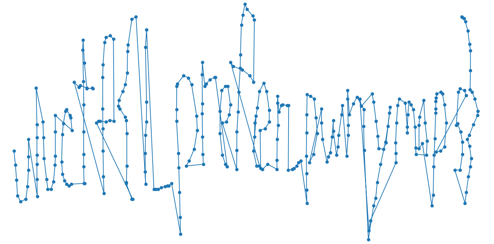

# Pwnymaps

    My friend gave me his address, but the coords he gave are n dimensional... Can you help me setup my GPS to find him?


Pwnymaps is a challenge that verifies a list of coordinates which when ploted reveal the flag.

## Solution

The binary first asks for the "complexity" which means the amount of points you want to provide as input and have verified.
From the verification arrays the maximum seems to be 335 points.


The code takes the x and y coordinates in for each iteration and encodes them into 8 bytes.
These 8 bytes are xored in 16-bit pairs together and checked if the hash of their hamming weight matches an stored value for the index.
If all points pass this check then they are encoded further and checked against a `correct` array.
After all points pass this check as well we get `You have reached your destination. PWNYMAPS does not support route plotting yet.` back from the binary.


```python
def encode(x, y):
    x = x & 0xffffffff
    y = y & 0xffffffff
    
    p0 = ((y >> 0x1c) | ((x << 4) & 0xff0))&0xffff
    p1 = (y >> 0x10) & 0xfff
    numToEncode = p0 | (EncodeMorton48((x >> 8), p1) << 0xc)

    nums = [Unpad64_8(numToEncode >> i)&0xff for i in range(8)]
    
    tmp = nums[1]
    nums[1] = nums[5]
    nums[5] = tmp

    rdx_27 =  ((nums[0] << 8) | nums[1]) ^  (nums[3] | (nums[2] << 8))
    rax_111 = ((nums[7] | (nums[6] << 8)) ^ (rdx_27 ^ (nums[5] | (nums[4] << 8))))
    rax_113 = numberOfSetBits(rax_111)
    
    # hash(rax_113) == correct_checksums[index]
    
    rdx_36 = ((nums[1] >> 1) & 0x40) | ((nums[2] >> 2) & 0x20) | ((nums[3] >> 3) & 0x10) | ((nums[4] >> 4) & 8) | ((nums[5] >> 5) & 4) | ((nums[6] >> 6) & 2) | ((nums[7] >> 7) & 1)
    
    encodeInput = [(nums[0] & 0x7f), (nums[1] & 0x7f), 
        (nums[2] & 0x7f), (nums[3] & 0x7f), (nums[4] & 0x7f), (nums[5] & 0x7f),
        (nums[6] & 0x7f), (nums[7] & 0x7f), rdx_36]
    rax_245 = EncodeMorton9x7(encodeInput)
    
    rax_245_2 = (nums[0] >> 7) << 0x3f
    res = (rax_245 | rax_245_2)
    return rax_113, res
```

The most simple way to solve this is to just let `z3` solve it.
[The solve script for that is here](z3solve.py)

The more fun way of solving this by actually decoding the `correct` array.

```python
p0 = ((y>>0x1c) | ((x << 4) & 0xff0))&0xffff
p1 = (y>>0x10) & 0xfff

numToEncode = p0 | (EncodeMorton48((x>>8), p1) << 0xc)
```

Note here that the first 16 bits of `y` are disgarded. 
Starting at the top we generate the number we encode into 8 bytes.
This number consists out of different parts of `x` and `y` and can be expressed like this:


```python
nums = [(Unpad64_8((numToEncode>>i)) )&0xff for i in range(8)]

tmp = nums[1]
nums[1] = nums[5]
nums[5] = tmp
```

Then we 8x8 bit values out:


```python
rdx_36 = ((nums[1]>>1) & 0x40) | ((nums[2]>>2) & 0x20) | ((nums[3]>>3) & 0x10) | ((nums[4]>>4) & 8) | ((nums[5]>>5) & 4) | ((nums[6]>>6) & 2) | ((nums[7]>>7) & 1)

encodeInput = [(nums[0] & 0x7f), (nums[1] & 0x7f), 
    (nums[2] & 0x7f), (nums[3] & 0x7f), (nums[4] & 0x7f), (nums[5] & 0x7f),
    (nums[6] & 0x7f), (nums[7] & 0x7f), rdx_36]
rax_245 = EncodeMorton9x7(encodeInput)

rax_245_2 = (nums[0]>>7) << 0x3f
res = (rax_245 | rax_245_2)
```

Then we split the 8x8 bit blocks into 9x7 bit blocks (+ one):


From this we can see how the bits are shuffeled and just extract them directly:

```python
correct = # encoded data from the binary
# see diagrams
bittable_y = {0: 28, 2: 30, 3: 31, 5: 29, 10: 16, 16: 17,19: 20, 21: 19, 23: 18, 25: 21, 28: 24, 30: 23, 32: 22, 34: 25, 39: 27, 41: 26 }
bittable_x = {1: 1, 4: 0, 6: 2, 7: 3, 9: 4, 11: 6, 12: 7, 13: 8, 14: 5, 15: 9, 18: 10, 20: 11, 22: 12, 24: 13, 27: 14, 29: 15, 31: 16, 33: 17, 36: 18, 38: 19, 40: 20, 42: 21, 45: 22, 47: 23, 49: 24, 51: 25, 53: 31, 54: 26, 56: 27, 58: 28, 60: 29, 63: 30 }


print(len(correct))
for entry in correct:   
    x = 0
    y = 0
    # extract the bits and place them at the correct position
    for i in range(64):
        v = (entry>>i)&1
        if v == 0: continue
        if i in bittable_y:
            y = y | (1 << bittable_y[i])
        if i in bittable_x:
            x = x| (1 << bittable_x[i])
    print(x, y)
```

This also gives us valid input for the binary and coordinates to plot for the flag.


Plotting these points gives us this pretty hard to read mess:



A bit of manual cleaning up:


And a bit of guessing (hints on the bad handwriting were released later): `uiuctf{i_prefer_pwnymaps}`

# Determined 

    "It is my experience that proofs involving matrices can be shortened by 50% if one throws the matrices out."

    Emil Artin
    
## Solution

We have a remote that asks us for input for specific values of a matrix and then gives us the determinant of it back:

```python
var('p q r v02 v04 v11 v13 v20 v22 v24 v40 v42')

M = Matrix([
    [p, 0, v02, 0, v04],
    [0, v11, 0, v13, 0],
    [v20, 0, v22, 0, v24],
    [0, q, 0, r, 0],
    [v40, 0, v42, 0, 0],
])

M.det()
# -r*v04*v11*v22*v40 + q*v04*v13*v22*v40 + r*v02*v11*v24*v40 - q*v02*v13*v24*v40 + r*v04*v11*v20*v42 - q*v04*v13*v20*v42 - p*r*v11*v24*v42 + p*q*v13*v24*v42

```

We control `v02`, `v04`, `v11`, `v13`, `v20`, `v22`, `v24`, `v40`, `v42`.
`p`, `q` and `r` are unknown to us.

We are additionally given

```python
n = 158794636700752922781275926476194117856757725604680390949164778150869764326023702391967976086363365534718230514141547968577753309521188288428236024251993839560087229636799779157903650823700424848036276986652311165197569877428810358366358203174595667453056843209344115949077094799081260298678936223331932826351
e = 65535
c = 72186625991702159773441286864850566837138114624570350089877959520356759693054091827950124758916323653021925443200239303328819702117245200182521971965172749321771266746783797202515535351816124885833031875091162736190721470393029924557370228547165074694258453101355875242872797209141366404264775972151904835111
```

and the script that generated these values

```python
from Crypto.Util.number import bytes_to_long
n = p * q
e = 65535
m = bytes_to_long(FLAG)
c = pow(m, e, n)
# printed to gen.txt
print(f"{n = }")
print(f"{e = }")
print(f"{c = }")
```

So our goal is determining `p` or `q`.

By setting all our controlled input to `1` except for `v11 = 0` we get:

```python
M = Matrix([
    [p, 0, 1, 0, 1],
    [0, 0, 0, 1, 0],
    [1, 0, 1, 0, 1],
    [0, q, 0, r, 0],
    [1, 0, 1, 0, 0],
])

M.det()
# p*q - q
```
We run this against the remote

```
[DET] Welcome
[DET] First things first, gimme some numbers:
[DET] M[0][2] = 1
[DET] M[0][4] = 1
[DET] M[1][1] = 0
[DET] M[1][3] = 1
[DET] M[2][0] = 1
[DET] M[2][2] = 1
[DET] M[2][4] = 1
[DET] M[4][0] = 1
[DET] M[4][2] = 1
[DET] Have fun: 158794636700752922781275926476194117856757725604680390949164778150869764326023702391967976086363365534718230514141547968577753309521188288428236024251993827021237309488607099396251558718631178638562077858262514078537543492352337967199580389883367433729078970596973723167029400868564841912135610784434189991222
```

```python
from Crypto.Util.number import long_to_bytes

n = 158794636700752922781275926476194117856757725604680390949164778150869764326023702391967976086363365534718230514141547968577753309521188288428236024251993839560087229636799779157903650823700424848036276986652311165197569877428810358366358203174595667453056843209344115949077094799081260298678936223331932826351
e = 65535
c = 72186625991702159773441286864850566837138114624570350089877959520356759693054091827950124758916323653021925443200239303328819702117245200182521971965172749321771266746783797202515535351816124885833031875091162736190721470393029924557370228547165074694258453101355875242872797209141366404264775972151904835111

res = 158794636700752922781275926476194117856757725604680390949164778150869764326023702391967976086363365534718230514141547968577753309521188288428236024251993827021237309488607099396251558718631178638562077858262514078537543492352337967199580389883367433729078970596973723167029400868564841912135610784434189991222

q = -(res-n)
q_root = mod(c, q).nth_root(e)
print(long_to_bytes(int(q_root)))
# b'uiuctf{h4rd_w0rk_&&_d3t3rm1n4t10n}'
```