# vmquacks_revenge

    Description:
    A duck at your local pond snitched on your quacking abilities with the formidable Snowman decompiler to the anti-quack police force! They have revamped their entire architecture, rebuilt their tooling infrastructure, and are seeking vengeance for the previous quacking incidents. Can you quack their latest license key checker to prove your quacking prowess?

vmquacks_revenge is a Linux binary that runs a virtual machine which takes in a serial number and verifies it. It has anti-tempering within the binary and VM code and the general VM program is decently complex.

## Solution


### Looking at the main virtual machine loop and analyzing it

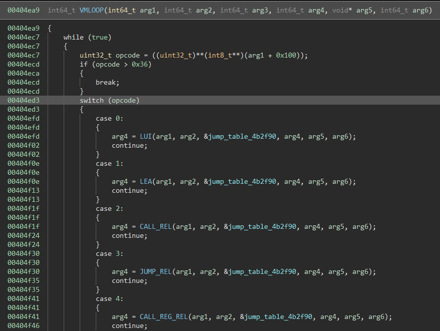

My teammate Aaron did most the virtual machine reversing, and generally the machine implemented is nothing special so a quick overview of our understanding:

- There 54 instructions
- Registers and memory access are 64 bit
- Register 0 is a "zero" register that always holds 0
- Register 1 is a link register and contains the last return address
- Register 2 is the stack pointer
- Register 3 is the frame pointer (like in x86)
- Register 4 is a static pointer to global external memory (the .quack_quack_quack section of the binary with an offset of -x0x10)
- The VM itself and the VM code contain self integrity checks
- Some VM code / used variables are encrypted and need to be dumped at runtime after decryption

Besides that, this is a standard custom virtual machine without any gimmicks.

To properly debug this programs hardware breakpoints help a lot, e.g.: `watch * 0x1337110` lets us wait until the random state is updates and virtual machine execution has properly begun.
To get the VM code and some more data, dump the `.quack_quack_quack` section.

Later for trouble shooting I often verified what the VM is doing by 
```
rwatch * ((0x1337000)+<VM_ADDRESS>)
r
AAAAAAAA-BBBBBBBB-CCCCCCCC-DDDDDDDD-EEEEEEEE-FFFFFFFF-00000000-11111111
d
b * HANDLER_ADDRESS_OF_THE_OPERATION_AT_VM_ADDRESS
c
d
```

This way I was able to inspect the virtual machine state and exact operations without tripping any of the anti-debugging / self integrity checks.

### Analyzing the VM

My actual work started after Aaron gave me a virtual machine dump and a disassembler for it. Based on the disassembler I wrote a Binary Ninja plugin that does both disassembly and lifting.
And after lots of troubleshooting (there are probably lots of lifting errors still in it, especially regarding to casting) - it worked and we now were properly able to inspect the virtual machine code.


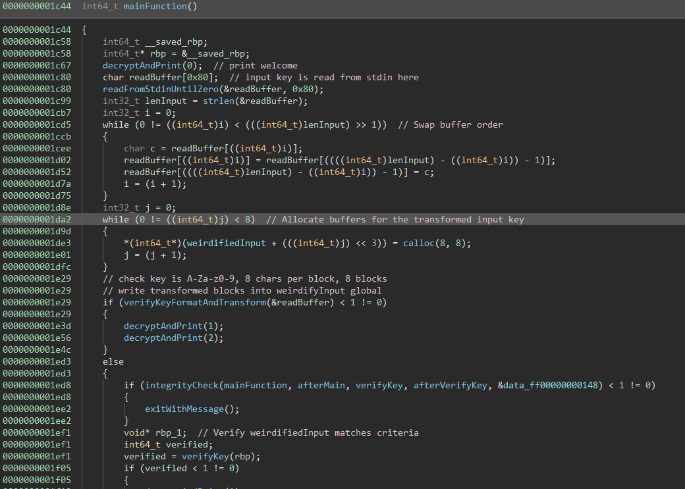

The program reads up to 0x80 characters from stdin and then inverts their order. It allocates 8 arrays that are used to store the transformed input in if it matches the required format.
If it matches then after some integrity checks the transformed input is verified and either accepted or rejected.

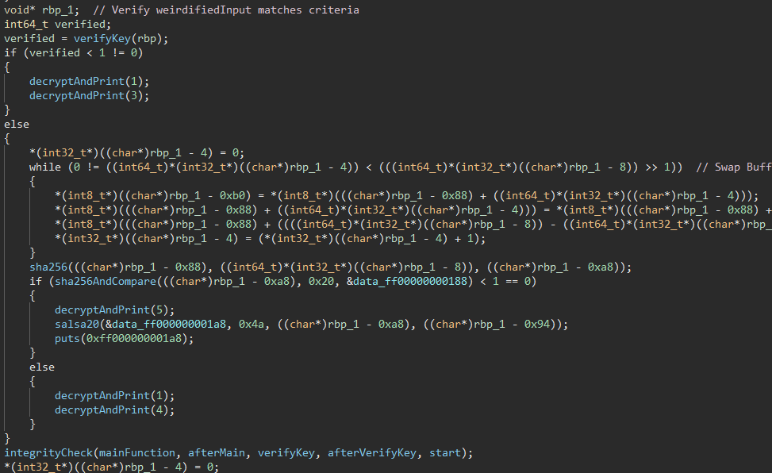

As a fail safe if somehow a wrong key is validated there is also hashing logic (which is also used to decrypt the flag from the right key), but we didn't find any colliding correct input, so this is luckily nothing for us to worry about.

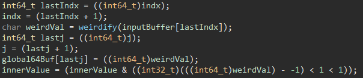

The input format function mostly just verifies that our input has a format like "AAAAAAAA-BBBBBBBB-CCCCCCCC-DDDDDDDD-EEEEEEEE-FFFFFFFF-00000000-11111111" where all 8 characters there will be a `-` and the allowed characters are`A-Za-z0-9`.
Interesting is the block of code that runs what we named "weirdify" on the input and then stores it in global memory.

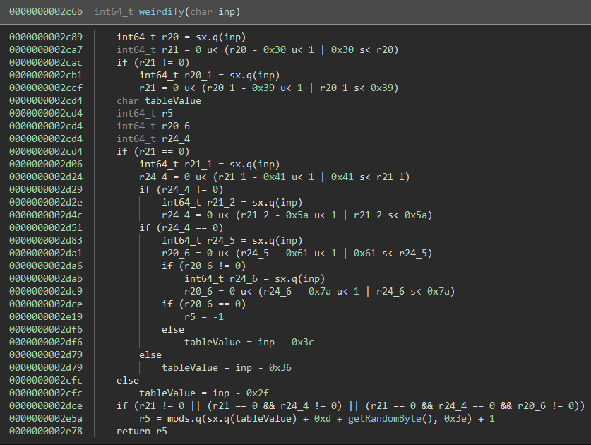

The "weirdify" function has a lot of annoying logic to it and especially the random number part of it makes it troublesome to deal with.
Luckily the actual random number generation is pretty simple and we can dump the random seed / starting value from the vm binary at address `0x1337110` (it is 0x1337babe). 

```
0000000006b04      pseudoRandomNumber = (sx.o(zx.q(pseudoRandomNumber)) * sx.o(0x343fd)).d - 0x613d
0000000006b27      return zx.q(pseudoRandomNumber)
```

This was actually a pretty good test of the decompilation, because I was able to copy-paste the pseudo C of weirdify into actual C code and brutefroce the character to value table without any modifications.
Taking the allowed charset into account I simplified it to:

```python
# This is the main calculation part of the weridify function
def weirdifyPre(arg1):
    if(arg1 >= ord('0') and arg1 <= ord('9')):
        return arg1-ord('0')+0x01
    if(arg1 >= ord('A') and arg1 <= ord('Z')):
        return arg1-ord('A')+0x0B
    if(arg1 >= ord('a') and arg1 <= ord('z')):
        return arg1-ord('a')+0x25
    print("Not supported character "+hex(arg1))
    
# the weirdify function
def weirdify(value, rngSeed, iteration):
    v = weirdifyPre(value)
    # this is a pseudo random number generator
    for i in range(iteration):
        rngSeed = signOffset(((rngSeed * 0x343fd)- 0x613d), 32)
    # which applies a "random" value to weirdify the output
    return (((v + 0xd) + (rngSeed&0xff)) % 0x3e) + 1;
```


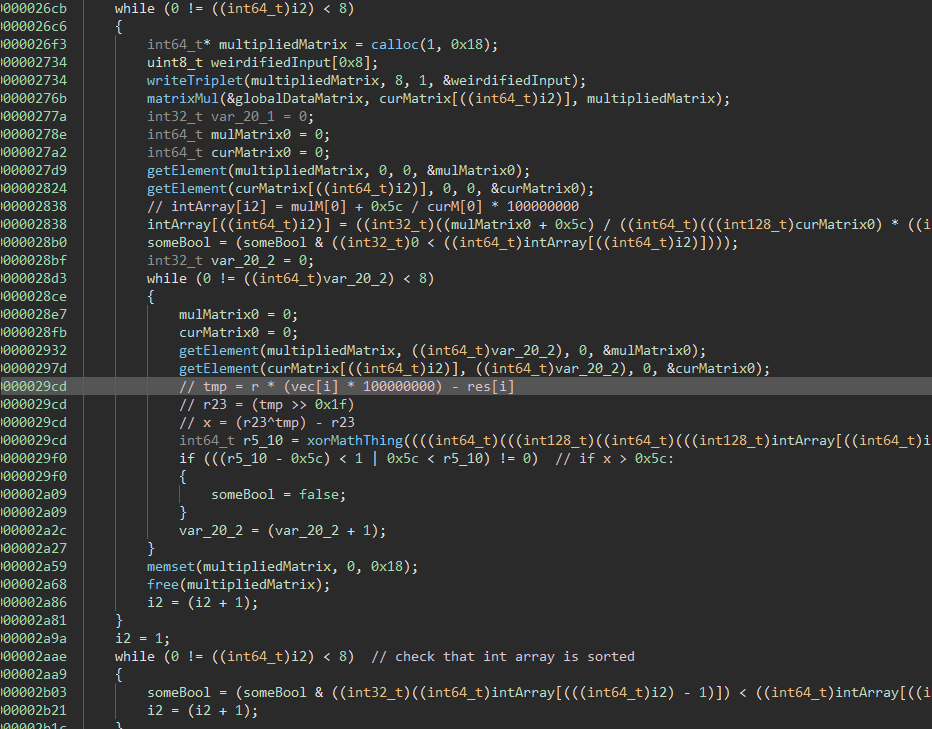

The verify code looks a bit scary when first looking at it and getting everything right (the lifter, analysis and re-implementation) took a lot of hours.
The program iterating over our 8 key blocks that have been separated and "weirdified" into 8 matrices.

It then multiplies the selected 8x1 matrix by a global 8x8 matrix. The global matrix is stored encrypted in memory and needs to be dumped AFTER it is decrypted (e.g. by breaking at one of the instructions in this function).
The outgoing matrix is then used to calculate the value  `intArray[i2] = mulM[0] + 0x5c / curM[0] * 100000000`. This value needs to be positive and is later used to verify that the key blocks are sorted in ascending `intArray` value order.

Then for all values of the current matrix the constrain for `x` has to hold.

The working python reimplementation looks like this:

```python
# Check whether an input is a key candidate and return the intArray/r value to order it properly
def runCheck(vec):
    # Decrypted matrix dumped at runtime from the binary at address 0x1337208 (they have to be decrypted)
    m = [
        [0xffffffffede5dafe,0xfffffffff5f743dd,0x00000000067b8bda,0x0000000017ff1621,0xffffffffe760a0d9,0x0000000010125448,0x000000000d7e1113,0x0000000008000969],
        [0xffffffffeb0a3540,0xffffffffc88f3a85,0x000000000257f745,0x0000000009c7fd78,0xfffffffffe19c100,0x0000000012267980,0x000000000c8505f6,0x0000000010f9c0b7],
        [0xffffffffd9df8aaa,0xffffffff04d141e9,0x0000000021f324fc,0x0000000019648e56,0x00000000055412ed,0x000000002d5b225c,0x000000001a2343fa,0x000000002dd83916],
        [0xffffffffe5a0af81,0xffffffff5cc74a0f,0x0000000008962a72,0x00000000287392d5,0x0000000000315867,0x0000000016f6d77f,0x0000000014fde34c,0x0000000020dc2c52],
        [0xffffffffdafbdc02,0xfffffffed5a8296b,0x000000000cd46b7c,0x0000000014a3b1ca,0x000000002805c014,0x000000002efa4dc8,0x00000000158fd422,0x00000000396d3f69],
        [0xffffffffcb6b92d2,0x000000000314edfd,0xfffffffffe6a83a7,0x000000000e96bbe0,0xffffffffe7df78e9,0x00000000320c4adb,0x0000000012e0feae,0x000000000f42b54d],
        [0xffffffffc8ebcae5,0xffffffffa166c5b8,0x0000000002317c38,0x000000001bc27472,0xffffffffecd4fb9e,0x000000001e294aef,0x0000000039380937,0x00000000179b36a2],
        [0xffffffffd300432f,0xffffffff2d0c1e3c,0x00000000069f76d9,0x0000000017d259ce,0x0000000000d02195,0x000000002bd9cf95,0x000000001b70eed3,0x00000000426dc286]
    ]
    m2 = [ [0] * 8, [0] * 8, [0] * 8, [0] * 8, [0] * 8, [0] * 8, [0] * 8, [0] * 8]

    # Transpose
    for i in range(8):
        for j in range(8):
            m2[i][j] = signOffset(m[j][i], 64)      
    m = m2

    # At first it does matrix multiplication
    res = mult(m, vec)

    # then it calculates an intArray value which is later used for ordering the parts
    r = signOffset((res[0] + 92) // (vec[0] * 100000000), 32)
    # reject negative values
    if(r <= 0):  return None

    # check that for each vector the following property holds
    # To solve this we try scalars of the left eigenvectors as they 
    # fulfill some ratio property this is verifying.
    # tbh no clue I'm not big brain enough for this math stuff I only rev
    for i in range(8):
        tmp = r * (vec[i] * 100000000) - res[i]
        r23 = (tmp >> 0x1f)
        x = (r23^tmp) - r23
        # values above 0x5c are rejected
        if x > 0x5c:
            return None
    # whooo we have a key candidate 
    return (vec, r)
```

### Solving

Ok, so now we know how the VM works, how the key has to look like and how it is verified.
This was a part were we where stuck on for quite a while as we knew how everything works but didn't know how to generate something that fulfills the requirements.
We worked a lot of hours on refining z3 scripts, bruteforcing and debugging our reimplementations for mistakes, until at some point my teammate Aaron saved the day (like usual) and figured out that using a intger multiple of the eigenvectors of the global matrix fulfills the requirements.
I have to admit that I don't really get why they do, or how he came to the conclusion but it works.


In practice this means we open up sage and give it the sign extended decrypted global matrix:

```python
"""
M = m = Matrix([[-303703298, -168344611, 108760026, 402593313, -413097767, 269636680, 226365715, 134220137], [-351652544, -930137467, 39319365, 164101496, -31866624, 304511360, 210044406, 284803255], [-639661398, -4214144535, 569582844, 426020438, 89395949, 760947292, 438518778, 769145110], [-442454143, -2738402801, 144058994, 678662869, 3233895, 385275775, 352183116, 551300178], [-621028350, -5005366933, 215247740, 346272202, 671465492, 788155848, 361747490, 963460969], [-882142510, 51703293, -26573913, 244759520, -404784919, 839666395, 316735150, 256030029], [-924071195, -1587100232, 36797496, 465728626, -321586274, 506022639, 959973687, 396048034], [-754957521, -3539198404, 111113945, 399661518, 13640085, 735694741, 460386003, 1114489478]])
M = M.transpose() 
M.eigenvectors_left()
```

Then put those into a small script to try their multiple on the check:

```python
# Calculate possible key candidates from the eigenvectors
def solutionsFromEigenvectors():
    # matrix taken from sage
    eigvectors = [(9.99999983497936e7,
      [(1, 0.169491520858711, 0.084745751546947, 0.2881355875831414, 0.288135581541381, 0.847457626194665, 0.711864401602224, 0.2711864305805604)],
      1),
     (2.000000038798546e8,
      [(1, 0.952381012280966, 2.52380974358845, 1.238095290338078, 2.38095253294195, 0.714285692436905, 1.71428579754716, 2.190476355812853)],
      1),
     (3.000000002486778e8,
      [(1, 0.56249999554731, 0.6562499830366, 1.781250008071057, 1.78124998926551, 1.25000000457964, 0.93749998508704, 0.718749983851072)],
      1),
     (3.999999995713364e8,
      [(1, 2.24999981996979, 13.4999990261208, 0.249999948696195, 8.2499992358664, 4.49999968632836, 7.2499994613724, 0.499999967815939)],
      1),
     (4.999999990500059e8,
      [(1, 0.34693878212022, 1.1020408347751, 0.59183675570741, 0.1428571707193, 1.0204081565988, 0.7755102140302, 0.83673471316265)],
      1),
     (5.999999984377138e8,
      [(1, 0.6896552117266, 2.034482866964, 1.96551735699380, 1.9310346670275, 0.3793103236556, 2.0000000738185, 1.86206907715878)],
      1),
     (6.99999998618207e8,
      [(1, 1.5833334555942, 3.500000285201, 1.75000013943522, 4.333333783508, 3.4166668726864, 2.333333445203, 3.91666698372095)],
      1),
     (8.00000001844412e8,
      [(1, 0.6000000012274, 0.899999994546, 0.4333333263700, 0.333333323750, 2.0000000104400, 1.633333338514, 1.19999999876425)],
      1)]

    solutions = []
    for eigvec in eigvectors:
        row = list(*eigvec[1])
        # iterate for some multipliers
        for i in range(1, int(128/max(row))):
            floatVersion = [v*i for v in row]
            intVersion = [round(r) for r in floatVersion]
            # check if key candidate
            checkRes = runCheck(intVersion)
            if checkRes != None:
                solutions.append(checkRes)
    return solutions
```

From this we get 8 key candidates `[([59, 10, 5, 17, 17, 50, 42, 16], 1), ([21, 20, 53, 26, 50, 15, 36, 46], 2), ([32, 18, 21, 57, 57, 40, 30, 23], 3), ([4, 9, 54, 1, 33, 18, 29, 2], 4), ([8, 18, 108, 2, 66, 36, 58, 4], 4), ([49, 17, 54, 29, 7, 50, 38, 41], 5), ([29, 20, 59, 57, 56, 11, 58, 54], 6), ([12, 19, 42, 21, 52, 41, 28, 47], 7), ([30, 18, 27, 13, 10, 60, 49, 36], 8)]`.

Now if we use the "weirdify" algorithm we reversed earlier, make a reverse lookup table out of it and use that to reconstruct a key (see the vmquacks_revenge.py script for details), we get the solution:

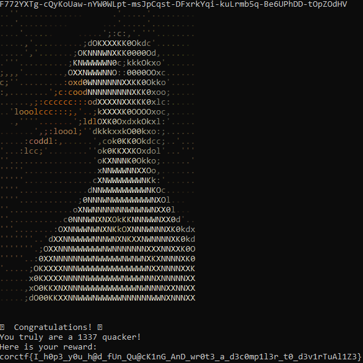

# msfrob

    Description:
    6b0a444558474b460a5a58454d584b470a5f5943444d0a444558474b460a4d464348490a4c5f44495e4345445904

msfrob is a linux binary that obfuscates all its imports

## Solution

The program takes in one command line argument and then verifies it.
Looking at it in Binary Ninja shows that all imported functions show up as `msfrob`.

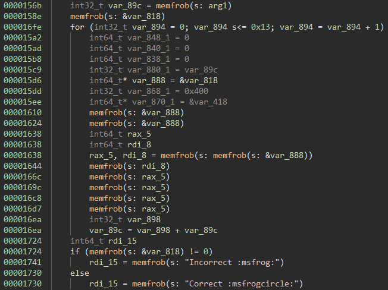

We can easily manually figure out which `msfrob` calls which function, by settings breakpoint before the call, then setting a breakpoint at `_dl_lookup_symbol_x` and looking at the arguments passed to it.
One of the registers will contain a pointer to the original import name.

That way we can recover the original imports:

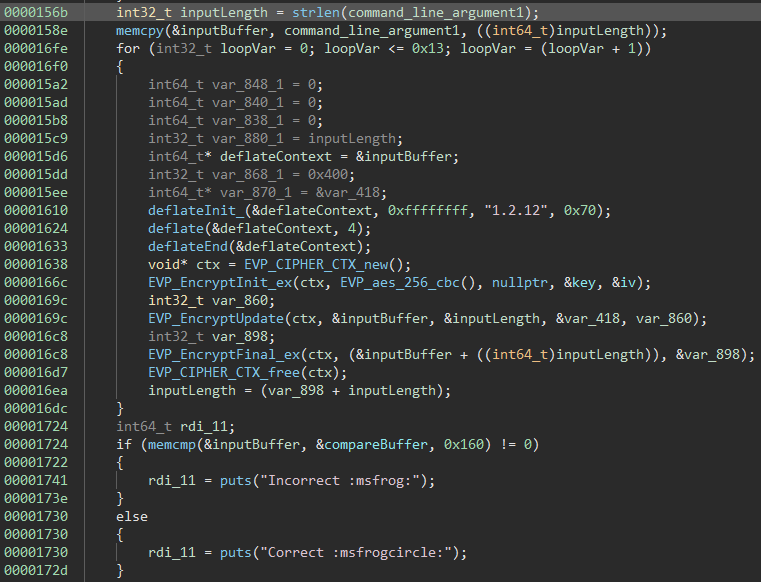

What the program is doing is, it is taking the input and compressing it with deflate and encrypting it with AES 20 times. Then it is comparing the output against a fixed buffer.
By dumping the buffer, key and iv we can easily inverse this process:

```python
from Crypto import Random
from Crypto.Cipher import AES
import zlib

# from @0x2020
data = bytes.fromhex("4cef34fad125454be7ad99c4b1d7f62c5bf313bfcc031d1681db5038a8b6dd20902a6ea2effe6b8fdb806f7074eb7d36e4dc87f320ebe50f3e283558ad07d23dd85d41355e4f419b9185e15c18b8f65adf08353104d2e04464fc06c6d65b98204f1c1eb820d59eda81d6365b5560a82cf2da5792c9e014f0434b2e11d37067a855087dc7764f77e8bef3190484b2a020dc4cd2c894179b754f783535e662742d0ca834f190a9fd59d4f824b93b94bd79c778b956c1e3b62e173a32f94e47f909c4e8fa49536a0bb9360b2b5cc9f33963b3d1ac706cf14642bc0b913a649577ec240164d298e1bf3817d4d03916131d34a41afa335f8821d55c4ebf339de12acc4715039da685362d6d31013d9508dc72d3f6f765b7c0955df4c9a7fadcef5136c11de608eb8aec5dc95a3dd39aa6ad2899248892402dab1259f88447b2b948f78f1e3264ba24d23df3c484bdd2e10107a17618451e549193116e41547e40e702")

# from @0x2180
key = bytes.fromhex("d4f5d967152f777f6c7c4673f6f092f077503b300c878a0d9c1d72a26546c8dc")
# from @0x40d0
iv = bytes.fromhex("00000000000000000000000000000000")

for i in range(0x14):
    cipher = AES.new(key, AES.MODE_CBC, iv)
    decrypted = cipher.decrypt(data)
    decompressed = zlib.decompress(decrypted, bufsize=0x70)
    data = decompressed
    print(len(decrypted), len(decompressed), data)
```

Giving us the flag: `corctf{why_w0u1d_4ny0n3_us3_m3mfr0b??}`

# turbocrab

    Description:
    blazinglyer faster 
    
Turbocrab is a Rust binary with symbols that assembles code at runtime and then executes it to take input and verify it.

## Solution

Looking into the binary and following the functions by how they are named `turbocrab::execute_shellcode::h6984ce5848b31780` shows that some code is assembled and then a dynamically created function is exected.

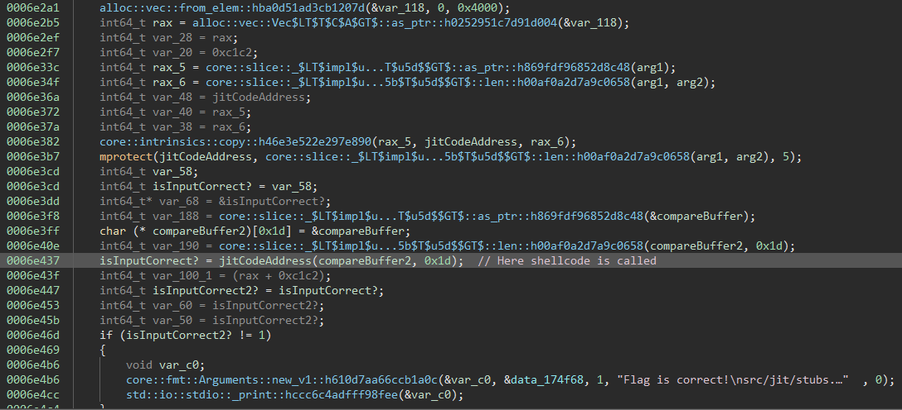

This is the shellcode the binary is executing, it is always the same so breakpointing there and dumping it is a good idea.

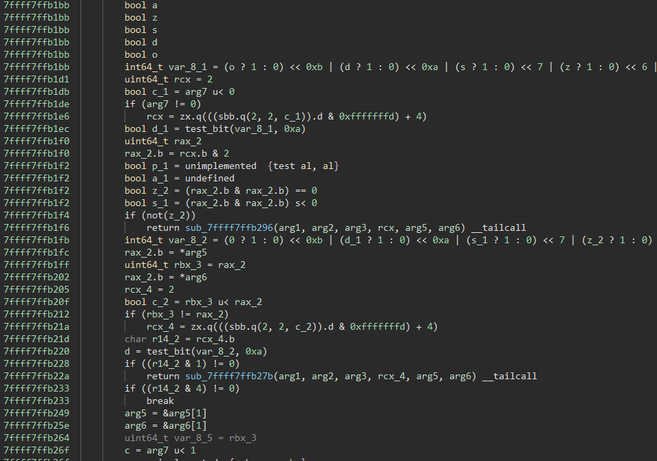

A quick look into the binary shows that it decompiles absolutely horrible. Luckily we don't need to do that.
The shellcode is relatively small so by scrolling through it you can find:

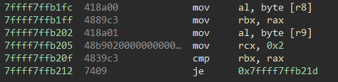

This is the only comparison done on memory content (or at least the only one that is easily spotable).
A bit of trying around shows that characters are transformed independent of each other and each character is always transformed the same way.
By setting a breakpoint there, trying different inputs and then dumping the transformed output we can build a table to reverse the compare buffer:

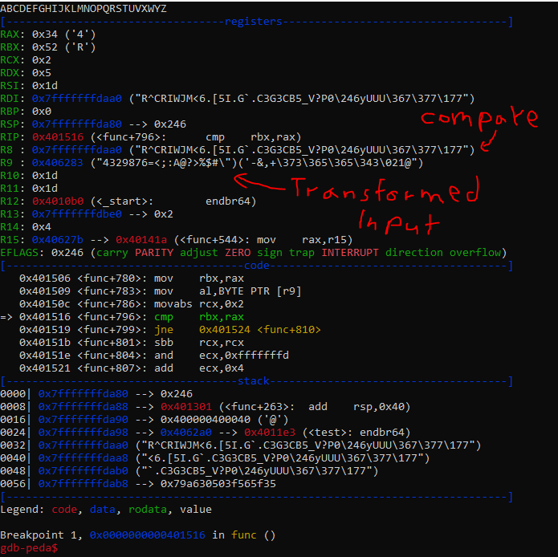

The addresses in the binary of the screenshot are a bit more static because I made a standalone binary out of the extracted shellcode. This is not necessary for solving it but made it easier to analyze and test.


```python
# compare values from binary in turbocrab::execute_shellcode::h6984ce5848b31780
arr = [0x52,0x5e,0x43,0x52,0x49,0x57,0x4a,0x4d,0x3c,0x36,0x2e,0x5b,0x35,0x49,0x2e,0x47,0x60,0x2e,0x43,0x33,0x47,0x33,0x43,0x42,0x35,0x5f,0x56,0x3f,0x50]

# hook comparison, dump compares, solves
"""
7ffff7ffb1fc  418a00             mov     al, byte [r8]
7ffff7ffb1ff  4889c3             mov     rbx, rax
7ffff7ffb202  418a01             mov     al, byte [r9]
7ffff7ffb205  48b9020000000000…mov     rcx, 0x2
7ffff7ffb20f  4839c3             cmp     rbx, rax
7ffff7ffb212  7409               je      0x7ffff7ffb21d
"""

# dumped input -> encoded pairs
keys = ""
values = []

keys   += "ABCDEFGHIJKLMNOPQRSTUVWXYZ"
values += [0x34,0x33,0x32,0x39,0x38,0x37,0x36,0x3d,0x3c,0x3b,0x3a,0x41,0x40,0x3f,0x3e,0x25,0x24,0x23,0x22,0x29,0x28,0x27,0x26,0x2d,0x2c,0x2b]

keys   += "abcdefghijklmnopqrstuvwxyz"
values += [0x54,0x53,0x52,0x59,0x58,0x57,0x56,0x5d,0x5c,0x5b,0x5a,0x61,0x60,0x5f,0x5e,0x45,0x44,0x43,0x42,0x49,0x48,0x47,0x46,0x4d,0x4c,0x4b]

keys   += "_-{}"
values += [0x2e,0x20,0x4a,0x50]

keys   += "0123456789"
values += [0x34,0x35,0x32,0x33,0x38,0x39,0x36,0x37,0x3c,0x3d]

keys   += "!? =()[]/&%$# +-.:,;<>|~*'"
values += [0x14,0x3f,0x15,0x21,0x1d,0x1c,0x2a,0x30,0x1e,0x17,0x18,0x19,0x12,0x15,0x1a,0x20,0x1f,0x3a,0x21,0x3b,0x11,0x3e,0x51,0x4f,0x1b,0x16]

#keys   += "@!? =()[]/&%$# +-.:,;<>|~*'"
#values += [0x35, 0x14,0x3f,0x15,0x21,0x1d,0x1c,0x2a,0x30,0x1e,0x17,0x18,0x19,0x12,0x15,0x1a,0x20,0x1f,0x3a,0x21,0x3b,0x11,0x3e,0x51,0x4f,0x1b,0x16]

cMap = {}
for i in range(len(values)):
    cMap[values[i]] = keys[i]
    
print(''.join([cMap[v] for v in arr]))
```

Notable here is that the encoded output is not unique in relation to the input, but only one flag was accepted, so some trying/bruteforcing around with the collisions may be needed to get the the most reasonable looking flag: `corctf{x86_j1t_vm_r3v3rs1ng?}`