# crabheartpenguin


This challenge provides a linux kernel and initial ramdisk which contains a Rust driver. The goal is to write a program that makes the driver give out the flag.

## Solution

To begin with the driver seems to register itself as a file named `crab`:

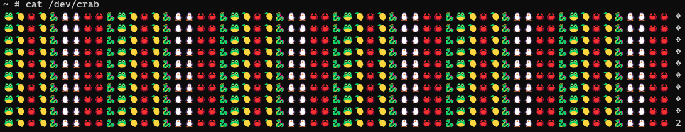

Interacting with it just gives emojis back.

A good first step for me was too look at https://github.com/Rust-for-Linux/linux/blob/rust/rust/kernel/file.rs and read through how Rust kernel code could generally look like (some of the identifiers from this file are the same as in the challenge binary).

One problem for me was that binary ninja doesn't really handle Rust code and especially Rust iterators very well so solving this involved a lot of manual testing and verification.

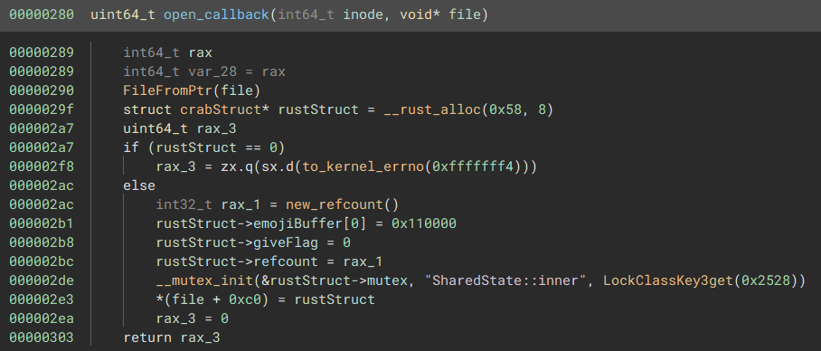

Matching this with the Rust for Linux code it seems that it is normal that a file driver creates a shadow Rust struct on opening a file that it saves in the private_data field.

The `0x110000` that is written to the struct field I named `emojiBuffer[0]` is actually already important because the path the `write_callback` (or `write_iter_callback` - the `iter` variants behave analog to their counter part) will be different depending on if this value is set or not.
In fact we need the `read_callback` to first initialize the fields by filling them with the content of the `make_prompt` function. 

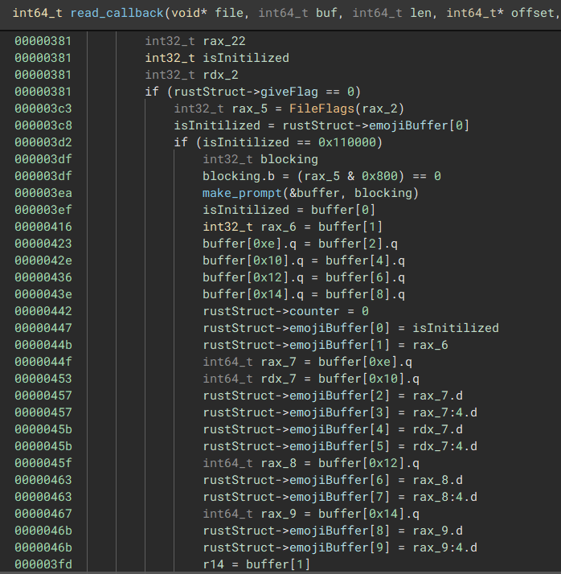

The `make_prompt` function is responsible for randomly generating a set of 10 emojis.

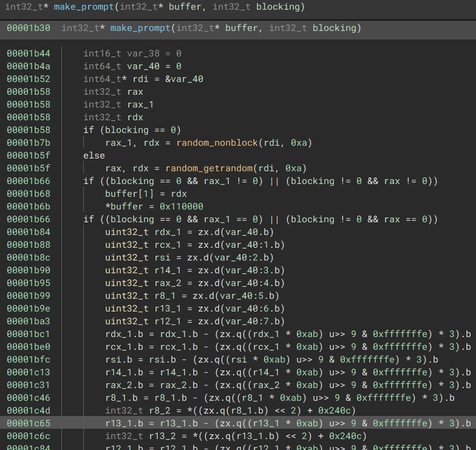

What binary ninja is not showing well is that these emojis are actually only one of "🦀🐧🍋🐸🐱🐉" (as seen in the initial screenshot of interacting with the device).

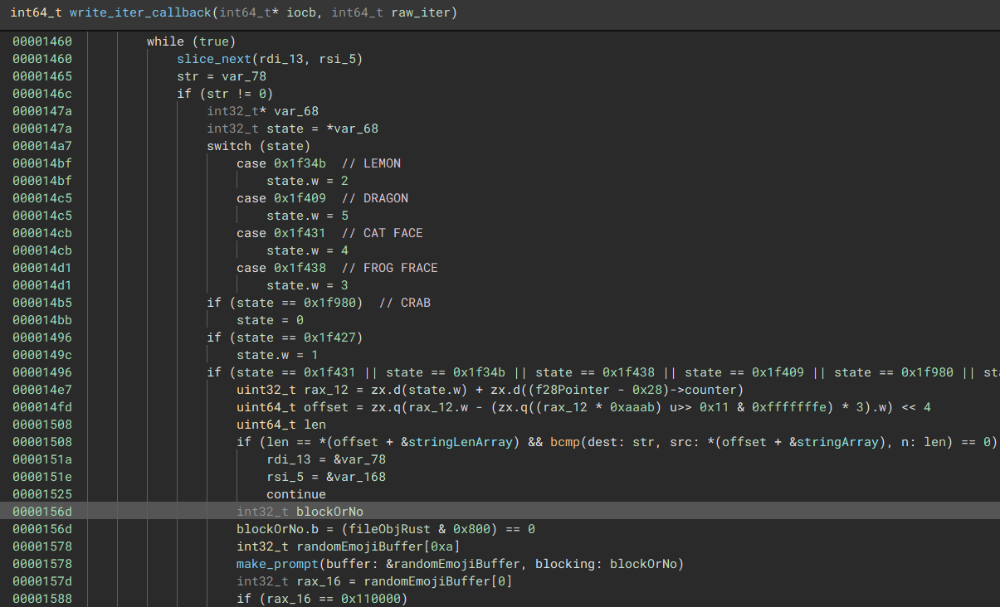

Now in the write function what is happening is:

- Check if Rust Struct for the file is initialized with a 10 emoji array
- Check if the string we are writing is utf8 decodable (and decode it - `_RNvNtNtCsfDBl8rBLEEc_4core3str8converts9from_utf8`)
- Split the string at `-` (`_RNvMsr_NtNtCsfDBl8rBLEEc_4core3str7patternNtB5_11StrSearcher3new`)
- Zip the split string and the randomly generated emojis
- Iterate for each emoji (so 10 times):
    - Get the index of the emoji (from 0 at crab to 5 to dragon "🦀🐧🍋🐸🐱🐉")
    - Get the current counter (initialized at the beginning at 0)
    - Calculate `(emoji_index + counter) % 6`
    - Check if the split string part matches the string table entry at that index (stringArray: `["crab", "penguin", "lemonthink", "msfrog", "af", "dragon"]`)
    - If it doesn't match: FAIL
- If all 10 emojis matched their string table entry and `counter == 0xa`: `giveFlag = 1`
- If all 10 emojis matched their string table entry: `counter = counter + 1`

If `giveFlag` is 1 then reading the device will give us the flag.

So to solve this challenge we need:
- Open file to the device
- Do 11 Times:
    - Read 10 Emojis (UTF-8 encoded)
    - Match them with the `(table+counter)%6` entries
    - Write them to the device with `-` separators
- Read flag

So writing a program that solves this:

```C
#include "nolibc-syscall-linux.h"

// gcc exploit.c -nostdlib -static -o exploit


// array at 0x24b8
char* names[] = {"crab-", "penguin-", "lemonthink-", "msfrog-", "af-", "dragon-"};

void _start(void) {
    
    // open crab device
    char dev_crab[] = "/dev/crab";
    int fd = open2(dev_crab, O_RDWR);
    if (fd < 0) {
        write_cstring_using_stack(2, "Error: unable to open /dev/crab\n");
        exit(1);
    }

    
    // We need to pass 11 iterations as the 0xa check happens before incrementing
    for(int loopindex=0;loopindex<11;loopindex++) {
        
        
        // read buffer
        char buffer[256];
        ssize_t rdlen = read_buffer(fd, buffer, sizeof(buffer));
        if(rdlen > 0) {
            if (!write_all(1, buffer, (size_t)rdlen)) {
                write_cstring_using_stack(2, "Error: failed writing to the standard output\n");
                close(fd);
                exit(1);
            }
        }
        
        // UTF-8 Encoding!
        // CRAB    b'\xf0\x9f\xa6\x80'
        // PENGUIN b'\xf0\x9f\x90\xa7'
        // LEMON   b'\xf0\x9f\x8d\x8b'
        // FROG    b'\xf0\x9f\x90\xb8'
        // CAT     b'\xf0\x9f\x90\xb1'
        // DRAGON  b'\xf0\x9f\x90\x89'
        
        
        char solution[256];
        int solutionindex = 0;
        for(int offset=0;offset<10;offset++) {
            int state = 0; // see write_callback (iter) handlers
            if(buffer[offset*4+0] == '\xf0' && buffer[offset*4+1] == '\x9f') {
                if(buffer[offset*4+2] == '\xa6' && buffer[offset*4+3] == '\x80') {
                    state = 0;
                }else if(buffer[offset*4+2] == '\x90' && buffer[offset*4+3] == '\xa7') {
                    state = 1;
                }else if(buffer[offset*4+2] == '\x8d' && buffer[offset*4+3] == '\x8b') {
                    state = 2;
                }else if(buffer[offset*4+2] == '\x90' && buffer[offset*4+3] == '\xb8') {
                    state = 3;
                }else if(buffer[offset*4+2] == '\x90' && buffer[offset*4+3] == '\xb1') {
                    state = 4;
                }else if(buffer[offset*4+2] == '\x90' && buffer[offset*4+3] == '\x89') {
                    state = 5;
                }else {
                    write_cstring_using_stack(2, "Error: Emoji not parsed\n");
                    close(fd);
                    exit(1);
                }
            }else {
                write_cstring_using_stack(2, "Error: No emoji received\n");
                close(fd);
                exit(1);
            }
            
            // current loop  + emoji state mod 6 from array
            char* thisone = names[(loopindex+state)%6];
            for(int i=0;i<nolibc_strlen(thisone);i++) {
                solution[solutionindex+i] = thisone[i];
            }
            solutionindex+=nolibc_strlen(thisone);
            
        }
        // remove last '-'
        solution[solutionindex-1] = 0; 
        
        // echo out for debugging
        write_all(1, solution, solutionindex-1);
        write_cstring_using_stack(1, "\n");
        
        // send to /dev/crab
        write(fd, solution, solutionindex-1);
    }

    // Receive flag
    char flag[256];
    ssize_t flaglen = read_buffer(fd, flag, sizeof(flag));
    if(flaglen > 0) {
        if (!write_all(1, flag, (size_t)flaglen)) {
            write_cstring_using_stack(2, "Error: failed writing to the standard output [flag]\n");
            close(fd);
            exit(1);
        }
    }
    close(fd);
    exit(0);
}
```

(Using https://github.com/fishilico/shared/tree/master/linux/nolibc )

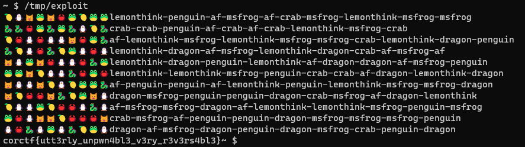


## Notes

Debugging this driver was a mess for me so a general documentation on how I did it and how to do it in the future:

### Modifying the file system / getting files on there


```
mkdir tmp_mnt/
gunzip -c initramfs.cpio.gz | sh -c 'cd tmp_mnt/ && cpio -i'
cd tmp_mnt/
```

Make changes to files in `tmp_mnt`

```
sh -c 'cd tmp_mnt/ && find . | cpio -H newc -o' | gzip -9 > new_initramfs.cpio.gz
```

Then replace `-initrd initramfs.cpio.gz` with `-initrd new_initramfs.cpio.gz` in the qemu arguemtns in `run.sh`.

(From https://xilinx-wiki.atlassian.net/wiki/spaces/A/pages/18842473/Build+and+Modify+a+Rootfs )

### Becoming Root

We are not running as root in the challenge - this makes sense as otherwise reading out the flag without doing the challenge would be easy.
I didn't realize this initially...
In the `/tmp_mnt/init` file change `setsid /bin/cttyhack setuidgid 1000 /bin/sh` to `setsid /bin/cttyhack setuidgid 0 /bin/sh`.
Now we start as root.


### UD2 Debugging

Because I initially didn't see I wasn't root and I couldn't get offset of the driver because of that I debugged the program by inserting `ud2` instructions at the points of interest in the driver and letting it crash.

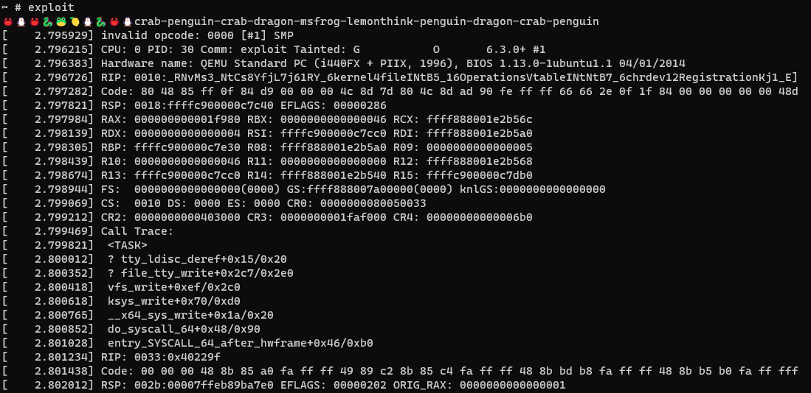

While the crash dumps are helpful and this worked this isn't really ideal to do.

### Qemu+gdb Debugging

Get the offset of the driver and symbols (need to be root):

```
~ # cat /proc/modules
crab 24576 - - Live 0xffffffffa0000000 (O)
```

```
~ # cat /proc/kallsyms | grep crab
ffffffffa0000000 t _RINvNtCsfDBl8rBLEEc_4core3ptr13drop_in_placeINtNtCs8YfjL7j61RY_6kernel6chrdev12RegistrationKj1_EECs]ffffffffa00000a0 t _RINvNtCsfDBl8rBLEEc_4core3ptr13drop_in_placeNtNtCsl49asOUBAoG_5alloc11collections15TryReserveErrorE]ffffffffa00000b0 t _RINvNtCsl49asOUBAoG_5alloc7raw_vec11finish_growNtNtB4_5alloc6GlobalECs6tAWYO0dm9x_4crab     [crab]
ffffffffa0000140 t _RNvMs0_NtCsl49asOUBAoG_5alloc3vecINtB5_3VechE10try_resizeCs6tAWYO0dm9x_4crab        [crab]
ffffffffa0000280 t _RNvMs3_NtCs8YfjL7j61RY_6kernel4fileINtB5_16OperationsVtableINtNtB7_6chrdev12RegistrationKj1_ENtCs6t]ffffffffa0000310 t _RNvMs3_NtCs8YfjL7j61RY_6kernel4fileINtB5_16OperationsVtableINtNtB7_6chrdev12RegistrationKj1_ENtCs6t]ffffffffa00007b0 t _RNvMs3_NtCs8YfjL7j61RY_6kernel4fileINtB5_16OperationsVtableINtNtB7_6chrdev12RegistrationKj1_ENtCs6t]ffffffffa0001750 t _RNvXs1_NtNtNtCsfDBl8rBLEEc_4core4iter8adapters3zipINtB5_3ZipINtNtNtBb_3str4iter5SplitReEINtNtNtBb_5]ffffffffa0000d10 t _RNvMs3_NtCs8YfjL7j61RY_6kernel4fileINtB5_16OperationsVtableINtNtB7_6chrdev12RegistrationKj1_ENtCs6t]ffffffffa0000d80 t _RNvMs3_NtCs8YfjL7j61RY_6kernel4fileINtB5_16OperationsVtableINtNtB7_6chrdev12RegistrationKj1_ENtCs6t]ffffffffa0001210 t _RNvMs3_NtCs8YfjL7j61RY_6kernel4fileINtB5_16OperationsVtableINtNtB7_6chrdev12RegistrationKj1_ENtCs6t]ffffffffa0001b30 t _RNvCs6tAWYO0dm9x_4crab11make_prompt [crab]
ffffffffa0001d20 t _RNvXs_Cs6tAWYO0dm9x_4crabNtB4_7CrabDevNtCs8YfjL7j61RY_6kernel6Module4init   [crab]
ffffffffa0001f30 t init_module  [crab]
ffffffffa0001fb0 t cleanup_module       [crab]
ffffffffa0001ff0 t _RNvXs0_Cs6tAWYO0dm9x_4crabNtB5_8CrabFileNtNtCs8YfjL7j61RY_6kernel4file10Operations4open     [crab]
```

Add `-S -s` to the qemu arguments (this starts a local gdbserver and waits for a connection at `:1234`).

now with something like `hbreak *0xffffffffa0000000+0x3cc` we can break when an emoji array is initialized.

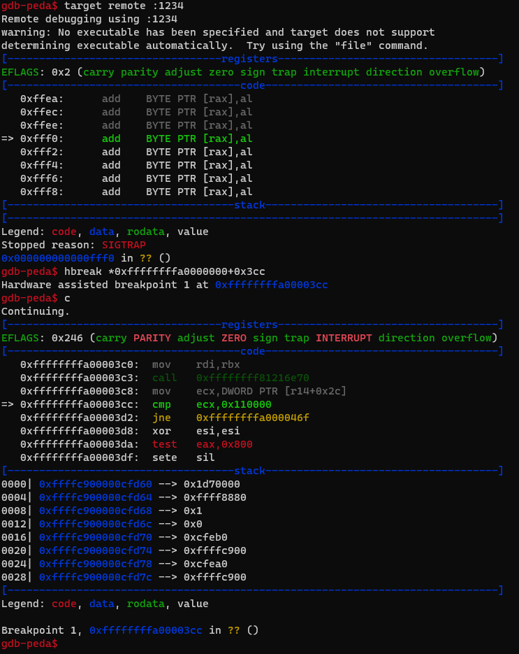

This is way more clean than the UD2 debugging I did before >_>

# diophantus
    
    Looks like someone self-rolled some kind of prime field based encryption. Surely it's not secure. Can you decrypt it?
    The program was run with the following args - ./encrypt flag.txt key_a key_b > flag.enc

This challenge is a Rust linux program that given a file and two keys encrypts it. The goal is to decrypt a given ciphertext.

## Solution

This is a Rust binary which is already a bad start, but the authors thankfully left symbols in to work with (which makes this task actually fun and not just a massive pain).

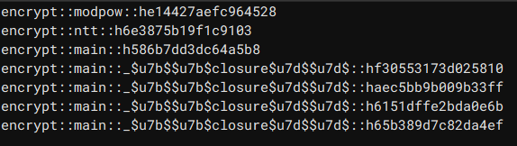

The actual program consists out of the main function, 4 closures (which are always annoying to reverse), modpow (so taking the power of a number modulo something) and ntt (Number-Theoretic Transform with in this case modulo 0x10001).

Reversing the program is mostly very straight forward and the things that aren't obvious can be easily verified by debugging and putting a breakpoint at the places.
Also the `galois` python library implements the Number-Theoretic Transform exactly like the binary so no need to mess with that too much either (verified by just running tests and checking the debugger).

```python
import galois
import math
import struct

def inputStuff(s):
    arr = []
    sizeStuff = (1 << ((int(math.log2(len(s)))+1) & 0x3f))
    sl = [s[i] if i < len(s) else 0 for i in range(sizeStuff)]
    for i in range(sizeStuff//2):
        arr.append((sl[i*2] << 8) | (sl[i*2+1]))
    return arr

def outputStuff(arr):
    output = b''
    for i in range(len(arr)):
        output += struct.pack(">H", arr[i]&0xffff)
    return output

def encrypt(s, a, b):
    step0 = inputStuff(s)
    step1 = galois.ntt(step0, modulus=0x10001)
    step2 = [((int(x)*a)+b)%0x10001 for x in step1]
    step3 = galois.ntt(step2, modulus=0x10001)
    step4 = [(int(x)*pow(len(step0), -1, 0x10001))%0x10001 for x in step3]
    step4 = [step4[0]] + step4[1:][::-1]
    return outputStuff(step4)
```

So what we have is that at first the input file is read and parsed into shorts.
That array is then padded to be the length of a power of 2.
Then we apply ntt on this array with modulus 0x10001.
Then we apply a linear function characterized by the 2 key inputs on all elements.
then we apply ntt on that array again, multiply the result with the inverse of the length of the array in modulus 0x10001 and do some weird array element swapping.

I'm not quite sure if I got the array swapping thing completely correct but either way it is meant to be part of the inverse ntt:

```python
def encrypt(s, a, b):
    step0 = inputStuff(s)
    step1 = galois.ntt(step0, modulus=0x10001)
    step2 = [((int(x)*a)+b)%0x10001 for x in step1]
    step4 = galois.intt(step2, modulus=0x10001)
    return outputStuff(step4)
```

Inverting this as it is - is quite easy as we just need to invert the linear function in the modulus:

```python
def decrypt(c, a, b):
    ai = int(pow(a, -1, 0x10001))
    return encrypt(c, ai, (-ai*b)%0x10001)
```

Now for some interesting properties of the NTT that we can observe by playing around with it:

- `intt(ntt(array) * a) = array * a`
- `intt(ntt(array) + b) = [array[0] + b] + array[1:]`
    

```python
def encrypt_fast(s, a, b):
    step0 = inputStuff(s)
    step4 = [((int(x)*a))%0x10001 for x in step0]
    step4[0] = (step4[0]+b)%0x10001
    return outputStuff(step4)
    
def decrypt_fast(c, a, b):
    ai = int(pow(a, -1, 0x10001))
    return encrypt_fast(c, ai, (-ai*b)%0x10001)
    
```

Based on this we can make the encryption and decryption very fast but more importantly:

```python
def brute(ciphertext, plaintext):
    encoded_ciphertext = inputStuff(ciphertext)
    encoded_plaintext = ((plaintext[0]<<8) | plaintext[1]) # encode as short

    for a in range(1, 2**16+1):
        b = (encoded_ciphertext[0] - (encoded_plaintext*a))%0x10001
        decrypted = decrypt_fast(ciphertext, a, b)
        if decrypted.isascii():
            print((a, b), decrypted)
```

We can reduce the (already small keyspace) to `2**16` because from the description we know the flag is directly encrypted in the ciphertext we were given.
Since all flags start with `corctf` we can iterate `2**16` a's and calculate b accordingly so that for the first short `co` encrypts to `B6 02` (`c = (p*a)+b` => `c - (p*a) = b`).

```python
ciphertext = bytes.fromhex("B6 02 33 3E 27 AB 2E 8D B4 3D 1C E3 0E A1 79 33 FA 5F A8 77 CE 95 D2 47 D1 C6 EB E8 2C 5A 3D A3 E0 D5 89 EF 12 05 2C 5A EF 9E F1 D1 49 36 49 63 61 DC A9 4B E3 91".replace(" ", ""))
brute(ciphertext, b'co')
```

    b'corctf{i_l0v3_s0lv1ng_nUmb3r_th30r3tic_tR@n5f0rmS!!!}\n\x00\x00\x00\x00\x00\x00\x00\x00\x00\x00'
    
    
Of course from our observations that `output[i] = (input[i]+b)%0x10001` for `i>1` we can be even smarter and calculate the (a, b) pair directly:

```python
def solve(ciphertext, plaintext):
    encoded_ciphertext = inputStuff(ciphertext)
    encoded_plaintext_0 = ((plaintext[0]<<8) | plaintext[1])
    encoded_plaintext_1 = ((plaintext[2]<<8) | plaintext[3])
    a = (encoded_ciphertext[1] * pow(encoded_plaintext_1, -1, 0x10001))%0x10001
    b = (encoded_ciphertext[0] - (encoded_plaintext_0*a))%0x10001
    print((a, b), decrypt_fast(ciphertext, a, b))
    
solve(ciphertext, b'corc')
```


# impossible-maze

    Mind the gap, if it's real.

This challenge is a linux game which features a seemingly impossible maze. The goal is to solve the maze correctly.

## Solution

This challenge is quite nifty in that it does 3D render in the terminal.
You move with AWSD but while the camera is rotating this is a bit confusing - pressing C freezes the view.

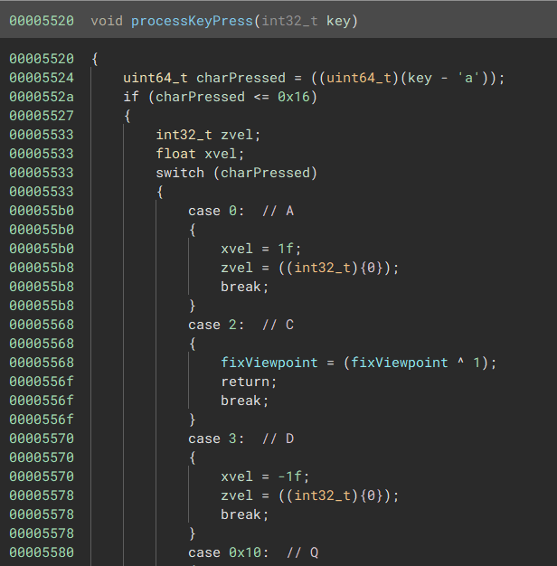

The key handling function also seems to handle most of the actual game logic so reversing it is enough to understand most of the program.

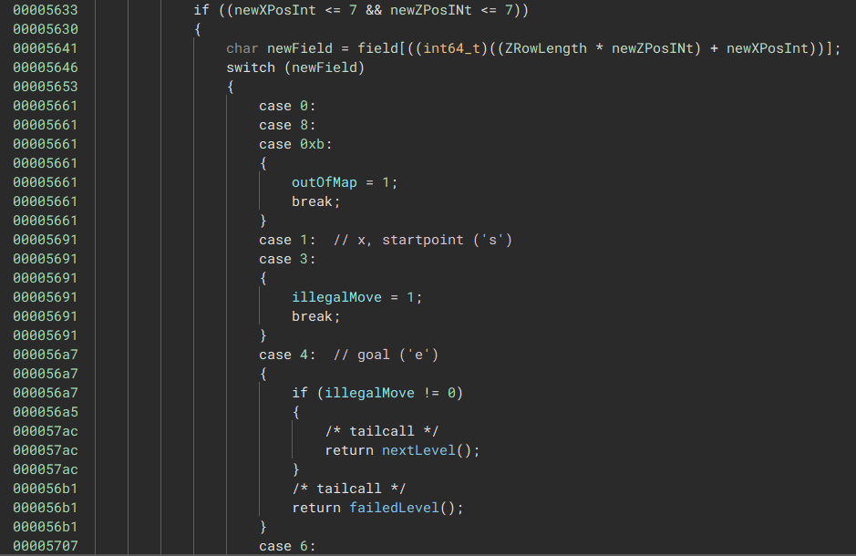

The most relevant part is which tiles do what (note here that both '1' and '3' map to the illegal path) here.

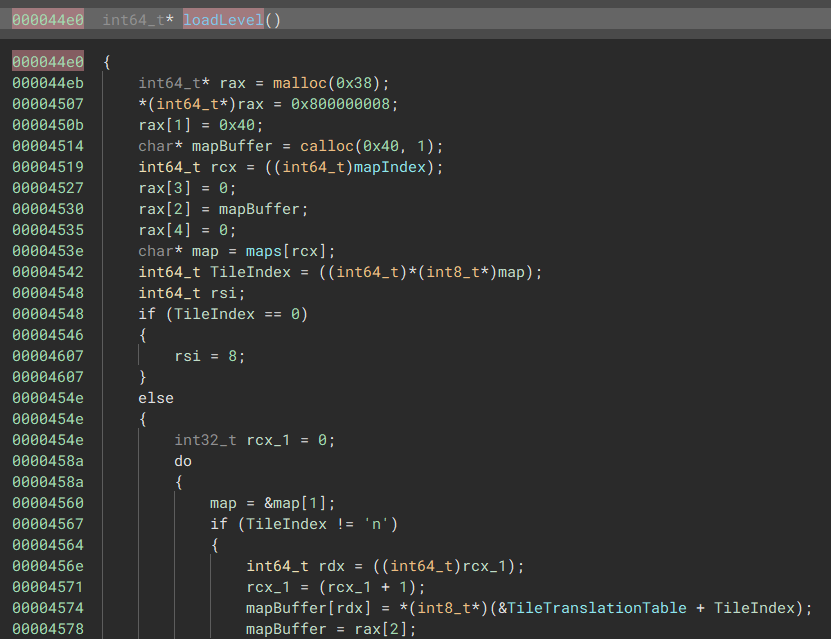

Following the paths for the next level, reloading the current level and reseting the game leads to this presumingly load level function.
Here we can see that the current map is loaded from a global array and then it's parsed into the numbers we have seen in the movement logic.

```python
# 0x348b0
mapArray = bytes.fromhex("20207320202020656e40404020202020406e40202020202020406e40202020202020406e40404040402020406e20202020404040406e20202020202020206e20202020202020206e000000000000000065404078404040736e40202020202020406e40202020202020406e40202020202020406e40202020202020406e40202020202020406e40202020202020406e40404040404040406e000000000000000073404040404040406e40202078207820406e40404040204020406e20202020207820406e78787878404078406e78404065202020236e40202040404020236e40202020204040236e000000000000000040406131202020406e40202040202020406e40202040202020406e40202040202020406e40202040786161406e40202073202020406e40202020202020406e40404065404040406e000000000000000065202020202020206e40202020202020206e40202020202020206e40202020202020206e40202020202020206e40202020202020206e40202020202020206e40404073202020206e000000000000000073312340404078206e20232020204020206e20422020204020206e20322020204020206e20417878787820206e20404240404040406e20782020202020406e20404040404040656e000000000000000065404040404040406e78787878787878406e40404040404040406e40787878787878786e40784040404040406e40787878787878786e40404040404040406e78787878787878736e000000000000000073404040404040406e40202020202020236e314c4c4c4c4c4c616e78202020202020406e40404040404040406e40202020202020206e65202020202020206e20202020202020206e0000000000000000654c4c4c234078656e202020204c2020206e202020204c4c4c4c6e202020202020204c6e202020204c4c4c4c6e204c4c4c4c2020206e734c2020202020206e20202020202020206e0000000000000000734c4c4c314c4c326e23202020782020236e40404040612020626e422020204c2020406e422020204c2020406e612020204c4c4c326e65202020202020206e20202020202020206e000000000000000065404040404040406e20202020202020406e40404040404040406e40202020202020206e40404040404040406e20202020202020406e73404040404040406e20202020202020206e00000000")

# 0x48240
tileTranslationTable = bytes.fromhex("0000000000000000000000000000000000000000000000000000000000000000000000050000000000000000000000000006090000000000000000000000000002070a0000000000000000000c0000000000000000000000000000000000000000080b0000040000000000000000000000000003000000000100000000000000")

maps = []

for i in range(11):
    maps.append(mapArray[0x50*i:][:0x48])
    
for mapIndex in range(10):
    print("MAP:", mapIndex)
    for y in range(8):
        print([tileTranslationTable[x] for x in maps[mapIndex][(7-y)*9:][:9][::-1]])
        
    for y in range(8):
        print(maps[mapIndex][(7-y)*9:][:9][::-1])
```

The 11 levels are stored consequentially in memory so we can just dump and parse them like in the above script.

This e.g. gives us for the hardest level 8:

```
MAP: 8
[0, 0, 0, 0, 0, 0, 0, 0, 0]
[0, 0, 0, 0, 0, 0, 0, 12, 3]
[0, 0, 0, 0, 12, 12, 12, 12, 0]
[0, 12, 12, 12, 12, 0, 0, 0, 0]
[0, 12, 0, 0, 0, 0, 0, 0, 0]
[0, 12, 12, 12, 12, 0, 0, 0, 0]
[0, 0, 0, 0, 12, 0, 0, 0, 0]
[0, 4, 1, 2, 5, 12, 12, 12, 4]
b'n        '
b'n      Ls'
b'n   LLLL '
b'nLLLL    '
b'nL       '
b'nLLLL    '
b'n   L    '
b'nex@#LLLe'
```

The number arrays is how the map looks parsed for the movement function, the below byte array is how it is stored.
Either way we can see '@' are normal tiles, 's' is our start point, 'L' are invisible tiles, '#' are tiles that disappear when we step on them, 'e' is the end and then there are some tiles that either flip on/off every second move or that turn on/off when moving over a trigger.
This information is enough to just quickly solve all mazes manually:

Level 0:


Level 1:
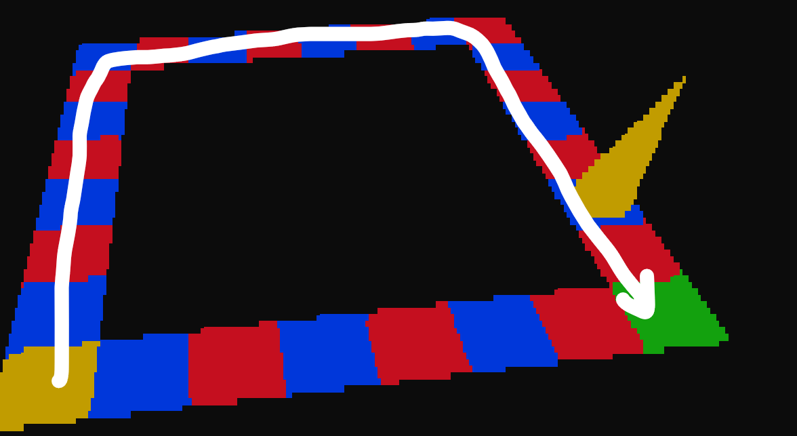

Level 2:
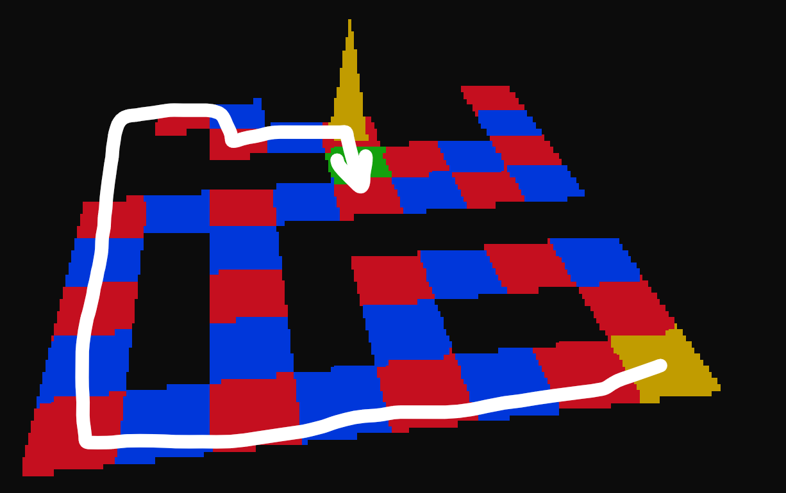

Level 3:
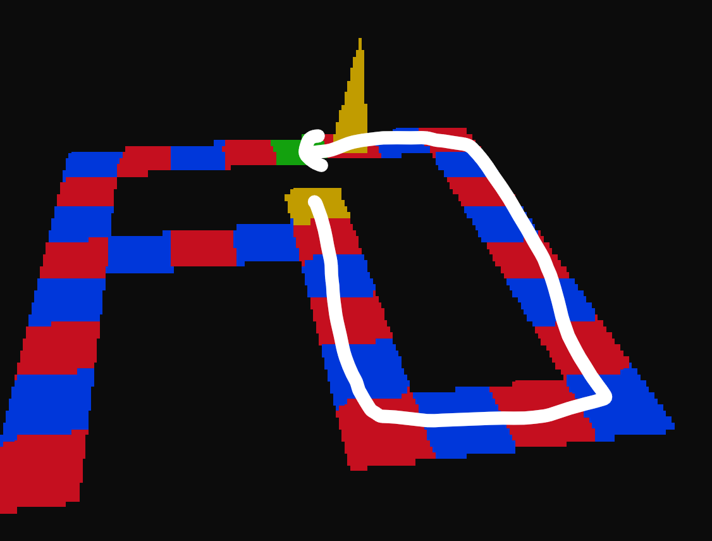

Level 4:
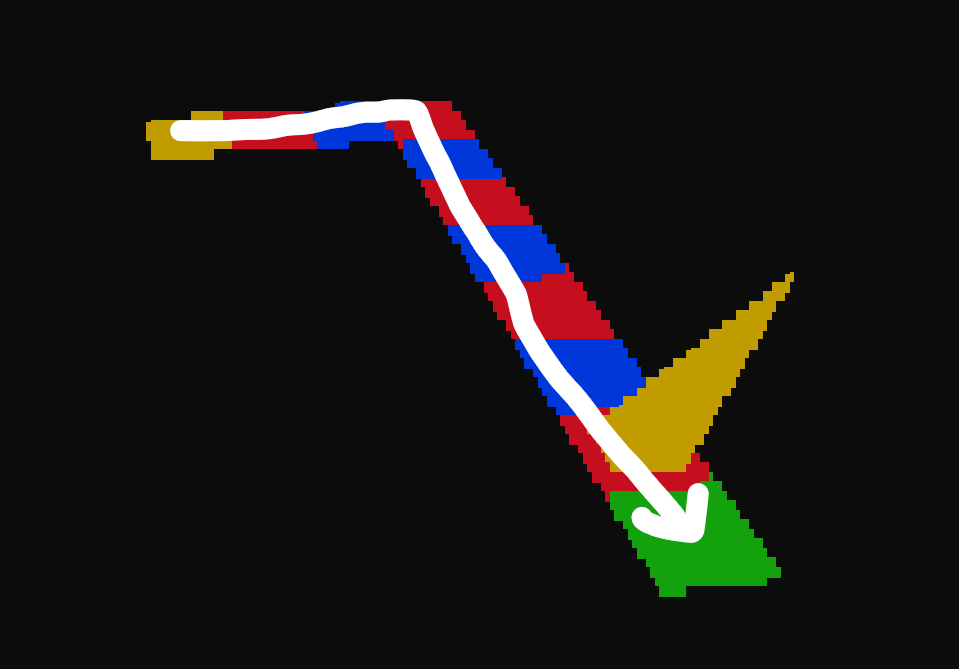

Level 5:
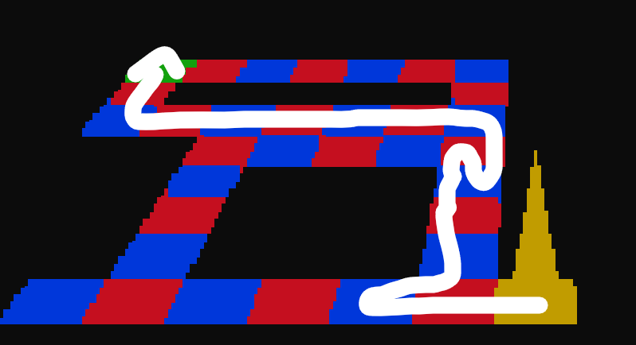

Level 6:
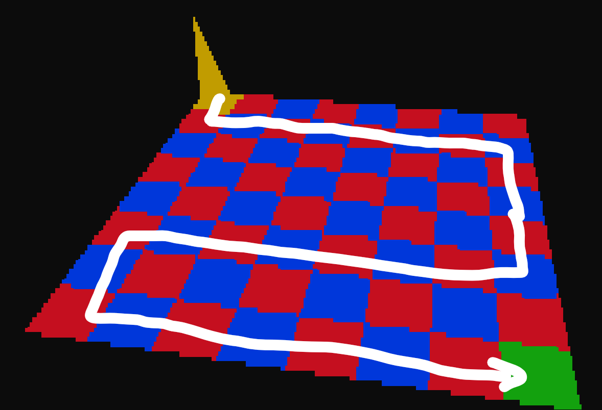

Level 7:
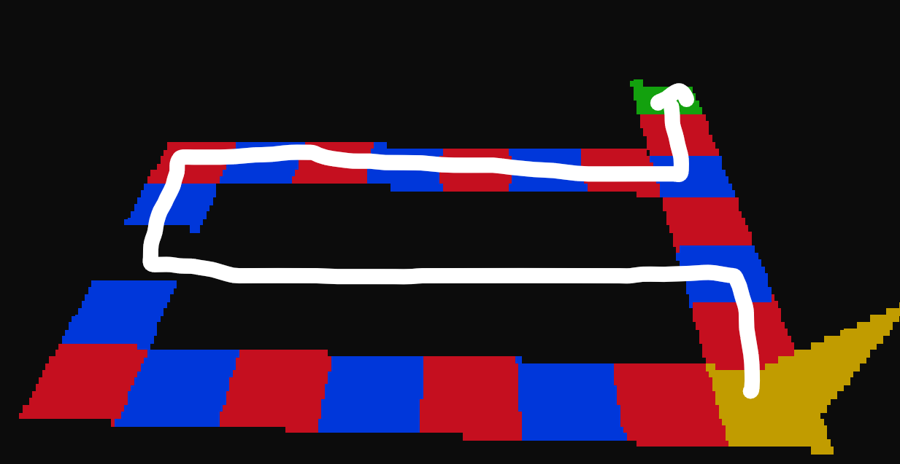

Level 8:
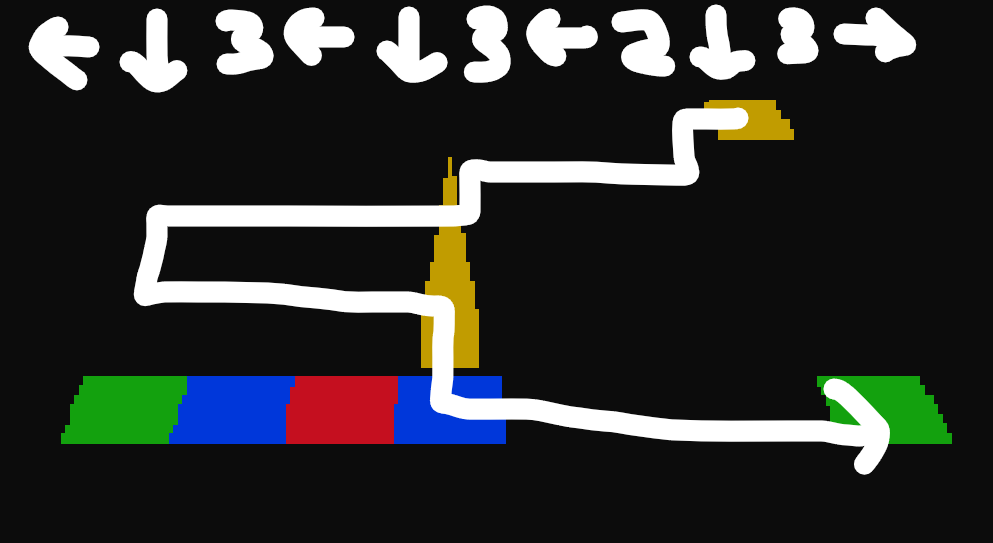

Level 9:
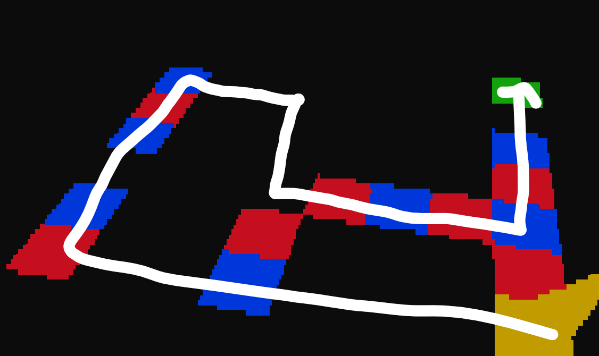

Level 10:


Solving all levels makes the flag appear in the sky:


A bit hard to read from just one angle but it is `corctf{A-MAZ1NG_JOB}`.
Note that if you cheat (e.g. patch all levels to be automatically solved) the flag in the sky will not show or be wrong.