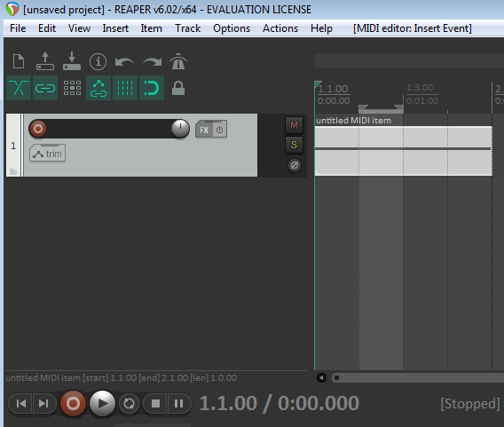
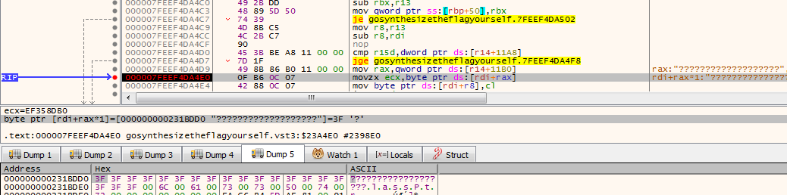
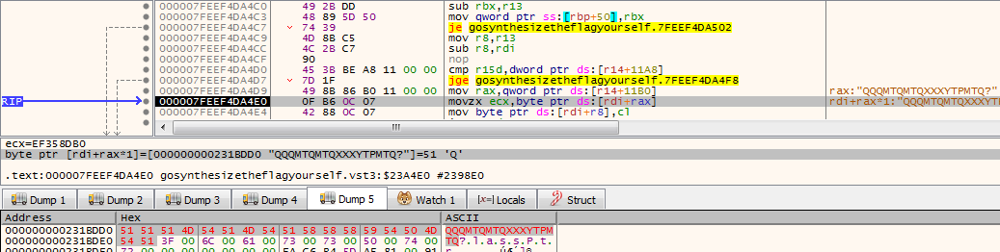
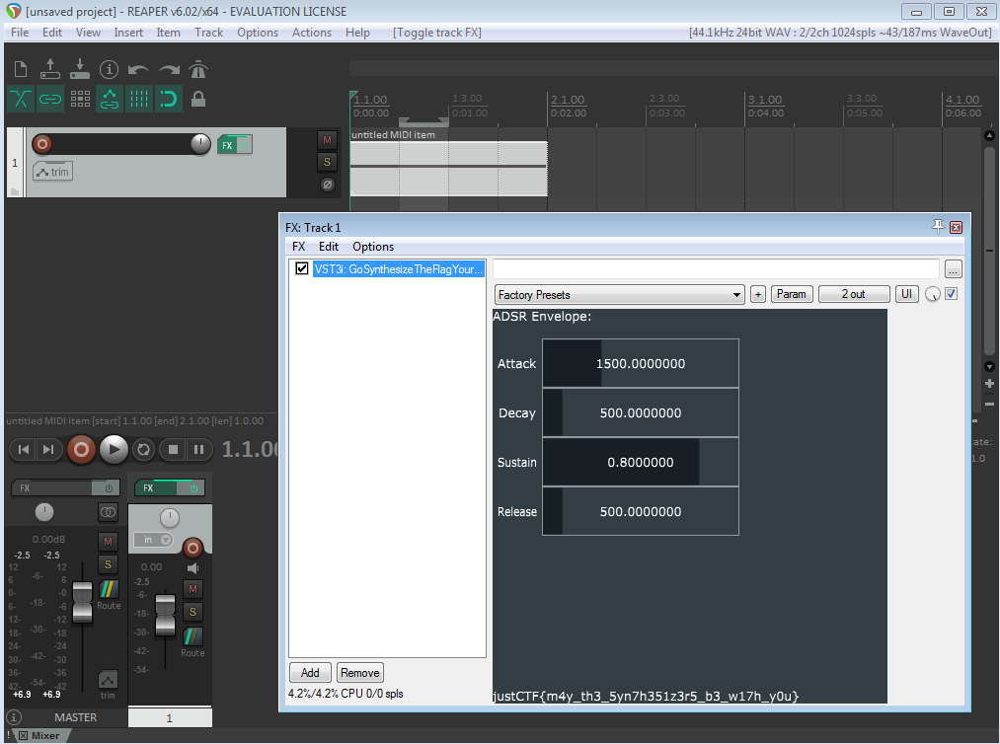

# CHANGE_VM

    Description
    Hi, I've been told you like cracking Linux binaries. Can you find a password for this one?
    
    12 solves overall, 2nd solve
    
The challenge consists out of change_my_mind, a 64bit Linux binary which requires a password which it confirms or denies after running calculations within a custom VM.

## Solution

At first I analysed the binary and tried to run angr on it with more specific constraints, as it turns out a very generic angr approach works as well:

```python
import angr
import claripy

p = angr.Project("change_my_mind")

symsize = claripy.BVS('inputLength', 64) # Make length of input symbolic as it has to be 41 characters
simfile = angr.SimFile('/tmp/stdin',size=symsize)

state = p.factory.entry_state(stdin=simfile)
simgr = p.factory.simulation_manager(state)

simgr.explore(find=lambda s: b"Good" in s.posix.dumps(1)) # Search the path that leads to "Good password"
f = simgr.found[0]
print(f)
print((b"STDOUT: "+f.posix.dumps(1)).decode())
print((b"FLAG: "+f.posix.dumps(0)).decode()) # print input for the correct path, which is the flag
```

Running the script returns the correct input:
```bash
STDOUT: Hello!
Please provide your credentials!
>>Lets'check...
Good password. Congratulations!

FLAG: justCTF{1_ch4ng3d_my_m1nd_by_cl34r1n6_7h3_r00m}
```

# GoSynthesizeTheFlagYourself

    Description
    Your mission is to crack attached synth plugin.
    All I know is that it runs in Reaper, JUCE's AudioPluginHost and free FLStudio Demo on Windows.
    
    3 solves overall, 3rd solve
    
The challenge consists out of a VST 3 Audio Plugin binary, which when loaded into a software compatible with it shows a menu to filter the audio for Attack, Decay, Sustain and Release.
After playing the correct sound track it presents the flag.

## Solution

Upon statically analysing the plugin the following md5 hashes were interesting among the string in the binary:

    714d32d45f6cb3bc336a765119cb3c4c
    51a96b38445ff534e3cf14c23e9c977f
    bc9189406be84ec297464a514221406d
    4ec6aa45006dae153d94abd86b764e17
    
The function containing them (at RVA :$23A270) is quite interesting as it processes the sound played within the audio editing software in some sort, hashes it in sets of 3 bytes and compares them against the previously mentioned strings.
Some of the md5 hashes are referenced more than once and looking them up online shows that they also originate from 3 byte combinations.
Correctly sorted they look this:

    QQQ -> 714d32d45f6cb3bc336a765119cb3c4c
    MTQ -> 51a96b38445ff534e3cf14c23e9c977f
    MTQ -> 51a96b38445ff534e3cf14c23e9c977f
    XXX -> bc9189406be84ec297464a514221406d
    YTP -> 4ec6aa45006dae153d94abd86b764e17
    MTQ -> 51a96b38445ff534e3cf14c23e9c977f
    MTQ -> 51a96b38445ff534e3cf14c23e9c977f

Consequentially the sound bytes processed by this function have to match "QQQMTQMTQXXXYTPMTQ" (or at least I assume so, either way this string works).

To change the music data to match I didn't actually create a correct audio file, but did it forcefully with a debugger.

After getting the plugin to load in Reaper I
 - created a new line
 - inserted a new midi item 
 - filled all notes to be something



I then
 - added and opened the GoSynthesizeTheFlagYourself plugin
 - attached a debugger to Reaper
 - inserted a breakpoint at relative address :$23A4E0 to the base of the plugin
 - played the midi soundtrack from the beginning
 


At the breakpoint address the `rax` register contains the start address of the data that has to match, in this case with the soundtrack I made only '?' characters.



Replacing it in-memory with the "QQQMTQMTQXXXYTPMTQ" string, removing the breakpoint and continuing execution reveals the flag within the plugin:
        


# FSMir

    Description
    We managed to intercept description of some kind of a security module, but our intern does not know this language. Hopefully you know how to approach this problem.
    
    77 solves overall, 13th solve
    
The challenge consists out of a SystemVerilog file which depending on the current state and the input `di` advance to the next state and outputs a signal if it reached the solution state.

## Solution

By iterating over the file and filtering out the conditions for state transfer I created a map from the old states to the new states and required `di`'s (which construct the flag).

```python
f = open("fsmir.sv")
lines = f.read().split("\n")

entries = {}

for line in lines:
    if not "(di ^ c)" in line: continue                              # ignore lines not related to state transfer
    line = line.strip()
    cond   = int(line.split(":")[0].split("'b")[1],2)                # extract the previous state
    check  = int(line.split("==")[1].split(")")[0].split("'b")[1],2) # extract the xor comparison value
    result = int(line.split("<=")[1].split(";")[0].split("'b")[1],2) # extract the new state
    entries[cond] = (result, chr(check^cond))                        # as "(di ^ c) == check", check^c = di
```

Starting from state 0 I traversed the map until I reached the solution state `assign solved = c == 8'd59;` and saved the `di` / flag parts while doing so:

```python
state = 0
flag = []
while state != 59:
    state, flag_part = entries[state]
    flag.append(flag_part)
```

This reveals the flag:

```python
>>> print(''.join(flag))
justCTF{SystemVerilog_is_just_C_with_fancy_notation_right?}
```


# FSMir 2

    Description
    We intercepted yet another security module, this time our intern fainted from just looking at the source code, but it's a piece of cake for a hacker like yourself, right?

    52 solves overall, 6th solve
    
The challenge consists out of a SystemVerilog file which depending on the current state and the input `di` advance to the next state and outputs a signal if it reached the solution state.

## Solution

By iterating over the file and filtering out the conditions for state transfers I created a map from the new states to the previous states and required `di`'s (which construct the flag).

```python
f = open("fsmir2.sv")
lines = f.read().split("\n")

entries = {}

for line in lines:
    line = line.strip()
    if "case(di)" in line:                                         # filter for the require previous state
        last_cond = int(line.split(" : ")[0].split("'b")[1], 2)    # extract the previous state as a number
    elif "default: c <= 9'b0;" in line: pass                       # ignore the default case as it's just a fallback
    elif ": c <= " in line:                                        # filter for the conditional state changes
        check_di  = int(line.split(": c <=")[0].split("'b")[1], 2) # extract the di value required for the state transfer
        new_value = int(line.split("9'b")[1].split(";")[0], 2)     # extract the new state value as a number
        if not new_value in entries:
            entries[new_value] = []
        entries[new_value].append((last_cond, check_di))           # add the state change to the "new state" -> (previous state, di) map
```

Starting from the solved state `assign solved = c == 9'b101001101;` I traversed the map backwards and reconstructed the `di` values:

```python
last_value = int("101001101", 2)  # the solution state
before = last_value
flag = []
while before != 0:                # if we reached the 0 state we are at a dead end
    l = entries[before]           # extract the list for a given new state
    before, flag_part = l[0]      # extract the previous state and di/flag part value, set the previous state to the new next state
    flag.append(chr(flag_part))   # append the character to the flag
flag.reverse()                    # reverse the flag as we traversed the map backwards
```

This reveals the flag:

```python
>>> print(''.join(flag))
justCTF{I_h0p3_y0u_us3d_v3r1L4t0r_0r_sth...}
```