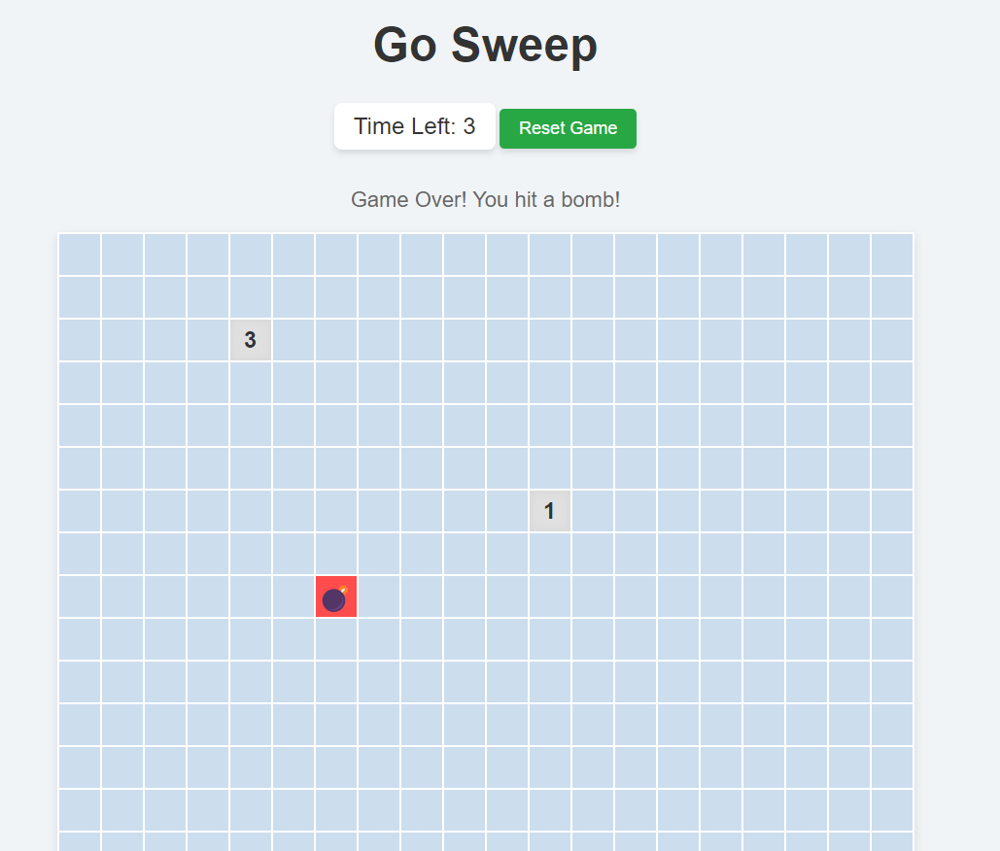
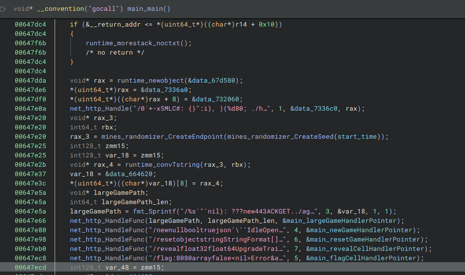
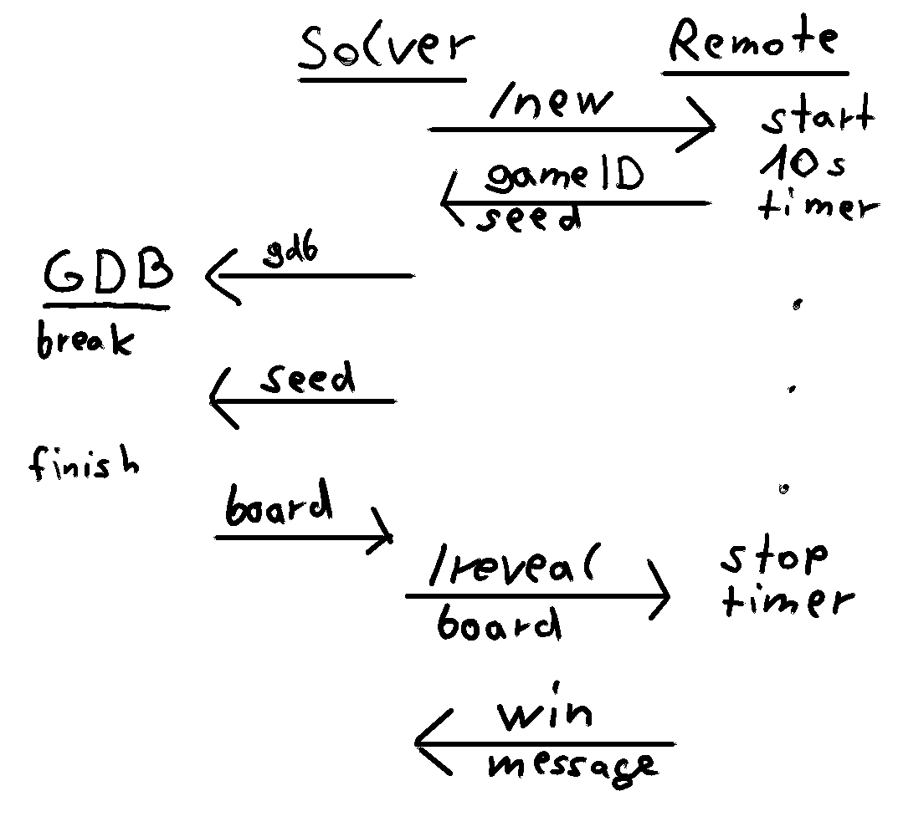
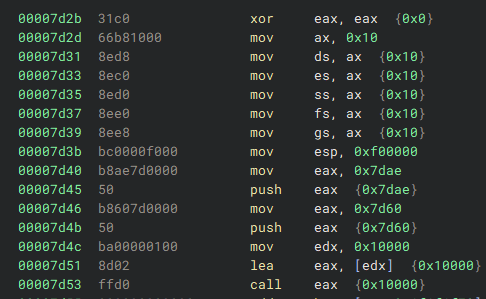
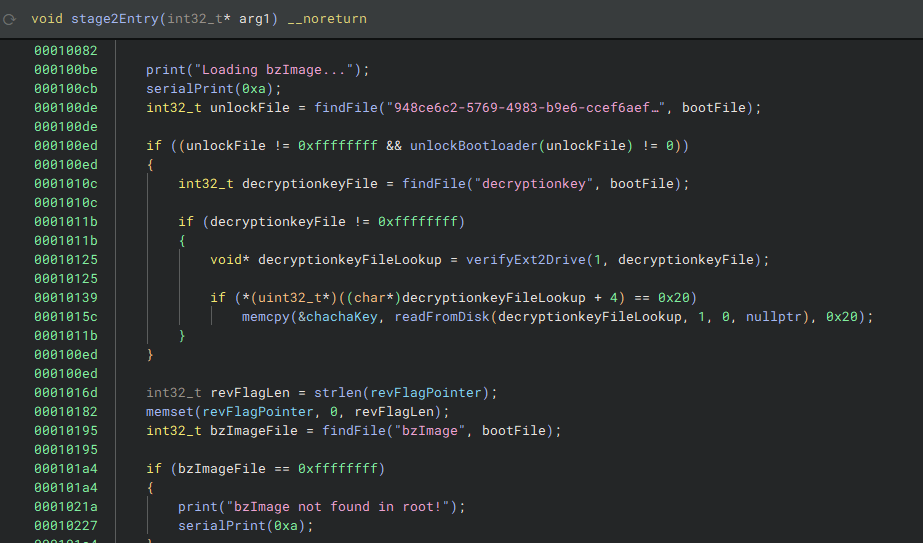
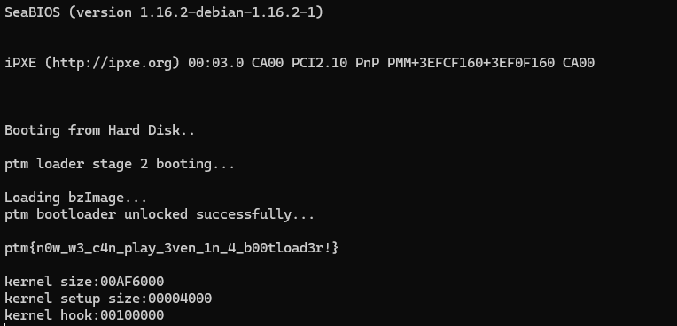
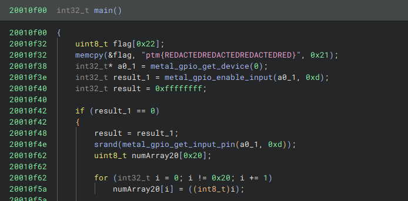

# Go Sweep

    Every time I think I'm close, boom! what am I missing? maybe I need to think backwards...

Go Sweep is a webserver written in Go which hosts a minesweeper clone on a 10 second timer.

## Solution

The solution server website provides us with the option to reset the game, reveal tiles or place flags (as an indicator for where we think bombs are).
   


The Go binary is stripped but with the use the use of plugins we can restore them and make the code quite readable (for Binary Ninja the [Golang Symbol Restore](https://github.com/d-we/binja-golang-symbol-restore) and [Go Calling Convention](https://github.com/PistonMiner/binaryninja-go-callconv) plugins). 



We still need to deal with a few Go oddities, but besides that we can see that we have API endpoints at `/new` (creating a new game id)  `/reset` (resetting a game) `/reveal` (revealing tiles) `/flag` (placing bomb flags).
Additionally we have a endpoint for large games which path is randomly generated from the start time of the binary.

Instead of reproducing the minesweeper logic I decided to reuse the GoSweep binary to reveal the board state.
When we request a `/new` game (or `/reset`) we get the seed of the game, which is the argument for the `main_initBoard` function (@ `0x643f20`).

By starting a local copy of GoSweep after receiving the seed and having it create the same board we can dump the solution from it and submit (before our 10 second timer runs out):



Doing this does not give us the flag though and instead we just get something like `Good job! Take some nanos: 1726333951116608719` back.

The timestamp in this message is what is used to generate the "secret" large game path in `main`, and to actually get the flag we have to beat a large game.

Again I decided to use the GoSweep binary to generate us this path, which is rather easily done by attaching breakpoints in `main` before the path is generated, replacing the binaries timestamp with the one the remote gave us and dumping the path string after.

Then we repeat the same as for the small board, just with new breakpoints for `main_initLargeBoard`.

So overall:

- Start a small game on remote and get the seed
- Compute locally how the board looks like for the seed
- Submit the solution and get the nano timestamp
- Compute large game path from timestamp
- Start a large game on remote with computed path to get seed
- Compute locally how the large board looks like for the seed
- Submit the solution and get the flag

```python
import requests
from pwn import *
from threading import Thread
import time

remoteUrl = "https://gosweep.challs.m0lecon.it/"

def dumpSecretPath(timestamp):
    io = gdb.debug(['./GoSweep'], api=True)
    io_gdb = io.gdb

    io_gdb.execute("b* 0x647e16") # set time name
    io_gdb.execute("b* 0x647e66") # dump name 
    io_gdb.continue_and_wait()
    io_gdb.execute("set $rax="+hex(timestamp))
    io_gdb.continue_and_wait()
    res = io_gdb.execute("x/s $rax", False, True).split(":")[1].strip().replace('"', "")
    io_gdb.continue_nowait()
    io_gdb.quit()
    io.kill()
    return res

def dumpSolution(seed, arenaSize, timestamp, endPoint):
    io = gdb.debug('./GoSweep', api=True)
    io_gdb = io.gdb

    def newBoard():
        time.sleep(1)
        url = "http://localhost:8080"
        x = requests.get(url+endPoint, json = {}, timeout=20)
        game = x.json()
        print("Local Response", game)

    io_gdb.execute("b* 0x647e16") # set time name
    if arenaSize == 20:
        io_gdb.execute("b* 0x643f20") # start 20x20
        io_gdb.execute("b* 0x6441c4") # stop 20x20
    else:
        io_gdb.execute("b* 0x644280") # start 50x50
        io_gdb.execute("b* 0x644524") # stop 50x50
    io_gdb.continue_and_wait()
    io_gdb.execute("set $rax="+hex(timestamp)) # set timestamp seed (for /secretpath)
    thread = Thread(target=newBoard)
    thread.start()
    io_gdb.continue_and_wait()
    print("Set seed")
    print("Before", io_gdb.execute("p/x $rax", False, True).strip())
    io_gdb.execute("set $rax="+hex(seed))
    print("After", io_gdb.execute("p/x $rax", False, True).strip())
    io_gdb.continue_and_wait()

    lstAddr = int(io_gdb.execute("p/x $rax", False, True).strip().split(" = ")[1], 16)
    print(hex(lstAddr))

    def dumpU64(addr):
        return int(io_gdb.execute("x/a "+hex(addr), False, True).strip().split(":")[1], 16)
        
    def dumpU64N(addr, n):
        out = io_gdb.execute("x/"+str(n)+"a "+hex(addr), False, True)
        values = []
        for line in out.split("\n"):
            if line.strip() == "": continue
            line = line.strip().split(":")[1].strip()
            for v in line.split("\t"):
                if v.strip() == "": continue
                values.append(int(v.strip(), 16))
        return values
    print(hex(lstAddr))

    dump = ""
    # Dump the board
    for row in range(arenaSize):
        offset = lstAddr+8*3*row
        # dump row array
        rowArray, v0, v1 = dumpU64(offset), dumpU64(offset+8), dumpU64(offset+16)
        values = dumpU64N(rowArray, 3*v0) # dump columns at once because individually this is too slow
        for col in range(v0):
            offsetR = 3*col
            bomb, num, revealed = values[offsetR], values[offsetR+1], values[offsetR+2]
            if bomb == 0: # format it to reveal all non-bomb fields at once
                dump += "&row="+str(row)+"&col="+str(col)
    io_gdb.continue_nowait()
    thread.join()
    io_gdb.quit()
    io.kill()
    return dump


# Retrieve secret timestamp by solving 20x20 game

x = requests.get(remoteUrl+"/new", json = {})
remoteGame = x.json()
print(remoteGame)
seed = int(remoteGame["seed"])

dump=dumpSolution(seed, 20, 0, "/new")
x = requests.post(remoteUrl+"/reveal?gameID="+remoteGame["gameID"]+dump)
# solution from 20x20 game
ts = int(x.json()["message"].split(": ")[1])

# get the secret path that is generated from the timestamp (this initiates a 50x50 game)
timestampPath = dumpSecretPath(ts)
print(timestampPath)

# Start 50x50 game on remote
x = requests.get(remoteUrl+timestampPath, json = {})
remoteGame = x.json()
print(remoteGame)
seed = int(remoteGame["seed"])

# Dump solution from binary using same seed, timestamp and path
dump=dumpSolution(seed, 50, ts, timestampPath)
x = requests.post(remoteUrl+"/reveal?gameID="+remoteGame["gameID"]+dump)
print(x.json()["message"]) # get flag
```

(Note that if you have a gdb extension, e.g. pwngdb active the script may fail)

`Congratulations! Take some chars: ptm{wh0_n33ds_luck_wh3n_y0u_h4v3_r3v3rs3?}`

# bootme

    Why would I write userspace or kernel code when I can write REAL code?
    
bootme is a remote server which boots up a small linux image with a custom bootloader. We have local copies with the flag removed.

## Solution

Essentially what the remote server does is copy the bootloader and filesystem image into a unique folder for us and connect us into it.

The actual emulation command is:
`qemu-system-x86_64 -drive format=raw,file=bootloader.bin -drive format=raw,file=flash.img -nographic -m 1G -monitor /dev/null`

The README file does tell us that the `flash.img` isn't in any way special and we only need to reverse the `bootloader.bin`.

Since this is a bootloader it starts at the initial offset of `0x7C00` in Realmode (x86-16), the actual interesting logic happens after relocation, but we need to figure out where it is copied to.



Following the protected mode initialization we can quickly see that the relocated start address is `0x10000`.

Checking in gdb what code is actually at that address gives us the entry point (for convenience rebasing the entire thing to `0xfe00` x86-32 is good enough).


`qemu-system-i386 -s -S -drive format=raw,file=bootloader.bin -drive format=raw,file=flash.img -nographic -m 1G`

`gdb -ex "target remote localhost:1234" -ex "set architecture i8086" -ex "set disassembly-flavor  intel" -ex "b *0x7d53" -ex "c"`

(Note that the kernel image is x86_64 and will not boot with `qemu-system-i386` but using it for debugging the protected mode section is more convenient as gdb will actually work with the right architecture)



From here on it is pretty normal reversing with debug string hints and `in`/`out` port numbers that when you google them tell you pretty much what the function is about (read from harddisk / serial output).

For the reversing part of the challenge the `unlockBootloader` (`@ 0001072c`) is the relevant section, which verifies the content of the file `/boot/948ce6c2-5769-4983-b9e6-ccef6aef6c51` (which we have to supply) if it exists.
If the content passes the internal check the bootloader is unlock, we get the reversing flag (and for the pwn part can overwrite the decryption key for the kernel images).

The `unlockBootloader` function expects the file to be (at least) 480 bytes long and contain only `\x01` and `\x02` bytes.
The amount of `\x02` bytes has to be exactly 99 and the rest of the program puts restrictions on how `\x01` have to be placed.

What is essentially happening is that the program considers the input to be a 16 by 30 map.
Given a list of starting points from 237 starting points that are required to be `\x01` the program adds the non-processed neighbors of a point to the processing queue if no neighbor is `\x02`.
At the end all `\x01`'s have to be processed.

Given the fixed `\x01`'s from the hardcoded starting points:

```python
f = [
2,1,2,2,2,2,1,1,2,1,1,1,2,1,1,1,2,2,2,2,2,2,2,2,2,2,1,2,2,2,
2,2,2,2,2,2,2,1,1,2,1,1,1,2,1,2,2,2,2,2,2,2,2,2,2,1,2,2,2,1,
2,2,2,2,2,2,2,1,1,2,2,1,1,1,2,2,1,2,2,2,1,2,2,1,2,2,1,2,2,2,
1,2,2,2,2,2,1,2,1,2,1,1,1,2,2,2,2,1,2,2,2,1,2,1,1,2,1,1,2,1,
1,1,1,1,2,1,1,1,1,1,1,1,2,1,2,1,2,1,2,2,1,1,1,1,1,2,1,1,1,1,
1,1,2,1,2,2,1,2,1,1,2,1,1,2,1,1,1,2,2,1,1,2,1,1,1,1,2,1,1,2,
1,2,2,2,2,2,2,1,1,1,1,2,2,2,1,2,1,2,1,1,1,1,1,2,1,1,1,1,2,1,
2,2,1,2,2,2,1,2,1,2,1,2,2,1,1,2,2,2,1,1,2,2,1,1,1,2,1,1,1,2,
2,2,2,2,1,2,2,1,1,1,1,1,1,2,2,2,2,1,2,2,1,1,1,1,1,1,1,1,2,2,
1,2,1,2,1,2,2,1,2,2,2,1,1,1,2,2,2,2,1,1,1,1,1,1,2,2,2,1,2,1,
1,2,2,1,1,2,1,1,1,1,1,1,1,1,2,1,2,2,2,1,2,1,2,1,1,1,2,2,2,2,
1,1,1,1,2,2,2,1,2,1,1,1,2,1,1,2,2,2,2,1,2,2,2,2,2,1,1,1,1,2,
1,2,1,2,2,1,2,2,1,2,2,1,1,2,2,1,2,2,2,2,2,2,1,2,1,2,1,1,1,1,
2,1,1,1,2,2,2,2,1,1,2,1,1,1,2,1,2,2,1,2,2,2,2,2,2,1,2,1,1,1,
2,1,1,1,2,1,2,2,1,1,1,1,1,1,1,2,2,2,2,2,2,2,2,2,1,2,1,1,2,1,
1,1,1,2,1,1,1,2,1,2,1,2,1,2,1,2,1,1,2,1,2,2,2,1,2,1,1,1,1,1,
]
```

I just decided to manually replace 2's by 1's and check if the program complains.

```python
def printMap(f):
    for y in range(0x10):
        line = ""
        for x in range(0x1e):
            line = line + ("X" if f[x + y*0x1e] == 1 else " ")
        print(line)

buffer = [0 for i in range(0x3c0)]
counter = 0

lookup = [0x0c, 0x0e, 0x18, 0x0e, 0x15, 0x09, 0x11, 0x03, 0x0e, 0x0e, 0x17, 0x05, 0x17, 0x02, 0x17, 0x0a,
	0x01, 0x0b, 0x03, 0x05, 0x16, 0x06, 0x1b, 0x0d, 0x08, 0x0d, 0x11, 0x08, 0x1c, 0x0c, 0x01, 0x00,
	0x08, 0x0f, 0x19, 0x0f, 0x18, 0x03, 0x0d, 0x04, 0x17, 0x07, 0x07, 0x02, 0x1a, 0x0e, 0x0b, 0x05,
	0x02, 0x07, 0x12, 0x07, 0x0b, 0x04, 0x0b, 0x0b, 0x08, 0x08, 0x10, 0x0f, 0x13, 0x0f, 0x0d, 0x09,
	0x0d, 0x0e, 0x1d, 0x09, 0x1a, 0x0c, 0x19, 0x06, 0x05, 0x0c, 0x13, 0x0b, 0x0e, 0x0b, 0x16, 0x0c,
	0x09, 0x00, 0x1b, 0x0b, 0x0b, 0x09, 0x08, 0x0c, 0x1b, 0x0c, 0x06, 0x03, 0x09, 0x08, 0x01, 0x05,
	0x1a, 0x03, 0x1a, 0x0b, 0x0f, 0x0c, 0x1d, 0x01, 0x09, 0x0d, 0x0d, 0x0a, 0x02, 0x09, 0x18, 0x06,
	0x0e, 0x07, 0x1b, 0x04, 0x00, 0x06, 0x13, 0x0a, 0x07, 0x09, 0x10, 0x02, 0x04, 0x09, 0x0f, 0x0d,
	0x00, 0x09, 0x09, 0x0a, 0x0e, 0x00, 0x00, 0x03, 0x1b, 0x03, 0x02, 0x0e, 0x1c, 0x0d, 0x19, 0x0b,
	0x0a, 0x04, 0x19, 0x01, 0x13, 0x07, 0x0e, 0x06, 0x1d, 0x0e, 0x10, 0x06, 0x17, 0x03, 0x06, 0x00,
	0x14, 0x02, 0x0e, 0x01, 0x16, 0x09, 0x01, 0x0e, 0x02, 0x0c, 0x0f, 0x00, 0x09, 0x0b, 0x06, 0x0f,
	0x18, 0x0c, 0x0c, 0x09, 0x02, 0x04, 0x0d, 0x0b, 0x0f, 0x0a, 0x06, 0x07, 0x0a, 0x03, 0x04, 0x08,
	0x15, 0x0a, 0x12, 0x06, 0x0b, 0x02, 0x15, 0x06, 0x02, 0x0d, 0x1b, 0x0e, 0x0c, 0x05, 0x1a, 0x04,
	0x0a, 0x0f, 0x08, 0x04, 0x0e, 0x0f, 0x09, 0x06, 0x06, 0x04, 0x10, 0x05, 0x06, 0x05, 0x0c, 0x0c,
	0x00, 0x0f, 0x05, 0x0f, 0x0b, 0x00, 0x1c, 0x04, 0x05, 0x04, 0x04, 0x0f, 0x15, 0x08, 0x0a, 0x0b,
	0x00, 0x04, 0x09, 0x05, 0x03, 0x0b, 0x19, 0x05, 0x01, 0x0d, 0x0b, 0x08, 0x08, 0x05, 0x0c, 0x01,
	0x0c, 0x0a, 0x15, 0x03, 0x03, 0x04, 0x0b, 0x0c, 0x08, 0x0e, 0x08, 0x07, 0x13, 0x06, 0x08, 0x03,
	0x19, 0x0d, 0x17, 0x04, 0x1a, 0x00, 0x0b, 0x01, 0x1b, 0x08, 0x14, 0x04, 0x0b, 0x0d, 0x0d, 0x02,
	0x19, 0x0a, 0x00, 0x0a, 0x1b, 0x0f, 0x0a, 0x06, 0x18, 0x05, 0x07, 0x00, 0x02, 0x0f, 0x0f, 0x05,
	0x1b, 0x07, 0x1a, 0x0f, 0x08, 0x02, 0x18, 0x0a, 0x07, 0x08, 0x16, 0x04, 0x07, 0x0a, 0x19, 0x08,
	0x0d, 0x07, 0x17, 0x09, 0x0c, 0x0f, 0x1a, 0x06, 0x0b, 0x0a, 0x1a, 0x07, 0x1d, 0x0f, 0x1d, 0x04,
	0x0a, 0x08, 0x16, 0x07, 0x18, 0x04, 0x0a, 0x01, 0x14, 0x09, 0x0a, 0x00, 0x0d, 0x00, 0x1c, 0x07,
	0x16, 0x05, 0x01, 0x04, 0x1d, 0x06, 0x17, 0x08, 0x16, 0x08, 0x03, 0x0d, 0x1c, 0x0f, 0x0a, 0x0a,
	0x03, 0x0e, 0x1d, 0x0c, 0x1b, 0x06, 0x12, 0x0d, 0x14, 0x05, 0x00, 0x0b, 0x0c, 0x03, 0x0b, 0x0e,
	0x11, 0x04, 0x13, 0x09, 0x09, 0x04, 0x1a, 0x02, 0x12, 0x09, 0x07, 0x01, 0x00, 0x05, 0x08, 0x06,
	0x02, 0x0b, 0x0e, 0x05, 0x06, 0x0a, 0x0f, 0x04, 0x14, 0x06, 0x05, 0x0e, 0x08, 0x0a, 0x13, 0x05,
	0x18, 0x07, 0x14, 0x08, 0x1b, 0x05, 0x0a, 0x07, 0x0c, 0x0d, 0x03, 0x0a, 0x07, 0x0b, 0x0c, 0x08,
	0x07, 0x06, 0x04, 0x0a, 0x11, 0x0f, 0x00, 0x0c, 0x1d, 0x0d, 0x1c, 0x05, 0x15, 0x04, 0x08, 0x01,
	0x1c, 0x0b, 0x18, 0x08, 0x1d, 0x03, 0x01, 0x0f, 0x07, 0x04, 0x1a, 0x08, 0x0a, 0x0e, 0x0b, 0x03,
	0x09, 0x0e, 0x1b, 0x09, 0x0d, 0x0d, 0x0c, 0x02, 0x17, 0x0f]


mustBeOne = set([])

for i in range(0xed):
    buffer[counter*2] = lookup[i*2]
    buffer[counter*2+1] = lookup[i*2+1]
    counter += 1
    while True:
        if counter <= 0:
            break
        counter -= 1
        x = buffer[counter * 2]
        y = buffer[counter * 2 + 1]
        pos = x + y*0x1e
        if(f[pos] == 2):
            print("Assert Error, must be 1 at ("+str(x)+", "+str(y)+") ["+str(pos)+"]")
            exit(0)
        mustBeOne.add(pos)
        f[pos] = 3
        
        array = [x-1, y-1, 
                 x-1, y, 
                 x-1, y+1,
                 x, y-1, 
                 x, y+1, 
                 x+1, y-1, 
                 x+1, y, 
                 x+1, y+1]

        flag = 1
        for j in range(8):
            # bounds check on neighbors
            if array[j << 1] <= 0x1d and array[1 + (j << 1)] <= 0xf:
                if(f[(array[j << 1] + array[1 + (j << 1)] * 0x1e)] == 2):
                    flag = 0
        
        # if no neighbor is 2
        if flag == 0: continue
        
        for j in range(8):
            # bounds check on neighbors
            if array[j << 1] <= 0x1d and array[1 + (j << 1)] <= 0xf:
                if f[array[1 + (j << 1)] * 0x1e + array[j << 1]] == 1:
                # save "1" position into buffer
                    buffer[counter * 2] = array[j << 1]
                    buffer[counter * 2 + 1] = array[1 + (j << 1)]
                    counter += 1

    
print(hex(0x1e0-len(mustBeOne)))
out = 0


for i in range(0x1e0):
    if f[i] != 3 and f[i] != 2:
        print("Not consumed 1, failure")
        break
    if f[i] == 2:
        out += 1

print("Amount of 2's (should be 0x63)", hex(out))
```

This left me with this specifically (one of many solutions):

``` python
f = [
1,1,1,1,1,1,1,1,1,1,1,1,1,1,1,1,1,1,1,1,1,1,1,1,1,1,1,1,1,1,
1,1,1,1,1,1,1,1,1,1,1,1,1,1,1,1,1,1,1,1,1,1,1,1,1,1,1,1,1,1,
1,1,1,1,1,1,1,1,1,1,1,1,1,1,1,1,1,1,1,1,1,1,1,1,1,1,1,1,1,1,
1,1,1,1,2,2,1,2,1,2,1,1,1,2,2,2,2,1,2,2,2,1,1,1,1,1,1,1,1,1,
1,1,1,1,2,1,1,1,1,1,1,1,2,1,2,1,2,1,2,2,1,1,1,1,1,1,1,1,1,1,
1,1,1,1,2,2,1,2,1,1,2,1,1,2,1,1,1,2,2,1,1,2,1,1,1,1,1,1,1,1,
1,1,1,2,2,2,2,1,1,1,1,2,2,2,1,2,1,2,1,1,1,1,1,2,1,1,1,1,1,1,
1,1,1,2,2,2,1,2,1,2,1,2,2,1,1,2,2,2,1,1,2,2,1,1,1,1,1,1,1,1,
1,1,1,1,1,2,2,1,1,1,1,1,1,2,2,2,2,1,2,2,1,1,1,1,1,1,1,1,1,1,
1,1,1,1,1,2,2,1,2,2,2,1,1,1,2,2,2,2,1,1,1,1,1,1,2,1,1,1,1,1,
1,1,1,1,1,2,1,1,1,1,1,1,1,1,2,1,2,2,2,1,2,1,2,1,1,1,1,1,1,1,
1,1,1,1,2,2,2,1,2,1,1,1,2,1,1,2,2,2,2,1,2,2,2,2,1,1,1,1,1,1,
1,1,1,1,2,1,2,2,1,2,2,1,1,2,2,1,2,2,2,2,2,2,1,2,1,1,1,1,1,1,
1,1,1,1,1,1,1,1,1,1,1,1,1,1,1,1,1,1,1,1,1,1,1,1,1,1,1,1,1,1,
1,1,1,1,1,1,1,1,1,1,1,1,1,1,1,1,1,1,1,1,1,1,1,1,1,1,1,1,1,1,
1,1,1,1,1,1,1,1,1,1,1,1,1,1,1,1,1,1,1,1,1,1,1,1,1,1,1,1,1,1,
]
```

Base64 encoding this and writing it on the file on remote:

```
echo -n "AQEBAQEBAQEBAQEBAQEBAQEBAQEBAQEBAQEBAQEBAQEBAQEBAQEBAQEBAQEBAQEBAQEBAQEBAQEBAQEBAQEBAQEBAQEBAQEBAQEBAQEBAQEBAQEBAQEBAQEBAQEBAQICAQIBAgEBAQICAgIBAgICAQEBAQEBAQEBAQEBAQIBAQEBAQEBAgECAQIBAgIBAQEBAQEBAQEBAQEBAQICAQIBAQIBAQIBAQECAgEBAgEBAQEBAQEBAQEBAgICAgEBAQECAgIBAgECAQEBAQECAQEBAQEBAQEBAgICAQIBAgECAgEBAgICAQECAgEBAQEBAQEBAQEBAQECAgEBAQEBAQICAgIBAgIBAQEBAQEBAQEBAQEBAQECAgECAgIBAQECAgICAQEBAQEBAgEBAQEBAQEBAQECAQEBAQEBAQECAQICAgECAQIBAQEBAQEBAQEBAQICAgECAQEBAgEBAgICAgECAgICAQEBAQEBAQEBAQIBAgIBAgIBAQICAQICAgICAgECAQEBAQEBAQEBAQEBAQEBAQEBAQEBAQEBAQEBAQEBAQEBAQEBAQEBAQEBAQEBAQEBAQEBAQEBAQEBAQEBAQEBAQEBAQEBAQEBAQEBAQEBAQEBAQEBAQEBAQEBAQEBAQEB" | base64 -d > /boot/948ce6c2-5769-4983-b9e6-ccef6aef6c51
```

And then rebooting with `exit` gives the flag:



    
# m0veCon

    I found this on the web, do you understand it? What does this have to do with my NFTs?
    
m0veCon provides a Move binary program for the Move Virtual Machine.
    
## Solution

I had never heard about this before and used [this blog post](https://www.zellic.io/blog/introducing-movetool/) as my primary reference on what is going on.

[Another writeup](https://leoq7.com/2023/02/PBCTF-Move-VM/) mentioned the [disassembler](https://github.com/move-language/move-on-aptos) which was very helpful for working with the `.mv` file.

After fixing the version bytes after the magic numbers (`07 00 00 0A`) to Version 7 (`07 00 00 0A`) I had code, data and meta information to work with:

```
[...]
B0:
	0: VecPack(1, 0)
	1: StLoc[1](loc0: vector<u8>)
	2: LdU8(0)
	3: StLoc[2](loc1: u8)
	4: CopyLoc[0](Arg0: vector<u8>)
	5: StLoc[3](loc2: vector<u8>)
B1:
	6: ImmBorrowLoc[3](loc2: vector<u8>)
	7: Call vector::is_empty<u8>(&vector<u8>): bool
	8: BrTrue(381)
B2:
	9: LdFalse
	10: StLoc[5](loc4: bool)
	11: ImmBorrowLoc[3](loc2: vector<u8>)
	12: VecLen(1)
	13: LdU64(4)
	14: Ge
	15: BrFalse(192)
B3:
	16: LdU64(0)
	17: StLoc[6](loc5: u64)
[...]
```

So the challenge itself encodes the flag with a randomized mapping of letters to words (and provides us the mapping as well).
Then the flag is run through the `compress` function which is part of the Move program.

Analyzing and translating the code (referencing the [interpreter implementation](https://github.com/move-language/move-on-aptos/blob/main/language/move-vm/runtime/src/interpreter.rs) for questions) shows the following behavior:

- Iterate through the input buffer until it is empty
- len(input) >= 4, iterate internal word list
- input.startswith(" "+word): output(0x08, word list index)
- input.startswith(word): output(0x06, word list index)
- input.startswith(word+" "): output(0x07, word list index)
- len(input) >= 2, iterate internal tuple list
- input.startswith(tuple): output(0x80 | tupleIndex)
- input[0] >= 9 and input[0] < 0x80: output(input[0])
- otherwise: output(<length>, <c0> <c1> <c2> <c3> <c4>) in blocks of maximum 5

```python
def wordCompress(loc1, loc3):
    if len(loc3) < 4:
        return False, loc1, loc3 # word lookup does not apply
    
    loc6 = 0
    loc5 = False
    while loc6 < len(wordTable):
        word = wordTable[loc6]
        
        spaceOffset = 0
        if loc3[0] == " ":
            spaceOffset = 1
        
        if len(loc3) >= len(word)+spaceOffset and loc3[spaceOffset:spaceOffset+len(word)] == word:
            loc5 = True
            break
        
        loc6 = loc6 + 1

    if loc5 == False:
        return False, loc1, loc3 # word lookup failed
        
    loc4 = loc3
    if loc4[0] == " ":
        loc1.append(8)
        loc1.append(loc6) 
        loc3 = loc3[1:len(loc3)]
    else:
        
        loc15 = False
        if len(loc3) > len(wordTable[loc6]):
            loc15 = loc3[len(wordTable[loc6])] == " "
        if loc15:
            loc1.append(7)
            loc1.append(loc6)
            loc3 = loc3[1:len(loc3)]
        else:
            loc1.append(6)
            loc1.append(loc6)
    
    loc3 = loc3[len(wordTable[loc6]):len(loc3)]  
    return True, loc1, loc3

def tupleCompress(loc1, loc3):
    if(len(loc3) < 0x2): # tuple lookup does not apply
        return False, loc1, loc3
        
    loc6 = 0
    loc5 = False
    
    while loc6 < len(tupleTable):
        if(loc3[:2] == tupleTable[loc6:loc6+2]):
            loc5 = True
            break
        loc6 = loc6 + 2
    
    if loc5 == False: # tuple lookup does not apply
        return False, loc1, loc3

    loc1.append(0x80 | (loc6//2))
    loc3 = loc3[2:len(loc3)]
    return True, loc1, loc3
    
def compress(loc0):
    loc1 = []
    loc2 = 0
    loc3 = loc0

    while len(loc3) > 0:
        worked, loc1, loc3 = wordCompress(loc1, loc3)
        if worked: 
            loc2 = 0
            continue
        worked, loc1, loc3 = tupleCompress(loc1, loc3)
        if worked: 
            loc2 = 0
            continue
            
        if ord(loc3[0]) >= 9 and ord(loc3[0]) < 0x80:
            loc1.append(ord(loc3[0]))
            loc3 = loc3[1:len(loc3)]
            loc2 = 0
            continue
        else:
            loc2 = loc2 + 1
            if loc2 == 1:
                loc1.append(loc2)
                loc1.append(ord(loc3[0]))
            else:
                loc1.append(ord(loc3[0]))
                loc1[len(loc1) - (loc2 + 1)] = loc2
                if loc2 == 5:
                    loc2 = 0
            loc3 = loc3[1:len(loc3)]
            continue
        
    return loc1
```

The decompression code for this is way simpler than the compression code:

```python
def decompress(loc1):
    loc3 = []
    while len(loc1) > 0:
        if((loc1[0] & 0x80) != 0): # tuple
            loc6 = (loc1[0]&0x7f)*2
            loc3.append(tupleTable[loc6:loc6+2])
            loc1 = loc1[1:]
        elif loc1[0] == 6:
            loc3.append(wordTable[loc1[1]])
            loc1 = loc1[2:]
        elif loc1[0] == 7:
            loc3.append(wordTable[loc1[1]]+" ")
            loc1 = loc1[2:]
        elif loc1[0] == 8:
            loc3.append(" "+wordTable[loc1[1]])
            loc1 = loc1[2:]
        elif loc1[0] <= 5:
            loc2 = loc1[0]
            loc1 = loc1[1:]
            for i in range(loc2):
                loc3.append(chr(loc1[0]))
                loc1 = loc1[1:]
        else:
            loc3.append(chr(loc1[0]))
            loc1 = loc1[1:]

    return ''.join(loc3)
```

Which decodes `0x677588ce2062dfc5702062fcbf6e2066fefc6520a572e96c20a46262b020bd85fa20f2e2b020a96ca97420bd85fa20f2e2b02062fcbf6e206578f591208bc6982066a4a36420c0f0e620e0d9e520f2e2b020a1d2636b20a46262b020d5958420677588ce2062dfc570206578f59120f2e2b020d5958420bd85fa2062dfc57020cf948d` to `guitar bishop burden future normal ribbon silent proton velvet silent proton burden expert monday friend palace cancel proton attack ribbon insane guitar bishop expert proton insane silent bishop wealth`.

With the character to word encoding we get `ptm{ar3_w3_m0v1ng_crypt0_y3t}`.

    
# Embedded encryption

    In the world of IoT, security is paramount. It means I shall use my small devices to encrypt secrets, right?
   
Embedded encryption gives us a RISC-V firmware image that encodes a flag. We also get the encoded flag.
   
## Solution

This challenge was fun teamwork for the last two hours of the ctf with lots of multitasking.

The binary is relatively simple and we figured to split the encoding process into two separate steps.

First we are swapping and xoring:

```python
def encode_stage1(flag):
    buffer = [0 for _ in range(0x20)]
    numArray20 = [i for i in range(0x20)]
    numArray100 = [i for i in range(0x100)]

    for i in range(1337):
        for j in range(1000):
            swap(numArray20, rand() % 0x20, rand() % 0x20)
        for j in range(10000):
            swap(numArray100, rand() & 0xff, rand() & 0xff)
        for j in range(0x20):
            buffer[j] = flag[numArray20[j]]
        for j in range(0x20):
            flag[j] = buffer[numArray20[j]]
        for j in range(0x20):
            flag[j] = numArray100[flag[j]]
        for j in range(0x20):
            flag[j] = (rand()&0xff) ^ flag[j]
```

And then we are encoding the output flag in a 16 by 16 matrix where the bit set are respectively the index in the flag.
Then we output the sum of each row and the sum of each column.

```python
def encode_stage2(flag):
    buffer = [0 for _ in range(0x10*0x10)]
    for j in range(0x20):
        for y in range(0x10):
            for k in range(0x10):
                buffer[0x10*y+k] = buffer[0x10*y+k] << 1
        buffer[flag[j]] ^= 1

    X = []
    for y in range(0x10):
        v = 0
        for j in range(0x10):
            v += buffer[0x10*y+j]
        X.append(v)

    Y = []
    for j in range(0x10):
        v = 0
        for y in range(0x10):
            v += buffer[0x10*y+j]
        Y.append(v)
        
    return (X, Y)
```

Decoding the last step is rather simple as we just need to compute back the (x, y) pairs which give us the characters.

```python
def decode_stage2(X, Y):
    flag = []
    for i in range(0x20):
        x = [(v>>(0x1f-i))&1 for v in X].index(1)
        y = [(v>>(0x1f-i))&1 for v in Y].index(1)  
        flag.append(x*0x10+y)
        
    return flag
```

For inverting the stage 1 we need to make sure we use the `rand()` values in the same order, so first we need to precompute them all.
Then we need to swap the lookup arrays until they are in the end constellation.
The rest is just the encode operations in opposite order and inverted (notability xor being the inverse of xor, swap being the inverse of swap).

```python
def decode_stage1(flag):
    swapValues20 = []
    swapValues100 = []
    xorValues = []
    
    # precompute all rand() values in the same order
    for i in range(1337):
        swapValues20a = []
        swapValues100a = []
        xorValuesa = []
        for j in range(1000):
            swapValues20a.append((rand() % 0x20, rand() % 0x20))
        for j in range(10000):
            swapValues100a.append((rand() & 0xff, rand() & 0xff))
        for j in range(0x20):
            xorValuesa.append((rand()&0xff))
        
        swapValues20.append(swapValues20a)
        swapValues100.append(swapValues100a)
        xorValues.append(xorValuesa)
    
    buffer = [0 for _ in range(0x20)]
    numArray20 = [i for i in range(0x20)]
    numArray100 = [i for i in range(0x100)]

    # swap arrays to end constellation
    for i in range(1337):
        for j in range(1000):
            swap(numArray20, swapValues20[i][j][0], swapValues20[i][j][1])
        for j in range(10000):
            swap(numArray100, swapValues100[i][j][0], swapValues100[i][j][1])

    for i in range(1337-1, -1, -1):
        for j in range(0x20):
            flag[j] = xorValues[i][j] ^ flag[j]
        for j in range(0x20):
            flag[j] = numArray100.index(flag[j])
        for j in range(0x20):
            buffer[j] = flag[numArray20.index(j)]
        for j in range(0x20):
            flag[j] = buffer[numArray20.index(j)]
        for j in range(1000-1, -1, -1):
            swap(numArray20, swapValues20[i][j][0], swapValues20[i][j][1])
        for j in range(10000-1, -1, -1):
            swap(numArray100, swapValues100[i][j][0], swapValues100[i][j][1])
```

One interesting thing the binary does: It calls `srand` at the very beginning with the output of a pin as the seed.
This function can only ever return `0` or `1`, so only those two seeds are possible start points.



Otherwise we struggled a bit with the `rand` code, which can be simplified to

```
def rand():
    global state
    state = (0x5851f42d4c957f2d * state + 1) & (2**64-1)
    return state>>32
```

All of this together and trying out both seeds gives us:

```
X = 49664, 268435456, 2147614752, 9437184, 524352, 0, 4194564, 536870912, 102760448, 134217866, 0, 0, 16, 0, 1074018305, 16843776
Y = 0, 80, 8192, 0, 256, 136052736, 0, 16778752, 2097152, 0, 541081604, 8388610, 33, 268601344, 1073741824, 2248216712

srand(0)
dflag = decode_stage2(X, Y)
decode_stage1(dflag)
print(bytearray(dflag))

srand(1)
dflag = decode_stage2(X, Y)
decode(dflag)
print(bytearray(dflag))
```

which for the seed `1` gives us `ptm{O3i2Cwz84cY5hJr3yD1iN68mps7}`