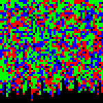

# RGNN 

    Reversing, Great. Nunnu Nanna
    
RGNN is a binary that takes in a 50x50 character input and generates the flag out of it if it fulfills the specified constraints.

## Solution


### Looking into the Code

Interestingly the control flow of the binary is a bit weird as the `main` function only contains a check whether an addtional parameter was provided (otherwise it sets `failed = -1`).
The actual logic is within the `fini_array` executed after the `main` function.

If a file was provided it starts with reading:

```C
if ( failed != -1 ) { //  if no file was provided don't check if it fulfills the constrains
    fd = open(file, 0);
    if ( fd >= 0 ) {
        for ( i = 0; i < 0x32; i++ ) {
            for ( j = 0; j = 0x32; j++ ) {
                if ( read(fd, &buf, 1) != 1 || buf < 0x30 || buf > 0x33 )  // read the input
                    return;
                inputMap[0x32 * i + j] = buf - 0x30;
            }
            if ( read(fd, &buf, 1) != 1 ) // read the new line
                return;
        }
        close(fd);
    }
}
```

The input has a format of 50 characters that are either 0, 1, 2 or 3 and this for 50 lines (important here is a 1 byte line ending).

Next is the actual task of the challenge:

```C
if ( failed != -1 ) { // if no file was provided don't check if it fulfills the constrains

    for ( i = 0; i < 0x32; i++ )  { // y axis loop
    
        input_j = 0;
    
        for ( j = 0; j < 0x28; j++ ) { // x axis loop
        
            if ( arrayXAxis[2 * (j + 0x28 * i)] == 5 )  break; // Type = 5 Blocks act as ends for the row / column
            
            while ( input_j < 0x32 ) { // iterate until a non-zero is found in the input
                if ( inputMap[0x32 * i + input_j] )
                    break;
                input_j++;
            }
            
            // check if the found input is not out of bounds and is equal to the required block type
            if ( input_j == 0x32 || inputMap[0x32 * i + input_j] != arrayXAxis[2 * (j + 0x28 * i)] ) {
                failed = 0;
                return;
            }
            
            // iterate until the input type changes or we go out of bounds
            old_j = input_j;
            while ( input_j < 0x32 && inputMap[0x32 * i + input_j] == arrayXAxis[2 * (j + 0x28 * i)] )
                input_j++;
            
            // check if the block size is equal to the required block size 
            if ( input_j - old_j != arrayXAxis[2 * (j + 0x28 * i) + 1]) {
                failed = 0;
                return;
            }
            
        }
    }
}
```

This is a bit more to digest. The function iterates through a `arrayXAxis` array and the input has to match the values of it.
These values have to repeated exactly a specified amount from the `arrayXAxis` array and if for a single array entry this is not true the program fails.
Between each loop iteration an arbitrary number of `0` can exist as long as we don't get out of the 50 character bounds.

The same is repeated for the Y-Axis with another array:

```C
if ( failed != -1 ) { // if no file was provided don't check if it fulfills the constrains

    for ( i = 0; i < 0x32; i++ )  { // x axis loop
    
        input_j = 0;
    
        for ( j = 0; j < 0x28; j++ ) { // y axis loop
        
            if ( arrayYAxis[2 * (j + 0x28 * i)] == 5 )  break; // Type = 5 Blocks act as ends for the row / column
            
            while ( input_j < 0x32 ) { // iterate until a non-zero is found in the input
                if ( inputMap[0x32 * input_j + i] )
                    break;
                input_j++;
            }
            
            // check if the found input is not out of bounds and is equal to the required block type
            if ( input_j == 0x32 || inputMap[0x32 * input_j + i] != arrayYAxis[2 * (j + 0x28 * i)] ) {
                failed = 0;
                return;
            }
            
            // iterate until the input type changes or we go out of bounds
            old_j = input_j;
            while ( input_j < 0x32 && inputMap[0x32 * input_j + i] == arrayYAxis[2 * (j + 0x28 * i)] )
                input_j++;
            
            // check if the block size is equal to the required block size 
            if ( input_j - old_j != arrayYAxis[2 * (j + 0x28 * i) + 1]) {
                failed = 0;
                return;
            }
            
        }
    }
}
```

This can be modeled as following:


The binary provides for both X-Axis and Y-Axis an amount of `Blocks` which have a `Type` (`1`, `2`, `3`) and a Size.
Each Row and Column is `50 Elements` in Size and these `Blocks` are placed in the specified order on them.
It is then possible to move these `Blocks` left and right by redistributing the `0`s around.


A small addition to this is that two `Blocks` with the same `Type` may not be directly next to each other as the program would otherwise count them as one `Block` and not multiple, so there must be `0`s between them. 


The solution to this challenge is a layout that is simultaneously viable for the `X-Axis-Array` of `Blocks` and the `Y-Axis-Array` of `Blocks`.

### Modeling the Problem


As a first step to solving this I converted the `X-Axis-Array` and `Y-Axis-Array` from their array of `(Type, Size)` into their `50 x 50 Raster` representation. (See the `createRaster.py` script)

For the X-Axis this looks as following:


And for the Y-Axis:



The second step was to make `Blocks` out of these `Raster`s again and to define constrains for moving them around.

```python
globalBlockNr = 0
def blockify(line):
    global globalBlockNr
    blocks = [] # (blockType, blockSize, blockPostionVar)
    lastBlock = None
    for c in line:
        if lastBlock != None and (ord(c)-ord('0')) == lastBlock[0]:
            bT, bS, bV = lastBlock
            lastBlock = (bT, bS+1, bV)
        else:
            if lastBlock != None:
                blocks.append(lastBlock)
                lastBlock = None
            if c != '0':
                lastBlock = ((ord(c)-ord('0')), 1, BitVec('block_'+str(globalBlockNr), 8))
                globalBlockNr += 1
    if lastBlock != None: blocks.append(lastBlock)
    return blocks
```    

Reversing the above process again and adding the additional position variable is rather easy and could have been probably combined with the `Raster` creation part.


The movement constraints of the `Blocks` can be expressed as following:

```python
def blockifyConstrains(line):
    blocks = blockify(line)
    for i in range(len(blocks)):
        solver.add(ULE(blocks[i][3],0x32-blocks[i][1])) # A Block may only have a position from 0 to 49 and they may not go out of bounds

    for i in range(len(blocks)):
        if i+1 < len(blocks) and blocks[i][0] == blocks[i+1][0]: solver.add(ULT(blocks[i][2]+blocks[i][1], blocks[i+1][2])) # Increasing the boundry box if two same Type Blocks are following each other
        elif i+1 < len(blocks): solver.add(ULE(blocks[i][2]+blocks[i][1], blocks[i+1][2])) # No Block may intersect or be more right than their successor Block
        
        if i-1 > 0 and blocks[i][0] == blocks[i-1][0]: solver.add(ULT(blocks[i-1][2]+blocks[i-1][1], blocks[i][2])) # Increasing the boundry box if two same Type Blocks are following each other
        elif i-1 > 0: solver.add(ULE(blocks[i-1][2]+blocks[i-1][1], blocks[i][2])) # No Block may intersect or be more left than their predecessor Block
        
    return blocks
```

- Each `Block` with their full length must be within the 50 Length Row / Column
- As the sequential order of `Blocks` may not be changed, no `Block's` position may be lower than their predecessor or higher then their successor
- `Blocks` may not intersect with each other
- If two `Same-Type Blocks` are next to each other enforce a gap between them

Now to combine the `X-Axis` and `Y-Axis` contrains on these `Blocks` I project them back again on the `50 x 50 Raster`

```python
def addLine(line, row):
    blocks = blockifyConstrains(line)
        
    for p in range(0x32): # for each pixel in this row
        l = []
        last = (pixel[row][p] == 0) # if this pixel is in no block then it's value is 0
        for i in range(len(blocks)): # check if the pixel is in a block and if not check the next block
            last = If(And(ULE(blocks[i][2], p), ULT(p, blocks[i][2]+blocks[i][1])), pixel[row][p] == blocks[i][0], last)
        solver.append(last) # add the merged constraint to the solver
```

I do this by checking for each pixel in a Row / Column if it's within one of the `Blocks` and if so then adding the `Type` of the `Block` as a constrain for the pixel (or `0` if the pixel is in no `Block`)

The same is of course also done for the `Y-Axis`:

```python
def addColumn(line, col): 
    blocks = blockifyConstrains(line)
        
    for p in range(0x32): # for each pixel in this column
        l = []
        last = (pixel[p][col] == 0) # if this pixel is in no block then it's value is 0
        for i in range(len(blocks)): # check if the pixel is in a block and if not check the next block
            last = If(And(ULE(blocks[i][2], p), ULT(p, blocks[i][2]+blocks[i][1])), pixel[p][col] == blocks[i][0], last)
        s.append(last) # add the merged constraint to the solver
```    

(See `solve.py` for the full solution)


### Flag

After a short while of letting `Z3` solve the model we get a solution:


```
11113111122220112101130013331200111133333221101111
11132112111223120210333311121301031133301331111120
01013110211111123112031222321100033121030033311101
11211112221232331023030132301130231211122003120132
11220220320222031001103311031111112001111210031330
30233213011011233101102332311110033001121311231111
23030232313222022103112131111013020001022022222131
12112201110220311121111011122200022121101301223222
12203323022300320332122013120322233101121322013222
20233111203312120311330110121300133203321322211110
33020111213333021122132222111013301303003202200113
12133313332211020233233113332302211110032222130102
13233003333230100200031111122333313112330223131112
11122233033022321033021111333333022101101120130110
20113330301101331132301221003011311132001320233300
11023122211112021222220223233103122232111202003301
30223111212033111013320221200223111230313312233301
23333102102101221210033201212221331213312323102023
02222113122223121110111121111021331100021023122301
12130103230112210111111110331122220331120211133312
22332133331132100112211111103112111210122211113032
22121233302111211111220012001312121122332111110032
03101331230001123111231213223222301133301122130000
33110010111323133032222013002201300331110321230222
11111211102223113222013110033231013011323311103332
12013320200002222222111221103020122233323311132302
02022132130223310333030112033022311222113333333333
22213133223223110330011220331202203222230331230332
23313032101011122122220222113123212121333030003310
20003333222231122103202011210133321222332330000233
22121033221231221112221101211233310322203332222022
31021101011231111022012301101200112332102312220223
11221133011222212323111323232111101213330213021221
11333012210310101113311111120121133213221101221211
11331032213031112211133101000000132333111001212221
31330110011323321312201233122233133200301211311223
01112010322222321333123112222031302110333220112133
03202030302202311112110212222221332030333202122302
13213200333001311112013332231212132002113113211333
11111312221120313122313033231132222200011231023211
11112311211000002111130303331332023321111112030301
11111332330211231312322231121013202301130101131331
11112320332233333030201033103203300001111301233001
11101103302013311122111231111130330131020011233311
22111101233202031131203300113111233330322203303333
32121122031112331133223333333002210213310033332003
12112033333110131023223303213132021113013303320322
12320302110110021132021113112101231211223201211233
20210222223112023301310123302132311110222212111323
32011333303310033031221123122112033110113113022003
```

Using this as the input for the binary provides the flag (again watch out to use 1-Byte Line Breaks):

    $ ./binary input.txt
    pbctf{ebbebebtebeertbebbrbbrebbetbttetebrtbbbeeettbbtbbbbteetbrrrbbttb}