# Binary Tree

    Uh, you can give the key. It's a binary search tree... I think?
    Author: rbtree
    
Binary Tree is a ELF file that takes 100 character input and verifies it through traversing a "binary search tree"

## Solution

Looking at the `_start` function, the program reads in 100 bytes of input and then maps each bit of the bytes in a big `bit_array`.
The program also contains a very big array of static data (named `big_data_array` here) and a "PASS" and "FAIL" string.

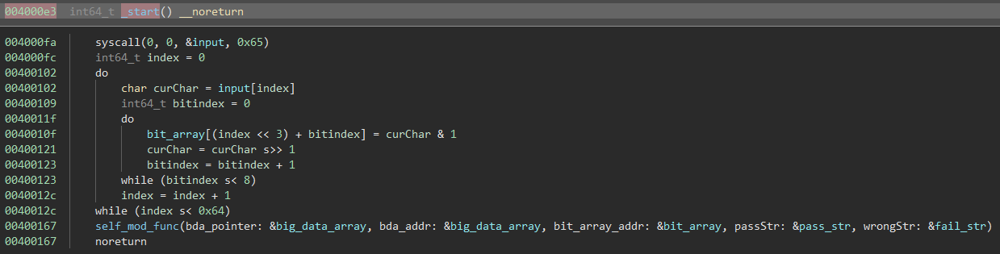

The actual interesting function is the self modifying function at address `0x400080`:

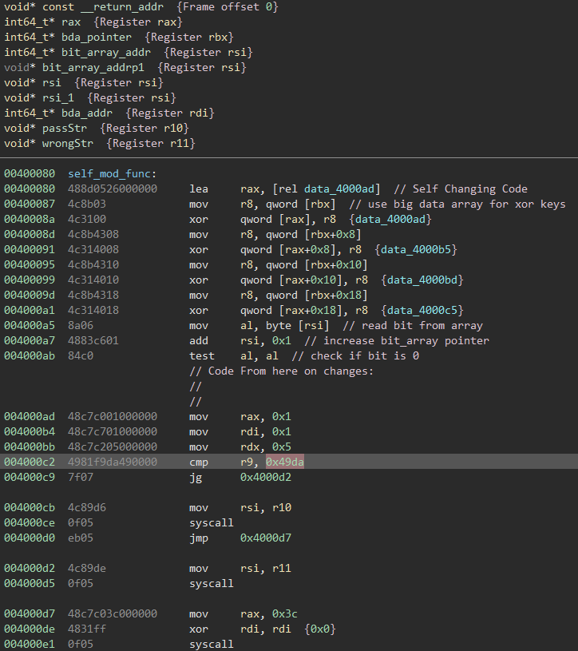

In the high level view it is clearly possible to see that the function modifies itself based on the data pointed to by `rbx` / `bda_pointer`:
After the self modifying the code reads a bit from the `bit_array`, increases the `bit_array` pointer by one and runs `test al, al` to see if the bit is zero.
The instructions after that aren't actually executed as they are changed by the code before.

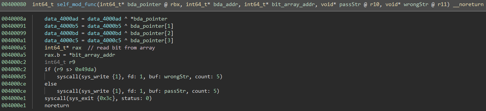

The code after the self modification looks like this:

```
0x4000ad:       nop
0x4000ae:       je      0x4000bd
0x4000b0:       lea     rbx, [rdi + 0x40]
0x4000b4:       nop
0x4000b5:       add     r9, 0x49
0x4000b9:       jmp     0x400080
0x4000bb:       nop
0x4000bc:       nop
0x4000bd:       lea     rbx, [rdi + 0x20]
0x4000c1:       nop
0x4000c2:       nop
0x4000c3:       nop
0x4000c4:       add     r9, 0x11
0x4000c8:       nop
0x4000c9:       nop
0x4000ca:       nop
0x4000cb:       jmp     0x400080
```


Now this is interesting:
The actual code that is executed uses the flags set by the `test` instruction to branch depending on the value of the bit of the input.
Depending on whether the bit is 0 or 1 one of two similar looking blocks of code is executed.
Both of them set `rbx` / `bda_pointer` to a new address absolute to `rdi` / `bda_address` / the `big_data_array`, add a value to `r9` and recursively jump back to the beginning of the function.

As `rbx` changed, depending on the branch the self-modifying-xor will reveal different new code.

The same semantic structure of code is revealed for all 800 bits of the input `bit_array`

After the 800th bit, the code is changed back to the original function (for now the assumption is that all paths recover the same original function):

```
0x4000ad:       mov     rax, 1
0x4000b4:       mov     rdi, 1
0x4000bb:       mov     rdx, 5
0x4000c2:       cmp     r9, 0x49da
0x4000c9:       jg      0x4000d2
0x4000cb:       mov     rsi, r10
0x4000ce:       syscall
0x4000d0:       jmp     0x4000d7
0x4000d2:       mov     rsi, r11
0x4000d5:       syscall
0x4000d7:       mov     rax, 0x3c
0x4000de:       xor     rdi, rdi
0x4000e1:       syscall
```

As the challenge description mentioned this can be viewed as a 800-depth binary search tree with weighted branches.
The goal is probably to find a 800 bit input for which the added weights of the taken branches is less or equal to the `MAGIC_VALUE` `0x49da` / `18906`.

The problem is that a full search of all paths is not feasible as a 800-depth binary search tree would have  `2**800 = 6668014432879854274079851790721257797144758322315908160396257811764037237817632071521432200871554290742929910593433240445888801654119365080363356052330830046095157579514014558463078285911814024728965016135886601981690748037476461291163877376` unique paths.
A Breadth-first search with trimming branches once they are higher than the `MAGIC_VALUE` also does not seem to be feasible as it seems to get stuck at around depth 200 which would still be `2**200 = 1606938044258990275541962092341162602522202993782792835301376` unique paths.


But wait! Does this being a binary search tree actually make sense?
No, because in a binary search tree each node does not only have 2 children (which this fulfills), but also has exactly one parent (which makes it a tree).
That would mean there are supposed to be `sum([2**i for i in range(801)])` nodes.
As `big_data_array` encodes the nodes and is only `816096` bytes in size, it can only encode `25503` nodes.
So this obviously can't be a tree, it is more of a binary search graph.


So which properties does this graph actually have?
There is an explicit start node, each node has two children, the graph is directed / each edge is unidirectional, there are multiple exit nodes, and each edge has a weight.
For now let's assume that the weights are all positive and not zero. Also we can be sure that from the start any 800 transitions a exit node will appear.

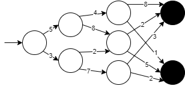


As the `MAGIC_VALUE` is not an exact value but just the maximum the correct solution is allowed to have, we can solve this by finding the path with the least cost from start to exit.
One method to do that is to calculate the minimal cost of arriving to a specific exit node backwards:

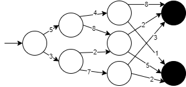

As the backwards calculated cost of a node can't get lower if all the children of it have been traversed, there is no need to traverse all paths anymore.
It is only required to traverse all nodes.

To work with the self-modifying code I used [capstone](https://www.capstone-engine.org/). 
The following script uses the above displayed method to find the shortest path:

```python

from capstone import *


loopFunc = 0x400080
loopFuncLen = 0x4000e1-loopFunc

bigdataArray = 0x400176
bigdataArrayLen = 0x4c7556-bigdataArray

MAGIC_VALUE = 0x49da


md = Cs(CS_ARCH_X86, CS_MODE_64)
binaryFile = open("main.elf", "rb")
data = binaryFile.read()

loopFuncMem = data[0x80:0x80+loopFuncLen]
bigArrayMem = data[0x176:0x176+bigdataArrayLen]

loopFuncMem = [b for b in loopFuncMem]
bigArrayMem = [b for b in bigArrayMem]

binaryFile.close()


# Actual Minimal Path Calculations

shortestPath = {}

def registerPath(path, add):
    revAdd = 0
    if path[-1] in shortestPath:
        revAdd = shortestPath[path[-1]]
    else:
        revAdd = add[-1]

    for r in range(1, len(path)+1):
        if r > 1: revAdd = revAdd + add[-r]
        if path[-r] in shortestPath:
            shortestPath[path[-r]] = min(shortestPath[path[-r]], revAdd)
        else:
            shortestPath[path[-r]] = revAdd

def parseBranch(mem, rbx, val, depth=0, path=[], add=[]):

   
    if rbx in shortestPath:
        registerPath(path, add)
        if shortestPath[rbx]+val > MAGIC_VALUE:
            return
    
    if depth == 100*8: 
        registerPath(path, add)
        return

    # apply self modifying xor
    for i in range(8*4):
        mem[i] ^= bigArrayMem[rbx+i]

    currentAdd = 0
    nextPointer = 0
    existingJumps = []
    
    for i in md.disasm(bytes(mem), 0x2d):
        op = i.mnemonic
        if op == "nop": 
            continue
        if op == "je":
            continue
        if op == "jmp":
            existingJumps.append((nextPointer, currentAdd))
            continue
        if op == "add":
            currentAdd = int(i.op_str.split(",")[1].strip(), 16)
            continue
        if op == "lea":
            nextPointer = int(i.op_str.split("+")[1].split("]")[0].strip(), 16)
            continue
        print("0x%x:\t%s\t%s" %(i.address, i.mnemonic, i.op_str)) # print if unexpected stuff occurs
    
    for (nextPointer, currentAdd)  in existingJumps:
        parseBranch(mem+[], nextPointer, val+currentAdd, depth+1, path+[nextPointer], add+[currentAdd])
    
# calculate shortest paths
parseBranch(loopFuncMem[0x2d:], 0, 0)
```

Interestingly the script gets "stuck" at ~depth 400 and 200 again, but looking into it, the paths taking up most of the time are unlikely to lead to the solution anyways, so trimming them solves it waaay faster:

```python
        # this prevents unnecessary calculations
        if shortestPath[rbx]+val > 14000 and depth < 400:
            return
            
        if shortestPath[rbx]+val > 12000 and depth < 200:
            return
```


With the data of the shortest paths we can easily traverse the graph:

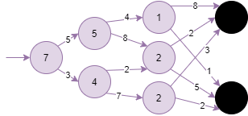


```python
def verboseCalc(mem, rbx, val, depth=0, bits=[]):

    if depth == 100*8: 
        barray = ''.join('0' if b == 0 else '1' for b in bits)
        # print flag
        print(''.join([chr(int(barray[i*8:(i+1)*8][::-1],2)) for i in range(len(barray)//8)]))
        return
        
    # apply self modifying xor
    for i in range(8*4):
        mem[i] ^= bigArrayMem[rbx+i]

    currentAdd = 0
    nextPointer = 0
    
    
    existingJumps = []
    
    for i in md.disasm(bytes(mem), 0x2d):
        op = i.mnemonic
        if op == "jmp":
            existingJumps.append((nextPointer, currentAdd))
        if op == "add":
            currentAdd = int(i.op_str.split(",")[1].strip(), 16)
        if op == "lea":
            nextPointer = int(i.op_str.split("+")[1].split("]")[0].strip(), 16)
    
    jo = shortestPath[existingJumps[0][0]]
    jz = shortestPath[existingJumps[1][0]]

    if jo+val == MAGIC_VALUE:
        verboseCalc(mem+[], existingJumps[0][0], val+existingJumps[0][1], depth+1, bits+[1])
    if jz+val == MAGIC_VALUE:
        verboseCalc(mem+[], existingJumps[1][0], val+existingJumps[1][1], depth+1, bits+[0])

# use shortest paths map and traverse it
verboseCalc(loopFuncMem[0x2d:], 0, 0)
```

Through all the optimization we just run the [script](solve.py) and get the flag within a few seconds

    >python solve.py
    pbctf{!!finding_the_shortest_path_in_self-modifying_code!!_e74c30e30bb22a478ac513c9017f1b2608abfee7}
    
# Cosmo

    To make it fair for everyone, this binary is fully portable. Run it anywhere! This definitely makes it easier, right?
    Author: UnblvR
    
Cosmo is a password verification program compiled with [Cosmopolitan](https://github.com/jart/cosmopolitan)

## Solution


The binary contains a lot of code for the cross platform features.
Figuring out what belongs to the actual challenge is the first step, running strings helps here:

```
> strings hello.com
...
Give flag
Correct!
...
```

Checking where those strings are referenced in the code leads to the main function:

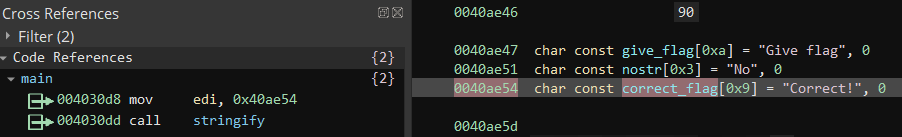


Checking the main function and making some assumptions, a lot of the code can be easily labeled:

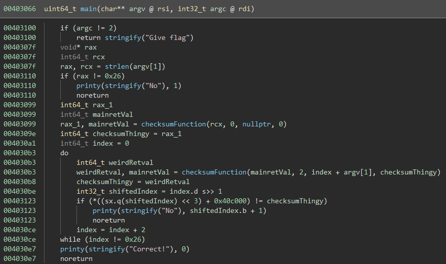

The `checksumFunction` was labeled as such, as it takes the previous return values and parts of the input and calculates the next round based on it.
The return value of each round is compared against entries of a hardcoded array:

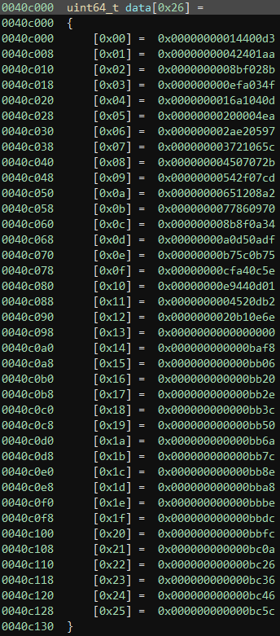

Looking in the `checksumFunction` shows a lot of mathematical operations, especially the `packedCompliactedMathThings` function is complex.
As it seems that it only checks 2 bytes of input each time it is possible to bruteforce the checksums.
An easy way to do that would be to reuse the existing code. With a bit more effort reimplementing the function is also possible.
I did none of these things and instead googled for the constants and special cases:

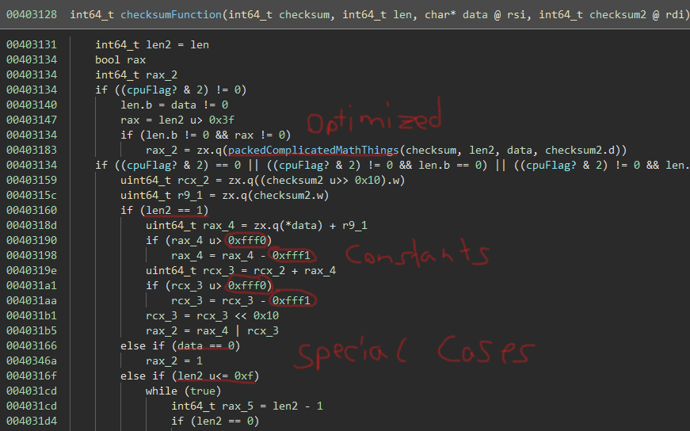

Interestingly one of the constants actually yielded a result:

`0xfff1 = 65521`:

`define BASE 65521U     /* largest prime smaller than 65536 */`
in zlibs [adler32.c](https://github.com/madler/zlib/blob/master/adler32.c)

Looking at the structure of the implementation, it seems reasonable that it is indeed the correct checksum algorithm:

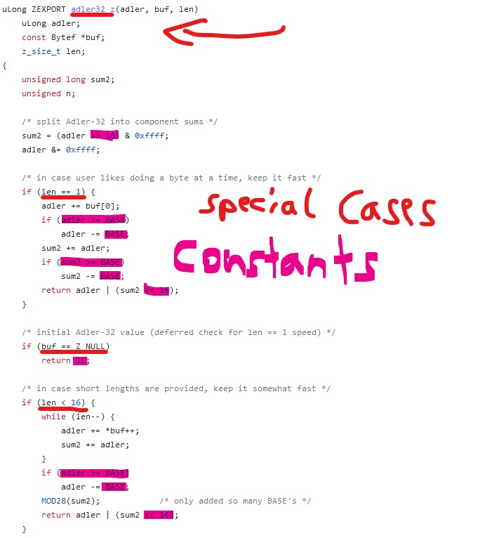

A quick python implementation of the code reveals the flag:

```python
import zlib

checksums = [
	0x00000000014400d3, 0x00000000042401aa,
	0x0000000008bf028b, 0x000000000efa034f,
	0x0000000016a1040d, 0x00000000200004ea,
	0x000000002ae20597, 0x000000003721065c,
	0x000000004507072b, 0x00000000542f07cd,
	0x00000000651208a2, 0x0000000077860970,
	0x000000008b8f0a34, 0x00000000a0d50adf,
	0x00000000b75c0b75, 0x00000000cfa40c5e,
	0x00000000e9440d01, 0x0000000004520db2,
	0x0000000020b10e6e, 0x0000000000000000,
	0x000000000000baf8, 0x000000000000bb06,
	0x000000000000bb20, 0x000000000000bb2e,
	0x000000000000bb3c, 0x000000000000bb50,
	0x000000000000bb6a, 0x000000000000bb7c,
	0x000000000000bb8e, 0x000000000000bba8,
	0x000000000000bbbe, 0x000000000000bbdc,
	0x000000000000bbfc, 0x000000000000bc0a,
	0x000000000000bc26, 0x000000000000bc36,
	0x000000000000bc46, 0x000000000000bc5c
]


already = []

for i in range(len(checksums)):
    for a in range(0x100):
        for b in range(0x100):
            c = zlib.adler32(bytes(already+[a,b]))
            if c == checksums[i]:
                already = already + [a,b]
                print(''.join([chr(c) for c in already]))
```


    >python solve.py
    pb
    pbct
    pbctf{
    pbctf{ac
    pbctf{acKs
    pbctf{acKshu
    pbctf{acKshuaL
    pbctf{acKshuaLLy
    pbctf{acKshuaLLy_p
    pbctf{acKshuaLLy_p0r
    pbctf{acKshuaLLy_p0rta
    pbctf{acKshuaLLy_p0rtabl
    pbctf{acKshuaLLy_p0rtable_
    pbctf{acKshuaLLy_p0rtable_3x
    pbctf{acKshuaLLy_p0rtable_3x3c
    pbctf{acKshuaLLy_p0rtable_3x3cut
    pbctf{acKshuaLLy_p0rtable_3x3cutAb
    pbctf{acKshuaLLy_p0rtable_3x3cutAbLe
    pbctf{acKshuaLLy_p0rtable_3x3cutAbLe?}
