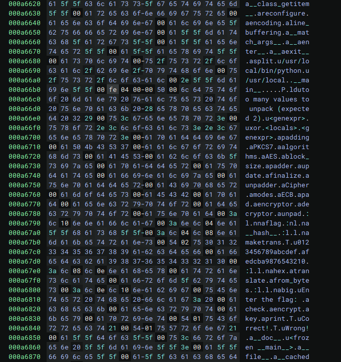

# Annuitka

    Python is slow but simple. C is fast but complex.
    What if you could have the best of both worlds?
    
Annuitka is a [Nuitka](https://github.com/Nuitka/Nuitka) compiled python program that asks for a flag and verifies it.

## Solution

Searching for the included bytecode by looking for suspicious strings (e.g. flag, correct, wrong) we can find which functions the included program calls:



There are many ways to proceed from this.
The method I chose was to hook into the code through the external `cryptography` library and use of the AES encryption from it (called functions in the above strings dump).

The initialization of the AES encryptor/decryptor is in `cryptography/hazmat/primitives/ciphers/algorithms.py` which has the following code:

```python
class AES(BlockCipherAlgorithm):
    name = "AES"
    block_size = 128
    # 512 added to support AES-256-XTS, which uses 512-bit keys
    key_sizes = frozenset([128, 192, 256, 512])

    def __init__(self, key: bytes):
        self.key = _verify_key_size(self, key)

    @property
    def key_size(self) -> int:
        return len(self.key) * 8
```

by changing this to give us the inspect library and evaluate our input we can dump everything we want from the challenge binary:

```python
def __init__(self, key: bytes):
    import inspect
    exec(input())
    self.key = _verify_key_size(self, key)
```

```
./chall
Enter the flag: empty
print(key.hex())
ca11ab1ecafebabe5ca1ab1edeadbeef
Wrong!
```

```
./chall
Enter the flag: empty
print(inspect.stack()[2][0].f_globals["flag"].hex())
80878332b5ad57cbbf22cfd5628671c13e93734c8525af6ffa9ded232593c2972ebe750210e15cc1ca3b6b2fb1c3808d998e3eaf6f1dd9c506b69f39fc9a5657
Wrong!
```

The flag is just AES ECB encoded using the key (our input is encrypted and compared against it):

```
$ ./chall
Enter the flag:
v=inspect.stack()[2][0].f_globals;d=v["Cipher"](globals()["AES"](key),v["modes"].ECB()).decryptor();print(d.update(v["flag"])+d.finalize())

b'snakeCTF{sp33d_0f_pyth0n_&_s1mpl1c1ty_0f_C_32ace614b3b42326}\x04\x04\x04\x04'
Wrong!
```

```
$ ./chall
Enter the flag: snakeCTF{sp33d_0f_pyth0n_&_s1mpl1c1ty_0f_C_32ace614b3b42326}
Correct!
```