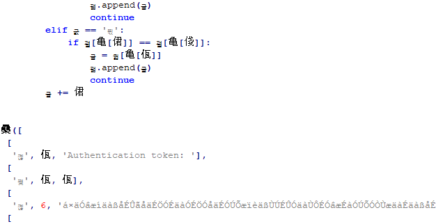

# Repyc

    woo thi chal sooo repyc!
    
The challenges provides a compiled python 3.6 program that asks for an authentication token.

## Solution

Decompiling the pyc file with uncompyle6 shows that the variables and strings contain Unicode characters and are quite unreadable

After fixing some indentation problems looking at the code shows that it's a small virtual machine with 31 instructions, 16 registers, a memory region and a stack.

The program the VM is executing reads a string from the user, then xors each character with 0x87 and subtracts 0xf from them, it then compares it with the rather long Unicode string and either ends the program if they don't match or confirms that the input is correct.

Reversing the encoding procedure by adding 0xf to each character of the Unicode string, then xoring them with 0x87 reveals the rather long flag:

`watevr{this_must_be_the_best_encryption_method_evr_henceforth_this_is_the_new_Advanced_Encryption_Standard_anyways_i_dont_really_have_a_good_vid_but_i_really_enjoy_this_song_i_hope_you_will_enjoy_it_aswell!_youtube.com/watch?v=E5yFcdPAGv0}`